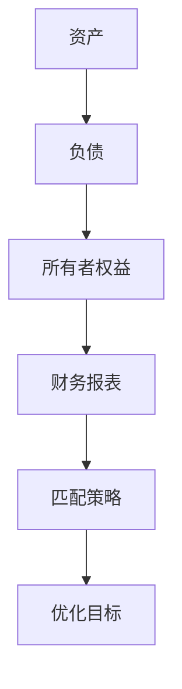
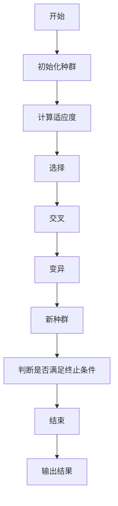
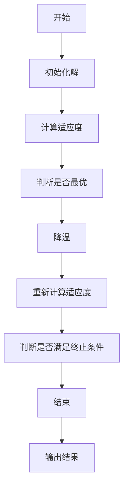
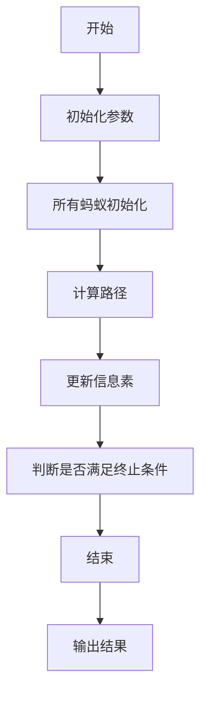
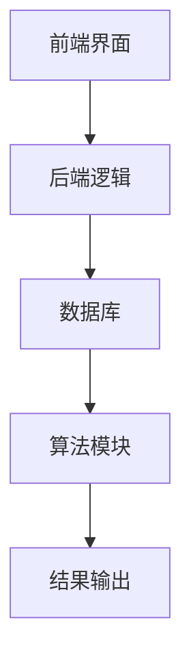
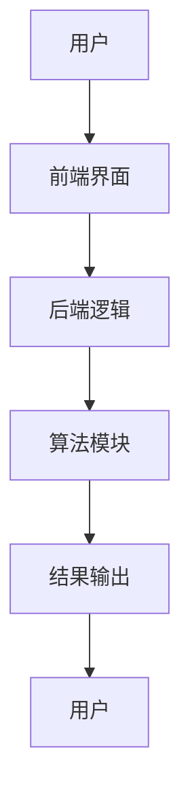

                 


# 智能资产负债匹配策略生成器

## 关键词
智能资产负债匹配，策略生成器，人工智能，算法优化，系统架构

## 摘要
智能资产负债匹配策略生成器是一种利用人工智能技术优化资产负债表匹配的系统，通过先进的算法和系统架构设计，帮助用户高效地生成最优匹配策略。本文将从背景、核心概念、算法原理、系统架构到项目实战，全面解析智能资产负债匹配策略生成器的实现与应用。

---

# 第一部分: 智能资产负债匹配策略生成器的背景与概念

## 第1章: 问题背景与描述

### 1.1 问题背景
#### 1.1.1 资产负债表的基本概念
资产负债表是企业财务状况的重要报表，反映了企业在某一特定时点的资产、负债和所有者权益的状况。资产和负债的匹配直接影响企业的财务健康和经营效率。

#### 1.1.2 资产负债匹配的重要性
资产和负债的合理匹配是企业稳健经营的关键。匹配不当可能导致资金链断裂、资本成本增加等问题。

#### 1.1.3 当前资产负债匹配中的问题与挑战
传统资产负债匹配方法依赖人工经验，存在效率低、匹配不精确等问题。随着企业规模扩大和业务复杂化，传统方法难以满足需求。

### 1.2 问题描述
#### 1.2.1 资产负债匹配的目标与意义
目标是实现资产与负债在期限、风险和收益上的最优匹配，意义在于提高资金使用效率、降低资本成本、增强企业抗风险能力。

#### 1.2.2 资产负债匹配中的常见问题
包括资产和负债期限不匹配、收益与风险不匹配、市场波动影响匹配效果等。

#### 1.2.3 智能匹配的必要性与优势
智能匹配能够快速处理海量数据，利用算法优化匹配策略，提高匹配效率和准确性。

---

## 第2章: 核心概念与联系

### 2.1 核心概念原理
#### 2.1.1 智能资产负债匹配的定义与特点
智能资产负债匹配是利用人工智能技术，通过算法优化资产与负债的匹配策略，具有高效性、精准性和适应性强的特点。

#### 2.1.2 系统的核心要素与组成
包括数据输入、算法选择、匹配模型、优化目标和结果输出。

#### 2.1.3 系统的输入输出关系
输入包括资产和负债的数据、市场环境信息等，输出是最优匹配策略。

### 2.2 核心概念对比分析
#### 2.2.1 不同匹配算法的特点对比
| 算法名称      | 描述                        | 优缺点                     |
|---------------|-----------------------------|---------------------------|
| 遗传算法      | 模拟生物进化过程            | 具备全局搜索能力，但收敛速度慢 |
| 模拟退火算法  | 类似金属退火过程            | 具备较强的全局搜索能力，但计算复杂 |
| 蚁群算法      | 模拟蚂蚁觅食过程            | 适用于组合优化问题，收敛速度快 |

#### 2.2.2 各种算法的优缺点分析
- 遗传算法：全局搜索能力强，但容易陷入局部最优。
- 模拟退火算法：能够跳出局部最优，但计算复杂。
- 蚁群算法：适用于组合优化，收敛速度快。

#### 2.2.3 算法选择的影响因素
包括问题规模、数据特征、计算资源和时间限制等。

### 2.3 核心概念ER图


---

## 第3章: 算法原理与实现

### 3.1 算法原理
#### 3.1.1 遗传算法
遗传算法模拟生物进化过程，包括选择、交叉和变异操作。

#### 3.1.2 模拟退火算法
模拟退火算法通过逐步降温来优化解空间。

#### 3.1.3 蚁群算法
蚁群算法通过模拟蚂蚁觅食行为，寻找最优路径。

### 3.2 算法流程图
#### 3.2.1 遗传算法流程图


#### 3.2.2 模拟退火算法流程图


#### 3.2.3 蚁群算法流程图


### 3.3 算法实现代码
#### 3.3.1 遗传算法实现
```python
def genetic_algorithm(population_size, fitness_function, mutation_rate):
    population = initialize_population(population_size)
    while not stopping_condition_met():
        population = evaluate_population(population, fitness_function)
        population = select_parents(population)
        population = crossover_parents(population)
        population = mutate_population(population, mutation_rate)
    return best_candidate(population)
```

#### 3.3.2 模拟退火算法实现
```python
def simulated_annealing(initial_state, cost_function, cooling_schedule):
    current_state = initial_state
    current_cost = cost_function(initial_state)
    while not stopping_condition_met():
        neighbor = get_neighbor(current_state)
        neighbor_cost = cost_function(neighbor)
        if neighbor_cost < current_cost:
            current_state = neighbor
            current_cost = neighbor_cost
        else:
            current_state = neighbor
            current_cost = current_cost + cooling_schedule(current_state)
    return current_state
```

---

## 第4章: 系统分析与架构设计方案

### 4.1 问题场景介绍
#### 4.1.1 项目背景
企业需要优化资产负债匹配，提高资金使用效率。

#### 4.1.2 系统功能设计
- 数据输入与处理
- 算法选择与优化
- 结果输出与可视化

### 4.2 项目介绍
#### 4.2.1 项目目标
实现智能资产负债匹配策略生成器，提供高效的匹配解决方案。

#### 4.2.2 系统功能模块
- 数据输入模块
- 算法选择模块
- 结果输出模块

### 4.3 系统架构设计
#### 4.3.1 系统架构图


#### 4.3.2 系统接口设计
- 前端接口：接收用户输入，调用后端服务。
- 后端接口：处理数据，调用算法模块。
- 数据库接口：存储和检索数据。

### 4.4 系统交互流程
#### 4.4.1 用户与系统交互流程图


---

## 第5章: 项目实战

### 5.1 环境安装
#### 5.1.1 安装Python
```bash
python --version
pip install numpy pandas scikit-learn
```

#### 5.1.2 安装相关库
```bash
pip install matplotlib
pip install scikit-optimize
```

### 5.2 系统核心实现
#### 5.2.1 核心代码实现
```python
def optimize_asset_liability_matching(asset_data, liability_data, algorithm='genetic'):
    if algorithm == 'genetic':
        return genetic_algorithm(asset_data, liability_data)
    elif algorithm == 'simulated_annealing':
        return simulated_annealing(asset_data, liability_data)
    else:
        return None
```

#### 5.2.2 代码解读与分析
- 输入数据：资产和负债的数据。
- 算法选择：用户可以选择不同的算法进行匹配。
- 输出结果：最优匹配策略。

### 5.3 实际案例分析
#### 5.3.1 案例背景
某企业资产和负债数据，需要优化匹配策略。

#### 5.3.2 案例分析
通过智能资产负债匹配策略生成器，找到最优的匹配方案，降低资本成本。

### 5.4 项目小结
通过项目实战，验证了智能资产负债匹配策略生成器的有效性和实用性。

---

## 第6章: 最佳实践、小结、注意事项和拓展阅读

### 6.1 最佳实践 tips
- 根据具体问题选择合适的算法。
- 数据预处理是关键，确保数据质量。
- 定期更新模型，适应市场变化。

### 6.2 小结
智能资产负债匹配策略生成器通过人工智能技术，优化资产与负债的匹配策略，帮助企业提高资金使用效率。

### 6.3 注意事项
- 数据隐私和安全问题。
- 算法的可解释性问题。
- 系统的可扩展性问题。

### 6.4 拓展阅读
- 《算法导论》
- 《机器学习实战》
- 《智能优化算法》

---

## 作者
作者：AI天才研究院 & 禅与计算机程序设计艺术

