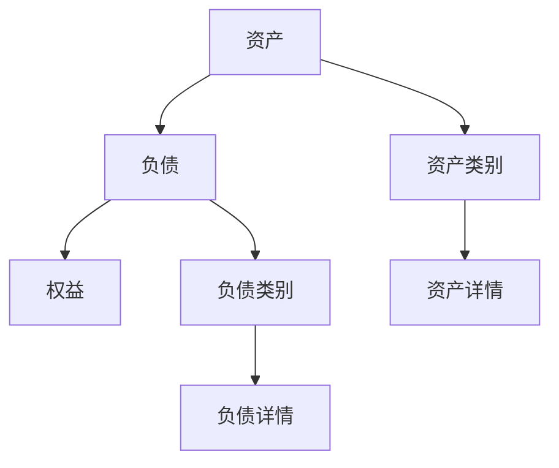
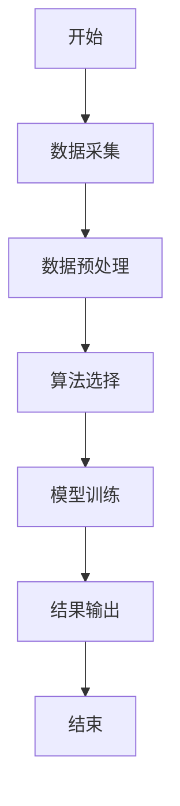
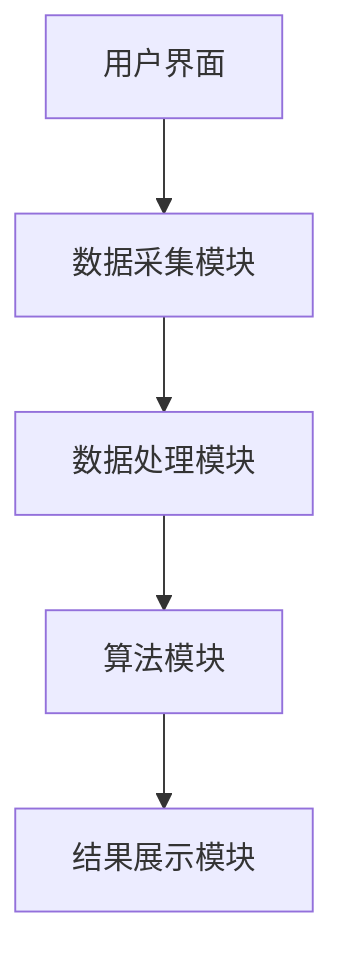
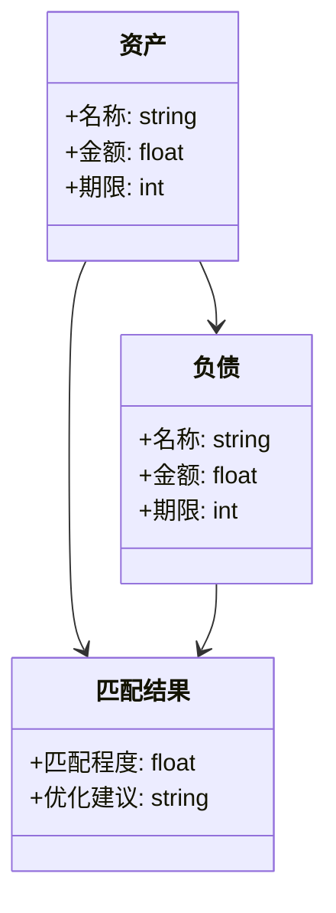

                 


# 智能资产负债匹配管理系统

> 关键词：智能资产负债匹配管理系统, 资产负债匹配管理, 智能匹配算法, 系统架构设计, 项目实战

> 摘要：智能资产负债匹配管理系统是一种基于人工智能和大数据分析的金融管理系统，通过智能匹配算法实现资产与负债的高效匹配，优化资源配置，降低风险，提升企业财务管理水平。本文将从系统的概述、核心概念、算法原理、架构设计、项目实战等多个方面，全面解析智能资产负债匹配管理系统的构建与实现。

---

## 第1章: 智能资产负债匹配管理概述

### 1.1 资产负债匹配管理的定义与背景

#### 1.1.1 资产负债匹配管理的基本概念
资产负债匹配管理是指通过对资产和负债的分析、评估和优化，确保资产和负债在规模、期限、风险等方面相匹配，以实现企业财务健康和稳健发展的管理过程。传统的资产负债匹配管理依赖于人工分析和经验判断，而智能资产负债匹配管理则通过引入人工智能、大数据和机器学习等技术，实现自动化、智能化的匹配优化。

#### 1.1.2 智能时代的资产负债匹配管理
在数字化和智能化的时代背景下，企业面临的金融市场环境更加复杂多变。智能资产负债匹配管理系统通过实时数据采集、智能算法和动态优化，能够快速响应市场变化，提高匹配效率和精准度。

#### 1.1.3 资产负债匹配管理的重要性
资产负债匹配管理是企业财务管理的核心内容之一，直接关系到企业的资金流动性、偿债能力和盈利能力。通过智能匹配管理，企业可以有效降低财务风险，优化资本结构，提升经营效率。

---

### 1.2 资产负债匹配管理的核心要素

#### 1.2.1 资产与负债的定义与分类
资产是指企业拥有或控制的能够为企业带来经济利益的资源，包括现金、应收账款、存货、固定资产等。负债是指企业由于过去的交易或事项而产生的、预期会导致经济利益流出的义务，包括短期负债、长期负债等。

#### 1.2.2 资产负债匹配的关键指标
- **期限匹配**：资产和负债的期限应尽可能匹配，以降低再融资风险。
- **规模匹配**：资产和负债的规模应合理匹配，避免过度杠杆或资金闲置。
- **风险匹配**：资产和负债的风险程度应相匹配，以降低整体风险敞口。

#### 1.2.3 资产负债匹配管理的目标
- 优化资本结构，降低资本成本。
- 提高资金流动性，确保企业资金链安全。
- 降低财务风险，增强企业抗风险能力。

---

### 1.3 资产负债匹配管理的演变

#### 1.3.1 传统资产负债匹配管理
传统资产负债匹配管理主要依赖于财务人员的经验和手工分析，效率低、主观性强，难以应对复杂的市场变化。

#### 1.3.2 智能化资产负债匹配管理的发展
随着人工智能和大数据技术的发展，智能资产负债匹配管理系统逐渐成为主流。通过机器学习算法和实时数据分析，系统能够快速生成匹配方案，提高管理效率和精准度。

#### 1.3.3 当前行业趋势与挑战
当前，智能化资产负债匹配管理正在快速发展，但也面临数据隐私、算法复杂度和模型解释性等挑战。未来，随着技术的进步，这些问题将逐步得到解决。

---

## 第2章: 智能资产负债匹配管理的核心概念

### 2.1 资产负债匹配管理的数学模型

#### 2.1.1 资产负债匹配的基本模型
资产负债匹配的基本模型可以表示为：
$$ \text{目标函数} = \text{资产} - \text{负债} $$
其中，目标函数表示企业的净资产，通过优化目标函数，可以实现资产和负债的最优匹配。

#### 2.1.2 智能匹配算法的数学表达
智能匹配算法通常采用非线性优化模型，例如：
$$ \min \sum_{i=1}^{n} w_i (a_i - b_i)^2 $$
其中，\( w_i \) 是权重，\( a_i \) 是资产，\( b_i \) 是负债。

---

### 2.2 资产负债匹配管理的实体关系图



上述实体关系图展示了资产、负债、权益之间的关系，以及资产和负债的分类和详细信息。

---

### 2.3 资产负债匹配管理的核心算法



---

### 2.4 本章小结

---

## 第3章: 智能资产负债匹配算法的数学模型与实现

### 3.1 资产负债匹配算法的数学模型

#### 3.1.1 目标函数的定义
目标函数通常用于衡量资产和负债的匹配程度：
$$ \text{目标函数} = \sum_{i=1}^{n} \lambda_i (a_i - b_i) $$
其中，\( \lambda_i \) 是权重系数。

#### 3.1.2 约束条件的建立
约束条件通常包括：
1. 资产和负债的期限匹配：
$$ \sum_{i=1}^{n} t_i a_i = \sum_{i=1}^{n} t_i b_i $$
2. 资产和负债的规模匹配：
$$ \sum_{i=1}^{n} a_i = \sum_{i=1}^{n} b_i $$

#### 3.1.3 数学模型的求解方法
常用的求解方法包括线性规划、非线性规划和遗传算法等。

---

### 3.2 资产负债匹配算法的实现

#### 3.2.1 算法实现的步骤
1. 数据采集与预处理
2. 算法选择与参数设置
3. 模型训练与优化
4. 结果输出与验证

#### 3.2.2 算法实现的代码示例
以下是一个简单的匹配算法示例（Python）：

```python
import numpy as np

def match_assets_liabilities(assets, liabilities, weights):
    # 数据预处理
    assets = np.array(assets)
    liabilities = np.array(liabilities)
    weights = np.array(weights)
    
    # 模型训练
    coefficients = np.linalg.lstsq(assets, liabilities, rcond=None)[0]
    
    # 结果输出
    matched_liabilities = coefficients * assets
    return matched_liabilities

assets = [100, 200, 300]
liabilities = [80, 160, 240]
weights = [0.3, 0.4, 0.3]

matched_liabilities = match_assets_liabilities(assets, liabilities, weights)
print("Matched liabilities:", matched_liabilities)
```

---

### 3.3 算法的数学公式与推导

#### 3.3.1 目标函数的公式
目标函数可以表示为：
$$ \text{目标函数} = \sum_{i=1}^{n} (a_i - b_i)^2 $$

---

## 第4章: 智能资产负债匹配管理系统的架构设计

### 4.1 系统架构概述

#### 4.1.1 系统的整体架构


#### 4.1.2 系统的功能模块划分
1. 数据采集模块
2. 数据处理模块
3. 算法模块
4. 结果展示模块

#### 4.1.3 系统的交互流程
1. 用户输入数据
2. 数据采集模块接收数据
3. 数据处理模块预处理数据
4. 算法模块生成匹配方案
5. 结果展示模块输出结果

---

### 4.2 系统功能设计

#### 4.2.1 领域模型的设计


---

### 4.3 系统架构的实现

#### 4.3.1 系统架构的Mermaid图


---

## 第5章: 智能资产负债匹配管理系统的项目实战

### 5.1 项目环境的搭建

#### 5.1.1 开发环境的安装与配置
- 安装Python
- 安装必要的库（如numpy、pandas、scikit-learn）

#### 5.1.2 项目核心代码实现
```python
import numpy as np
from sklearn.linear_model import LinearRegression

def match_assets_liabilities(assets, liabilities):
    model = LinearRegression()
    model.fit(np.array(assets).reshape(-1, 1), liabilities)
    matched_liabilities = model.predict(np.array(assets).reshape(-1, 1))
    return matched_liabilities

assets = [100, 200, 300]
liabilities = [80, 160, 240]
matched_liabilities = match_assets_liabilities(assets, liabilities)
print("Matched liabilities:", matched_liabilities)
```

---

### 5.2 系统功能的实现

#### 5.2.1 系统功能模块的实现
1. 数据采集模块：读取资产和负债数据。
2. 数据处理模块：清洗和预处理数据。
3. 算法模块：使用机器学习算法生成匹配方案。
4. 结果展示模块：输出匹配结果和优化建议。

---

## 第6章: 智能资产负债匹配管理系统的最佳实践与注意事项

### 6.1 最佳实践
1. 数据的准确性和完整性是关键。
2. 算法的选择应根据具体场景调整。
3. 系统的实时性和可扩展性需要重点关注。

### 6.2 注意事项
1. 数据隐私和安全问题。
2. 算法的可解释性和透明度。
3. 系统的稳定性和容错能力。

### 6.3 未来展望
随着人工智能和大数据技术的进一步发展，智能资产负债匹配管理系统将更加智能化和自动化，为企业财务管理提供更强大的支持。

---

## 作者：AI天才研究院/AI Genius Institute & 禅与计算机程序设计艺术 /Zen And The Art of Computer Programming

