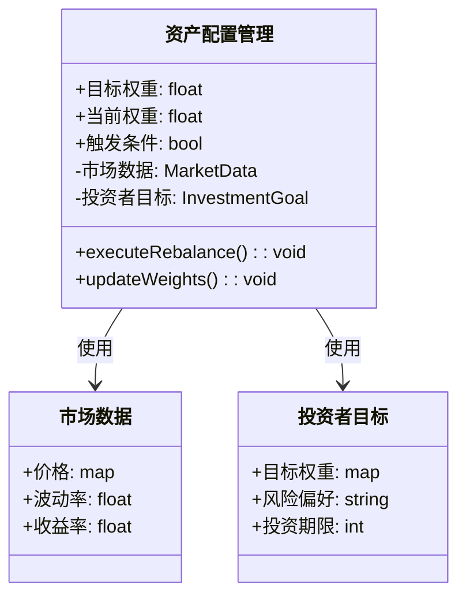
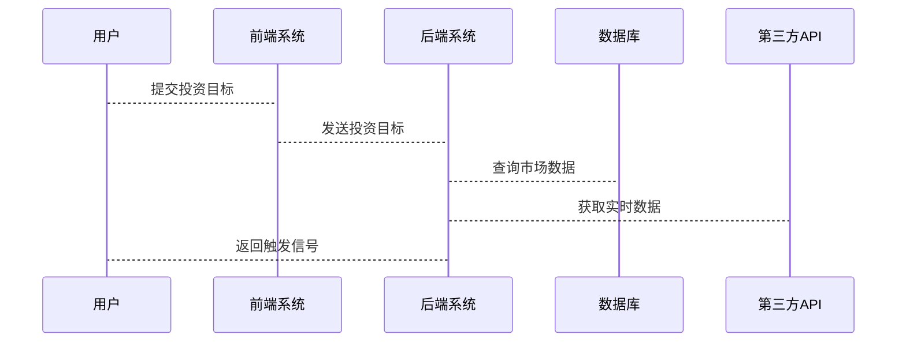

                 


# 智能资产配置再平衡触发系统

> 关键词：智能资产配置，再平衡触发，算法原理，系统架构，项目实战

> 摘要：本文详细探讨了智能资产配置再平衡触发系统的核心概念、算法原理、系统架构以及项目实战。通过理论分析与实际案例相结合，阐述了如何设计和实现一个高效的资产配置再平衡触发系统，为投资管理和财富配置提供了新的思路。

---

# 第一部分: 智能资产配置再平衡触发系统概述

# 第1章: 智能资产配置再平衡触发系统的背景与概念

## 1.1 问题背景与问题描述

### 1.1.1 资产配置的基本概念
资产配置是指将资金分配到不同的资产类别（如股票、债券、现金等）中，以实现投资目标（如收益最大化、风险最小化）的过程。有效的资产配置能够帮助投资者在不同市场环境下优化投资组合的表现。

### 1.1.2 再平衡的必要性
随着时间的推移，市场波动和投资者目标的变化可能导致资产配置偏离初始设定的比例。例如，股票市场的上涨可能使得股票在投资组合中的权重超过目标比例，而债券市场的下跌可能使得债券权重低于目标比例。此时，需要通过再平衡操作将资产比例调整回目标配置。

### 1.1.3 智能化再平衡的驱动力
传统的再平衡方法通常是基于固定的时间间隔（如季度或半年）进行定期调整。然而，这种方法可能无法适应市场环境的快速变化。通过引入智能化的再平衡触发机制，可以根据实时市场数据和投资者目标的变化动态调整资产配置，从而提高投资效率和收益。

## 1.2 智能资产配置再平衡触发系统的概念结构

### 1.2.1 核心要素与组成
智能资产配置再平衡触发系统主要包括以下几个核心要素：
1. **资产类别**：定义投资组合中的不同资产类别及其权重。
2. **目标配置**：设定投资组合中各类资产的目标权重。
3. **触发条件**：定义触发再平衡操作的条件，如偏离目标权重的阈值或特定的市场信号。
4. **执行策略**：确定再平衡的具体操作方式，如逐步调整或一次性调整。
5. **优化算法**：用于优化再平衡操作的算法，以最小化交易成本或最大化收益。

### 1.2.2 系统的边界与外延
智能资产配置再平衡触发系统的边界包括：
- **输入**：市场数据（如资产价格、波动率）、投资者目标、风险偏好等。
- **输出**：再平衡触发信号、调整后的资产配置方案。

系统的外延包括与之交互的其他系统，如交易系统、数据采集系统等。

### 1.2.3 系统的功能与目标
系统的功能包括：
1. **数据采集**：实时或定期采集市场数据和投资者信息。
2. **状态监测**：监测当前资产配置与目标配置的偏离程度。
3. **触发决策**：根据触发条件判断是否需要进行再平衡操作。
4. **策略执行**：根据决策结果执行再平衡操作。
5. **反馈优化**：根据再平衡效果优化触发条件和执行策略。

## 1.3 本章小结
本章介绍了智能资产配置再平衡触发系统的背景、核心概念和组成要素，为后续章节的深入分析奠定了基础。

---

# 第二部分: 核心概念与算法原理

# 第2章: 资产配置再平衡的触发条件与算法

## 2.1 资产配置再平衡的核心概念

### 2.1.1 市场波动对资产配置的影响
市场波动可能导致资产价格的剧烈波动，从而使得投资组合的实际权重偏离目标权重。例如，在股票市场大涨的情况下，股票权重可能超过目标比例，而债券权重可能低于目标比例。

### 2.1.2 投资目标的变化
投资者的投资目标可能随着时间发生变化，例如风险偏好、收益目标或投资期限的变化。这些变化需要通过再平衡操作来调整资产配置。

### 2.1.3 再平衡成本与收益的权衡
再平衡操作可能会产生交易成本（如佣金、税费）和机会成本（如错失市场上涨的机会）。因此，在触发再平衡操作时需要权衡调整成本与收益。

## 2.2 再平衡触发条件的算法实现

### 2.2.1 基于阈值的触发算法
基于阈值的触发算法是最常用的再平衡触发方法。当投资组合的实际权重偏离目标权重超过一定阈值时，触发再平衡操作。

#### 示例：
假设目标配置为股票40%、债券60%，当股票的实际权重超过45%或低于35%时，触发再平衡操作。

### 2.2.2 基于时间窗口的触发算法
基于时间窗口的触发算法是定期进行再平衡操作，例如每季度或每半年进行一次。

### 2.2.3 基于机器学习的智能触发算法
基于机器学习的智能触发算法可以根据市场环境和投资者目标动态调整触发条件。例如，使用回归模型预测市场波动率，从而动态调整触发阈值。

## 2.3 算法原理的数学模型与公式

### 2.3.1 阈值触发算法的数学表达
$$ \text{触发条件} = |\text{当前权重} - \text{目标权重}| > \text{阈值} $$

### 2.3.2 时间窗口触发算法的数学表达
$$ \text{触发条件} = \text{周期} \times \text{权重调整量} $$

### 2.3.3 机器学习触发算法的数学表达
$$ \text{触发概率} = f(\text{市场数据}, \text{模型参数}) $$

## 2.4 本章小结
本章详细介绍了再平衡触发条件的算法实现，包括阈值触发、时间窗口触发和机器学习触发三种方法，并通过数学公式进行了理论分析。

---

# 第三部分: 系统分析与架构设计

# 第3章: 智能资产配置再平衡触发系统的架构设计方案

## 3.1 问题场景介绍

### 3.1.1 系统目标
设计一个智能资产配置再平衡触发系统，能够根据市场环境和投资者目标动态调整资产配置。

### 3.1.2 系统输入与输出
- **输入**：市场数据、投资者目标、风险偏好。
- **输出**：再平衡触发信号、调整后的资产配置方案。

### 3.1.3 系统约束条件
- 交易成本最小化。
- 再平衡操作的频率不能过于频繁，以免产生过多交易成本。
- 系统需要具备实时性，能够快速响应市场变化。

## 3.2 系统功能设计

### 3.2.1 领域模型设计（Mermaid 类图）


### 3.2.2 系统架构设计（Mermaid 架构图）


### 3.2.3 系统接口设计

#### 3.2.3.1 输入接口
- **市场数据接口**：从数据源获取实时市场数据。
- **投资者目标接口**：获取投资者的风险偏好和投资目标。

#### 3.2.3.2 输出接口
- **触发信号接口**：向交易系统发送再平衡操作信号。
- **报告接口**：生成再平衡报告，供投资者查阅。

### 3.2.4 系统交互（Mermaid 序列图）


## 3.3 本章小结
本章从系统架构的角度，详细设计了智能资产配置再平衡触发系统的功能模块、接口设计和交互流程，为后续的实现提供了清晰的指导。

---

# 第四部分: 项目实战

# 第4章: 项目实战与代码实现

## 4.1 环境安装与配置

### 4.1.1 Python环境安装
需要安装以下Python库：
- `numpy`：用于数值计算。
- `pandas`：用于数据处理。
- `matplotlib`：用于数据可视化。
- `scikit-learn`：用于机器学习算法。

### 4.1.2 数据源配置
需要获取市场数据（如股票价格、债券收益率等）和投资者目标数据。

## 4.2 系统核心实现源代码

### 4.2.1 数据处理模块
```python
import pandas as pd

def load_market_data():
    # 示例：从CSV文件加载市场数据
    data = pd.read_csv('market_data.csv')
    return data

def calculate_weights(data):
    # 示例：计算当前权重
    weights = data.iloc[-1] / data.iloc[-1].sum()
    return weights
```

### 4.2.2 触发条件判断模块
```python
import numpy as np

def threshold_trigger(current_weights, target_weights, threshold=0.05):
    # 示例：基于阈值的触发条件判断
    deviation = np.abs(current_weights - target_weights)
    trigger = np.any(deviation > threshold)
    return trigger
```

### 4.2.3 再平衡执行模块
```python
def execute_rebalance(current_weights, target_weights):
    # 示例：简单再平衡操作
    rebalanced_weights = target_weights
    return rebalanced_weights
```

## 4.3 代码应用解读与分析

### 4.3.1 数据处理模块解读
数据处理模块从CSV文件中加载市场数据，并计算当前资产的权重。权重计算方法为：最后一笔数据的资产价值占总价值的比例。

### 4.3.2 触发条件判断模块解读
触发条件判断模块基于阈值判断当前权重是否偏离目标权重。如果偏离超过阈值，则触发再平衡操作。

### 4.3.3 再平衡执行模块解读
再平衡执行模块将当前权重调整为目标权重。这只是一个简单的示例，实际应用中可能需要更复杂的算法。

## 4.4 实际案例分析与详细讲解

### 4.4.1 案例背景
假设投资者的目标配置为股票40%、债券60%，当前配置为股票50%、债券50%。市场波动导致股票价格上涨，当前权重偏离目标权重。

### 4.4.2 触发条件判断
计算当前权重与目标权重的偏离程度：
$$ \text{偏离} = |50\% - 40\%| = 10\% > 5\% \text{阈值} $$

触发条件满足，进入再平衡操作。

### 4.4.3 再平衡执行
将当前权重调整为目标权重：
$$ \text{股票权重} = 40\% $$
$$ \text{债券权重} = 60\% $$

## 4.5 本章小结
本章通过实际案例详细讲解了智能资产配置再平衡触发系统的实现过程，包括数据处理、触发条件判断和再平衡执行三个主要步骤。

---

# 第五部分: 总结与展望

# 第5章: 总结与展望

## 5.1 本章小结
本文详细探讨了智能资产配置再平衡触发系统的核心概念、算法原理、系统架构和项目实现。通过理论分析和实际案例相结合，为投资管理和财富配置提供了新的思路。

## 5.2 注意事项与最佳实践

### 5.2.1 注意事项
- 触发条件的设置需要根据市场环境和投资者目标动态调整。
- 再平衡操作可能会产生交易成本，需要权衡调整的频率和幅度。

### 5.2.2 最佳实践
- 定期回顾和优化触发条件。
- 结合市场环境和投资者目标动态调整触发策略。

## 5.3 未来研究方向

### 5.3.1 更智能的触发算法
研究基于机器学习的动态触发算法，以适应市场环境的变化。

### 5.3.2 多目标优化
在再平衡过程中考虑多个目标（如收益、风险、流动性等）的优化。

### 5.3.3 高频交易场景下的应用
研究高频交易场景下再平衡触发系统的实现与优化。

## 5.4 本章小结
本文总结了智能资产配置再平衡触发系统的核心内容，并展望了未来的研究方向。

---

# 作者：AI天才研究院/AI Genius Institute & 禅与计算机程序设计艺术 /Zen And The Art of Computer Programming

---

> **总结**：本文通过系统的分析和详细的实现，为智能资产配置再平衡触发系统的开发提供了理论和实践的双重指导。希望本文能够为投资管理和财富配置领域提供新的思路和参考。

