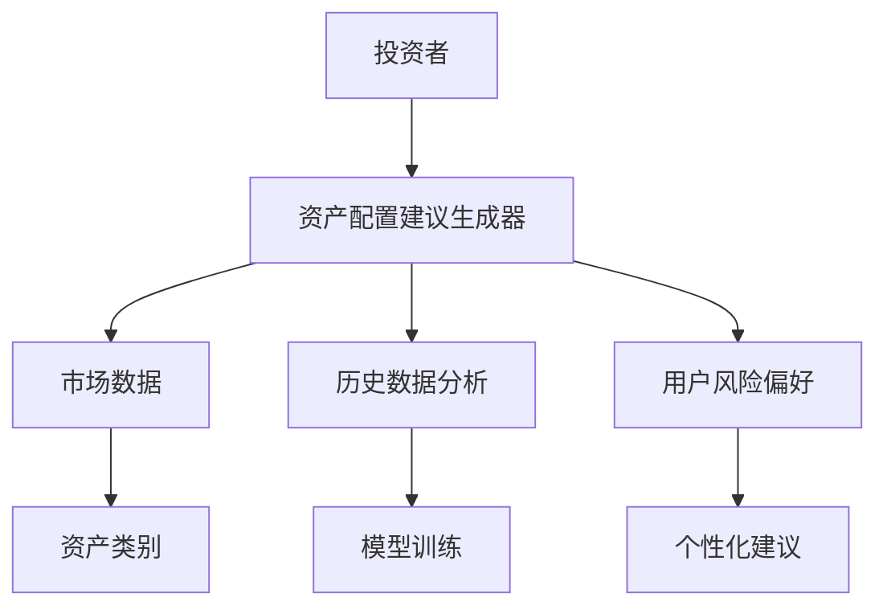
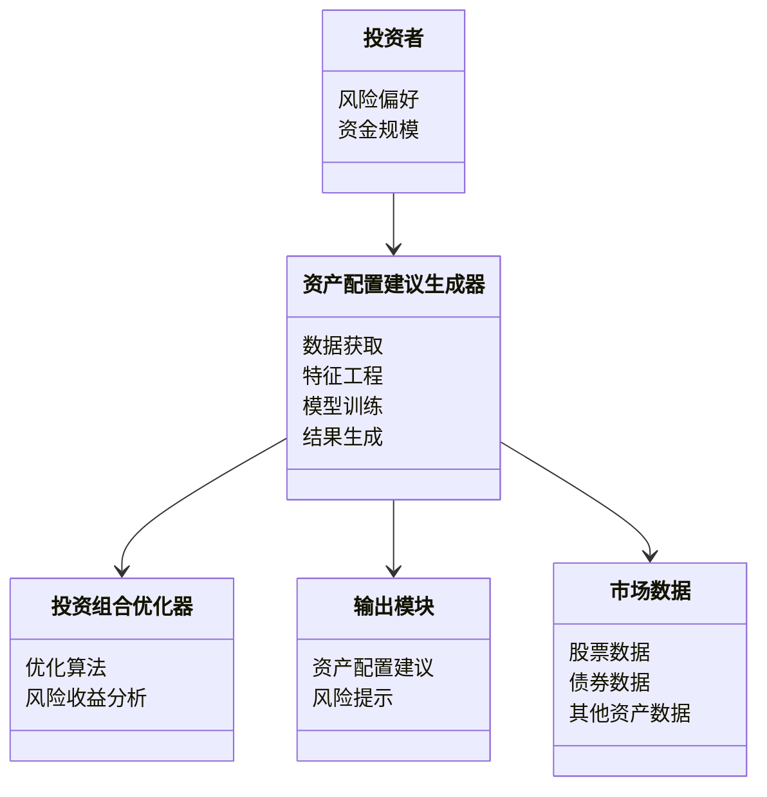
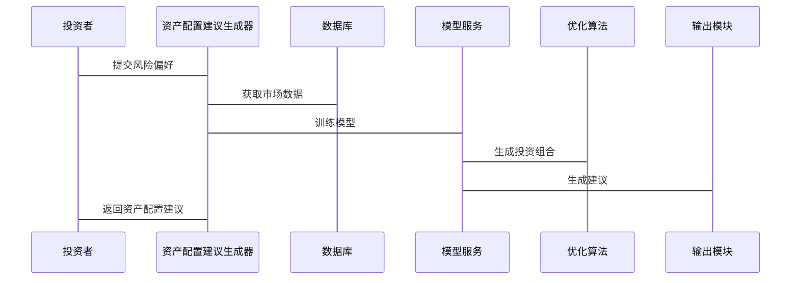

                 


# 智能资产配置建议生成器

> 关键词：智能资产配置，人工智能，投资组合优化，风险管理，金融技术

> 摘要：本文详细探讨了智能资产配置建议生成器的背景、核心概念、算法原理、系统设计和实际应用。通过结合现代投资组合理论（MPT）和机器学习技术，我们提出了一种基于人工智能的解决方案，以实现个性化的资产配置建议。文章还包括了详细的系统架构设计和项目实战，为读者提供了从理论到实践的全面指导。

---

# 第一部分: 智能资产配置建议生成器的背景与核心概念

## 第1章: 资产配置与智能投资概述

### 1.1 资产配置的定义与重要性

#### 1.1.1 传统资产配置的定义
资产配置是指将资金分配到不同的资产类别（如股票、债券、房地产等）中，以实现投资目标的过程。传统资产配置依赖于历史数据和经验判断，是一种基于统计分析的定性或半定量方法。

#### 1.1.2 资产配置在投资中的重要性
资产配置是投资组合管理的核心，它决定了投资组合的风险和收益。合理的资产配置可以降低投资组合的整体风险，同时最大化收益。

#### 1.1.3 资产配置的核心要素
- **资产类别**：股票、债券、现金等。
- **权重分配**：每种资产在组合中的比例。
- **再平衡**：定期调整资产权重以维持目标配置。

### 1.2 智能投资的定义与特点

#### 1.2.1 智能投资的定义
智能投资是一种利用人工智能技术（如机器学习、大数据分析）来优化投资决策的过程。它通过自动化分析市场数据和投资者需求，提供更精准的投资建议。

#### 1.2.2 智能投资的核心特点
- **数据驱动**：依赖大量历史和实时数据进行分析。
- **自动化**：通过算法自动优化投资组合。
- **个性化**：根据投资者的风险偏好和财务目标提供定制化建议。

#### 1.2.3 智能投资与传统投资的区别
| **方面** | **传统投资** | **智能投资** |
|----------|--------------|--------------|
| 数据来源 | 历史数据      | 历史+实时数据 |
| 决策方式 | 人工判断      | 自动化算法    |
| 个性化   | 较低          | 高度个性化    |

### 1.3 智能资产配置生成器的背景

#### 1.3.1 传统资产配置的局限性
传统资产配置方法依赖经验判断，难以应对复杂多变的市场环境。此外，传统方法难以处理大规模数据，且无法快速响应市场变化。

#### 1.3.2 AI技术在金融领域的应用
人工智能技术（如机器学习、深度学习）在金融领域的应用日益广泛，特别是在风险评估、市场预测和投资组合优化方面。

#### 1.3.3 智能资产配置生成器的提出
为了克服传统资产配置的局限性，我们提出了一种基于人工智能的智能资产配置生成器。该系统能够根据市场数据和投资者需求，自动生成个性化的资产配置建议。

---

## 第2章: 智能资产配置的核心概念与联系

### 2.1 核心概念原理

#### 2.1.1 现代投资组合理论（MPT）
MPT由Harry Markowitz于1952年提出，是资产配置的核心理论。MPT通过优化投资组合的期望收益和风险，找到最优的资产分配方案。

#### 2.1.2 风险与收益的权衡
在MPT中，风险和收益是两个关键指标。投资者需要在风险和收益之间找到平衡点，以实现投资目标。

#### 2.1.3 资产分配与再平衡
资产分配是指初始的资产权重分配，而再平衡是指定期调整资产权重以维持目标配置。

### 2.2 核心概念属性对比

#### 2.2.1 不同资产类别之间的特征对比
| **资产类别** | **风险** | **收益** | **流动性** |
|--------------|----------|----------|------------|
| 股票          | 高       | 高       | 高          |
| 债券          | 中       | 中       | 高          |
| 现金          | 低       | 低       | 极高        |

#### 2.2.2 资产配置生成器的实体关系图



### 2.3 本章小结

---

# 第二部分: 智能资产配置生成器的算法原理

## 第3章: 现代投资组合理论与数学模型

### 3.1 现代投资组合理论（MPT）概述

#### 3.1.1 MPT的核心思想
MPT通过优化投资组合的期望收益和风险，找到最优的资产分配方案。其核心思想是通过分散投资来降低风险。

#### 3.1.2 MPT的数学模型
投资组合的期望收益和风险可以用以下公式表示：

- 期望收益：
  $$E(r_p) = \sum_{i=1}^{n} w_i E(r_i)$$

- 风险：
  $$Var(r_p) = \sum_{i=1}^{n} \sum_{j=1}^{n} w_i w_j Cov(r_i, r_j)$$

其中，$w_i$ 是第$i$个资产的权重，$E(r_i)$ 是第$i$个资产的期望收益，$Cov(r_i, r_j)$ 是第$i$和$j$个资产之间的协方差。

#### 3.1.3 MPT的假设条件
- 资产价格服从正态分布。
- 市场是有效的。
- 投资者是理性的。

### 3.2 数学模型与公式

#### 3.2.1 投资组合的期望收益公式
$$E(r_p) = \sum_{i=1}^{n} w_i E(r_i)$$

#### 3.2.2 投资组合的风险公式
$$Var(r_p) = \sum_{i=1}^{n} \sum_{j=1}^{n} w_i w_j Cov(r_i, r_j)$$

### 3.3 优化算法

#### 3.3.1 线性规划算法
线性规划是一种优化方法，常用于解决投资组合优化问题。其目标是最小化风险，同时满足收益和权重约束。

#### 3.3.2 基于均值-方差优化的算法
均值-方差优化是一种常用的优化方法，目标是最小化投资组合的风险，同时实现目标收益。

#### 3.3.3 非线性优化算法
非线性优化算法用于解决复杂的优化问题，如多目标优化。

---

## 第4章: 机器学习在智能资产配置中的应用

### 4.1 机器学习模型概述

#### 4.1.1 监督学习模型
- 线性回归：用于预测资产收益。
- 支持向量机（SVM）：用于分类和回归。

#### 4.1.2 无监督学习模型
- 聚类分析：用于识别市场周期。
- 主成分分析（PCA）：用于降维。

#### 4.1.3 神经网络模型
- 长短期记忆网络（LSTM）：用于时间序列预测。
- 卷积神经网络（CNN）：用于图像识别。

### 4.2 基于机器学习的资产配置模型

#### 4.2.1 数据预处理
- 清洗数据：去除缺失值和异常值。
- 特征工程：提取有用的特征（如收益率、波动率）。

#### 4.2.2 模型训练
- 使用历史数据训练模型。
- 通过交叉验证优化模型参数。

#### 4.2.3 模型评估
- 使用回测（backtesting）评估模型性能。
- 通过夏普比率（Sharpe Ratio）衡量模型的风险调整后收益。

---

# 第三部分: 智能资产配置生成器的系统设计

## 第5章: 系统分析与架构设计方案

### 5.1 问题场景介绍
投资者需要根据市场环境和自身风险偏好，制定合理的资产配置策略。传统的资产配置方法难以满足复杂多变的市场需求。

### 5.2 项目介绍
智能资产配置生成器是一个基于人工智能的投资组合优化系统，能够根据市场数据和投资者需求，自动生成个性化的资产配置建议。

### 5.3 系统功能设计

#### 5.3.1 领域模型（Mermaid 类图）



### 5.4 系统架构设计（Mermaid 架构图）


### 5.5 系统接口设计

#### 5.5.1 API接口
- `/api/v1/assets`：获取资产数据。
- `/api/v1/portfolio`：生成投资组合建议。

### 5.6 系统交互（Mermaid 序列图）



---

## 第6章: 项目实战

### 6.1 环境安装

#### 6.1.1 安装Python
```bash
python --version
pip install --upgrade pip
```

#### 6.1.2 安装依赖包
```bash
pip install numpy pandas scikit-learn matplotlib
```

### 6.2 系统核心实现源代码

#### 6.2.1 数据获取
```python
import pandas as pd
import numpy as np

# 获取股票数据
def get_stock_data(tickers, start, end):
    data = pd.DataFrame()
    for ticker in tickers:
        df = pd.read_csv(f'data/{ticker}.csv', parse_dates=['Date'])
        data[ticker] = df['Close']
    return data
```

#### 6.2.2 特征工程
```python
from sklearn.preprocessing import StandardScaler

def preprocess_data(data):
    # 标准化数据
    scaler = StandardScaler()
    features = scaler.fit_transform(data)
    return features
```

#### 6.2.3 模型训练
```python
from sklearn.linear_model import LinearRegression

def train_model(features, labels):
    model = LinearRegression()
    model.fit(features, labels)
    return model
```

#### 6.2.4 结果生成
```python
def generate_recommendation(model, features):
    prediction = model.predict(features)
    return prediction
```

### 6.3 代码应用解读与分析

#### 6.3.1 数据获取
从指定的股票代码中读取数据，并将其合并到一个DataFrame中。

#### 6.3.2 特征工程
对数据进行标准化处理，以消除不同特征之间的量纲差异。

#### 6.3.3 模型训练
使用线性回归模型训练投资组合优化器。

#### 6.3.4 结果生成
根据训练好的模型，生成资产配置建议。

### 6.4 实际案例分析

#### 6.4.1 数据获取与预处理
```python
tickers = ['AAPL', 'MSFT', 'GOOGL']
data = get_stock_data(tickers, start='2020-01-01', end='2023-12-31')
features = preprocess_data(data)
```

#### 6.4.2 模型训练与预测
```python
labels = data.iloc[:, -1].values  # 使用最后一个资产作为目标
model = train_model(features, labels)
recommendation = generate_recommendation(model, features)
```

#### 6.4.3 结果分析
通过分析预测结果，生成个性化的资产配置建议，并输出风险提示。

### 6.5 项目小结

---

# 第四部分: 最佳实践

## 第7章: 最佳实践 tips、小结、注意事项、拓展阅读

### 7.1 小结
智能资产配置生成器是一种基于人工智能的投资组合优化系统，能够根据市场数据和投资者需求，自动生成个性化的资产配置建议。

### 7.2 注意事项
- 数据来源必须可靠。
- 模型需要定期更新。
- 投资者需要理解风险提示。

### 7.3 拓展阅读
- Harry Markowitz的《Portfolio Selection》。
- Andrew Ng的《Machine Learning》课程。

---

# 作者：AI天才研究院/AI Genius Institute & 禅与计算机程序设计艺术 /Zen And The Art of Computer Programming

