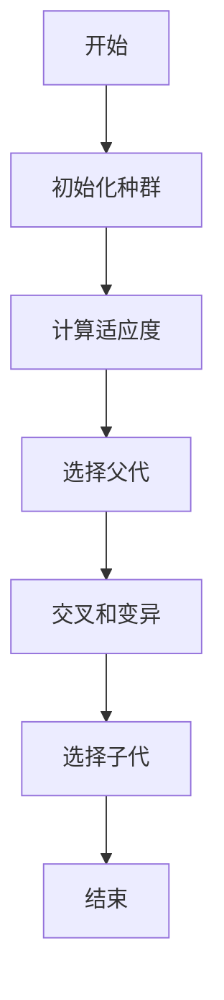
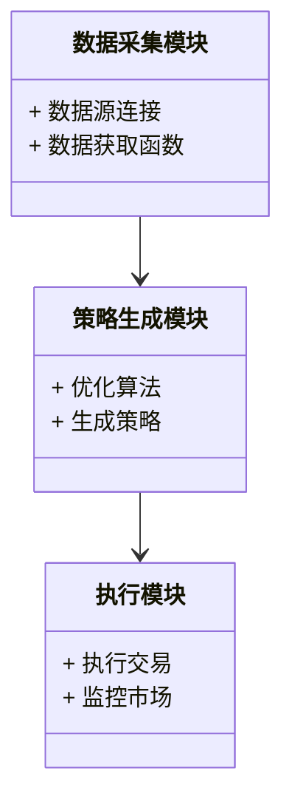

                 


# 智能资产配置策略动态优化器

## 关键词
智能资产配置，动态优化，优化算法，机器学习，投资组合

## 摘要
智能资产配置策略动态优化器是一种利用智能算法动态调整资产配置的工具，旨在通过实时市场数据和智能算法优化投资组合，提高收益并降低风险。本文将详细探讨其背景、核心算法、系统架构及项目实现，帮助读者全面理解其原理和应用。

---

## 第1章：智能资产配置策略动态优化器概述

### 1.1 智能资产配置的背景与意义
智能资产配置通过结合人工智能和大数据分析，实现资产组合的动态优化，帮助投资者在复杂多变的市场环境中做出最优决策。

#### 1.1.1 传统资产配置的局限性
传统资产配置方法依赖于固定规则，难以适应市场变化。例如，固定比例的资产分配可能在市场波动时导致重大损失。

#### 1.1.2 智能化配置的必要性
智能算法能够实时分析市场数据，识别潜在风险和机会，从而动态调整资产配置。

#### 1.1.3 动态优化的核心价值
动态优化能够根据市场变化快速调整投资组合，最大化收益并降低风险。

### 1.2 问题背景与描述
资产配置的核心问题是如何在不同资产之间分配资金，以实现风险和收益的最优平衡。

#### 1.2.1 资产配置的基本问题
- 如何选择最优的资产组合？
- 如何在不同市场条件下调整组合？

#### 1.2.2 动态优化的目标
动态优化的目标是根据实时市场数据，持续调整资产配置以最大化收益。

#### 1.2.3 边界与外延
动态优化的边界包括数据来源、市场条件和算法选择。外延则包括风险管理、绩效评估等。

### 1.3 核心概念与组成
智能资产配置动态优化器由智能优化算法、动态调整机制和组合优化模型组成。

---

## 第2章：智能优化算法原理

### 2.1 算法原理概述
智能优化算法是动态优化的核心，包括遗传算法、粒子群优化和机器学习模型。

#### 2.1.1 遗传算法
遗传算法模拟生物进化过程，通过选择、交叉和变异操作优化解。

#### 2.1.2 粒子群优化
粒子群优化算法通过模拟鸟群觅食行为，寻找问题的最优解。

#### 2.1.3 机器学习模型
机器学习模型（如神经网络）通过训练数据预测最优资产配置。

### 2.2 算法对比与选择
选择合适的算法需考虑其优缺点和适用场景。

#### 2.2.1 各算法的优缺点
| 算法      | 优点                | 缺点                |
|-----------|---------------------|---------------------|
| 遗传算法  | 全局搜索能力强       | 收敛速度较慢         |
| 粒子群优化| 收敛速度快           | 易陷入局部最优       |
| 机器学习  | 高精度预测           | 需大量数据支持       |

#### 2.2.2 适用场景分析
- 遗传算法适用于复杂问题。
- 粒子群优化适用于连续优化问题。
- 机器学习适用于数据驱动的场景。

---

## 第3章：优化算法的数学模型

### 3.1 数学模型构建
优化模型包括目标函数和约束条件。

#### 3.1.1 目标函数
最大化收益：
$$ \text{收益} = \sum_{i=1}^{n} w_i r_i $$
最小化风险：
$$ \text{风险} = \sum_{i=1}^{n} w_i^2 \sigma_i^2 $$

#### 3.1.2 约束条件
权重之和为1：
$$ \sum_{i=1}^{n} w_i = 1 $$

### 3.2 算法流程图


---

## 第4章：算法实现

### 4.1 Python 实现
以下代码实现遗传算法优化投资组合。

```python
import numpy as np

def fitness(weights, returns):
    return np.sum(weights * returns)

def optimize(weights, returns, generations=100):
    population = 100
    for _ in range(generations):
        # 计算适应度
        fitness = np.array([fitness(w, returns) for w in weights])
        # 选择
        selected = weights[np.argsort(-fitness)[:50]]
        # 交叉
        crossed = np.zeros_like(selected)
        for i in range(25):
            parent1 = selected[2*i]
            parent2 = selected[2*i+1]
            crossed[2*i] = (parent1 + parent2) / 2
            crossed[2*i+1] = (parent1 + parent2) / 2
        # 变异
        mutated = crossed + np.random.normal(0, 0.1, crossed.shape)
        # 约束
        mutated = mutated / np.sum(mutated, axis=1)[:, None]
        weights = mutated
    return weights
```

---

## 第5章：系统架构设计

### 5.1 系统模块划分
系统包括数据采集、策略生成和执行模块。

#### 5.1.1 数据采集模块
从金融数据源获取实时数据。

#### 5.1.2 策略生成模块
基于算法生成优化策略。

#### 5.1.3 执行模块
根据策略执行交易。

### 5.2 系统架构图


---

## 第6章：项目实战

### 6.1 环境安装
安装必要的库：
```bash
pip install numpy pandas scikit-learn
```

### 6.2 核心代码实现
以下代码实现动态优化器：

```python
import numpy as np
from sklearn import svm

def load_data():
    # 加载市场数据
    pass

def optimize_portfolio(data):
    # 使用SVM进行优化
    model = svm.SVR()
    model.fit(data)
    return model.predict(data)

if __name__ == "__main__":
    data = load_data()
    weights = optimize_portfolio(data)
    print(weights)
```

---

## 第7章：总结与展望

### 7.1 最佳实践
- 定期重新优化模型。
- 结合风险管理策略。

### 7.2 未来发展方向
- 引入区块链技术。
- 研究分布式计算。

---

作者：AI天才研究院  
来源：禅与计算机程序设计艺术

