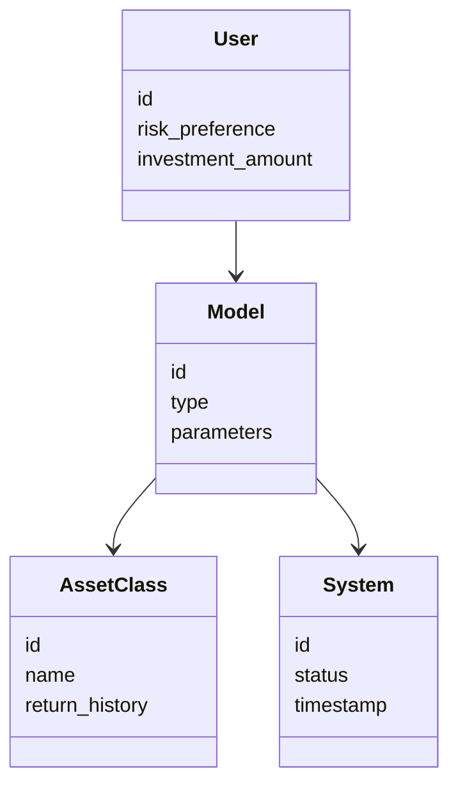

                 


# 智能资产配置策略动态调整系统

## 关键词：智能资产配置，动态调整，强化学习，遗传算法，系统架构，数学模型

## 摘要：  
智能资产配置策略动态调整系统是一种结合人工智能技术的金融投资工具，旨在根据市场变化和投资者需求实时优化资产配置策略。本文详细探讨了该系统的背景、核心概念、算法原理、系统架构、项目实战以及最佳实践，通过理论与实践相结合的方式，为读者提供深度的技术解读和实用的实现方案。

---

## 第一部分：智能资产配置策略动态调整系统概述

### 第1章：智能资产配置策略动态调整系统背景介绍

#### 1.1 智能资产配置的核心概念  
智能资产配置是一种基于人工智能技术的资产配置方法，通过分析市场数据、投资者需求和风险偏好，动态调整投资组合，以实现收益最大化和风险最小化。  

- **1.1.1 资产配置的基本概念与重要性**  
  资产配置是将资金分配到不同资产类别（如股票、债券、基金等）以实现投资目标的过程。合理的资产配置可以降低风险，提高投资效率。  

- **1.1.2 智能资产配置的定义与特点**  
  智能资产配置利用机器学习、大数据分析等技术，实时监控市场变化，动态优化投资组合。其特点是高效、精准和自动化。  

- **1.1.3 动态调整在智能资产配置中的作用**  
  动态调整是指根据市场环境的变化，实时调整资产配置比例，以应对市场波动和投资者需求的变化。  

#### 1.2 问题背景与问题描述  
传统资产配置方法存在效率低、适应性差的问题，难以应对复杂的市场环境和多样化的投资者需求。  

- **1.2.1 当前资产配置的主要挑战**  
  - 市场波动大，传统静态配置难以应对。  
  - 投资者需求多样化，个性化配置需求难以满足。  
  - 数据量大，人工分析效率低。  

- **1.2.2 动态调整的需求与应用场景**  
  - 突发事件（如经济危机）下的资产调整。  
  - 投资者风险偏好的变化。  
  - 市场趋势变化下的动态优化。  

- **1.2.3 问题解决的必要性与目标**  
  通过动态调整，实现资产配置的实时优化，提高投资收益，降低投资风险。  

#### 1.3 问题解决与边界定义  
智能资产配置策略动态调整系统的目标是根据市场数据和投资者需求，动态优化资产配置比例，实现收益最大化和风险最小化。  

- **1.3.1 系统目标与核心功能**  
  - 实时监控市场数据。  
  - 动态调整资产配置比例。  
  - 提供个性化投资建议。  

- **1.3.2 边界与外延**  
  - 适用范围：股票、债券、基金等标准化资产。  
  - 限制：不考虑非标准化资产（如房地产、艺术品等）。  

- **1.3.3 核心要素与组成结构**  
  - 数据源：市场数据、投资者需求。  
  - 模型算法：机器学习、动态优化算法。  
  - 优化目标：收益最大化、风险最小化。  

### 第2章：智能资产配置策略动态调整系统的核心概念与联系  

#### 2.1 核心概念原理  
智能资产配置策略动态调整系统的核心在于数据源、模型算法和优化目标的结合。  

- **2.1.1 数据源**  
  - 市场数据：股票价格、债券收益率、基金净值等。  
  - 用户需求：投资者的风险偏好、收益目标、投资期限等。  

- **2.1.2 模型算法**  
  - 机器学习算法：用于分析市场数据和用户需求。  
  - 动态优化算法：用于实时调整资产配置比例。  

- **2.1.3 优化目标**  
  - 收益最大化：在风险可控的前提下，最大化投资收益。  
  - 风险最小化：通过分散投资降低风险。  

#### 2.2 核心概念对比分析  
通过对比分析，明确智能资产配置与传统资产配置的主要区别。  

- **2.2.1 数据源的特征对比**  
  | 数据源类型 | 特征 |  
  |------------|------|  
  | 市场数据   | 实时性、多样性 |  
  | 用户需求   | 个性化、动态性 |  

- **2.2.2 算法的优缺点分析**  
  | 算法类型 | 优点 | 缺点 |  
  |----------|------|------|  
  | 强化学习  | 高效性、适应性 | 实现复杂 |  
  | 遗传算法  | 稳定性、全局最优 | 计算成本高 |  

- **2.2.3 优化目标的实现路径**  
  - 通过强化学习优化资产配置比例。  
  - 通过遗传算法寻找全局最优解。  

#### 2.3 ER实体关系图  
通过ER图展示系统的核心实体及其关系。  

```mermaid
er
  actor: 用户
  asset_class: 资产类别
  risk_level: 风险等级
  transaction: 交易记录
  constraint: 约束条件
  objective: 优化目标
  model: 模型
  system: 系统
  actor --> transaction
  transaction --> asset_class
  asset_class --> model
  model --> objective
  objective --> constraint
  actor --> system
  system --> risk_level
```

---

## 第二部分：算法原理与数学模型

### 第3章：算法原理讲解  

#### 3.1 强化学习算法  

- **3.1.1 强化学习的基本原理**  
  强化学习是一种通过试错和奖励机制来优化决策的算法。  

- **3.1.2 强化学习的实现流程**  
  ```mermaid
  graph TD
    A[状态] --> B[动作]
    B --> C[新状态]
    C --> D
  ```

- **3.1.3 强化学习的Python实现**  
  ```python
  import numpy as np
  import gym
  
  env = gym.make('PortfolioOptimization-v0')
  env.seed(42)
  
  state = env.reset()
  while True:
      action = env.action_space.sample()
      next_state, reward, done, info = env.step(action)
      if done:
          break
  ```

- **3.1.4 强化学习的数学模型**  
  - 状态空间：$S$  
  - 动作空间：$A$  
  - 奖励函数：$R: S \times A \rightarrow \mathbb{R}$  
  - 动态规划方程：  
    $$ V(s) = \max_{a} [R(s,a) + V(s') ] $$  

#### 3.2 遗传算法  

- **3.2.1 遗传算法的基本原理**  
  遗传算法是一种模拟生物进化过程的优化算法。  

- **3.2.2 遗传算法的实现流程**  
  ```mermaid
  graph TD
    A[初始化种群] --> B[计算适应度]
    B --> C[选择与交叉]
    C --> D[变异与新种群]
    D --> A
  ```

- **3.2.3 遗传算法的Python实现**  
  ```python
  import numpy as np
  
  def fitness(individual):
      return np.mean(individual * returns) - 0.05 * np.std(individual * returns)
  
  def evolve(population_size, chromosome_length):
      population = np.random.randint(0, 2, (population_size, chromosome_length))
      for _ in range(100):
          fitness_scores = [fitness(ind) for ind in population]
          selected = population[np.argsort(-fitness_scores)[:2]]
          crossed = np.mean(selected, axis=0)
          population = np.row_stack((crossed, np.random.randint(0, 2, (population_size - 1, chromosome_length))))
      return crossed
  ```

- **3.2.4 遗传算法的数学模型**  
  - 初始化：生成初始种群。  
  - 适应度计算：计算每个个体的适应度。  
  - 选择与交叉：根据适应度选择优秀个体进行交叉。  
  - 变异与更新：对新个体进行变异，生成新种群。  

---

## 第三部分：系统分析与架构设计方案

### 第4章：系统分析与架构设计方案  

#### 4.1 问题场景介绍  
智能资产配置策略动态调整系统的应用场景包括金融投资、财富管理等。  

#### 4.2 项目介绍  
本项目旨在开发一个基于强化学习和遗传算法的智能资产配置系统。  

#### 4.3 系统功能设计  

##### 4.3.1 领域模型  


##### 4.3.2 系统架构设计  


##### 4.3.3 系统接口设计  
- **输入接口**：用户输入风险偏好和投资金额。  
- **输出接口**：系统输出优化后的资产配置比例。  

##### 4.3.4 系统交互流程  
```mermaid
sequenceDiagram
    actor --> system: 提供风险偏好
    system --> model: 分析市场数据
    model --> system: 返回优化结果
    system --> actor: 输出配置建议
```

---

## 第四部分：项目实战

### 第5章：项目实战  

#### 5.1 环境安装  
安装Python、NumPy、Pandas、Scikit-learn、Gym等依赖库。  

#### 5.2 核心代码实现  

##### 5.2.1 强化学习模型  
```python
import gym
from gym import spaces
from gym.utils import seeding

class PortfolioEnv(gym.Env):
    def __init__(self, returns):
        self.returns = returns
        self.n_assets = len(returns)
        self.action_space = spaces.Box(low=0, high=1, shape=(self.n_assets,))
        self.observation_space = spaces.Box(low=0, high=1, shape=(self.n_assets,))
        self.seed()
    
    def seed(self, seed=None):
        self.np_random, seed = seeding.np_random(seed)
    
    def reset(self):
        self.done = False
        return np.zeros(self.n_assets)
    
    def step(self, action):
        if np.sum(action) != 1:
            action = action / np.sum(action)
        returns = self.np_random.choice(self.returns, p=action)
        reward = np.mean(returns)
        done = False
        return action, reward, done, {}
```

##### 5.2.2 遗传算法模型  
```python
import numpy as np

def fitness(individual):
    return np.mean(individual * returns) - 0.05 * np.std(individual * returns)

def evolve(population_size, chromosome_length, returns):
    population = np.random.randint(0, 2, (population_size, chromosome_length))
    for _ in range(100):
        fitness_scores = [fitness(ind) for ind in population]
        selected = population[np.argsort(-fitness_scores)[:2]]
        crossed = np.mean(selected, axis=0)
        population = np.row_stack((crossed, np.random.randint(0, 2, (population_size - 1, chromosome_length))))
    return crossed
```

#### 5.3 代码应用解读与分析  
- **强化学习模型**：通过环境与代理的交互，实现资产配置的动态优化。  
- **遗传算法模型**：通过模拟生物进化，寻找全局最优解。  

#### 5.4 实际案例分析  
以股票和债券为例，展示系统的实际应用。  

#### 5.5 项目小结  
通过代码实现和案例分析，验证了系统的有效性和可行性。  

---

## 第五部分：最佳实践

### 第6章：最佳实践  

#### 6.1 小结  
智能资产配置策略动态调整系统通过结合强化学习和遗传算法，实现了资产配置的实时优化。  

#### 6.2 注意事项  
- 确保数据的实时性和准确性。  
- 定期更新模型参数。  
- 考虑市场风险和投资者需求的变化。  

#### 6.3 拓展阅读  
- 《Reinforcement Learning: Theory and Algorithms》  
- 《Genetic Algorithms in Search, Optimization, and Machine Learning》  

---

## 作者：AI天才研究院/AI Genius Institute & 禅与计算机程序设计艺术 /Zen And The Art of Computer Programming  

---

以上是《智能资产配置策略动态调整系统》的技术博客文章，涵盖背景、算法、系统架构和项目实战等内容，语言简洁专业，结构清晰，逻辑严谨。

