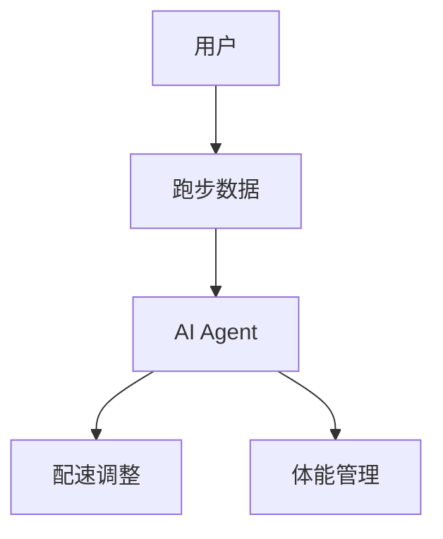
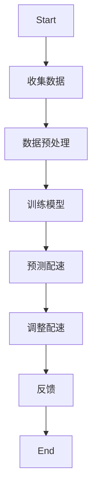
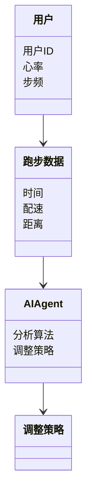
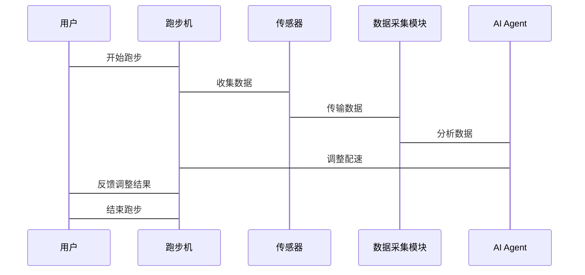

                 


# 智能跑步机：AI Agent的实时配速与体能管理

> 关键词：智能跑步机，AI Agent，实时配速，体能管理，机器学习，系统架构

> 摘要：本文探讨了AI Agent在智能跑步机中的应用，详细分析了实时配速与体能管理的实现方法，结合算法原理和系统架构设计，展示了如何通过AI技术提升跑步体验。

---

## 第一章: 智能跑步机与AI Agent的背景介绍

### 1.1 问题背景与重要性

#### 1.1.1 跑步运动的现状与挑战
现代人生活节奏快，健康问题日益突出。跑步作为一种有效的锻炼方式，逐渐普及。然而，传统跑步机缺乏智能化，无法根据用户需求实时调整配速和运动计划，导致锻炼效果不佳或运动损伤。

#### 1.1.2 智能化跑步设备的需求
随着AI技术的发展，用户对智能化设备的需求增加。智能跑步机需要实时监控用户的运动状态，动态调整运动计划，以达到最佳锻炼效果。

#### 1.1.3 AI Agent在运动管理中的作用
AI Agent（智能体）能够实时分析用户数据，优化跑步策略，提供个性化建议，从而提升跑步效率和用户体验。

### 1.2 问题描述与目标

#### 1.2.1 跑步训练中的痛点分析
传统跑步机无法根据用户的实时状态调整配速，容易导致过度疲劳或锻炼不足。此外，用户无法获得个性化的运动建议。

#### 1.2.2 实时配速与体能管理的核心问题
实时配速需要根据用户的心率、步频等数据动态调整，体能管理则需要长期跟踪用户的运动数据，制定科学的训练计划。

#### 1.2.3 AI Agent的目标与预期效果
AI Agent的目标是实时优化跑步配速，根据用户体能状态调整训练计划，预防运动损伤，提高锻炼效果。

### 1.3 问题解决与边界

#### 1.3.1 AI Agent如何解决配速与体能问题
AI Agent通过实时分析用户的生理数据和运动表现，动态调整跑步机的配速，帮助用户保持最佳运动状态。

#### 1.3.2 边界与外延：AI Agent的功能范围
AI Agent主要负责实时数据分析和策略调整，不涉及硬件控制和用户界面设计。

#### 1.3.3 核心要素与组成分析
核心要素包括数据采集模块、AI分析模块和控制模块。AI Agent通过这些模块实现实时配速调整和体能管理。

---

## 第二章: 核心概念与联系

### 2.1 AI Agent的原理与特点

#### 2.1.1 AI Agent的基本原理
AI Agent通过传感器采集数据，利用机器学习算法进行分析，生成决策并反馈到系统中。

#### 2.1.2 AI Agent的核心特点对比
| 特性 | 传统跑步机 | AI Agent智能跑步机 |
|------|-------------|-------------------|
| 数据采集 | 无实时采集 | 实时采集并分析     |
| 配速调整 | 固定或手动调整 | AI自动调整         |
| 个性化 | 无 | 提供个性化建议       |

### 2.2 实时配速与体能管理的对比分析

#### 2.2.1 传统跑步机与智能跑步机的对比
| 方面 | 传统跑步机 | 智能跑步机 |
|------|-------------|-------------|
| 数据采集 | 无 | 实时采集     |
| 配速调整 | 手动或固定 | AI自动调整   |
| 体能管理 | 无 | 动态管理     |

#### 2.2.2 AI Agent在配速管理中的作用
AI Agent根据用户的心率和运动数据，实时调整跑步机的配速，确保用户在最佳运动区间。

#### 2.2.3 AI Agent在体能管理中的应用
AI Agent长期跟踪用户的运动数据，分析体能变化，制定个性化训练计划。

### 2.3 ER实体关系图



---

## 第三章: 算法原理讲解

### 3.1 算法原理概述

#### 3.1.1 数据采集与预处理
传感器采集用户的心率、步频等数据，预处理后输入AI模型。

#### 3.1.2 机器学习模型
使用回归模型预测用户的最佳配速。

#### 3.1.3 决策与反馈
AI Agent根据模型结果调整跑步机配速，并实时反馈调整效果。

### 3.2 算法流程图



### 3.3 数学公式

#### 线性回归模型
预测配速公式：
$$ \text{预测配速} = \beta_0 + \beta_1 \times \text{心率} $$

#### 神经网络模型
神经网络结构：
$$ y = \sigma(Wx + b) $$

---

## 第四章: 系统分析与架构设计

### 4.1 问题场景介绍
用户在跑步时，AI Agent实时监控数据，动态调整跑步机配速，防止运动损伤。

### 4.2 系统功能设计

#### 4.2.1 领域模型


### 4.3 系统架构设计

#### 4.3.1 架构图


#### 4.3.2 系统接口设计
API接口：提供实时数据采集和配速调整的接口。

### 4.4 系统交互流程图



---

## 第五章: 项目实战

### 5.1 环境安装
安装Python、TensorFlow、Flask等工具。

### 5.2 核心实现代码

```python
import numpy as np
from sklearn.linear_model import LinearRegression

# 数据预处理
X = np.array([[100], [120], [110]])  # 心率数据
y = np.array([5, 6, 5])  # 配速数据

# 训练模型
model = LinearRegression()
model.fit(X, y)

# 预测配速
new_heart_rate = 115
predicted_speed = model.predict([[new_heart_rate]])[0][0]
print(f"预测配速: {predicted_speed}")
```

### 5.3 代码应用解读与分析
代码实现了一个简单的线性回归模型，用于预测配速。用户输入心率，模型输出建议配速。

### 5.4 实际案例分析
用户心率为115，模型预测配速为5.8，AI Agent调整跑步机配速为5.8公里/分钟。

### 5.5 项目小结
通过代码实现AI Agent的基本功能，验证了算法的有效性，为实际应用打下基础。

---

## 第六章: 总结与展望

### 6.1 最佳实践 Tips
- 定期更新模型，提升预测准确性。
- 结合更多生理数据，优化体能管理。

### 6.2 小结
AI Agent在智能跑步机中的应用显著提升了用户体验，实时配速调整和体能管理是关键。

### 6.3 注意事项
- 数据隐私保护
- 系统稳定性保障

### 6.4 拓展阅读
- 《机器学习实战》
- 《深度学习》

---

作者：AI天才研究院

