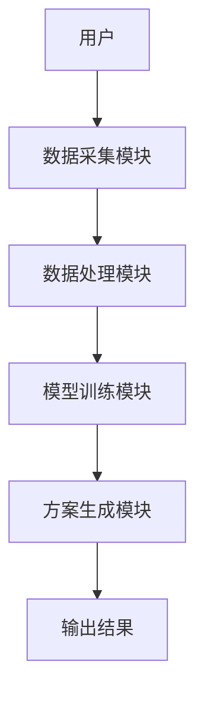

                 


# 智能跨国税收筹划方案生成器

> 关键词：智能税收筹划，跨国税务，人工智能，机器学习，税收优化

> 摘要：本文深入探讨了智能跨国税收筹划方案生成器的原理、方法和应用场景。通过分析跨国税务的复杂性，结合人工智能技术，提出了一套基于机器学习的智能税收优化方案。文章详细介绍了税收筹划的核心概念、AI驱动的税收优化算法、系统架构设计以及实际项目案例，为读者提供了从理论到实践的全面指导。

---

## 第一部分：智能跨国税收筹划的背景与基础

### 第1章：税收筹划的基本概念

#### 1.1 税收筹划的定义与特点

税收筹划是指通过合法、合规的方式，优化企业的税务结构，降低税负，提高企业的财务效益。其核心特点包括：

- **合法性**：必须遵守各国税法规定，避免偷税漏税。
- **规划性**：通过提前规划和策略制定，实现税负最小化。
- **动态性**：随着税法变化和企业经营状况的调整，税收筹划需要不断优化。

#### 1.2 跨国税收筹划的挑战

跨国税收筹划面临以下主要挑战：

- **税务政策差异**：不同国家的税法规定各不相同，增加了筹划的复杂性。
- **合规性风险**：如何在合法合规的前提下实现税负优化是一个难题。
- **信息不对称**：跨国经营涉及多国税务信息，获取和处理难度大。

---

### 第2章：智能化技术在税收筹划中的应用

#### 2.1 AI技术与税收筹划的结合

人工智能技术在税收筹划中的应用主要体现在以下几个方面：

- **数据处理**：利用AI技术对海量税务数据进行清洗、分析和建模。
- **模式识别**：通过机器学习算法识别税收筹划的最优模式。
- **规则匹配**：基于知识图谱技术，匹配各国税法规则，生成合规的税收优化方案。

#### 2.2 智能跨国税收筹划的必要性

AI技术的应用为跨国税收筹划带来了显著优势：

- **提高效率**：通过自动化处理和智能分析，大幅减少人工工作量。
- **降低风险**：AI能够实时监控税法变化，确保筹划方案的合规性。
- **个性化方案**：根据企业的具体需求，生成定制化的税收优化方案。

---

## 第二部分：智能跨国税收筹划的核心概念

### 第3章：智能跨国税收筹划的核心概念

#### 3.1 税收筹划的原理

税收筹划的原理主要包括：

- **税负最小化**：通过合理分配收入和支出，降低整体税负。
- **合规性优先**：确保所有筹划方案符合相关法律法规。
- **风险控制**：通过建立风险评估机制，降低税务争议风险。

#### 3.2 AI驱动的税收筹划模型

AI驱动的税收筹划模型包括以下关键模块：

- **数据处理模块**：负责清洗和预处理税务数据。
- **模型训练模块**：利用机器学习算法训练税收优化模型。
- **方案生成模块**：根据模型预测结果生成最优税收筹划方案。

---

## 第三部分：智能跨国税收筹划的算法原理

### 第4章：智能跨国税收筹划的算法原理

#### 4.1 税收筹划的机器学习模型

机器学习在税收筹划中的应用主要体现在以下几个方面：

- **监督学习**：用于基于历史数据的税收预测和优化。
- **无监督学习**：用于发现隐藏的税务数据模式和关联性。
- **强化学习**：用于动态调整税收筹划策略，以应对税法变化。

#### 4.2 税收筹划的数学模型

税收筹划的数学模型可以通过以下公式表示：

$$
\text{税负} = \sum_{i=1}^{n} w_i x_i
$$

其中，$w_i$ 表示第i项的权重，$x_i$ 表示第i项的数值。

---

## 第四部分：系统分析与架构设计

### 第5章：系统分析与架构设计

#### 5.1 问题场景介绍

跨国企业需要在多个国家进行税务申报和缴纳，涉及复杂的税务政策和合规性要求。如何利用AI技术实现智能化的税收筹划，是本文的核心问题。

#### 5.2 系统功能设计

系统功能设计包括以下模块：

- **数据采集模块**：负责采集多国税务数据。
- **模型训练模块**：基于机器学习算法训练税收优化模型。
- **方案生成模块**：根据模型预测结果生成最优税收筹划方案。

#### 5.3 系统架构设计

系统架构设计如图所示：



---

## 第五部分：项目实战

### 第6章：项目实战

#### 6.1 环境配置

项目实战需要以下环境：

- **Python 3.8+**
- **机器学习库（如Scikit-learn、TensorFlow）**
- **数据处理工具（如Pandas、NumPy）**

#### 6.2 核心代码实现

以下是核心代码示例：

```python
import pandas as pd
from sklearn.linear_model import LinearRegression

# 数据加载
data = pd.read_csv('tax_data.csv')

# 数据预处理
X = data[['收入', '支出']]
y = data['税负']

# 模型训练
model = LinearRegression()
model.fit(X, y)

# 模型预测
new_data = pd.DataFrame({'收入': [1000000], '支出': [500000]})
predicted_tax = model.predict(new_data)
print(predicted_tax)
```

#### 6.3 案例分析

通过上述代码，我们可以看到，模型能够根据输入的收入和支出数据，预测出相应的税负。这为企业提供了高效的税收筹划工具。

---

## 第六部分：最佳实践与小结

### 第7章：最佳实践与小结

#### 7.1 最佳实践

- **数据质量**：确保数据的准确性和完整性。
- **模型优化**：定期更新模型，以适应税法变化。
- **合规性检查**：确保所有筹划方案符合相关法律法规。

#### 7.2 小结

智能跨国税收筹划方案生成器通过结合人工智能技术和税收筹划理论，为企业提供了高效、合规的税务优化方案。未来，随着AI技术的不断发展，税收筹划将更加智能化和个性化。

---

作者：AI天才研究院/AI Genius Institute & 禅与计算机程序设计艺术 /Zen And The Art of Computer Programming

