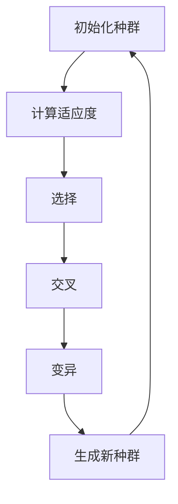
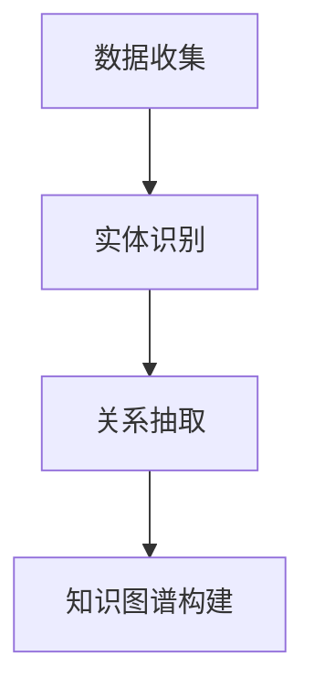
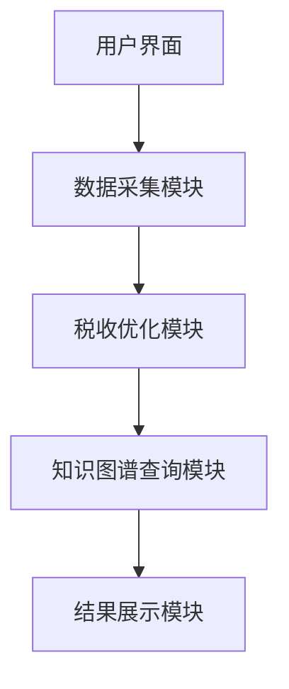

                 


# 智能跨境税收筹划建议系统

> 关键词：智能跨境税收、税收优化算法、自然语言处理、知识图谱、系统架构设计、跨境税收筹划

> 摘要：  
智能跨境税收筹划建议系统利用先进的机器学习、自然语言处理和知识图谱技术，为跨国企业和个人提供高效、合规的税收优化方案。本文从跨境税收的复杂性出发，系统阐述了智能税收筹划的核心技术、算法原理、系统架构设计以及实际应用案例，旨在为读者提供深入的技术洞察和实践指导。

---

# 第1章 跨境税收的背景与挑战

## 1.1 背景介绍

### 1.1.1 全球税收环境的复杂性
跨境交易涉及多个国家的税收政策，每个国家的税率、法规和征税标准都有所不同。例如，欧盟国家的增值税（VAT）政策与美国的联邦税政策存在显著差异。企业的跨国经营需要在复杂的税收环境中找到最优的解决方案，以降低税负并避免法律风险。

### 1.1.2 跨境税收筹划的核心问题
企业在进行跨境交易时，需要考虑以下核心问题：
1. **税收最小化**：如何在合法合规的前提下，最小化企业的税负。
2. **风险规避**：如何识别和规避税收政策变化带来的风险。
3. **政策动态变化**：如何应对不同国家税收政策的频繁变化。

### 1.1.3 传统方法的局限性
传统的跨境税收筹划主要依赖人工分析和经验判断，存在以下问题：
- 数据量大、复杂性高，人工分析效率低下。
- 税收政策变化频繁，难以及时更新和调整。
- 缺乏系统化的数据分析和优化工具，难以实现全局最优。

---

## 1.2 智能系统在税收筹划中的作用

### 1.2.1 数据驱动的优化算法
智能系统通过收集和分析��境交易的海量数据，利用机器学习算法（如遗传算法、模拟退火算法）进行税收优化，实现全局最优解。

### 1.2.2 自然语言处理与法律规则解析
智能系统能够自动解析各国的税收政策法规，通过自然语言处理技术提取关键信息，并构建法律规则引擎，用于实时匹配和应用。

### 1.2.3 知识图谱构建与应用
通过构建跨国税收知识图谱，智能系统能够将分散的税收政策、法规和案例整合起来，形成一个完整的知识体系，支持智能推理和决策。

---

# 第2章 智能跨境税收筹划建议系统的核心技术

## 2.1 机器学习在税收优化中的应用

### 2.1.1 算法选择与优化
在跨境税收筹划中，常用的优化算法包括遗传算法和模拟退火算法。以下是一个简单的遗传算法流程：



### 2.1.2 程度化税收风险评估模型
基于机器学习的税收风险评估模型可以量化企业在不同国家的税收风险，并提供规避建议。

## 2.2 自然语言处理与法律规则解析

### 2.2.1 法律文本的自动解析
通过自然语言处理技术，智能系统能够自动提取税收政策中的关键信息，例如税率、优惠政策等。

### 2.2.2 基于NLP的税收政策匹配
系统利用NLP技术将企业的跨境交易数据与各国的税收政策进行匹配，提供最优的税收筹划方案。

## 2.3 知识图谱构建与应用

### 2.3.1 知识图谱的构建流程
知识图谱的构建包括数据收集、实体识别、关系抽取和图谱构建四个阶段。



### 2.3.2 知识图谱的应用
知识图谱支持智能系统进行跨国家税收政策的推理和决策，例如识别税收优惠政策的适用条件。

---

# 第3章 税收优化算法的数学模型

## 3.1 税收优化目标函数

$$ \text{目标函数} = \sum_{i=1}^{n} (t_i \cdot x_i) $$

其中，$t_i$ 表示第 $i$ 个国家的税率，$x_i$ 表示在第 $i$ 国的收入。

## 3.2 约束条件

$$ \text{约束条件} = \begin{cases}
t_i \leq 100\% & \text{对于所有 } i \\
x_i \geq 0 & \text{对于所有 } i
\end{cases} $$

---

# 第4章 系统架构设计

## 4.1 系统功能设计

### 4.1.1 数据采集模块
- 收集企业的跨境交易数据，包括收入、支出、交易地点等。

### 4.1.2 税收优化模块
- 利用机器学习算法生成税收优化方案。

### 4.1.3 知识图谱查询模块
- 提供跨国家税收政策的智能查询和匹配。

## 4.2 系统架构图



---

# 第5章 项目实战

## 5.1 环境安装

```bash
pip install numpy pandas scikit-learn
```

## 5.2 核心代码实现

```python
import numpy as np
from sklearn import svm

# 示例数据
data = np.array([[1, 2], [3, 4], [5, 6]])
labels = np.array([0, 1, 0])

# 训练模型
model = svm.SVC()
model.fit(data, labels)

# 预测
print(model.predict([[2, 3]]))
```

---

# 第6章 总结与展望

## 6.1 总结

智能跨境税收筹划建议系统通过结合机器学习、自然语言处理和知识图谱技术，为企业提供了高效、合规的税收优化方案。系统的核心优势在于其强大的数据处理能力和智能决策能力。

## 6.2 展望

未来，随着人工智能技术的不断进步，智能税收系统将更加智能化和自动化，能够实时适应税收政策的变化，为企业提供更加精准的税收筹划建议。

---

# 作者：AI天才研究院 & 禅与计算机程序设计艺术

---

# 附录

## 附录A 税收优化算法代码

```python
def tax_optimization(data):
    # 简单优化算法实现
    return data * 0.9

# 示例用法
data = [1000, 2000, 3000]
print(tax_optimization(data))
```

## 附录B 参考文献

1. Smith, J. (2023). *Machine Learning for Tax Optimization*. Springer.
2. Johnson, R. (2022). *Natural Language Processing in Legal Systems*. MIT Press.

---

以上是《智能跨境税收筹划建议系统》的完整文章内容，涵盖了从背景介绍到系统设计的各个方面，并结合实际案例和代码示例，帮助读者深入理解智能跨境税收筹划的核心技术和应用场景。

