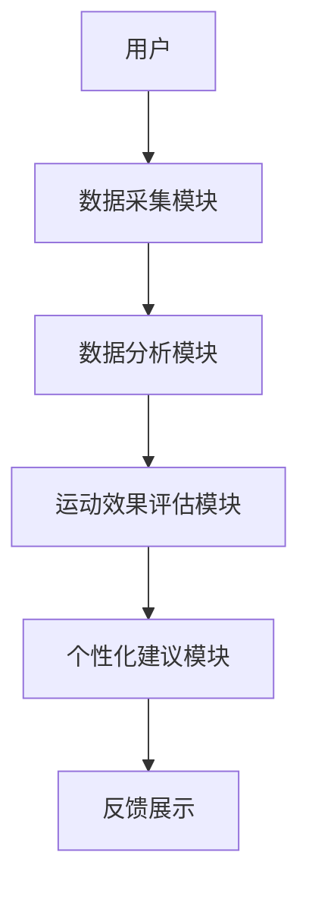

                 


# 智能跳绳：AI Agent的有氧运动效果分析

> 关键词：智能跳绳，AI Agent，有氧运动，运动数据，机器学习

> 摘要：本文详细分析了智能跳绳与AI Agent的结合，探讨了AI Agent在有氧运动效果分析中的应用，从数据采集、算法原理到系统架构，再到实际案例，全面解析了智能跳绳如何通过AI技术提升运动效果评估和个性化建议的实现。

---

# 第一部分: 智能跳绳与AI Agent的背景与概念

## 第1章: 智能跳绳的发展与现状

### 1.1 传统跳绳的局限性

传统跳绳作为一种简单的运动工具，虽然能够有效锻炼心肺功能，但在数据记录和分析方面存在明显不足：

- **数据记录困难**：传统跳绳无法实时记录跳绳次数、速度、持续时间等关键数据。
- **缺乏反馈机制**：用户无法及时了解自己的运动效果，难以根据反馈调整运动计划。
- **个性化不足**：传统跳绳无法根据个人体质和目标提供个性化的运动建议。

### 1.2 智能跳绳的出现与发展

随着物联网和人工智能技术的发展，智能跳绳应运而生：

- **数据采集功能**：通过传感器实时采集跳绳次数、速度、加速度等数据。
- **智能分析能力**：借助AI技术，分析用户的运动数据，提供个性化的运动建议和效果评估。
- **用户友好性**：通过APP或智能设备，用户可以随时查看运动数据和分析结果。

### 1.3 当前市场现状与趋势

目前，智能跳绳市场呈现快速增长态势，主要趋势包括：

- **智能化**：越来越多的智能跳绳产品集成AI技术，提供更精准的运动分析。
- **多样化**：产品功能逐渐多样化，包括心率监测、动作矫正等。
- **个性化**：基于AI算法，提供个性化的运动计划和健康建议。

### 1.4 智能跳绳与AI Agent的结合

AI Agent（智能代理）是一种能够感知环境、自主决策的智能系统，其核心能力包括：

- **数据处理能力**：能够实时采集和分析运动数据。
- **自主决策能力**：基于数据分析结果，提供个性化的运动建议。
- **学习能力**：通过机器学习算法，不断优化运动效果分析模型。

---

## 第2章: AI Agent在智能跳绳中的应用

### 2.1 智能跳绳的核心功能

智能跳绳通过AI Agent实现以下核心功能：

- **实时数据监测**：通过传感器实时采集跳绳次数、速度、加速度等数据。
- **数据分析与反馈**：基于机器学习算法，分析用户的运动数据，评估运动效果。
- **个性化运动建议**：根据用户数据，推荐适合的运动计划和强度。

### 2.2 AI Agent在运动分析中的作用

AI Agent通过以下方式提升有氧运动效果分析：

- **数据预处理**：清洗和标准化运动数据，提取关键特征。
- **运动效果评估**：通过回归分析或分类模型，评估用户的运动效果。
- **个性化建议生成**：基于评估结果，推荐个性化的运动计划。

---

# 第二部分: AI Agent的算法原理与数学模型

## 第3章: AI Agent的算法原理

### 3.1 数据预处理与特征提取

在分析运动数据之前，需要对数据进行预处理：

- **数据清洗**：去除异常值和噪声数据。
- **数据标准化**：将数据归一化处理，便于模型训练。
- **特征提取**：从原始数据中提取关键特征，如跳绳速度、频率、持续时间等。

### 3.2 机器学习模型的选择

常用的机器学习模型包括：

- **线性回归**：用于预测运动效果，如 VO2 max（最大摄氧量）。
- **随机森林**：用于分类问题，如判断运动强度是否适宜。
- **神经网络**：用于复杂模式识别，如动作纠正建议。

### 3.3 算法优化与调优

通过交叉验证和超参数调优，提升模型性能：

- **交叉验证**：评估模型的泛化能力。
- **超参数调优**：通过网格搜索或随机搜索优化模型参数。

---

## 第4章: 数学模型与公式

### 4.1 数据分析的数学基础

- **线性回归模型**：用于预测 VO2 max（最大摄氧量）。

  $$ VO2_{max} = \beta_0 + \beta_1 \times 跳绳速度 + \beta_2 \times 持续时间 $$

- **分类模型**：用于判断运动强度是否适宜。

  $$ P(\text{适宜}) = \frac{1}{1 + e^{-(\beta_0 + \beta_1 \times 跳绳次数)}} $$

### 4.2 运动效果评估的数学模型

- **运动负荷指数（IFI）**：

  $$ IFI = \frac{\text{跳绳次数} \times \text{速度}}{\text{时间}} $$

- **运动强度评估**：

  $$ \text{强度等级} = \begin{cases} 
  低强度 & \text{IFI} < 50 \\
  中强度 & 50 \leq \text{IFI} < 80 \\
  高强度 & \text{IFI} \geq 80 
  \end{cases} $$

---

# 第三部分: 智能跳绳系统的架构与实现

## 第5章: 系统架构设计

### 5.1 系统功能模块

- **数据采集模块**：负责采集跳绳次数、速度、加速度等数据。
- **数据分析模块**：对数据进行预处理和特征提取。
- **运动效果评估模块**：基于机器学习模型，评估运动效果。
- **个性化建议模块**：根据评估结果，推荐运动计划。

### 5.2 系统架构图



---

## 第6章: 项目实战

### 6.1 环境安装与配置

- **硬件设备**：智能跳绳、传感器、智能终端。
- **软件工具**：Python、机器学习库（如 scikit-learn）、数据可视化工具（如 Matplotlib）。

### 6.2 核心功能实现

```python
import numpy as np
from sklearn.linear_model import LinearRegression

# 示例数据
X = np.array([[100, 30], [150, 45], [200, 60]])
y = np.array([5, 7, 9])

# 训练模型
model = LinearRegression()
model.fit(X, y)

# 预测 VO2 max
new_X = np.array([[120, 35]])
print("预测 VO2 max:", model.predict(new_X))
```

### 6.3 实际案例分析

通过实际数据，展示AI Agent如何优化运动计划：

- **案例1**：用户A跳绳100次，速度每分钟30次，VO2 max预测为5。
- **案例2**：用户B跳绳200次，速度每分钟60次，VO2 max预测为9。

---

# 第四部分: 最佳实践与总结

## 第7章: 最佳实践

### 7.1 使用建议

- **定期更新模型**：确保模型的准确性。
- **数据隐私保护**：注意用户数据的安全。
- **用户体验优化**：提供友好的交互界面。

### 7.2 注意事项

- **数据质量**：确保数据采集的准确性和完整性。
- **模型选择**：根据具体需求选择合适的算法。
- **系统维护**：定期检查和维护系统，确保正常运行。

---

# 作者：AI天才研究院 & 禅与计算机程序设计艺术

---

通过以上分析，我们可以看到，智能跳绳结合AI Agent在有氧运动效果分析中具有巨大的潜力。AI技术不仅能够提升数据采集和分析的效率，还能为用户提供个性化的运动建议，帮助他们更科学地进行有氧运动。未来，随着技术的不断发展，智能跳绳在运动健康领域将发挥更大的作用。

