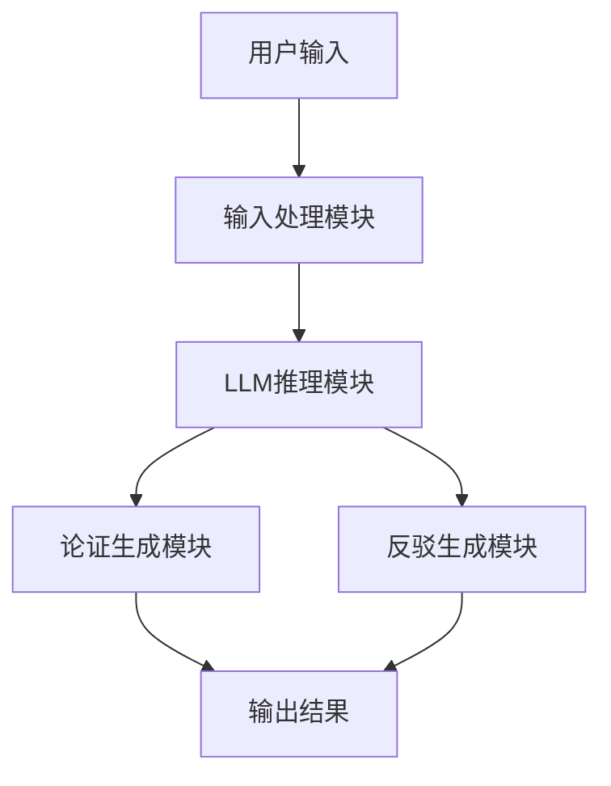
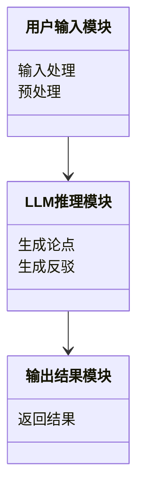
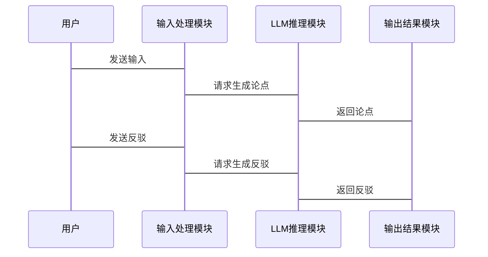

                 


# 智能辩论AI Agent：LLM驱动的论证与反驳系统

> 关键词：智能辩论，LLM，论证，反驳，AI Agent，自然语言处理

> 摘要：本文详细探讨了基于大语言模型（LLM）的智能辩论AI Agent的构建与实现。文章从问题背景、核心概念、算法原理、系统架构到项目实战，全面分析了智能辩论系统的设计与实现过程。通过结合理论与实践，本文为读者提供了从基础理论到实际应用的完整指南。

---

# 第一部分: 智能辩论AI Agent的背景与核心概念

## 第1章: 问题背景与问题描述

### 1.1 问题背景

#### 1.1.1 人工智能与自然语言处理的发展
人工智能（AI）技术的快速发展，特别是在自然语言处理（NLP）领域的突破，使得机器能够理解和生成人类语言。近年来，大语言模型（LLM）如GPT-3、GPT-4等的出现，使得机器在文本生成、对话理解和逻辑推理等方面的能力得到了显著提升。

#### 1.1.2 辩论与论证在人机交互中的重要性
辩论是一种复杂的语言交互形式，它不仅要求参与者具备逻辑思维能力，还需要能够快速生成合理的论点和反驳对方的观点。在人机交互中，智能辩论系统能够帮助用户进行高效的讨论，辅助决策，甚至在教育、法律等领域发挥重要作用。

#### 1.1.3 当前智能辩论系统的局限性
尽管现有的智能辩论系统取得了一定的进展，但大多数系统仍然存在以下问题：
- 论证缺乏深度，逻辑性不足。
- 反驳能力有限，无法灵活应对复杂场景。
- 系统的可解释性较差，难以让用户信任。
- 对特定领域的适应性不足。

### 1.2 问题描述

#### 1.2.1 智能辩论AI Agent的目标与范围
智能辩论AI Agent的目标是通过自然语言处理技术和大语言模型，实现自动化、智能化的论证与反驳。其范围包括：
- 自动生成合理的论点。
- 自动生成有效的反驳。
- 实时响应用户的输入，进行动态辩论。
- 支持多种语言和领域。

#### 1.2.2 辩论中的关键问题与挑战
在智能辩论系统中，以下问题是最关键的挑战：
- 如何确保生成的论点和反驳的逻辑性。
- 如何提高系统在复杂场景下的适应性。
- 如何优化系统的生成效率和响应速度。
- 如何解决系统的可解释性问题。

#### 1.2.3 LLM在智能辩论中的应用潜力
大语言模型在智能辩论中的潜力主要体现在以下几个方面：
- 自动生成高质量的论点和反驳。
- 理解复杂的语义关系。
- 进行多轮对话，保持逻辑连贯性。
- 支持多种语言和领域。

### 1.3 问题解决与边界

#### 1.3.1 智能辩论AI Agent的核心问题解决
智能辩论AI Agent的核心问题解决包括：
- 生成合理的论点和反驳。
- 理解用户的输入并进行有效的回应。
- 实现高效的多轮对话。

#### 1.3.2 边界与外延
智能辩论AI Agent的边界包括：
- 系统仅支持文本交互，不涉及音频或视频。
- 系统的生成内容基于训练数据，可能存在偏见。
- 系统的响应速度受到计算资源的限制。

#### 1.3.3 核心要素与组成结构
智能辩论AI Agent的核心要素包括：
- 输入处理模块：接收用户的输入并进行预处理。
- LLM推理模块：生成论点和反驳。
- 输出结果模块：将生成的结果返回给用户。

---

## 第2章: 智能辩论AI Agent的核心概念

### 2.1 论证与反驳的机制

#### 2.1.1 论证的基本结构
论证的基本结构包括：
- 前提：支持结论的事实或理由。
- 结论：论证的目标。
- 推理：从前提到结论的逻辑过程。

#### 2.1.2 反驳的逻辑框架
反驳的逻辑框架包括：
- 确定对方论点的弱点。
- 提出反论点或反例。
- 支持反论点的事实或理由。

#### 2.1.3 论证与反驳的动态过程
论证与反驳是一个动态的过程，涉及以下步骤：
1. 用户输入论点或反驳。
2. 系统理解输入内容。
3. 系统生成相应的反驳或论点。
4. 循环往复，直到达到辩论目标。

### 2.2 大语言模型（LLM）的作用

#### 2.2.1 LLM在智能辩论中的角色
LLM在智能辩论中的角色包括：
- 作为文本生成的核心引擎。
- 提供逻辑推理的能力。
- 支持语义理解。

#### 2.2.2 LLM的文本生成能力
LLM的文本生成能力主要体现在：
- 基于上下文生成合理的文本。
- 支持多轮对话，保持逻辑连贯性。

#### 2.2.3 LLM的推理与理解能力
LLM的推理与理解能力包括：
- 理解用户的输入内容。
- 识别文本中的逻辑关系。
- 支持复杂的语义分析。

### 2.3 系统架构与核心要素

#### 2.3.1 系统的模块划分
智能辩论AI Agent的系统模块包括：
- 输入处理模块：接收用户的输入并进行预处理。
- LLM推理模块：生成论点和反驳。
- 输出结果模块：将生成的结果返回给用户。

#### 2.3.2 各模块之间的关系
模块之间的关系如下：
1. 用户输入 -> 输入处理模块 -> LLM推理模块。
2. LLM推理模块 -> 生成论点或反驳 -> 输出结果模块。
3. 输出结果模块 -> 返回给用户。

#### 2.3.3 核心要素的详细描述
核心要素的详细描述包括：
- 输入处理模块：负责接收用户的输入并进行清洗和格式化。
- LLM推理模块：负责生成论点和反驳，基于预训练的模型。
- 输出结果模块：负责将生成的结果以用户友好的形式展示。

## 第3章: 核心概念与联系

### 3.1 论证与反驳的逻辑关系

#### 3.1.1 论证的逻辑结构
论证的逻辑结构可以用以下公式表示：
$$ 结论 = f(前提_1, 前提_2, \ldots, 前提_n) $$

#### 3.1.2 反驳的逻辑结构
反驳的逻辑结构可以用以下公式表示：
$$ 反论点 = f(对方论点, 反驳理由) $$

#### 3.1.3 论证与反驳的动态转换
论证与反驳的动态转换可以通过以下流程图表示：



### 3.2 LLM与智能辩论系统的联系

#### 3.2.1 LLM在论证生成中的应用
LLM在论证生成中的应用包括：
- 自动生成论点。
- 支持多种语言和领域。

#### 3.2.2 LLM在反驳生成中的应用
LLM在反驳生成中的应用包括：
- 自动生成反驳论点。
- 理解对方论点的逻辑结构。

#### 3.2.3 LLM的可解释性与智能辩论的需求
LLM的可解释性是智能辩论系统的重要需求，主要体现在：
- 用户需要理解系统生成的论点和反驳的依据。
- 系统需要能够解释生成内容的逻辑性。

### 3.3 系统架构的实体关系图


---

# 第二部分: 算法原理与数学模型

## 第4章: 算法原理与数学模型

### 4.1 算法原理

#### 4.1.1 基于LLM的文本生成算法
基于LLM的文本生成算法主要包括以下步骤：
1. 接收用户输入。
2. 对输入进行预处理。
3. 调用LLM生成文本。
4. 返回生成结果。

#### 4.1.2 论证与反驳的生成策略
论证与反驳的生成策略包括：
- 基于概率的生成策略。
- 基于规则的生成策略。

#### 4.1.3 系统的优化与改进
系统的优化与改进包括：
- 提高生成内容的逻辑性。
- 优化系统的响应速度。
- 提升系统的可解释性。

### 4.2 数学模型与公式

#### 4.2.1 概率生成模型
概率生成模型可以用以下公式表示：
$$ P(x|y) = \frac{P(x,y)}{P(y)} $$

#### 4.2.2 损失函数
损失函数可以用以下公式表示：
$$ L = -\sum_{i=1}^{n} \log P(y_i|x_i) $$

#### 4.2.3 模型优化目标
模型优化目标可以用以下公式表示：
$$ \min_{\theta} \mathbb{E}_{(x,y)}[L] $$

### 4.3 举例说明

#### 4.3.1 基于GPT的文本生成示例
假设用户输入为“全球变暖是”，系统生成的论点可以是“全球变暖是当前最严重的环境问题之一”。

---

# 第三部分: 系统分析与架构设计方案

## 第5章: 系统分析与架构设计

### 5.1 问题场景介绍

#### 5.1.1 项目背景
本项目旨在开发一个基于LLM的智能辩论AI Agent，用于支持用户进行高效的辩论。

#### 5.1.2 项目介绍
项目的主要目标包括：
- 开发一个能够自动生成论点和反驳的智能辩论系统。
- 提供高效的用户交互界面。

### 5.2 系统功能设计

#### 5.2.1 领域模型
领域模型可以用以下类图表示：



#### 5.2.2 系统架构设计
系统架构设计可以用以下架构图表示：


#### 5.2.3 系统接口设计
系统接口设计包括：
- 用户输入接口：接收用户的输入。
- 系统输出接口：返回生成的结果。

#### 5.2.4 系统交互
系统交互可以用以下序列图表示：



---

# 第四部分: 项目实战

## 第6章: 项目实战

### 6.1 环境安装

#### 6.1.1 安装Python
安装Python的具体步骤包括：
1. 下载Python安装包。
2. 按照安装向导进行安装。

#### 6.1.2 安装LLM库
安装LLM库的具体步骤包括：
1. 使用pip安装库：`pip install transformers`。

### 6.2 系统核心实现

#### 6.2.1 核心代码实现

```python
from transformers import AutoModelForCausalLM, AutoTokenizer

model_name = "gpt2"
tokenizer = AutoTokenizer.from_pretrained(model_name)
model = AutoModelForCausalLM.from_pretrained(model_name)

def generate_response(input_text):
    inputs = tokenizer(input_text, return_tensors="np")
    outputs = model.generate(inputs.input_ids, max_length=100)
    return tokenizer.decode(outputs[0], skip_special_tokens=True)
```

#### 6.2.2 代码解读与分析
代码解读与分析包括：
- 使用GPT-2模型进行文本生成。
- 输入处理和输出生成的逻辑。

### 6.3 案例分析

#### 6.3.1 案例分析
案例分析包括：
- 论证生成：用户输入“全球变暖是”，系统生成“全球变暖是当前最严重的环境问题之一”。
- 反驳生成：用户输入“全球变暖不是”，系统生成“全球变暖不是当前最严重的环境问题之一”。

#### 6.3.2 分析结果
分析结果包括：
- 生成的论点和反驳的逻辑性。
- 系统的响应速度和生成质量。

### 6.4 项目小结

---

# 第五部分: 最佳实践与总结

## 第7章: 最佳实践与总结

### 7.1 最佳实践 tips

#### 7.1.1 系统优化建议
系统优化建议包括：
- 提高生成内容的逻辑性。
- 优化系统的响应速度。

#### 7.1.2 用户使用建议
用户使用建议包括：
- 提供清晰的输入指令。
- 理解系统的生成内容。

### 7.2 小结

#### 7.2.1 核心内容回顾
核心内容回顾包括：
- 智能辩论AI Agent的背景与核心概念。
- 算法原理与数学模型。
- 系统分析与架构设计。
- 项目实战与案例分析。

#### 7.2.2 展望与未来方向
展望与未来方向包括：
- 提高系统的可解释性。
- 扩展系统的应用领域。

### 7.3 注意事项

#### 7.3.1 系统使用注意事项
系统使用注意事项包括：
- 确保输入内容的合理性。
- 注意系统的生成内容可能存在偏见。

#### 7.3.2 代码实现注意事项
代码实现注意事项包括：
- 确保计算资源充足。
- 注意模型的训练和推理效率。

### 7.4 拓展阅读

#### 7.4.1 推荐书籍
推荐书籍包括：
- 《深度学习》。
- 《自然语言处理入门》。

#### 7.4.2 推荐论文
推荐论文包括：
- “Attention Is All You Need”。
- “GPT-3: Language Models are Few-Shot Learners”。

---

# 作者：AI天才研究院/AI Genius Institute & 禅与计算机程序设计艺术 /Zen And The Art of Computer Programming

