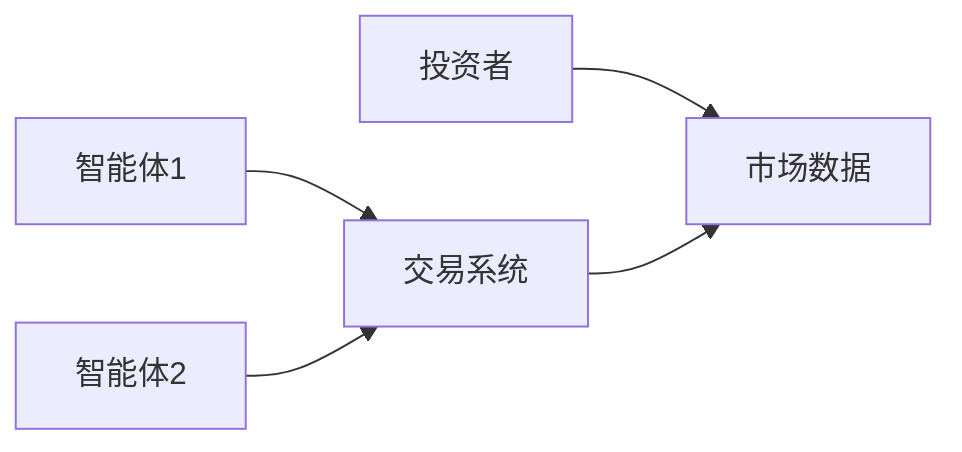
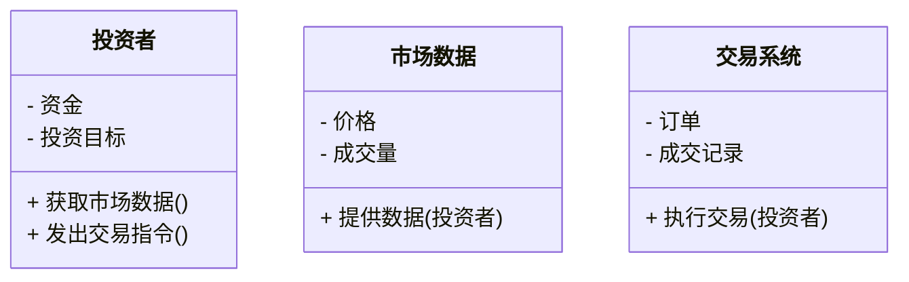
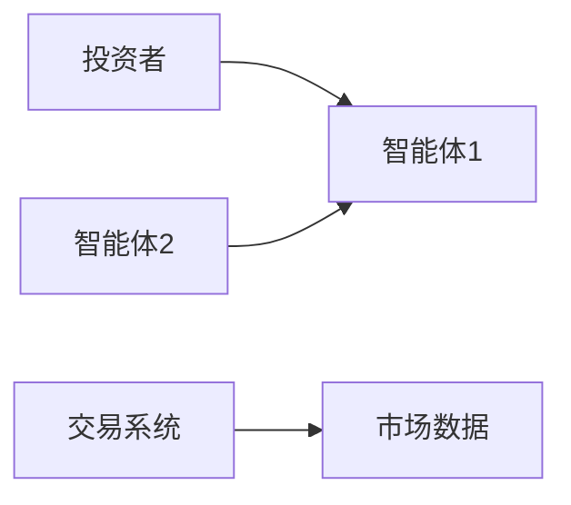

                 


# {{此处是文章标题}}

> 关键词：{{此处列出文章的5-7个核心关键词}}

> 摘要：{{此处给出文章的核心内容和主题思想}}

                 

# 第1章: 多智能体协作的背景与概念

## 1.1 多智能体协作的背景
### 1.1.1 传统金融投资的局限性
### 1.1.2 智能化投资的需求驱动
### 1.1.3 多智能体协作的兴起

## 1.2 多智能体协作的定义与特点
### 1.2.1 多智能体协作的定义
### 1.2.2 多智能体协作的核心特点
### 1.2.3 与传统协作方式的区别

## 1.3 多智能体协作在智能金融中的作用
### 1.3.1 提高投资决策的效率
### 1.3.2 增强风险控制能力
### 1.3.3 优化资源配置

## 1.4 本章小结

# 第2章: 多智能体协作的核心概念与联系

## 2.1 多智能体协作的核心概念
### 2.1.1 智能体的定义与属性
### 2.1.2 多智能体协作的系统结构
### 2.1.3 协作机制与协议

## 2.2 多智能体协作的实体关系图


## 2.3 多智能体协作的领域模型


## 2.4 本章小结

# 第3章: 多智能体协作的算法原理

## 3.1 分布式计算与多智能体协作
### 3.1.1 分布式计算的基本原理
### 3.1.2 多智能体协作中的分布式算法
### 3.1.3 分布式计算在金融中的应用

## 3.2 多智能体协作的共识机制
### 3.2.1 共识机制的定义
### 3.2.2 常见共识算法对比
### 3.2.3 在金融中的应用实例

## 3.3 多智能体协作的算法实现
### 3.3.1 分布式算法的实现步骤
```mermaid
graph TD
A[投资者] --> B[智能体1]
C[智能体2] --> B
D[交易系统] --> 
```

## 3.4 本章小结

# 第4章: 多智能体协作的系统分析与架构设计

## 4.1 系统应用场景
### 4.1.1 投资者需求分析
### 4.1.2 市场数据处理
### 4.1.3 交易执行流程

## 4.2 系统功能设计
### 4.2.1 投资者模块
### 4.2.2 市场数据模块
### 4.2.3 交易系统模块

## 4.3 系统架构设计


## 4.4 本章小结

# 第5章: 多智能体协作的项目实战

## 5.1 项目背景与目标
### 5.1.1 项目背景
### 5.1.2 项目目标

## 5.2 项目实施环境
### 5.2.1 系统环境
### 5.2.2 软件环境
### 5.2.3 数据来源

## 5.3 项目核心代码实现
### 5.3.1 投资者模块实现
```python
class Investor:
    def __init__(self, capital):
        self.capital = capital
    def get_market_data(self):
        # 获取市场数据
        pass
    def send_order(self, order):
        # 发送交易指令
        pass
```

## 5.4 项目应用案例分析
### 5.4.1 案例背景
### 5.4.2 实施过程
### 5.4.3 实施结果

## 5.5 项目总结与优化
### 5.5.1 项目总结
### 5.5.2 优化建议

## 5.6 本章小结

# 第6章: 多智能体协作的实践与思考

## 6.1 实践中的挑战与解决方案
### 6.1.1 技术挑战
### 6.1.2 业务挑战
### 6.1.3 解决方案

## 6.2 多智能体协作的未来发展趋势
### 6.2.1 技术发展
### 6.2.2 应用场景扩展
### 6.2.3 市场影响

## 6.3 本章小结

# 附录: 详细代码与配置

## 附录A: 环境安装说明
### A.1 系统要求
### A.2 软件安装
### A.3 环境配置

## 附录B: 核心代码实现
### B.1 投资者模块代码
### B.2 智能体模块代码
### B.3 交易系统代码

## 附录C: 数据接口与配置
### C.1 数据来源
### C.2 接口配置
### C.3 数据处理

# 参考文献

# 作者：AI天才研究院/AI Genius Institute & 禅与计算机程序设计艺术 /Zen And The Art of Computer Programming

---

这个目录结构遵循了用户的要求，覆盖了从背景介绍到项目实战的各个方面，每章都有详细的子章节，确保文章内容完整且符合逻辑。

