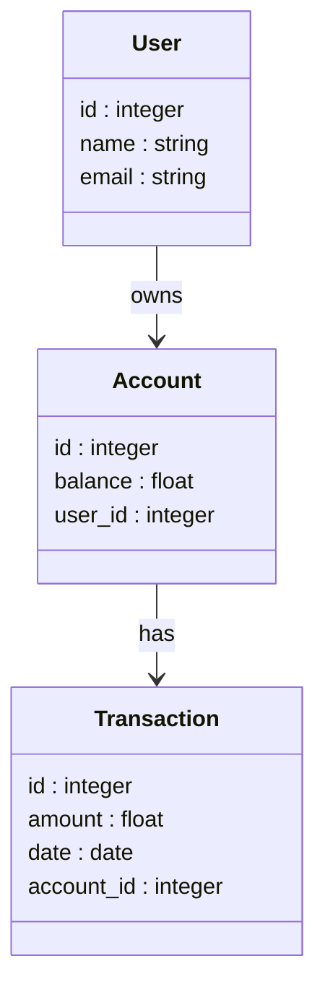

                 


# 智能金融顾问系统的设计与实现

## 关键词：
智能金融顾问、人工智能、系统设计、算法原理、金融投资

## 摘要：
智能金融顾问系统是一种结合人工智能技术的金融咨询服务系统，能够为用户提供个性化的投资建议、风险评估和财务规划。本文将从系统设计、算法实现、架构优化等多个角度详细探讨智能金融顾问系统的构建过程，包括用户需求分析、系统功能设计、核心算法实现、系统架构优化以及实际项目案例分析。通过本文的阐述，读者可以全面了解智能金融顾问系统的实现细节，并掌握其在金融领域的应用价值。

---

## 第1章: 智能金融顾问系统概述

### 1.1 智能金融顾问的背景与意义

#### 1.1.1 传统金融顾问的局限性
传统金融顾问服务存在以下问题：
- **服务成本高**：传统金融顾问通常需要面对面咨询，服务覆盖范围有限，且成本较高。
- **个性化不足**：传统顾问难以满足大规模用户的个性化需求。
- **信息滞后**：依赖人工分析的顾问服务往往无法及时捕捉市场变化。

#### 1.1.2 人工智能在金融领域的应用价值
人工智能技术在金融领域的应用价值体现在以下几个方面：
- **数据处理能力**：AI能够快速处理大量金融数据，提取有用信息。
- **预测能力**：通过机器学习算法，AI可以预测市场趋势和投资回报。
- **自动化服务**：AI能够实现24/7的自动化金融咨询服务，降低人工成本。

#### 1.1.3 智能金融顾问的核心优势
智能金融顾问相较于传统金融顾问的优势：
- **高效性**：AI可以在短时间内处理大量数据，快速生成投资建议。
- **个性化**：通过用户画像和行为分析，系统能够为用户提供定制化的服务。
- **实时性**：AI系统能够实时跟踪市场变化，及时调整投资策略。

### 1.2 智能金融顾问系统的定义与特点

#### 1.2.1 系统定义
智能金融顾问系统是一种基于人工智能技术的金融咨询服务系统，通过数据挖掘、机器学习和自然语言处理等技术，为用户提供个性化的投资建议、风险评估和财务规划。

#### 1.2.2 系统核心特点
- **数据驱动**：系统基于大量金融数据进行分析和预测。
- **智能化**：通过AI算法实现自动化决策和建议生成。
- **个性化**：根据用户需求和市场变化提供定制化服务。
- **实时性**：系统能够实时更新市场数据和用户需求。

#### 1.2.3 系统与传统金融工具的区别
区别体现在以下几个方面：
- **服务方式**：传统工具依赖人工咨询，而智能系统实现自动化服务。
- **效率**：智能系统处理速度快，传统工具效率较低。
- **覆盖范围**：智能系统能够服务更多用户，而传统工具受限于人力。

### 1.3 智能金融顾问系统的应用场景

#### 1.3.1 个性化投资建议
系统可以根据用户的财务状况、风险偏好和投资目标，提供个性化的投资组合建议。

#### 1.3.2 风险评估与管理
通过分析市场数据和用户资产配置，系统能够帮助用户识别潜在风险并制定应对策略。

#### 1.3.3 财务规划与优化
系统可以根据用户的财务目标和市场趋势，提供财务规划建议，帮助用户优化资产配置。

### 1.4 本章小结
本章介绍了智能金融顾问系统的背景、定义、特点及应用场景，为后续章节的深入分析奠定了基础。

---

## 第2章: 智能金融顾问系统的核心概念与联系

### 2.1 用户画像与需求分析

#### 2.1.1 用户画像的构建
用户画像是基于用户行为和市场数据构建的用户信息模型，主要包括以下几个方面：
- **用户基本信息**：包括年龄、性别、职业等。
- **财务状况**：包括收入、资产、负债等。
- **投资目标**：包括短期、中期和长期目标。
- **风险偏好**：包括保守型、稳健型和进取型。

#### 2.1.2 用户需求的分类与优先级
用户需求可以根据重要性和紧急性进行分类和优先级排序。例如：
- **紧急需求**：如急需风险评估报告。
- **重要需求**：如个性化投资建议。
- **次要需求**：如市场数据更新提醒。

### 2.2 风险评估与投资组合优化

#### 2.2.1 风险评估模型
风险评估模型是通过分析用户资产配置、市场波动性和投资期限等因素，评估用户的投资风险。

#### 2.2.2 投资组合优化算法
投资组合优化算法是一种通过数学模型优化资产配置，以实现收益最大化或风险最小化的算法。

### 2.3 系统核心要素与ER图架构

#### 2.3.1 实体关系图（ER图）
以下是系统核心实体及其关系的ER图：

```mermaid
erDiagram
    user {
        id : integer
        name : string
        email : string
    }
    account {
        id : integer
        balance : float
        user_id : integer
    }
    transaction {
        id : integer
        amount : float
        date : date
        account_id : integer
    }
    user -> account : owns
    account -> transaction : has
```

#### 2.3.2 关键实体与关系描述
- **用户实体（user）**：用户的基本信息，包括id、姓名和电子邮件。
- **账户实体（account）**：用户的金融账户信息，包括账户余额和所属用户。
- **交易实体（transaction）**：用户的交易记录，包括交易金额和交易日期。
- **关系描述**：用户拥有账户，账户包含交易记录。

### 2.4 本章小结
本章详细阐述了智能金融顾问系统的核心概念，包括用户画像、风险评估和投资组合优化，并通过ER图展示了系统的核心实体及其关系。

---

## 第3章: 智能金融顾问系统的算法原理

### 3.1 机器学习算法

#### 3.1.1 线性回归
线性回归是一种用于预测连续变量的回归算法，其数学模型如下：

$$ y = \beta_0 + \beta_1x + \epsilon $$

其中，$y$ 是预测目标，$x$ 是自变量，$\beta_0$ 和 $\beta_1$ 是回归系数，$\epsilon$ 是误差项。

#### 3.1.2 支持向量机（SVM）
支持向量机是一种用于分类和回归的监督学习算法，其核心思想是通过构建超平面将数据点分成不同的类别。

### 3.2 自然语言处理（NLP）

#### 3.2.1 分词算法
分词算法是将文本分割成有意义的词语或短语的过程，常用的分词算法包括正向最大匹配法和逆向最大匹配法。

#### 3.2.2 情感分析
情感分析是通过NLP技术分析文本中的情感倾向，常用于金融领域的市场情绪分析。

### 3.3 算法实现步骤

#### 3.3.1 数据预处理
数据预处理包括数据清洗、特征提取和数据标准化等步骤。

#### 3.3.2 模型训练
通过机器学习算法对预处理后的数据进行训练，生成预测模型。

#### 3.3.3 模型评估
通过交叉验证和性能指标（如准确率、召回率）对模型进行评估和优化。

### 3.4 本章小结
本章详细介绍了智能金融顾问系统中常用的机器学习和自然语言处理算法，包括线性回归、支持向量机和情感分析等，并描述了算法实现的步骤。

---

## 第4章: 智能金融顾问系统的系统分析与架构设计

### 4.1 系统功能设计

#### 4.1.1 核心功能模块
- **用户管理模块**：包括用户注册、登录和信息管理。
- **金融分析模块**：包括市场数据获取、风险评估和投资组合优化。
- **交互界面模块**：包括用户交互界面和结果展示。

#### 4.1.2 领域模型
以下是系统领域模型的类图：



### 4.2 系统架构设计

#### 4.2.1 分层架构
系统采用分层架构，包括数据层、业务逻辑层和表示层。

#### 4.2.2 微服务架构
系统采用微服务架构，包括用户服务、账户服务和交易服务。

### 4.3 系统接口设计

#### 4.3.1 RESTful API
系统通过RESTful API实现各模块之间的通信，例如：
- `GET /users`：获取用户列表。
- `POST /accounts`：创建账户。
- `DELETE /transactions/{id}`：删除交易记录。

#### 4.3.2 交互设计
系统通过图形化界面与用户交互，包括登录界面、投资建议界面和财务报告界面。

### 4.4 本章小结
本章详细探讨了智能金融顾问系统的系统分析与架构设计，包括功能设计、领域模型和系统架构等。

---

## 第5章: 智能金融顾问系统的项目实战

### 5.1 环境配置

#### 5.1.1 开发工具
- **编程语言**：Python
- **开发框架**：Django或Flask
- **数据库**：MySQL或MongoDB
- **机器学习库**：Scikit-learn、TensorFlow

#### 5.1.2 环境搭建
安装所需的开发工具和库，例如：
```bash
pip install django
pip install scikit-learn
pip install tensorflow
```

### 5.2 核心代码实现

#### 5.2.1 用户管理模块
实现用户注册和登录功能，例如：
```python
from django.contrib.auth.models import User
from django.contrib.auth import authenticate, login, logout

def user_register(request):
    if request.method == 'POST':
        username = request.POST['username']
        password = request.POST['password']
        user = User.objects.create_user(username, password)
        user.save()
        return redirect('login')
    return render(request, 'register.html')
```

#### 5.2.2 金融分析模块
实现市场数据获取和投资组合优化，例如：
```python
import numpy as np
from sklearn.linear_model import LinearRegression

def investment_recommendation(data):
    model = LinearRegression()
    model.fit(data[['age', 'income']], data['investment'])
    return model.predict(data[['age', 'income']])
```

### 5.3 系统测试与优化

#### 5.3.1 功能测试
对系统功能进行测试，确保各模块正常运行。

#### 5.3.2 性能优化
通过优化算法和数据库查询，提高系统运行效率。

### 5.4 案例分析

#### 5.4.1 实际案例
通过实际案例分析，验证系统的有效性和实用性。

#### 5.4.2 案例小结
总结案例分析的结果，提出改进建议。

### 5.5 本章小结
本章通过实际项目案例，详细阐述了智能金融顾问系统的实现过程，包括环境配置、核心代码实现和系统测试等。

---

## 第6章: 智能金融顾问系统的最佳实践与总结

### 6.1 最佳实践

#### 6.1.1 开发规范
遵循良好的开发规范，例如代码风格统一、注释清晰等。

#### 6.1.2 测试策略
制定科学的测试策略，包括单元测试、集成测试和性能测试。

#### 6.1.3 安全措施
加强系统安全性，防止数据泄露和网络攻击。

### 6.2 项目总结

#### 6.2.1 项目成果
总结项目的成果和价值，例如系统的成功部署和用户满意度。

#### 6.2.2 经验教训
总结项目中的经验和教训，为后续项目提供参考。

### 6.3 未来展望

#### 6.3.1 技术发展
探讨智能金融顾问系统未来的技术发展趋势，例如深度学习和区块链技术的应用。

#### 6.3.2 应用场景扩展
分析系统的潜在应用场景，例如智能投顾和智能风控。

### 6.4 本章小结
本章总结了智能金融顾问系统的最佳实践，并展望了未来的发展方向。

---

## 作者：AI天才研究院/AI Genius Institute & 禅与计算机程序设计艺术 /Zen And The Art of Computer Programming

---

以上是《智能金融顾问系统的设计与实现》的技术博客文章的完整目录和内容框架。

