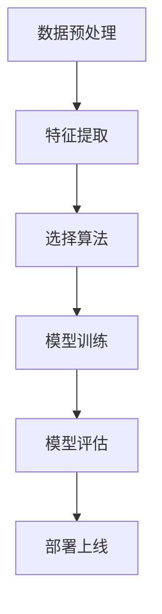

                 


# 智能银行不良资产管理系统

**关键词**：智能银行，不良资产，风险管理，人工智能，机器学习，系统架构

**摘要**：本文详细探讨智能银行不良资产管理系统的构建与实现，结合人工智能和大数据技术，分析不良资产识别、风险评估、智能决策等关键环节，提出基于机器学习的解决方案，通过系统架构设计和项目实战，展示如何利用智能化手段提升银行不良资产管理效率。

---

## 第一部分：智能银行不良资产管理系统概述

### 第1章：问题背景与目标

#### 1.1 问题背景
- **定义与现状**：银行不良资产是指无法按时足额偿还的贷款或无法按期兑付的债务，主要表现为违约率高、回收率低。传统管理模式依赖人工经验，效率低下，且容易受主观因素影响。
- **挑战与痛点**：
  - 数据分散：不良资产涉及多个业务系统，数据孤岛问题严重。
  - 风险评估不准确：传统方法难以捕捉复杂经济环境中的潜在风险。
  - 管理效率低：人工审核耗时长，难以应对海量数据和复杂场景。

#### 1.2 系统目标
- **目标设定**：通过智能化手段，实现不良资产的自动化识别、精准风险评估和高效管理流程优化。
- **关键指标**：提高识别准确率、降低管理成本、提升资产处置效率。

---

## 第二部分：核心概念与系统架构

### 第2章：核心概念与联系

#### 2.1 核心概念解析
- **不良资产识别**：基于机器学习算法，从海量数据中识别潜在风险客户。
- **风险评估模型**：构建基于特征工程和模型调优的评估体系，量化资产风险等级。
- **智能决策支持**：通过实时数据分析，为资产处置提供最优策略建议。

#### 2.2 实体关系图
```mermaid
erDiagram
    用户 {
        用户ID
        用户名
        密码
    }
    管理员 {
        管理员ID
        管理员名
        密码
    }
    资产信息 {
        资产ID
        资产类型
        资产状态
        资产价值
    }
    风险评估 {
        评估ID
        评估时间
        风险等级
    }
    用户与资产信息：多对多关联
    管理员与风险评估：一对多关联
```

---

## 第三部分：算法原理与实现

### 第3章：算法原理

#### 3.1 算法选择
- **逻辑回归模型**：适用于二分类问题，用于判断资产是否为不良。
- **XGBoost**：适合处理高维数据，提升分类性能。
- **特征工程**：提取关键特征（如违约历史、还款能力等）。

#### 3.2 算法流程


#### 3.3 数学公式
- 逻辑回归损失函数：
  $$ L(\theta) = -\frac{1}{m}\sum_{i=1}^{m} [y^{(i)}\log(h_{\theta}(x^{(i)})) + (1 - y^{(i)})\log(1 - h_{\theta}(x^{(i)})}] $$
- XGBoost目标函数：
  $$ \text{目标函数} = \text{损失函数} + \text{正则化项} $$

---

## 第四部分：系统分析与架构设计

### 第4章：系统分析

#### 4.1 问题场景
- **场景描述**：银行系统中存在大量逾期贷款，需通过智能化手段快速识别并制定处置策略。
- **关键问题**：数据来源分散、模型实时性要求高、系统安全性要求高。

### 第4章：架构设计

#### 4.2 领域模型
```mermaid
classDiagram
    class 用户 {
        用户ID
        用户名
        密码
    }
    class 资产信息 {
        资产ID
        资产类型
        资产状态
        资产价值
    }
    class 风险评估 {
        评估ID
        评估时间
        风险等级
    }
    用户 --> 资产信息：关联资产
    资产信息 --> 风险评估：触发评估
```

#### 4.3 系统架构


#### 4.4 接口设计
- **API接口**：
  - GET /api/assets：获取资产列表。
  - POST /api/assess：提交风险评估请求。
  - GET /api/report：获取评估报告。

---

## 第五部分：项目实战

### 第5章：环境搭建与核心代码实现

#### 5.1 环境搭建
- **Python版本**：3.8以上。
- **依赖库**：安装`scikit-learn`, `xgboost`, `pandas`, `numpy`。

#### 5.2 核心代码
```python
import pandas as pd
import numpy as np
from sklearn.model_selection import train_test_split
from sklearn.metrics import accuracy_score
from xgboost import XGBClassifier

# 数据加载与预处理
data = pd.read_csv('assets.csv')
X = data[['资产类型', '资产价值', '违约历史']]
y = data['是否不良资产']

# 数据分割
X_train, X_test, y_train, y_test = train_test_split(X, y, test_size=0.2, random_state=42)

# 模型训练
model = XGBClassifier()
model.fit(X_train, y_train)

# 模型预测
y_pred = model.predict(X_test)
print('准确率:', accuracy_score(y_test, y_pred))
```

---

## 第六部分：总结与展望

### 第6章：总结与最佳实践

#### 6.1 项目总结
- **实现价值**：通过智能化手段提升不良资产识别准确率，降低管理成本。
- **项目意义**：推动银行资产管理从传统模式向智能化转变。

#### 6.2 最佳实践
- **数据质量管理**：确保数据准确性和完整性。
- **模型优化**：定期更新模型，引入新的特征和数据源。
- **系统安全性**：加强数据加密和权限管理，确保系统安全。

#### 6.3 未来展望
- **技术进步**：引入更先进的AI技术（如深度学习）。
- **业务扩展**：拓展至更多金融领域，如信用评分、 fraud detection。

---

**作者：AI天才研究院/AI Genius Institute & 禅与计算机程序设计艺术/Zen And The Art of Computer Programming**

