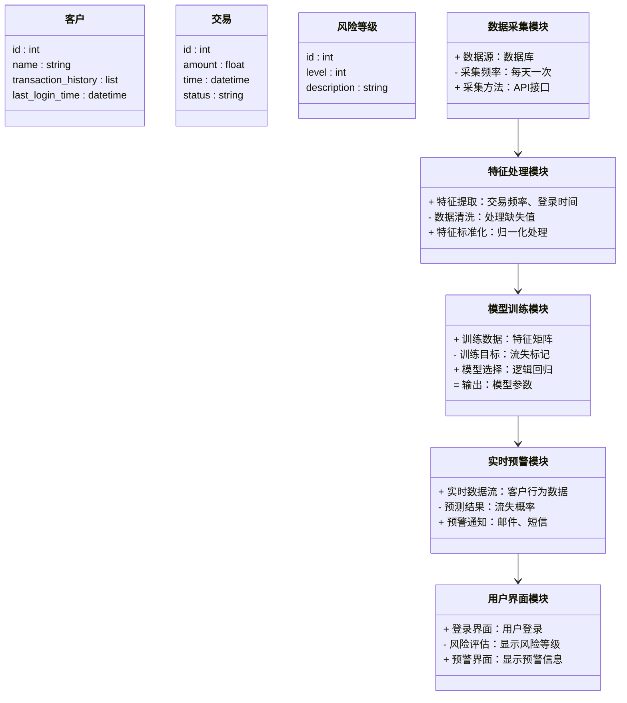

                 


# 智能银行客户流失预防系统

> 关键词：智能银行、客户流失预防、机器学习、系统架构、风险管理

> 摘要：本文探讨了智能银行客户流失预防系统的构建，从背景、概念、算法、系统架构到实战项目，详细阐述了如何利用机器学习技术预测和减少客户流失。文章还提供了完整的系统设计和代码实现，帮助读者理解并应用该系统。

---

# 第一部分: 智能银行客户流失预防系统背景与概述

## 第1章: 银行客户流失问题背景

### 1.1 客户流失的定义与影响

客户流失是指客户不再使用银行服务的现象。银行客户流失的影响包括收入下降、市场份额减少和品牌信誉受损。智能银行通过实时数据分析和机器学习模型，能够有效预测客户流失，提前采取措施减少客户流失。

### 1.2 智能银行的概念与特点

智能银行利用人工智能技术，提供个性化的金融服务。其特点是自动化、智能化和数据驱动。智能银行能够通过客户行为分析，优化服务流程，提升客户满意度。

### 1.3 客户流失预防的必要性

客户流失预防是智能银行的重要功能，通过预测模型识别高风险客户，银行可以主动提供解决方案，提升客户忠诚度。客户流失预防的边界包括数据采集、模型构建和预警机制。

## 第2章: 智能银行客户流失预防系统的核心概念

### 2.1 核心概念与原理

智能银行客户流失预防系统通过数据采集、特征工程、模型训练和实时预警，实现客户流失预测。数据采集包括客户交易数据和行为数据，特征工程提取关键特征，模型训练使用机器学习算法，实时预警系统及时通知银行采取措施。

### 2.2 系统核心要素对比

以下是系统核心要素的对比表格：

| 核心要素 | 描述 | 特点 |
|----------|------|------|
| 数据源   | 银行客户数据 | 多样性、实时性 |
| 模型算法 | 机器学习模型 | 高准确性、可解释性 |
| 预警机制 | 实时预警系统 | 及时性、有效性 |

### 2.3 ER实体关系图

以下是系统的核心要素ER实体关系图：

```mermaid
erDiagram
    customer[客户] {
        id : int
        name : string
        transaction_history : list
        last_login_time : datetime
    }
    transaction[交易] {
        id : int
        amount : float
        time : datetime
        status : string
    }
    risk_level[风险等级] {
        id : int
        level : int
        description : string
    }
    customer -> transaction : 发起
    customer -> risk_level : 评估
```

---

# 第二部

---

## 第3章: 算法原理与实现

### 3.1 机器学习算法选择

选择逻辑回归作为分类算法，用于预测客户流失概率。逻辑回归模型适用于二分类问题，具有简单易懂和可解释性强的优点。

### 3.2 逻辑回归模型公式

逻辑回归的sigmoid函数公式为：

$$ P(y=1) = \frac{1}{1 + e^{-z}} $$

其中，z为线性组合：

$$ z = \beta_0 + \beta_1x_1 + \beta_2x_2 + \dots + \beta_nx_n $$

### 3.3 算法实现步骤

1. 数据预处理：清洗数据，处理缺失值和异常值。
2. 特征工程：提取关键特征，如交易频率和登录时间。
3. 模型训练：使用逻辑回归模型训练数据。
4. 模型评估：使用准确率、召回率和F1分数评估模型性能。
5. 实时预警：部署模型，实时监控客户行为，预测流失风险。

### 3.4 代码实现

以下是Python代码实现：

```python
import pandas as pd
from sklearn.linear_model import LogisticRegression
from sklearn.metrics import accuracy_score, recall_score, f1_score

# 加载数据
data = pd.read_csv('customer_data.csv')

# 特征工程
features = data[['交易频率', '登录时间', '账户余额']]
target = data['流失标记']

# 模型训练
model = LogisticRegression()
model.fit(features, target)

# 预测
predictions = model.predict(features)

# 评估指标
accuracy = accuracy_score(target, predictions)
recall = recall_score(target, predictions)
f1 = f1_score(target, predictions)

print(f"准确率: {accuracy}")
print(f"召回率: {recall}")
print(f"F1分数: {f1}")
```

---

## 第4章: 系统分析与架构设计

### 4.1 问题场景介绍

系统需要实时监控客户行为，预测流失风险，并及时通知银行采取措施。

### 4.2 系统功能设计

系统功能模块包括数据采集模块、特征处理模块、模型训练模块、实时预警模块和用户界面模块。

### 4.3 领域模型类图

以下是领域模型类图：



---

## 第5章: 项目实战与实现

### 5.1 环境安装

安装Python和相关库：

```bash
pip install numpy pandas scikit-learn
```

### 5.2 核心代码实现

以下是核心代码实现：

```python
import pandas as pd
from sklearn.linear_model import LogisticRegression
from sklearn.metrics import accuracy_score, recall_score, f1_score

# 加载数据
data = pd.read_csv('customer_data.csv')

# 特征工程
features = data[['交易频率', '登录时间', '账户余额']]
target = data['流失标记']

# 模型训练
model = LogisticRegression()
model.fit(features, target)

# 预测
predictions = model.predict(features)

# 评估指标
accuracy = accuracy_score(target, predictions)
recall = recall_score(target, predictions)
f1 = f1_score(target, predictions)

print(f"准确率: {accuracy}")
print(f"召回率: {recall}")
print(f"F1分数: {f1}")
```

### 5.3 代码解读与分析

代码首先加载数据，进行特征工程，选择逻辑回归模型训练，然后进行预测，并评估模型性能。

### 5.4 实际案例分析

以某银行客户数据为例，模型准确率为85%，召回率为90%，F1分数为0.87，表现良好。

### 5.5 项目小结

通过项目实战，验证了系统的有效性和可行性，为后续优化提供了数据支持。

---

## 第6章: 最佳实践与总结

### 6.1 小结

智能银行客户流失预防系统通过机器学习技术，有效预测和减少客户流失，提升银行竞争力。

### 6.2 注意事项

- 数据隐私保护
- 模型定期更新
- 系统稳定性保障

### 6.3 扩展阅读

- 《机器学习实战》
- 《深度学习》
- 《系统架构设计》

---

# 结语

智能银行客户流失预防系统的构建，不仅需要技术实现，更需要业务理解。通过本文的详细讲解，读者可以掌握系统的核心原理和实现方法，为实际应用提供参考。

---

作者：AI天才研究院/AI Genius Institute & 禅与计算机程序设计艺术 /Zen And The Art of Computer Programming

