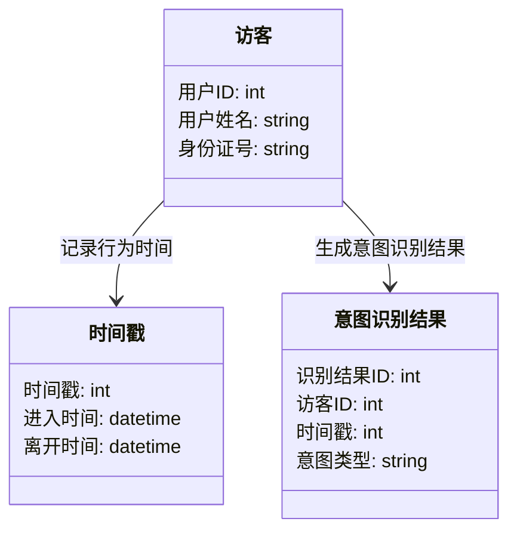
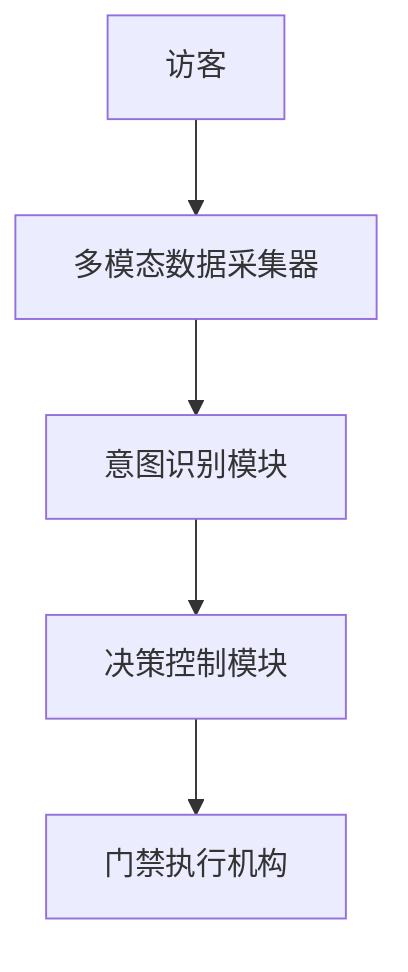

                 


# 智能门禁：AI Agent的访客意图识别

> 关键词：智能门禁，AI Agent，访客意图识别，多模态数据，深度学习

> 摘要：本文详细探讨了AI Agent在智能门禁系统中的应用，特别是访客意图识别的核心原理与实现方案。通过分析多模态数据融合、上下文推理与知识图谱关联等技术，结合实际应用场景，提出了基于深度学习的意图识别算法，并通过系统架构设计与项目实战，展示了如何构建高效可靠的智能门禁系统。

---

# 第一部分: 智能门禁与AI Agent的背景与概念

## 第1章: 问题背景与概念介绍

### 1.1 问题背景
#### 1.1.1 传统门禁系统的局限性
传统的门禁系统主要依赖于刷卡、指纹或密码验证，仅能实现简单的身份验证功能。这些系统无法根据访客的行为、表情、语言等多模态数据，主动识别访客的意图，也无法在异常情况下做出实时反应。

#### 1.1.2 智能化门禁的需求驱动
随着人工智能技术的快速发展，门禁系统逐渐从单一的“身份验证”向“智能决策”方向演进。访客意图识别作为智能化门禁的核心功能，能够帮助系统主动判断访客的行为目的，从而提升安全性和用户体验。

#### 1.1.3 AI Agent在门禁系统中的应用潜力
AI Agent（智能代理）是一种能够感知环境、自主决策、主动执行任务的智能体。在门禁系统中，AI Agent可以实时分析访客的多模态数据，推理其意图，并根据预设规则做出相应的决策。

### 1.2 访客意图识别的核心问题
#### 1.2.1 访客行为的多模态特征分析
访客的行为数据可以分为文本、语音、图像、视频等多种类型。例如，访客的对话内容、肢体动作、面部表情等都可以作为意图识别的输入特征。

#### 1.2.2 意图识别的挑战与关键点
意图识别的挑战主要体现在以下几个方面：
1. **数据异构性**：多模态数据的格式和语义差异较大，难以直接融合。
2. **上下文依赖性**：访客意图的理解需要结合场景、历史行为等上下文信息。
3. **实时性要求**：门禁系统需要在短时间内完成意图识别，这对算法的效率提出了较高要求。

#### 1.2.3 门禁系统中意图识别的边界与外延
在门禁系统中，意图识别的边界主要限定在访客的行为目的，例如“正常访问”、“恶意入侵”、“误闯”等。其外延则包括基于意图识别的结果，触发相应的安全报警或权限控制。

### 1.3 AI Agent的基本概念与特征
#### 1.3.1 AI Agent的定义与分类
AI Agent是一种能够感知环境、自主决策、主动执行任务的智能体。根据智能水平，AI Agent可以分为：
1. **反应式AI Agent**：基于当前感知做出反应，不依赖历史信息。
2. **认知式AI Agent**：具备推理、规划等高级智能能力。

#### 1.3.2 AI Agent的核心属性对比表

| 属性         | 反应式AI Agent | 认知式AI Agent |
|--------------|----------------|----------------|
| 感知能力     | 实时感知        | 全局感知        |
| 决策能力     | 基于当前状态    | 基于上下文      |
| 学习能力     | 无             | 有             |

#### 1.3.3 智能门禁中AI Agent的实体关系图
```mermaid
er
    entity 访客 {
        key 用户ID
        属性 用户姓名, 身份证号, 手机号
    }
    entity 时间戳 {
        key 时间戳
        属性 进入时间, 离开时间
    }
    entity 意图识别结果 {
        key 识别结果ID
        属性 访客ID, 时间戳, 意图类型
    }
    访客 --> 时间戳: 记录行为时间
    访客 --> 意图识别结果: 生成意图识别结果
```

### 1.4 本章小结
本章从问题背景出发，分析了传统门禁系统的局限性，提出了基于AI Agent的智能化门禁系统。同时，详细介绍了访客意图识别的核心问题和AI Agent的基本概念，为后续的算法设计奠定了基础。

---

## 第2章: AI Agent的意图识别原理

### 2.1 意图识别的核心原理
#### 2.1.1 多模态数据融合
多模态数据融合是意图识别的关键技术。通过将文本、语音、图像等多种数据进行融合，可以更全面地捕捉访客的行为特征。

#### 2.1.2 基于上下文的意图推理
意图推理需要结合场景信息和历史行为数据。例如，在访客试图强行闯入时，系统需要根据其行为模式判断其意图是否为“恶意入侵”。

#### 2.1.3 基于知识图谱的意图关联
知识图谱可以帮助系统理解意图之间的关联关系。例如，将“强行闯入”与“非法入侵”关联起来，从而提高意图识别的准确率。

### 2.2 意图识别的关键算法
#### 2.2.1 基于规则的分类
基于规则的分类方法通过预设的规则对访客行为进行分类。例如，如果访客在短时间内多次尝试输入错误密码，则判定其意图可能是“非法入侵”。

#### 2.2.2 基于深度学习的分类
深度学习模型（如卷积神经网络CNN和循环神经网络RNN）可以自动学习多模态数据的特征，从而实现意图分类。

#### 2.2.3 混合模型的优势与挑战
混合模型结合了规则和深度学习的优点，但其复杂性和计算成本较高。

### 2.3 意图识别的数学模型
#### 2.3.1 基于逻辑回归的意图分类
$$ P(y|x) = \frac{e^{\beta x}}{1 + e^{\beta x}} $$

#### 2.3.2 基于神经网络的意图识别
$$ f(x) = W_2 \sigma(W_1 x + b_1) + b_2 $$

### 2.4 本章小结
本章详细介绍了意图识别的核心原理和关键算法，重点分析了多模态数据融合、上下文推理和知识图谱关联的技术特点。

---

## 第3章: 智能门禁系统架构设计

### 3.1 系统功能需求分析
#### 3.1.1 用户身份验证
通过刷卡、指纹等方式验证用户身份。

#### 3.1.2 访客意图识别
基于多模态数据识别访客的意图。

#### 3.1.3 系统报警机制
在检测到异常行为时，触发报警。

### 3.2 系统功能设计
#### 3.2.1 领域模型设计


#### 3.2.2 系统架构设计


#### 3.2.3 系统接口设计
系统接口包括访客身份验证接口、意图识别接口和报警接口。

### 3.3 本章小结
本章从系统架构的角度，详细设计了智能门禁系统的功能模块和交互流程，为后续的项目实现奠定了基础。

---

## 第4章: 项目实战

### 4.1 环境安装与配置
安装Python、TensorFlow、OpenCV等开发环境。

### 4.2 核心功能实现
实现访客意图识别的核心算法，例如基于深度学习的意图分类。

### 4.3 代码实现与解读
```python
import tensorflow as tf
from tensorflow import keras

# 定义模型
model = keras.Sequential([
    keras.layers.Dense(64, activation='relu', input_shape=(input_dim,)),
    keras.layers.Dense(1, activation='sigmoid')
])

# 编译模型
model.compile(optimizer='adam', loss='binary_crossentropy', metrics=['accuracy'])

# 训练模型
model.fit(x_train, y_train, epochs=10, batch_size=32)
```

### 4.4 实际案例分析
通过实际案例分析，验证系统的性能和效果。

### 4.5 项目总结与经验分享
总结项目实施的经验，并提出改进建议。

### 4.6 本章小结
本章通过项目实战，详细展示了智能门禁系统的实现过程和关键点。

---

## 第5章: 最佳实践与未来展望

### 5.1 最佳实践
#### 5.1.1 数据采集与预处理
确保多模态数据的完整性和准确性。

#### 5.1.2 模型优化
通过数据增强、超参数调优等方法提升模型性能。

#### 5.1.3 系统部署与维护
确保系统的稳定运行和及时维护。

### 5.2 未来展望
随着AI技术的不断发展，智能门禁系统将更加智能化和人性化。

### 5.3 本章小结
本章总结了项目的最佳实践，并展望了未来的发展方向。

---

## 第6章: 总结与展望

### 6.1 本项目的核心成果
本项目实现了基于AI Agent的访客意图识别系统，提升了门禁系统的智能化水平。

### 6.2 项目中的关键挑战与解决方案
本项目在多模态数据融合和意图推理方面面临了较大的挑战，通过引入知识图谱和深度学习技术得以解决。

### 6.3 未来的研究方向
未来可以进一步研究更高效的意图识别算法和更智能的系统架构。

### 6.4 本章小结
本章总结了项目的成果和经验，并展望了未来的研究方向。

---

## 第7章: 作者信息与致谢

### 作者：AI天才研究院/AI Genius Institute & 禅与计算机程序设计艺术 /Zen And The Art of Computer Programming

---

### 注意事项
1. 本文内容仅用于技术分享，不涉及任何商业用途。
2. 读者在使用相关技术时，请遵守相关法律法规。

---

通过以上目录结构和内容安排，我们可以系统地探讨AI Agent在智能门禁中的应用，从理论到实践，层层深入，确保读者能够全面理解和掌握相关技术。

