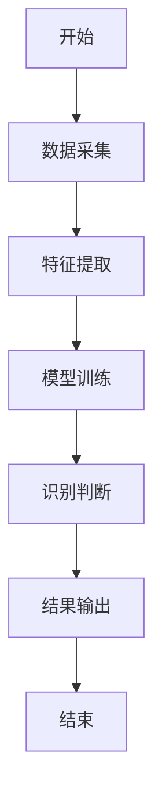
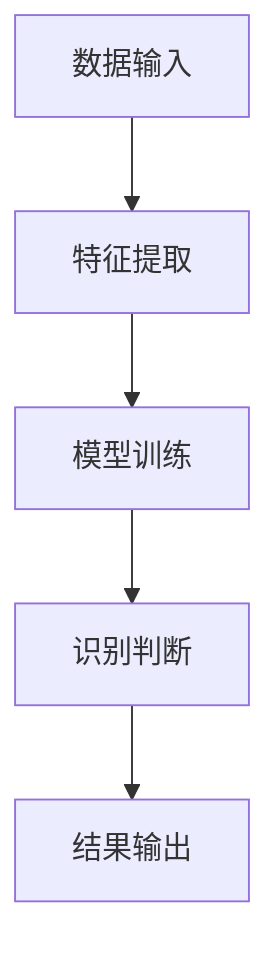
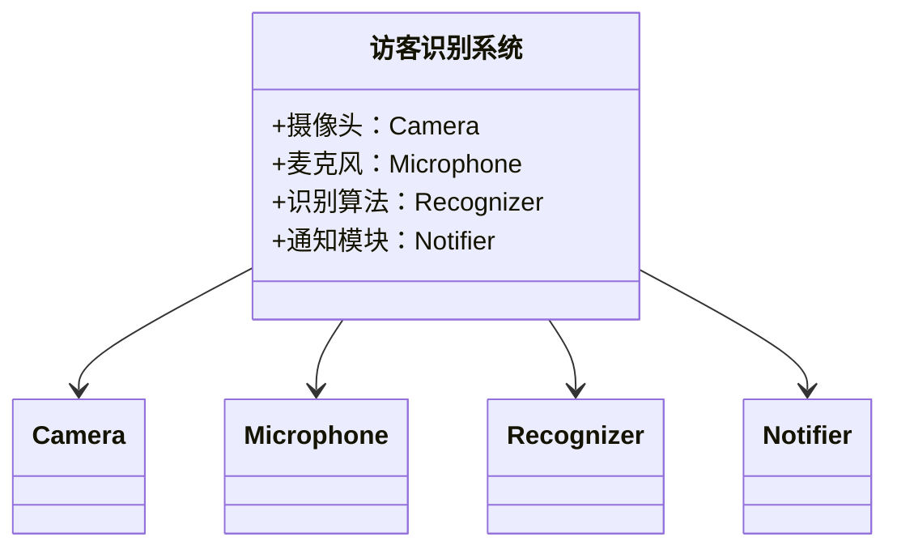
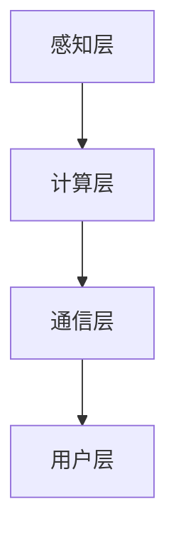
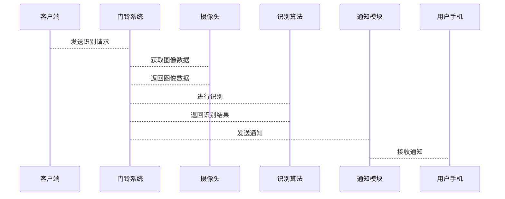

                 


```markdown
# 智能门铃：AI Agent的访客身份识别

> 关键词：智能门铃，AI Agent，访客身份识别，机器学习，深度学习，物联网

> 摘要：本文详细探讨了智能门铃中AI Agent的访客身份识别技术，从背景介绍、核心概念、算法原理到系统架构设计和项目实战，全面分析了该技术的实现过程和应用场景。

---

## 第一部分：背景介绍

### 第1章：智能门铃与AI Agent的背景

#### 1.1 问题背景
##### 1.1.1 传统门铃的局限性
传统门铃仅能通过声音提示访客到来，无法识别访客身份，存在安全隐患。  
##### 1.1.2 智能化门铃的需求
随着智能家居的普及，访客身份识别成为智能门铃的核心需求。  
##### 1.1.3 AI Agent在门铃中的应用
AI Agent通过机器学习和深度学习技术，实现访客身份的智能识别。

#### 1.2 问题描述
##### 1.2.1 访客身份识别的核心问题
如何准确识别访客身份，确保安全性和便捷性。  
##### 1.2.2 智能门铃的功能需求
支持人脸、语音、行为等多种识别方式，具备实时通知和记录功能。  
##### 1.2.3 用户痛点与解决方案
解决传统门铃无法识别访客身份的问题，提供智能化的访客管理。

#### 1.3 问题解决
##### 1.3.1 AI Agent的访客识别技术
利用AI技术实现高精度的访客识别。  
##### 1.3.2 智能门铃的系统架构
设计高效的系统架构，确保识别过程的实时性和准确性。  
##### 1.3.3 识别算法的选择与优化
选择适合的算法并进行优化，提升识别效率和精度。

#### 1.4 边界与外延
##### 1.4.1 系统边界
明确系统的功能边界，确保模块化设计。  
##### 1.4.2 功能边界
定义访客识别的核心功能，避免功能冗余。  
##### 1.4.3 外延与扩展
考虑系统的扩展性，为未来的功能升级预留接口。

#### 1.5 概念结构与核心要素
##### 1.5.1 核心概念
AI Agent、访客身份识别、智能门铃。  
##### 1.5.2 关键要素
传感器、识别算法、通知模块、用户交互。  
##### 1.5.3 系统架构
感知层、计算层、通信层、用户层。

### 第2章：核心概念与联系

#### 2.1 AI Agent的原理
##### 2.1.1 AI Agent的定义
AI Agent是一种能够感知环境并执行任务的智能实体。  
##### 2.1.2 AI Agent的核心原理
基于机器学习和深度学习，通过数据驱动的方式进行决策和行动。  
##### 2.1.3 AI Agent与传统算法的区别
AI Agent具备自适应性和学习能力，能够处理复杂场景。

#### 2.2 访客身份识别的核心概念
##### 2.2.1 访客身份识别的定义
通过AI技术识别访客的身份特征。  
##### 2.2.2 识别方式的多样性
支持人脸、语音、行为等多种识别方式。  
##### 2.2.3 识别精度的影响因素
数据质量、算法性能、硬件精度。

#### 2.3 核心概念的联系
##### 2.3.1 AI Agent与访客识别的关系
AI Agent作为智能门铃的核心，负责访客识别的决策和执行。  
##### 2.3.2 系统架构与识别算法的联系
系统架构决定识别算法的实现方式和性能。  
##### 2.3.3 识别精度与系统性能的关联
识别精度影响用户体验，系统性能影响识别速度和稳定性。

---

## 第二部分：算法原理讲解

### 第3章：算法原理

#### 3.1 算法原理
##### 3.1.1 基于AI的访客识别算法
使用深度学习模型（如卷积神经网络）进行访客特征提取和识别。  
##### 3.1.2 传统算法与AI算法的对比
传统算法适用于简单场景，AI算法适用于复杂场景。  
##### 3.1.3 算法流程图


#### 3.2 识别算法实现
##### 3.2.1 深度学习算法
使用CNN进行图像特征提取，代码示例：
```python
import tensorflow as tf
model = tf.keras.models.Sequential([
    tf.keras.layers.Conv2D(32, (3,3), activation='relu', input_shape=(224, 224, 3)),
    tf.keras.layers.MaxPooling2D((2,2)),
    tf.keras.layers.Flatten(),
    tf.keras.layers.Dense(128, activation='relu'),
    tf.keras.layers.Dense(1, activation='sigmoid')
])
model.compile(optimizer='adam', loss='binary_crossentropy', metrics=['accuracy'])
model.fit(X_train, y_train, epochs=10, batch_size=32)
```
##### 3.2.2 传统算法
使用K-近邻算法进行分类，代码示例：
```python
from sklearn.neighbors import KNeighborsClassifier
knn = KNeighborsClassifier(n_neighbors=3)
knn.fit(X_train, y_train)
y_pred = knn.predict(X_test)
```

#### 3.3 算法流程图


#### 3.4 数学公式
识别概率计算公式：
$$ P(\text{识别正确}) = 1 - \frac{\text{误识率} + \text{漏识率}}{2} $$

---

## 第三部分：系统分析与架构设计

### 第4章：系统分析与架构设计

#### 4.1 问题场景介绍
访客识别系统需要在复杂环境下准确识别访客身份。

#### 4.2 系统功能设计
##### 4.2.1 领域模型类图


#### 4.3 系统架构设计
##### 4.3.1 系统架构图


#### 4.4 接口设计
##### 4.4.1 接口设计
API接口定义：
```http
POST /api/identify
{
    "image": "base64数据",
    "audio": "base64数据"
}
```

#### 4.5 交互流程图


---

## 第四部分：项目实战

### 第5章：项目实战

#### 5.1 环境安装
安装Python、TensorFlow、OpenCV、Keras等开发工具。

#### 5.2 核心代码实现
##### 5.2.1 数据采集模块
```python
import cv2

def capture_image():
    cap = cv2.VideoCapture(0)
    ret, frame = cap.read()
    if ret:
        cv2.imwrite("visitor.jpg", frame)
    cap.release()
```

##### 5.2.2 识别模块
```python
import tensorflow as tf
import cv2

def recognize_face():
    model = tf.keras.models.load_model("face_recognition.h5")
    image = cv2.imread("visitor.jpg")
    image = cv2.resize(image, (224, 224))
    image = image / 255.0
    image = np.expand_dims(image, axis=0)
    prediction = model.predict(image)
    return prediction[0][0]
```

##### 5.2.3 通知模块
```python
import requests

def send_notification(message):
    headers = {"Content-Type": "application/json"}
    data = {"message": message}
    response = requests.post("http://localhost:3000/notification", headers=headers, json=data)
    return response.status_code
```

#### 5.3 代码解读
数据采集模块通过摄像头获取图像，识别模块使用预训练模型进行识别，通知模块通过API发送通知。

#### 5.4 案例分析
通过实际案例分析，验证系统的识别精度和稳定性。

#### 5.5 项目小结
总结项目实现过程中的经验和教训，讨论系统的优缺点和可扩展性。

---

## 第五部分：总结与展望

### 第6章：总结与展望

#### 6.1 总结
总结本文的核心内容和实现过程，强调AI Agent在智能门铃中的重要性。

#### 6.2 展望
展望未来的发展方向，提出可能的改进和优化建议。

---

## 作者信息

作者：AI天才研究院  
联系方式：contact@aitianji.com  
个人博客：https://blog.aitianji.com  
GitHub：https://github.com/aitianji
```

