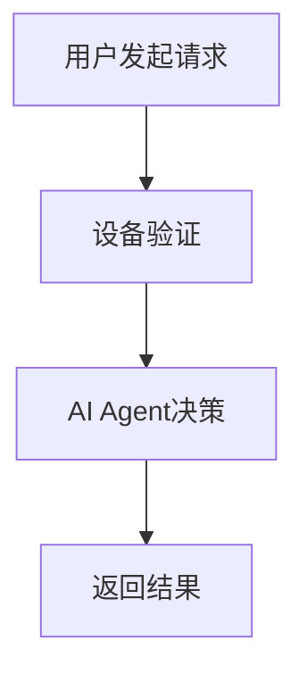
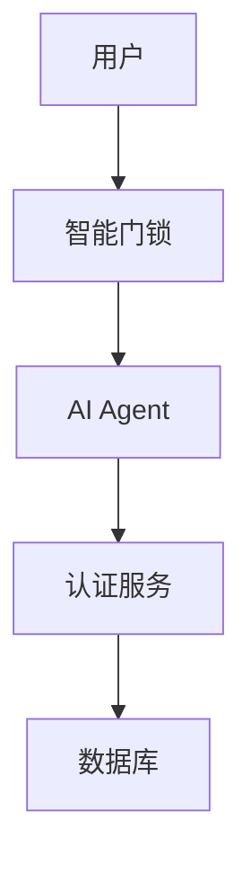

                 


# 智能门锁：AI Agent的多因素认证系统

> 关键词：智能门锁，AI Agent，多因素认证，安全系统，算法原理，系统架构

> 摘要：本文探讨了智能门锁结合AI Agent和多因素认证技术的实现与应用。通过分析多因素认证的核心原理、AI Agent的决策算法，以及系统架构设计，展示了如何构建一个高效、安全的智能门锁系统。文章结合实际案例，详细讲解了系统实现的关键步骤，并提供了最佳实践和注意事项。

---

# 第一部分: 智能门锁的背景与应用

## 第1章: 智能门锁的发展背景

### 1.1 传统门锁的局限性
- 传统门锁的单因素认证方式（如机械钥匙）存在安全隐患。
- 易被复制或暴力破解，缺乏灵活性和可扩展性。
- 无法适应智能化时代的多样化需求。

### 1.2 智能化时代的门锁变革
- 智能门锁的兴起：蓝牙、Wi-Fi、指纹识别等技术的应用。
- 多因素认证技术的引入：结合多种认证方式（如指纹、密码、手机验证）提升安全性。

### 1.3 多因素认证技术的必要性
- 提高安全性：通过结合多种认证方式降低被破解的风险。
- 适应不同场景：支持多种开门方式，满足个性化需求。
- 智能化管理：通过AI Agent实现智能决策和动态调整。

---

## 第2章: AI Agent在智能门锁中的作用

### 2.1 AI Agent的基本概念
- AI Agent的定义：具备感知、推理、决策能力的智能体。
- 在智能门锁中的角色：作为系统的核心决策模块，负责认证判断和权限管理。

### 2.2 多因素认证系统的必要性
- 单因素认证的不足：单一认证方式易被破解。
- 多因素认证的优势：结合多种认证方式，提高安全性。
- AI Agent在多因素认证中的作用：通过智能决策实现动态认证。

### 2.3 系统边界与外延
- 系统边界：智能门锁、用户设备、认证服务。
- 外延：与智能家居、物业管理系统的集成。

---

# 第二部分: 多因素认证系统的核心概念与原理

## 第3章: 多因素认证系统的核心概念

### 3.1 多因素认证的定义与特点
- 多因素认证的定义：结合至少两种不同的认证方式。
- 核心特点：安全性高、灵活性强、可扩展性好。

### 3.2 AI Agent在多因素认证中的角色
- 智能决策：基于用户行为、时间、位置等信息进行认证判断。
- 动态调整：根据风险评估动态调整认证策略。

### 3.3 实体关系分析
- 用户、设备、认证方式的实体关系：用户通过多种方式（如指纹、密码、手机验证）与设备交互。
- 数据流分析：用户发起请求 → 设备验证 → AI Agent决策 → 返回结果。

---

## 第4章: 多因素认证系统的核心算法原理

### 4.1 AI Agent的决策算法
- 基于规则的决策算法：简单易实现，适用于规则明确的场景。
- 基于机器学习的决策算法：通过训练数据实现复杂场景的智能决策。
- 基于神经网络的决策算法：深度学习模型，适用于高复杂度的场景。

### 4.2 多因素认证的判断逻辑
- 多因素认证的权重分配：根据认证方式的重要性分配权重。
- 基于概率的认证结果计算：综合各因素的概率进行判断。
- 动态调整机制：根据用户行为和环境变化动态调整认证策略。

### 4.3 算法流程图（Mermaid）


---

## 第5章: 系统分析与架构设计

### 5.1 系统功能设计
- 用户认证：指纹、密码、手机验证等多种方式。
- AI Agent决策：基于用户行为、时间、位置等信息进行认证判断。
- 动态调整：根据风险评估动态调整认证策略。

### 5.2 系统架构设计（Mermaid）


### 5.3 接口设计
- 用户接口：指纹识别模块、密码输入模块。
- AI Agent接口：与认证服务、数据库交互。

---

## 第6章: 项目实战

### 6.1 环境安装
- 安装Python、AI框架（如TensorFlow）、数据库（如MySQL）。

### 6.2 系统核心实现（Python代码示例）
```python
def authenticate(user, factors):
    # 多因素认证判断
    for factor in factors:
        if not verify(factor):
            return False
    return True

def verify(factor):
    # 验证单个因素
    pass
```

### 6.3 案例分析
- 某小区智能门锁系统：结合指纹和手机验证，实现住户的便捷认证。

---

## 第7章: 最佳实践与注意事项

### 7.1 最佳实践
- 定期更新认证策略。
- 加强数据加密和隐私保护。

### 7.2 小结
- 本文详细介绍了智能门锁结合AI Agent和多因素认证技术的实现与应用。

### 7.3 注意事项
- 数据安全：防止用户信息泄露。
- 系统维护：定期更新软件和硬件。

---

## 第8章: 拓展阅读

### 8.1 推荐书籍
- 《人工智能：一种现代的方法》。
- 《软件体系结构：设计模式与实现》。

### 8.2 在线资源
- 开源社区：GitHub、Gitee。
- 技术博客：AI技术博客、编程技术博客。

---

作者：AI天才研究院/AI Genius Institute & 禅与计算机程序设计艺术 /Zen And The Art of Computer Programming

