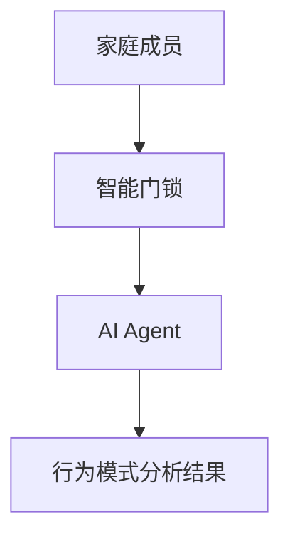
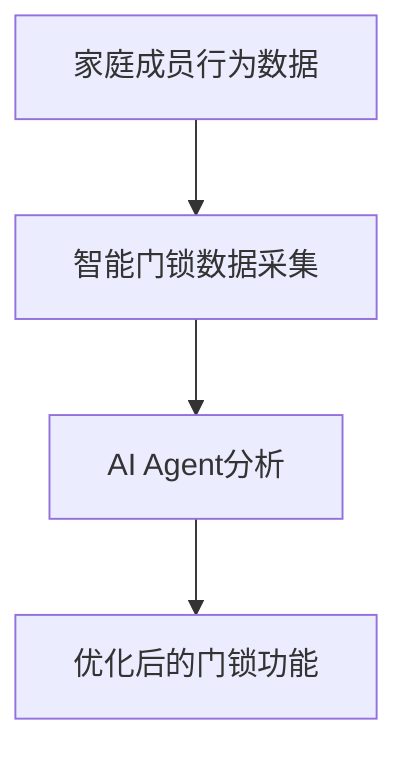
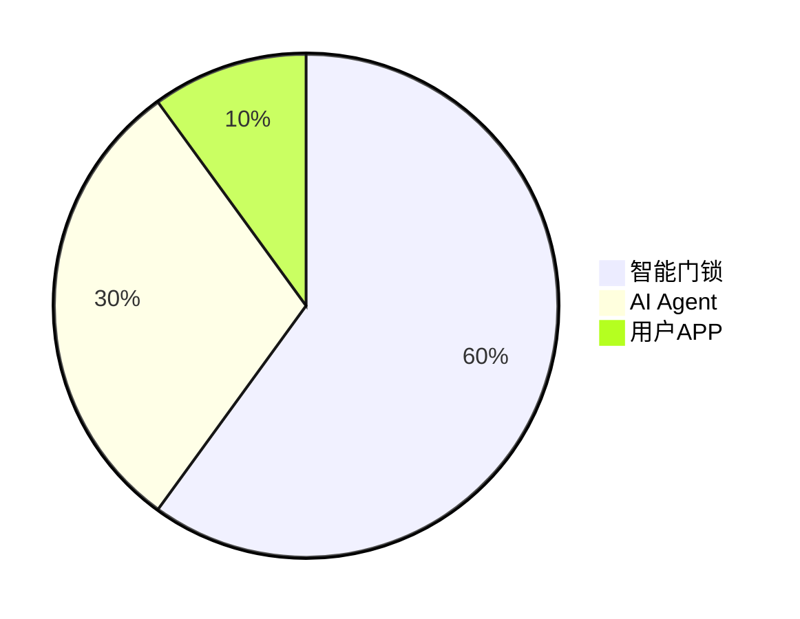
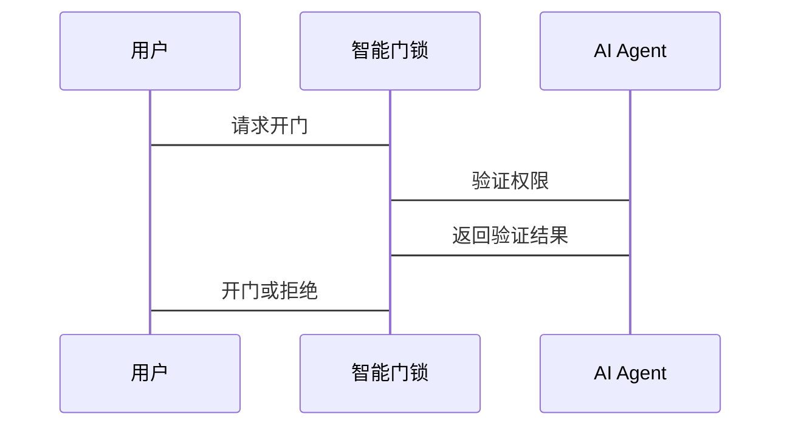

                 


# 智能门锁：AI Agent的家庭成员行为模式分析

## 关键词：智能门锁、AI Agent、行为模式分析、物联网、机器学习

## 摘要：  
智能门锁作为智能家居的重要组成部分，结合AI Agent技术，可以通过分析家庭成员的行为模式，实现智能化的安全管理和便捷生活。本文从智能门锁与AI Agent的结合出发，详细分析家庭成员行为模式的分析方法，探讨其在智能门锁中的应用，并通过实际案例展示如何利用AI技术优化家庭安全和生活体验。

---

# 第1章: 智能门锁与AI Agent的概述

## 1.1 智能门锁的基本概念

### 1.1.1 智能门锁的定义与特点
智能门锁是一种结合了物联网技术和智能控制的门锁系统。它通过无线通信技术（如Wi-Fi、蓝牙、 ZigBee等）与用户手机、智能音箱等设备连接，支持远程开锁、指纹识别、人脸识别等多种开锁方式。其主要特点包括：
- **安全性高**：支持多种身份验证方式，如指纹、密码、刷卡等。
- **智能化**：可以通过手机APP远程控制，记录开门记录，提供报警功能。
- **便捷性**：无需携带钥匙，支持多种开锁方式。

### 1.1.2 智能门锁的工作原理
智能门锁的核心部分包括传感器、通信模块和控制模块。当用户尝试开门时，传感器会检测输入（如指纹、密码），并通过通信模块将数据传输到控制模块。控制模块根据预设的权限判断是否允许开门，并通过反馈机制告知用户结果。

### 1.1.3 智能门锁的分类与应用场景
智能门锁可以根据功能和应用场景分为家庭门锁、商业门锁和公共设施门锁。家庭门锁主要用于住宅，注重便捷性和安全性；商业门锁适用于办公室、酒店等场景，强调权限管理和远程监控；公共设施门锁则用于如健身房、仓库等场所，注重耐用性和大规模管理。

---

## 1.2 AI Agent的基本概念

### 1.2.1 AI Agent的定义与特点
AI Agent（人工智能代理）是指能够感知环境并采取行动以实现目标的智能实体。它可以是一个软件程序，通过传感器获取信息，利用算法处理数据，并通过执行器（如发送指令）与环境互动。AI Agent的特点包括：
- **自主性**：能够自主决策。
- **反应性**：能够实时感知环境变化并做出反应。
- **目标导向**：行动基于预设或动态调整的目标。

### 1.2.2 AI Agent的核心技术与实现方式
AI Agent的核心技术包括自然语言处理（NLP）、计算机视觉（CV）、机器学习（ML）等。其实现方式主要包括：
- **基于规则的AI Agent**：通过预设规则进行判断和行动。
- **基于机器学习的AI Agent**：通过训练数据学习模式，实现自主决策。
- **混合型AI Agent**：结合规则和机器学习，兼顾灵活性和准确性。

### 1.2.3 AI Agent在智能门锁中的应用潜力
AI Agent可以增强智能门锁的功能，例如：
- **智能识别**：通过AI算法优化人脸识别和指纹识别的准确性。
- **行为分析**：分析家庭成员的行为模式，预测用户的开门需求。
- **异常检测**：实时监测开门行为，识别异常情况并发出警报。

---

## 1.3 智能门锁与AI Agent的结合

### 1.3.1 智能门锁与AI Agent的结合背景
随着智能家居的普及，家庭成员的行为数据（如开门时间、频率）变得丰富，为AI Agent提供了大量可分析的数据源。AI Agent可以通过分析这些数据，优化智能门锁的功能。

### 1.3.2 智能门锁与AI Agent结合的必要性与优势
- **必要性**：传统智能门锁仅能实现基本的开门功能，无法分析用户行为，难以提供个性化的服务。
- **优势**：AI Agent可以通过分析行为数据，优化开门权限、提供智能化提醒，甚至预防盗窃。

### 1.3.3 智能门锁与AI Agent结合的应用场景与前景
- **个性化开门权限**：根据家庭成员的行为模式，动态调整开门权限。
- **行为习惯优化**：通过分析开门时间，提醒用户注意异常情况。
- **安全增强**：结合AI Agent的异常检测功能，提升门锁的安全性。

---

# 第2章: 家庭成员行为模式分析的背景与意义

## 2.1 家庭成员行为模式分析的背景

### 2.1.1 当代家庭智能化的需求
现代家庭对智能化生活的追求，推动了智能家居设备的普及。智能门锁作为重要组成部分，需要更智能化的功能以满足用户需求。

### 2.1.2 智能门锁在家庭智能化中的角色
智能门锁不仅是家庭安全的第一道防线，还是家庭智能化的重要入口。通过与AI Agent结合，它可以成为家庭智能化的核心枢纽。

### 2.1.3 家庭成员行为模式分析的重要性
通过分析家庭成员的行为模式，智能门锁可以优化用户体验，提升安全性，甚至帮助家庭成员养成良好的生活习惯。

---

## 2.2 AI Agent在家庭成员行为模式分析中的作用

### 2.2.1 AI Agent在数据采集与处理中的作用
AI Agent可以实时采集家庭成员的开门记录、时间、频率等数据，并通过机器学习算法进行分析。

### 2.2.2 AI Agent在行为模式识别中的应用
AI Agent可以通过聚类分析、关联规则挖掘等技术，识别家庭成员的行为模式，如每天固定时间开门、周末开门频率增加等。

### 2.2.3 AI Agent在行为模式分析结果的应用
基于行为模式分析结果，AI Agent可以优化智能门锁的功能，例如：
- **自动调整权限**：根据家庭成员的行为模式，动态调整开门权限。
- **提供智能化提醒**：根据开门时间异常情况，提醒用户注意安全。

---

# 第3章: AI Agent家庭成员行为模式分析的核心概念与联系

## 3.1 核心概念与联系

### 3.1.1 AI Agent与智能门锁的核心概念
- **AI Agent**：负责数据处理、行为分析和决策。
- **智能门锁**：负责数据采集和执行决策。

### 3.1.2 核心概念的联系
AI Agent通过分析智能门锁采集的数据，优化其功能；智能门锁则为AI Agent提供数据来源和执行环境。

---

## 3.2 系统架构与数据流

### 3.2.1 实体关系图


### 3.2.2 数据流图


---

## 3.3 核心算法与实现

### 3.3.1 数据预处理
数据预处理是行为模式分析的关键步骤，包括：
- **去噪处理**：去除异常数据。
- **归一化处理**：统一数据格式。

### 3.3.2 特征提取
通过统计分析提取特征，例如：
- **开门频率**：每天开门的次数。
- **开门时间分布**：高峰期和低谷期。

### 3.3.3 模型训练
使用聚类分析或分类算法训练模型，识别不同的行为模式。

---

## 3.4 数学模型与公式

### 3.4.1 聚类分析公式
$$
\text{聚类中心} = \text{argmin} \sum_{i=1}^{k} \sum_{j=1}^{n} (x_j - c_i)^2
$$

### 3.4.2 关联规则挖掘公式
$$
\text{支持度} = \frac{\text{频繁项集的数量}}{\text{总事务数量}}
$$

---

## 3.5 系统架构与接口设计

### 3.5.1 系统架构图


### 3.5.2 系统交互图


---

# 第4章: 项目实战

## 4.1 环境搭建与数据采集

### 4.1.1 开发环境
- **硬件**：智能门锁（支持Wi-Fi）、Raspberry Pi。
- **软件**：Python、TensorFlow、Flask。

### 4.1.2 数据采集
通过智能门锁采集家庭成员的开门记录，包括时间、方式（指纹/密码）。

---

## 4.2 系统核心实现

### 4.2.1 数据预处理代码
```python
import pandas as pd

# 读取数据
data = pd.read_csv('door_records.csv')

# 去除异常值
data = data[~data['time'].isnull()]
```

### 4.2.2 特征提取与建模
```python
from sklearn.cluster import KMeans

# 提取特征
features = data[['time', 'method']]
model = KMeans(n_clusters=2)
model.fit(features)
```

---

## 4.3 实际案例分析

### 4.3.1 案例分析
分析某家庭成员的开门记录，识别其行为模式，并优化智能门锁的权限设置。

### 4.3.2 模型优化
根据实际效果，调整聚类算法参数，提升准确率。

---

## 4.4 项目小结
通过实际案例，展示了AI Agent在智能门锁中的应用，验证了其在行为模式分析中的有效性。

---

# 第5章: 优化与维护

## 5.1 系统优化

### 5.1.1 模型优化
通过网格搜索调整机器学习模型的参数，提升分类准确率。

### 5.1.2 系统性能优化
优化数据采集和处理流程，降低延迟。

---

## 5.2 系统维护

### 5.2.1 日志管理
定期检查系统日志，及时发现并解决问题。

### 5.2.2 数据更新
定期更新模型，确保行为模式分析的准确性。

---

## 5.3 最佳实践

### 5.3.1 数据安全
确保家庭成员数据的安全，避免泄露。

### 5.3.2 用户教育
向用户普及AI Agent的优势，消除隐私担忧。

---

## 5.4 拓展阅读
推荐相关领域的书籍和论文，帮助读者深入理解AI Agent和智能门锁的技术结合。

---

# 总结与展望

智能门锁与AI Agent的结合，不仅提升了家庭安全，还为智能家居的发展提供了新的方向。未来，随着AI技术的进步，智能门锁将更加智能化，为家庭成员提供更优质的服务。

---

# 作者：AI天才研究院/AI Genius Institute & 禅与计算机程序设计艺术 /Zen And The Art of Computer Programming

