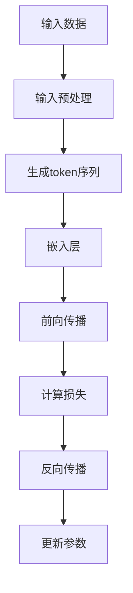
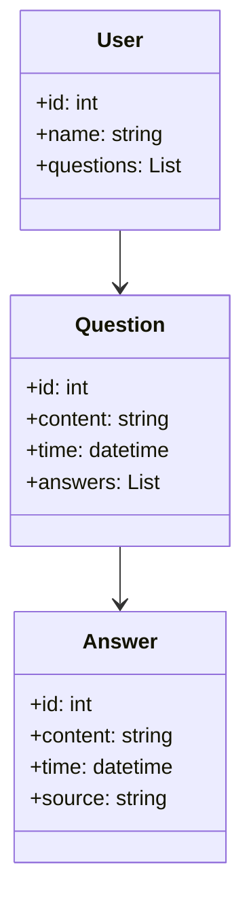

                 


# 智能问答AI Agent：基于LLM的精准答疑系统

## 关键词：智能问答，大语言模型，LLM，AI Agent，精准答疑

## 摘要：  
本文详细探讨了基于大语言模型（LLM）的智能问答AI Agent系统的设计与实现。从问题背景、核心概念到算法原理，从系统架构设计到项目实战，再到最佳实践，层层剖析，帮助读者全面理解智能问答AI Agent的技术精髓。文章结合理论与实践，通过丰富的案例和详细的代码示例，展示了如何利用LLM构建高效、精准的问答系统。

---

## 第一部分：背景介绍

### 第1章：智能问答AI Agent的背景与概念

#### 1.1 问题背景
在当今信息化时代，问答系统已成为人们获取信息的重要工具。然而，传统的问答系统存在以下问题：
- 数据依赖性强，难以应对复杂语义场景。
- 知识库更新成本高，难以覆盖广泛领域。
- 对上下文理解能力有限，难以支持多轮对话。

#### 1.2 问题描述
智能问答AI Agent的目标是通过自然语言处理技术，实现对复杂问题的精准理解和回答。与传统问答系统相比，智能问答AI Agent具有以下特点：
- 基于大语言模型（LLM），支持多轮对话。
- 具备上下文理解能力，能够关联历史信息。
- 可扩展性强，支持多种领域知识。

#### 1.3 问题解决
通过引入大语言模型（LLM），智能问答AI Agent能够实现：
- 自然语言理解（NLU）和生成（NLG）。
- 多轮对话管理。
- 知识库的动态扩展。

#### 1.4 边界与外延
智能问答AI Agent的边界在于其语言理解和生成能力，而其外延则包括：
- 与知识图谱的结合。
- 多模态信息的处理。
- 跨领域应用的扩展。

#### 1.5 概念结构与核心要素
智能问答AI Agent的核心要素包括：
1. **输入模块**：接收用户问题。
2. **理解模块**：解析问题语义。
3. **知识库**：存储上下文和领域知识。
4. **生成模块**：基于理解生成回答。
5. **反馈机制**：优化回答质量。

---

## 第二部分：核心概念与联系

### 第2章：智能问答AI Agent的核心概念

#### 2.1 核心概念原理
智能问答AI Agent的工作原理如下：
1. 用户输入问题。
2. 系统解析问题，提取关键词和意图。
3. 基于上下文和领域知识生成回答。
4. 返回结果并更新知识库。

#### 2.2 核心概念属性对比
以下表格对比了传统问答系统与智能问答AI Agent的关键属性：

| 属性                | 传统问答系统          | 智能问答AI Agent       |
|---------------------|-----------------------|-------------------------|
| 数据依赖            | 高，依赖结构化知识库   | 低，支持非结构化数据     |
| 上下文理解能力      | 无或有限             | 强，支持多轮对话         |
| 可扩展性            | 低，知识库更新困难     | 高，支持动态扩展         |
| 应用场景            | 单一领域             | 多领域、多场景           |

#### 2.3 ER实体关系图
以下是智能问答AI Agent的实体关系图：

```mermaid
er
    actor(User) -|{1} questions(QuestionID, Content, Time) 
    questions -|{1} answer(AnswerID, Content, Time)
    answer -> user_message(UserID, MessageContent)
    user_message -> context(ContextID, Content)
```

---

## 第三部分：算法原理讲解

### 第3章：基于LLM的智能问答算法

#### 3.1 算法原理
大语言模型（LLM）的训练和推理过程如下：

1. **训练阶段**：
   - 输入：大规模文本数据。
   - 输出：模型参数的优化。
   - 使用目标函数（如交叉熵损失）进行优化。

2. **推理阶段**：
   - 输入：用户问题。
   - 输出：生成回答。

#### 3.2 算法实现
以下是LLM的训练流程图：



以下是一个简单的PyTorch代码示例：

```python
import torch

# 定义模型
class LLMModel(torch.nn.Module):
    def __init__(self, vocab_size):
        super().__init__()
        self.embedding = torch.nn.Embedding(vocab_size, 512)
        self.decoder = torch.nn.Linear(512, vocab_size)

    def forward(self, input_ids):
        embed = self.embedding(input_ids)
        output = self.decoder(embed)
        return output

# 初始化模型
vocab_size = 10000
model = LLMModel(vocab_size)

# 定义损失函数和优化器
criterion = torch.nn.CrossEntropyLoss()
optimizer = torch.optim.Adam(model.parameters(), lr=0.001)

# 训练过程
for epoch in range(num_epochs):
    for batch in data_loader:
        optimizer.zero_grad()
        input_ids = batch['input_ids']
        labels = batch['labels']
        outputs = model(input_ids)
        loss = criterion(outputs, labels)
        loss.backward()
        optimizer.step()
```

#### 3.3 数学模型与公式
大语言模型的训练目标是最小化预测概率的负对数似然：

$$
\mathcal{L} = -\sum_{i=1}^{N} \log P(y_i|x_i)
$$

其中，$P(y_i|x_i)$ 是模型在给定输入$x_i$下生成$y_i$的概率。

---

## 第四部分：系统分析与架构设计

### 第4章：智能问答AI Agent的系统架构

#### 4.1 问题场景介绍
智能问答AI Agent的主要应用场景包括：
- 客户服务。
- 知识咨询。
- 信息检索。

#### 4.2 项目介绍
本项目旨在开发一个基于LLM的智能问答系统，实现精准答疑。

#### 4.3 系统功能设计
以下是系统的领域模型：



#### 4.4 系统架构设计
以下是系统的架构图：


#### 4.5 系统接口设计
系统主要接口包括：
- 用户提问接口。
- 系统回答接口。
- 知识库更新接口。

#### 4.6 系统交互设计
以下是系统的交互序列图：

```mermaid
sequenceDiagram
    User → Agent: 提问"如何使用Python?"
    Agent → LLM: 请求生成回答
    LLM → Agent: 返回回答"使用Python需要安装解释器..."
    Agent → User: 返回最终回答
```

---

## 第五部分：项目实战

### 第5章：智能问答AI Agent的实现

#### 5.1 环境安装
- Python 3.8+
- PyTorch 1.9+
- transformers库

#### 5.2 核心代码实现
以下是智能问答AI Agent的核心代码：

```python
from transformers import AutoModelForCausalLM, AutoTokenizer

class AIAssistant:
    def __init__(self, model_name="gpt2"):
        self.model = AutoModelForCausalLM.from_pretrained(model_name)
        self.tokenizer = AutoTokenizer.from_pretrained(model_name)

    def answer_question(self, question):
        inputs = self.tokenizer(question, return_tensors="pt")
        outputs = self.model.generate(**inputs, max_length=100)
        answer = self.tokenizer.decode(outputs[0], skip_special_tokens=True)
        return answer

# 使用示例
assistant = AIAssistant()
print(assistant.answer_question("如何使用Python？"))
```

#### 5.3 代码解读与分析
- **初始化**：加载模型和分词器。
- **提问**：将用户问题转换为模型输入。
- **生成回答**：使用模型生成回答。
- **返回结果**：将回答解码为字符串。

#### 5.4 案例分析
以下是一个实际案例：

```python
question = "如何学习人工智能？"
answer = assistant.answer_question(question)
print(answer)
```

输出结果可能为：
"学习人工智能需要掌握数学基础、编程能力，建议从Python和机器学习基础开始..."

#### 5.5 项目小结
通过上述代码，我们可以实现一个简单的智能问答系统。实际应用中，还需要优化模型性能和增加知识库的支持。

---

## 第六部分：最佳实践

### 第6章：智能问答AI Agent的最佳实践

#### 6.1 小结
- 基于LLM的智能问答系统具有强大的语义理解和生成能力。
- 系统架构设计需要考虑可扩展性和性能优化。

#### 6.2 注意事项
- 数据质量和多样性直接影响系统性能。
- 模型训练需要大量的计算资源。
- 需要注意模型的可解释性。

#### 6.3 拓展阅读
- "Deep Learning" by Ian Goodfellow.
- "Transformers: A Tutorial" by Analytics Vidhya.

---

## 作者：AI天才研究院/AI Genius Institute & 禅与计算机程序设计艺术 /Zen And The Art of Computer Programming

