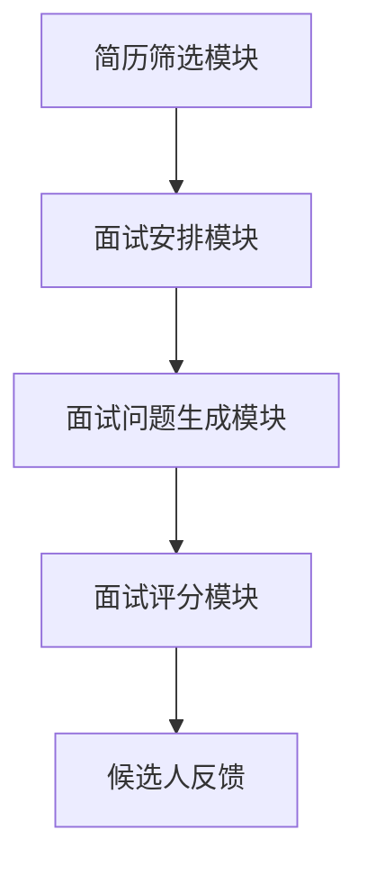
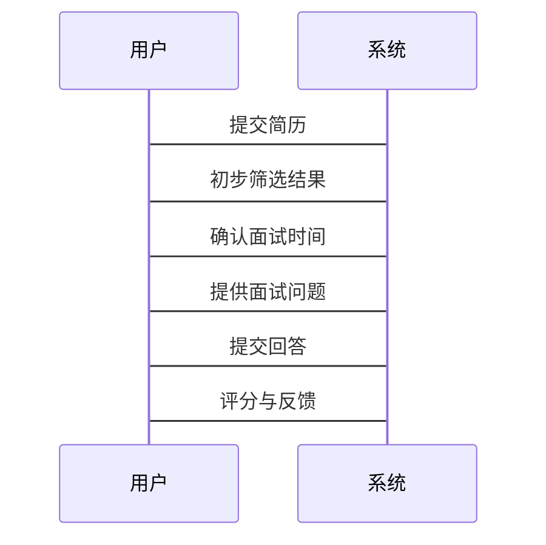

                 


# 智能面试官 AI Agent：LLM 辅助招聘流程

## 关键词：智能面试官, AI Agent, LLM, 招聘流程, 自然语言处理, 招聘效率, AI 技术

## 摘要：  
随着人工智能技术的快速发展，AI 在招聘领域的应用越来越广泛。大型语言模型（LLM）作为一种强大的工具，正在改变传统的招聘流程。本文将详细介绍 LLM 在招聘中的应用，包括其核心原理、系统架构设计、实际案例分析以及最佳实践。通过本文，读者将深入了解如何利用 LLM 辅助招聘，优化招聘流程，提升招聘效率和准确性。

---

## 第一部分：背景与概述

### 第1章：智能面试官 AI Agent 的定义与背景

#### 1.1 什么是智能面试官 AI Agent
- **1.1.1 智能面试官的定义**  
  智能面试官是一种基于人工智能技术的虚拟面试官，能够通过自然语言处理（NLP）技术与候选人进行交互，模拟真实面试过程，评估候选人的能力和匹配度。

- **1.1.2 AI Agent 在招聘中的作用**  
  - 筛选简历  
  - 安排面试  
  - 生成面试问题  
  - 提供面试反馈  

- **1.1.3 LLM 在智能面试官中的应用**  
  - 简历解析与分析  
  - 自动化面试安排  
  - 面试问题生成与评分  

#### 1.2 智能面试官的发展历程
- **1.2.1 招聘流程的传统模式**  
  - 人工筛选简历  
  - 面试官手动安排面试  
  - 面试后手动评估候选人  

- **1.2.2 AI 技术在招聘中的逐步渗透**  
  - AI 筛选简历的初步尝试  
  - 自动化面试安排工具的出现  
  - 初步的面试评分系统  

- **1.2.3 LLM 对招聘流程的革命性影响**  
  - 提供更智能的简历分析  
  - 实现自动化面试过程  
  - 提供个性化的面试体验  

#### 1.3 智能面试官的优势与挑战
- **1.3.1 提高招聘效率**  
  - 自动筛选简历，减少人工工作量  
  - 快速安排面试，缩短招聘周期  

- **1.3.2 降低招聘成本**  
  - 减少人力资源投入  
  - 提高招聘流程的自动化程度  

- **1.3.3 智能化与个性化的面试体验**  
  - 根据候选人简历生成个性化面试问题  
  - 提供实时反馈，增强候选人体验  

- **1.3.4 数据隐私与伦理问题**  
  - 候选人数据的隐私保护  
  - AI 面试官的公平性与透明度  

- **1.3.5 技术的局限性与未来发展方向**  
  - 当前 LLM 的局限性（如对上下文的理解不足）  
  - 未来可能的发展方向（如多模态模型的应用）  

---

## 第二部分：核心概念与技术基础

### 第2章：LLM 的基本原理与技术基础

#### 2.1 大型语言模型 (LLM) 的基本原理
- **2.1.1 什么是 LLM**  
  LLM 是一种基于深度学习的自然语言处理模型，通过大量数据训练，能够理解和生成自然语言文本。

- **2.1.2 LLM 的核心算法**  
  - 基于 transformer 的架构  
  - 注意力机制（Attention）  
  - 前向传播与反向传播  

- **2.1.3 LLM 的训练过程**  
  - 预训练（Pre-training）  
  - 微调（Fine-tuning）  

- **2.1.4 LLM 的应用场景**  
  - 简历分析  
  - 面试问题生成  
  - 面试评分与反馈  

#### 2.2 LLM 在招聘中的具体应用
- **2.2.1 简历筛选**  
  - 自然语言处理用于解析简历内容  
  - 根据职位需求筛选合适候选人  

- **2.2.2 面试安排**  
  - 自动化安排面试时间  
  - 提醒候选人面试时间  

- **2.2.3 面试问题生成**  
  - 根据候选人简历生成相关问题  
  - 提供多种问题类型（技术、行为、情景问题）  

- **2.2.4 面试评分与反馈**  
  - 根据回答生成评分  
  - 提供个性化反馈  

#### 2.3 LLM 的技术优势
- **2.3.1 自然语言处理能力**  
  - 理解复杂的文本内容  
  - 生成自然流畅的语言  

- **2.3.2 模型的可扩展性**  
  - 支持多种语言和领域  
  - 易于微调以适应具体需求  

- **2.3.3 实时交互能力**  
  - 支持实时对话  
  - 提供即时反馈  

---

### 第3章：LLM 的算法原理与数学模型

#### 3.1 LLM 的算法原理
- **3.1.1 基于 transformer 的架构**  
  - 编码器（Encoder）与解码器（Decoder）  
  - 自注意力机制（Self-Attention）  

- **3.1.2 前向传播与反向传播**  
  - 前向传播：输入文本生成概率分布  
  - 反向传播：计算损失并更新参数  

- **3.1.3 损失函数**  
  - 交叉熵损失函数：  
    $$ \text{Loss} = -\sum_{i=1}^{n} \text{log}(P(y_i|y_{<i})) $$  

- **3.1.4 注意力机制**  
  - 注意力权重计算：  
    $$ \text{Attention}(Q, K, V) = \text{softmax}\left(\frac{QK^T}{\sqrt{d_k}}\right)V $$  

#### 3.2 LLM 的训练过程
- **3.2.1 预训练阶段**  
  - 使用大规模通用数据（如 Wikipedia、书籍等）进行无监督预训练  
  - 目标：学习语言的结构和语义  

- **3.2.2 微调阶段**  
  - 使用特定领域数据（如招聘相关的文本）进行有监督微调  
  - 目标：适应具体任务需求  

---

## 第三部分：系统架构与设计

### 第4章：智能面试官的系统架构设计

#### 4.1 招聘系统的功能模块
- **简历筛选模块**  
  - 输入：候选人简历  
  - 输出：初步筛选结果  

- **面试安排模块**  
  - 输入：筛选通过的简历  
  - 输出：面试时间安排  

- **面试问题生成模块**  
  - 输入：候选人简历信息  
  - 输出：个性化面试问题  

- **面试评分模块**  
  - 输入：候选人回答  
  - 输出：评分与反馈  

#### 4.2 系统架构图（Mermaid）


#### 4.3 系统交互流程图（Mermaid）


---

## 第四部分：项目实战与实现

### 第5章：智能面试官的实现

#### 5.1 环境搭建
- **安装 Python 和必要的库**  
  - 使用 `pip install flask` 安装 Flask  
  - 使用 `pip install transformers` 安装 transformers  

#### 5.2 核心代码实现
```python
from flask import Flask
from transformers import AutoTokenizer, AutoModelForCausalLM

app = Flask(__name__)

tokenizer = AutoTokenizer.from_pretrained("gpt2")
model = AutoModelForCausalLM.from_pretrained("gpt2")

@app.route('/generate_questions', methods=['POST'])
def generate_questions():
    data = request.get_json()
    resume = data['resume']
    inputs = f"Based on the resume, generate interview questions: {resume}"
    inputs = tokenizer.encode(inputs, return_tensors='np')
    outputs = model.generate(inputs, max_length=100)
    questions = tokenizer.decode(outputs[0].tolist())
    return {'questions': questions}

if __name__ == '__main__':
    app.run(debug=True)
```

#### 5.3 案例分析
- **案例背景**  
  某科技公司招聘数据分析师，使用 LLM 辅助面试官生成技术问题。  

- **案例实施步骤**  
  1. 简历筛选：模型分析简历中的技术关键词。  
  2. 面试安排：自动安排候选人面试时间。  
  3. 问题生成：根据简历生成数据分析相关问题。  

---

## 第五部分：总结与展望

### 第6章：总结与展望

#### 6.1 最佳实践
- **数据隐私保护**  
  - 确保候选人数据的安全性  
  - 遵守相关隐私法规  

- **模型的可解释性**  
  - 提供透明的评分标准  
  - 明确模型的决策依据  

#### 6.2 小结
- LLM 在招聘中的应用前景广阔  
- 智能面试官将逐步成为招聘流程中的重要组成部分  
- 需要不断优化模型和流程，以应对新的挑战  

#### 6.3 注意事项
- 数据质量问题：确保输入数据的准确性和多样性  
- 模型更新：定期更新模型以适应新的语言和行业变化  
- 用户体验：优化候选人的面试体验  

#### 6.4 扩展阅读
- 推荐阅读《Large Language Models in AI》  
- 参考论文《The Transformer Architecture and Its Applications》  

---

## 作者：AI天才研究院 & 禅与计算机程序设计艺术

---

以上是《智能面试官 AI Agent：LLM 辅助招聘流程》的技术博客文章目录和内容概要。希望这篇博客能够为读者提供清晰的思路和实用的指导，帮助他们更好地理解和应用 LLM 技术在招聘流程中的潜力。

