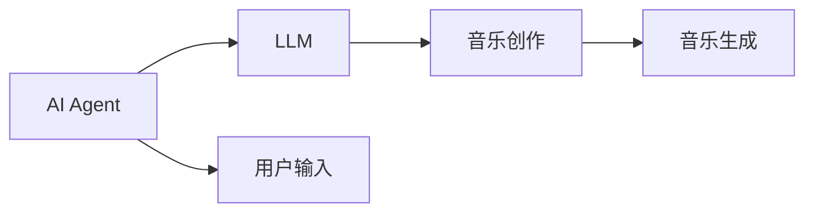

                 

# 目录大纲：《智能音乐创作 AI Agent：LLM 在艺术创作中的应用》

---

## 第一部分：智能音乐创作的背景与概念

### 第1章：智能音乐创作的背景介绍

#### 1.1 智能音乐创作的背景
- 1.1.1 数字化音乐创作的演进
  - 从传统音乐创作到数字化工具的演变
  - 数字化工具如何影响音乐创作的效率和多样性
- 1.1.2 AI技术在艺术领域的崛起
  - AI在艺术领域的应用现状
  - AI如何改变艺术创作的方式
- 1.1.3 LLM在音乐创作中的潜力
  - LLM在语言处理方面的优势
  - LLM如何应用于音乐创作的各个阶段

#### 1.2 问题背景与问题描述
- 1.2.1 音乐创作的痛点
  - 创作过程中的时间消耗
  - 创作灵感的不确定性
  - 创作工具的复杂性
- 1.2.2 LLM在音乐创作中的应用场景
  - 生成歌词
  - 旋律创作
  - 和声设计
- 1.2.3 问题解决的路径与目标
  - 利用LLM辅助音乐创作
  - 提高创作效率和灵感的多样性

#### 1.3 问题的边界与外延
- 1.3.1 音乐创作的边界
  - 不同音乐风格的特点
  - 不同文化背景下的音乐创作差异
- 1.3.2 LLM应用的边界
  - LLM在音乐创作中的适用范围
  - LLM的局限性
- 1.3.3 相关领域的外延
  - AI在视觉艺术中的应用
  - AI在表演艺术中的应用

#### 1.4 核心概念与组成
- 1.4.1 AI Agent的定义
  - AI Agent的定义和基本特征
  - AI Agent与传统计算机程序的区别
- 1.4.2 LLM的定义与特点
  - 大语言模型的定义
  - LLM与传统NLP模型的区别
- 1.4.3 智能音乐创作系统的组成
  - 用户交互界面
  - LLM音乐生成模块
  - AI Agent协调模块

---

## 第二部分：AI Agent与LLM的核心概念与联系

### 第2章：AI Agent与LLM的核心概念

#### 2.1 AI Agent的基本原理
- 2.1.1 AI Agent的定义
  - AI Agent的概念和功能
  - AI Agent与人类用户的交互方式
- 2.1.2 AI Agent的核心特点
  - 自适应性
  - 学习能力
  - 交互能力
- 2.1.3 AI Agent的分类与应用场景
  - 简单反应式AI Agent
  - 复杂推理式AI Agent
  - 学习进化式AI Agent

#### 2.2 LLM的基本原理
- 2.2.1 LLM的定义
  - 大语言模型的定义和特点
  - LLM与小语言模型的区别
- 2.2.2 LLM的核心特点
  - 大规模数据训练
  - 多任务学习能力
  - 高度的生成能力
- 2.2.3 LLM与传统NLP模型的区别
  - 模型规模
  - 模型训练方式
  - 模型输出能力

#### 2.3 AI Agent与LLM的关系
- 2.3.1 AI Agent与LLM的协同工作
  - AI Agent作为协调者
  - LLM作为生成模块
  - 两者的协同流程
- 2.3.2 LLM作为AI Agent的核心模块
  - LLM在AI Agent中的角色
  - LLM如何增强AI Agent的功能
- 2.3.3 AI Agent与LLM的实体关系图

**Mermaid实体关系图：**

---

## 第三部分：LLM在音乐创作中的算法原理

### 第3章：LLM的训练与生成原理

#### 3.1 LLM的训练过程
- 3.1.1 预训练
  - 预训练的目标
  - 预训练的数据来源
  - 预训练的模型结构
- 3.1.2 微调
  - 微调的目标
  - 微调的数据集
  - 微调的模型调整
- 3.1.3 跨领域迁移学习
  - 跨领域迁移学习的定义
  - 跨领域迁移学习的优势
  - 如何实现跨领域迁移学习

#### 3.2 LLM的生成过程
- 3.2.1 生成策略
  - 最大生成概率
  - 最小生成风险
  - 多目标优化
- 3.2.2 生成模型的数学公式
  - 生成模型的概率分布公式
  - 生成模型的损失函数
  - 生成模型的优化算法
- 3.2.3 生成过程中的细节处理
  - 温度参数
  - 重复惩罚
  - 长度限制

#### 3.3 LLM在音乐创作中的应用
- 3.3.1 歌词生成
  - 歌词生成的输入方式
  - 歌词生成的输出结果
  - 歌词生成的评价指标
- 3.3.2 旋律生成
  - 旋律生成的输入方式
  - 旋律生成的输出结果
  - 旋律生成的评价指标
- 3.3.3 和声设计
  - 和声设计的输入方式
  - 和声设计的输出结果
  - 和声设计的评价指标

---

## 第四部分：智能音乐创作系统的架构与实现

### 第4章：智能音乐创作系统的架构设计

#### 4.1 系统功能设计
- 4.1.1 用户交互界面
  - 输入方式
  - 输出方式
  - 用户反馈
- 4.1.2 LLM音乐生成模块
  - 模块功能
  - 模块输入
  - 模块输出
- 4.1.3 AI Agent协调模块
  - 协调功能
  - 协调流程
  - 协调机制

#### 4.2 系统架构设计
- 4.2.1 系统架构图
  - 系统整体架构
  - 各模块之间的关系
  - 系统的可扩展性
- 4.2.2 系统交互流程
  - 用户输入
  - AI Agent处理
  - LLM生成
  - 结果输出
- 4.2.3 系统接口设计
  - 输入接口
  - 输出接口
  - 调用接口

#### 4.3 系统实现
- 4.3.1 环境安装
  - 开发环境
  - 必需的库和工具
  - 安装步骤
- 4.3.2 核心代码实现
  - 用户交互模块
  - AI Agent协调模块
  - LLM生成模块
- 4.3.3 代码解读与分析
  - 关键代码段解读
  - 代码实现的细节
  - 代码优化建议

---

## 第五部分：项目实战与优化

### 第5章：项目实战：基于开源LLM构建音乐创作工具

#### 5.1 项目概述
- 5.1.1 项目背景
  - 项目目标
  - 项目意义
  - 项目范围
- 5.1.2 项目需求
  - 用户需求
  - 功能需求
  - 性能需求
- 5.1.3 项目计划
  - 时间安排
  - 资源分配
  - 风险管理

#### 5.2 项目实现
- 5.2.1 环境配置
  - 开发环境配置
  - 必需库安装
  - 工具链准备
- 5.2.2 核心代码实现
  - 用户输入模块
  - AI Agent协调模块
  - LLM生成模块
  - 结果输出模块
- 5.2.3 代码解读与分析
  - 关键代码段解读
  - 代码实现细节
  - 代码优化建议

#### 5.3 项目测试
- 5.3.1 测试方案
  - 测试目标
  - 测试用例设计
  - 测试环境准备
- 5.3.2 测试结果分析
  - 测试通过情况
  - 问题发现与解决
  - 性能指标分析
- 5.3.3 测试总结
  - 测试总结报告
  - 测试经验教训
  - 测试优化建议

#### 5.4 项目优化
- 5.4.1 系统优化
  - 性能优化
  - 可扩展性优化
  - 可维护性优化
- 5.4.2 代码优化
  - 代码结构优化
  - 代码性能优化
  - 代码可读性优化
- 5.4.3 用户体验优化
  - 界面优化
  - 操作流程优化
  - 反馈机制优化

---

## 第六部分：总结与展望

### 第6章：总结与展望

#### 6.1 项目总结
- 6.1.1 项目成果
  - 成功实现了智能音乐创作工具
  - 达到了预期的功能和性能指标
- 6.1.2 项目经验
  - 成功的经验
  - 意外的教训
- 6.1.3 项目不足
  - 系统的局限性
  - 功能的不完善之处

#### 6.2 未来展望
- 6.2.1 技术发展
  - AI技术的未来趋势
  - LLM的未来发展方向
- 6.2.2 应用场景扩展
  - 新的音乐创作工具
  - 跨领域应用的可能性
- 6.2.3 个人展望
  - 对未来研究方向的思考
  - 对AI音乐创作的个人愿景

---

## 附录

### 附录A：数学公式汇总

$$
\text{损失函数} = \text{交叉熵损失} = -\sum_{i=1}^{n} y_i \log(p_i) + (1 - y_i) \log(1 - p_i)
$$

$$
\text{生成概率} = \frac{\exp(\theta \cdot x)}{1 + \exp(\theta \cdot x)}
$$

### 附录B：参考文献

---

**作者：AI天才研究院/AI Genius Institute & 禅与计算机程序设计艺术/Zen And The Art of Computer Programming**

