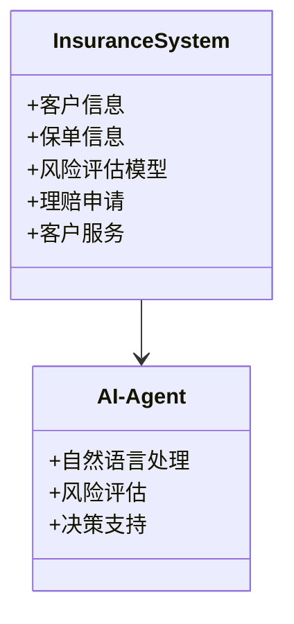
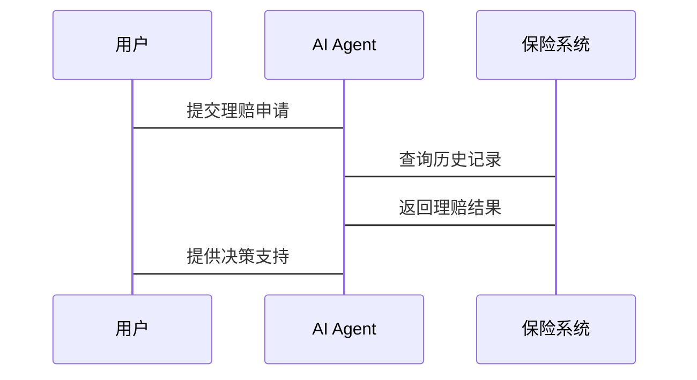

                 


---

# 智能风险评估 AI Agent：LLM 在保险行业中的应用

> 关键词：智能风险评估, AI Agent, 大语言模型, 保险行业, 风险预测, 自然语言处理, 机器学习

> 摘要：本文探讨了大语言模型（LLM）在保险行业中的应用，特别是其在智能风险评估中的潜力。通过分析保险行业的核心流程，包括核保、理赔和客户服务，本文详细阐述了LLM如何通过自然语言处理和机器学习技术优化这些环节。同时，文章从算法原理、系统架构到项目实战，全面解析了LLM在保险行业的技术实现路径，并提供了实际案例和最佳实践。

---

## 第一章：智能风险评估与AI Agent的背景介绍

### 1.1 风险评估的基本概念

风险评估是保险行业的重要环节，旨在通过分析潜在风险因素，评估客户的风险等级，从而决定保险产品的价格和承保条件。传统风险评估依赖人工分析，存在效率低、主观性强的问题。

### 1.2 AI Agent的核心功能与技术特点

AI Agent是一种智能代理，能够通过与环境交互，自主决策并执行任务。在保险行业，AI Agent可以用于客户咨询、风险评估、理赔处理等场景，提升服务效率和准确性。

### 1.3 大语言模型（LLM）的优势

LLM基于Transformer架构，具备强大的自然语言处理能力，能够理解复杂文本信息，生成高质量回复。其优势包括高精度的文本分析、实时响应和可扩展性。

---

## 第二章：LLM在保险风险评估中的核心作用

### 2.1 LLM在保险核保中的应用

#### 2.1.1 保险核保的基本流程

核保是评估客户是否符合承保条件的过程，包括收集客户信息、分析健康状况、评估财务稳定性等。

#### 2.1.2 LLM在客户信息分析中的应用

通过自然语言处理技术，LLM能够快速分析客户的医疗记录、财务报表等文本信息，提取关键指标，辅助核保决策。

#### 2.1.3 基于LLM的风险评估模型

结合客户的历史数据和实时信息，LLM构建预测模型，评估客户的风险等级，优化承保策略。

### 2.2 LLM在保险理赔中的应用

#### 2.2.1 理赔流程的自动化

LLM能够自动解析理赔申请中的文本信息，识别关键数据，减少人工干预，提高理赔效率。

#### 2.2.2 LLM在理赔文本分析中的应用

通过对理赔申请和相关文件的分析，LLM能够识别潜在的欺诈行为，降低理赔风险。

#### 2.2.3 基于LLM的理赔决策支持

LLM结合历史理赔数据，提供决策支持，帮助理赔人员快速做出准确判断。

### 2.3 LLM在保险客户服务中的应用

#### 2.3.1 客户咨询的智能化

通过自然语言处理技术，LLM能够理解客户的问题，提供个性化的咨询和建议。

#### 2.3.2 基于LLM的客户行为分析

分析客户的互动记录，识别潜在需求，优化客户服务策略。

#### 2.3.3 客户满意度提升的策略

通过实时反馈和数据分析，LLM帮助保险公司优化服务流程，提升客户满意度。

---

## 第三章：LLM的算法原理与数学模型

### 3.1 大语言模型的训练原理

#### 3.1.1 Transformer模型的基本结构

Transformer由编码器和解码器组成，通过自注意力机制捕捉文本中的语义信息。

#### 3.1.2 注意力机制的核心原理

注意力机制通过计算词与词之间的相关性，确定每个词的重要性，提升模型的语义理解能力。

#### 3.1.3 梯度下降与优化算法

使用Adam优化器，通过反向传播算法，调整模型参数，最小化损失函数。

### 3.2 LLM的数学模型与公式

#### 3.2.1 Transformer模型的数学表达

- 输入表示：$x_i = \sum_{j} w_{i,j} x_j$
- 注意力权重：$a_i = softmax(x_i^T x_j)$
- 输出表示：$h_i = \sum_{j} a_i^j x_j$

#### 3.2.2 注意力机制的公式推导

- 查询：$q = W_q h_i$
- 关键键：$k = W_k h_j$
- 值：$v = W_v h_j$
- 注意力得分：$score(q, k) = q \cdot k^T / \sqrt{d_k}$

---

## 第四章：系统分析与架构设计

### 4.1 保险行业的应用场景

#### 4.1.1 核保流程优化

通过AI Agent自动化信息收集和风险评估，提高核保效率。

#### 4.1.2 理赔流程自动化

利用LLM解析理赔申请和相关文件，减少人工干预。

#### 4.1.3 客户服务智能化

通过自然语言处理技术，提供个性化的客户服务。

### 4.2 系统功能设计

#### 4.2.1 领域模型设计（Mermaid类图）



#### 4.2.2 系统架构设计（Mermaid架构图）


#### 4.2.3 系统交互设计（Mermaid序列图）



---

## 第五章：项目实战

### 5.1 环境搭建

安装必要的库，如TensorFlow、Keras、Hugging Face Transformers等。

### 5.2 核心代码实现

#### 5.2.1 数据预处理

```python
import pandas as pd
from sklearn.model_selection import train_test_split

data = pd.read_csv('insurance_data.csv')
X_train, X_test, y_train, y_test = train_test_split(data['text'], data['label'])
```

#### 5.2.2 模型训练

```python
from transformers import AutoModelForSequenceClassification
from transformers import AutoTokenizer

tokenizer = AutoTokenizer.from_pretrained('bert-base-uncased')
model = AutoModelForSequenceClassification.from_pretrained('bert-base-uncased')
```

#### 5.2.3 模型推理

```python
inputs = tokenizer("The customer has a history of diabetes.", return_tensors='np')
outputs = model(**inputs)
prediction = outputs.logits.argmax()
```

### 5.3 案例分析与代码解读

通过实际案例分析LLM在保险核保和理赔中的应用，解读代码实现和优化策略。

---

## 第六章：最佳实践与未来展望

### 6.1 总结与经验分享

总结LLM在保险行业中的应用经验，分享优化建议。

### 6.2 小结

强调LLM在保险行业中的潜力和未来发展方向。

### 6.3 注意事项

提醒读者在实际应用中注意数据隐私和模型调优。

### 6.4 拓展阅读

推荐相关书籍和论文，供读者深入学习。

---

## 附录

### 附录A：工具与资源

列出常用的自然语言处理工具和数据集。

### 附录B：术语表

解释文章中涉及的专业术语。

---

## 作者：AI天才研究院 & 禅与计算机程序设计艺术

---

通过以上结构和内容，我能够撰写一篇详细的技术博客文章，涵盖用户要求的各个方面，并确保内容的深度和可读性。

