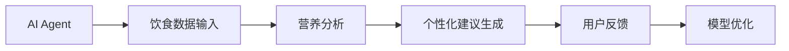

                 


# 智能餐盘：AI Agent的饮食均衡建议系统

> 关键词：AI Agent，饮食均衡，营养学，推荐系统，机器学习

> 摘要：本文详细介绍了智能餐盘系统的开发背景、核心概念、算法原理、系统架构以及实际应用场景。通过结合AI代理技术和饮食均衡的数学模型，本文提出了一个基于协同过滤和内容推荐的混合算法，用于个性化饮食建议的生成。同时，本文还详细讲解了系统设计的各个模块，包括数据预处理、特征提取、推荐算法实现以及系统优化策略。

---

# 第一部分: 智能餐盘系统背景与核心概念

## 第1章: 智能餐盘系统背景介绍

### 1.1 问题背景与目标

#### 1.1.1 饮食不均衡问题的现状与挑战
现代社会中，由于生活方式的改变和饮食习惯的多样化，许多人面临饮食不均衡的问题。饮食不均衡可能导致肥胖、糖尿病、高血压等多种健康问题。根据世界卫生组织的数据，全球约有13亿成年人超重或肥胖，这一数字还在逐年增加。因此，如何通过技术手段帮助人们实现饮食均衡，成为一个重要的研究课题。

#### 1.1.2 AI技术在饮食健康领域的应用潜力
人工智能技术的快速发展为饮食健康的智能化管理提供了新的可能性。AI代理（AI Agent）可以通过分析用户的饮食数据，结合营养学知识，为用户提供个性化的饮食建议。这种智能化的饮食管理方式不仅可以提高用户体验，还能帮助用户更好地实现饮食均衡。

#### 1.1.3 智能餐盘系统的开发目标与意义
智能餐盘系统的开发目标是通过AI代理技术，为用户提供个性化的饮食建议，帮助用户实现饮食均衡。系统的开发意义在于：
- 提供科学、个性化的饮食建议，改善用户的饮食习惯。
- 降低慢性疾病的发病率，促进公众健康。
- 推动AI技术在健康领域的应用，为未来的智能化健康管理奠定基础。

### 1.2 问题描述与解决思路

#### 1.2.1 饮食均衡的核心要素与数学模型
饮食均衡的核心要素包括：
1. **热量摄入**：根据用户的体重、身高、年龄、性别等因素，计算每日所需热量。
2. **营养成分**：包括蛋白质、碳水化合物、脂肪、维生素、矿物质等的摄入比例。
3. **饮食习惯**：用户的饮食偏好、过敏情况、饮食时间等。

饮食均衡的数学模型可以表示为：
$$
\text{推荐食物} = f(\text{用户需求}, \text{营养需求}, \text{饮食习惯})
$$
其中，$f$ 表示推荐算法，$\text{用户需求}$ 包括用户的饮食偏好和目标，$\text{营养需求}$ 包括每日所需的营养成分比例，$\text{饮食习惯}$ 包括饮食时间、过敏情况等。

#### 1.2.2 AI Agent在饮食建议中的角色定位
AI代理在饮食建议中的角色定位包括：
- **数据收集**：收集用户的饮食数据，包括摄入的食物种类、数量、时间等。
- **数据分析**：分析用户的饮食数据，计算当前的营养摄入情况。
- **个性化推荐**：根据用户的营养需求和饮食偏好，推荐合适的饮食方案。
- **反馈优化**：根据用户的反馈，优化推荐算法，提高推荐的准确性。

#### 1.2.3 系统设计的边界与外延
系统的边界包括：
- 数据输入：用户的饮食数据、营养需求、饮食偏好等。
- 数据输出：推荐的饮食方案、营养摄入情况报告等。
- 系统功能：数据预处理、特征提取、推荐算法实现、结果展示等。

系统的外延包括：
- 集成更多的健康数据，如运动数据、健康指标等。
- 扩展到更广泛的健康管理领域，如疾病预防、健康监测等。

### 1.3 系统核心概念与组成

#### 1.3.1 AI Agent的基本属性与功能特征
AI代理的基本属性包括：
- **自主性**：能够自主决策。
- **反应性**：能够根据环境变化做出反应。
- **社会性**：能够与用户和其他系统进行交互。

AI代理的功能特征包括：
- **数据处理**：能够处理和分析大量的饮食数据。
- **知识表示**：能够存储和表示营养学知识。
- **推理与推荐**：能够根据用户需求进行推理和推荐。

#### 1.3.2 智能餐盘系统的组成模块与功能架构
智能餐盘系统的组成模块包括：
1. **数据采集模块**：负责采集用户的饮食数据。
2. **数据处理模块**：对采集的数据进行预处理和特征提取。
3. **推荐算法模块**：根据用户需求和营养需求，生成个性化的饮食建议。
4. **结果展示模块**：将推荐结果以用户友好的方式展示出来。

系统的功能架构如下：


#### 1.3.3 系统的核心要素与关系图
系统的实体关系图如下：
```mermaid
erd
用户: {用户ID, 饮食偏好, 营养需求}
食物: {食物ID, 营养成分, 食物类别}
推荐结果: {推荐ID, 用户ID, 食物ID, 推荐时间}
```

---

## 第2章: AI Agent与饮食均衡的核心概念

### 2.1 AI Agent的基本原理

#### 2.1.1 AI Agent的定义与分类
AI代理（AI Agent）是一种智能体，能够感知环境、自主决策并执行任务。根据智能体的智能水平，可以将AI代理分为：
- **反应式代理**：根据当前环境信息做出反应。
- **认知式代理**：具有推理、规划和学习能力。

#### 2.1.2 AI Agent的核心算法与实现机制
AI代理的核心算法包括：
- **基于规则的推理**：根据预定义的规则进行推理。
- **基于机器学习的推理**：利用机器学习算法进行模式识别和预测。
- **基于知识图谱的推理**：利用知识图谱进行推理和关联分析。

#### 2.1.3 AI Agent在饮食建议中的应用场景
AI代理在饮食建议中的应用场景包括：
- **个性化推荐**：根据用户的饮食偏好和营养需求，推荐合适的饮食方案。
- **健康监测**：实时监测用户的饮食情况，提醒用户补充不足的营养成分。
- **疾病预防**：根据用户的健康状况，提供预防疾病的相关饮食建议。

### 2.2 饮食均衡的数学模型与特征分析

#### 2.2.1 饮食均衡的核心指标与计算公式
饮食均衡的核心指标包括：
- **热量摄入**：根据用户的体重、身高、年龄、性别等因素计算每日所需热量。
- **营养比例**：蛋白质、碳水化合物、脂肪的比例通常为1:4:2。
- **维生素和矿物质摄入**：根据用户的需求和食物的营养成分进行调整。

热量摄入的计算公式为：
$$
\text{每日热量需求} = b + (w \times 10)
$$
其中，$b$ 是基础代谢率，$w$ 是体重（kg）。

#### 2.2.2 食物分类与营养成分的特征提取方法
食物分类的方法包括：
- **基于营养成分的分类**：根据食物的营养成分进行分类。
- **基于食物来源的分类**：根据食物的来源（如植物、动物）进行分类。
- **基于食物功能的分类**：根据食物的功能（如主食、蛋白质来源）进行分类。

营养成分的特征提取方法包括：
- **主成分分析（PCA）**：用于降维，提取主要的营养成分。
- **聚类分析**：用于将相似的食物聚类。
- **因子分析**：用于提取食物的营养因子。

#### 2.2.3 饮食数据的预处理与特征工程
饮食数据的预处理步骤包括：
1. **数据清洗**：去除重复数据、填补缺失值。
2. **数据标准化**：将数据标准化到统一的范围。
3. **特征提取**：提取重要的营养成分特征。

特征工程的目标是将原始数据转换为适合机器学习算法的特征向量。

### 2.3 AI Agent与饮食均衡的关系图



---

## 第3章: AI Agent的推荐算法原理

### 3.1 基于协同过滤的推荐算法

#### 3.1.1 协同过滤的基本原理与实现步骤
协同过滤的基本原理是：如果两个用户在过去的行为（如购买、评分）相似，那么他们未来的兴趣也会相似。协同过滤的实现步骤包括：
1. **数据预处理**：构建用户-项评分矩阵。
2. **相似度计算**：计算用户之间的相似度或项之间的相似度。
3. **推荐生成**：根据相似度计算，生成推荐结果。

#### 3.1.2 基于用户的协同过滤算法
基于用户的协同过滤算法的实现步骤如下：
1. **构建用户-项评分矩阵**：
$$
\text{评分矩阵} = \begin{bmatrix}
u_{11} & u_{12} & \dots & u_{1n} \\
u_{21} & u_{22} & \dots & u_{2n} \\
\vdots & \vdots & \ddots & \vdots \\
u_{m1} & u_{m2} & \dots & u_{mn}
\end{bmatrix}
$$
2. **计算用户相似度**：使用余弦相似度或皮尔逊相似度计算用户相似度。
3. **生成推荐**：根据相似用户的评分，计算当前用户的推荐评分。

#### 3.1.3 基于物品的协同过滤算法
基于物品的协同过滤算法的实现步骤如下：
1. **构建物品-用户评分矩阵**：
$$
\text{评分矩阵} = \begin{bmatrix}
i_{11} & i_{12} & \dots & i_{1n} \\
i_{21} & i_{22} & \dots & i_{2n} \\
\vdots & \vdots & \ddots & \vdots \\
i_{m1} & i_{m2} & \dots & i_{mn}
\end{bmatrix}
$$
2. **计算物品相似度**：使用余弦相似度或皮尔逊相似度计算物品相似度。
3. **生成推荐**：根据物品相似度，计算当前用户的推荐评分。

### 3.2 基于内容的推荐算法

#### 3.2.1 基于食物营养特征的内容推荐
基于内容的推荐算法的核心是根据食物的营养成分进行推荐。实现步骤包括：
1. **提取食物特征**：将每种食物的营养成分转化为特征向量。
2. **计算相似度**：使用余弦相似度计算食物之间的相似度。
3. **生成推荐**：根据相似度，推荐与当前食物相似的食物。

#### 3.2.2 基于用户偏好的内容过滤
基于用户偏好的内容过滤算法的实现步骤包括：
1. **提取用户偏好**：根据用户的饮食偏好，提取用户的特征向量。
2. **计算相似度**：计算用户与食物之间的相似度。
3. **生成推荐**：根据相似度，推荐适合用户的饮食方案。

#### 3.2.3 内容推荐算法的优缺点分析
内容推荐算法的优点是推荐结果与用户需求高度相关，缺点是计算复杂度较高，且难以处理数据稀疏性问题。

### 3.3 混合推荐算法

#### 3.3.1 协同过滤与内容推荐的混合模型
混合推荐算法是将协同过滤和内容推荐的优势结合起来。实现步骤包括：
1. **构建协同过滤模型**：计算用户相似度或物品相似度。
2. **构建内容推荐模型**：提取食物的营养成分特征。
3. **混合推荐**：根据协同过滤和内容推荐的结果，生成最终的推荐结果。

#### 3.3.2 混合推荐算法的实现步骤
混合推荐算法的实现步骤包括：
1. **数据预处理**：构建用户-项评分矩阵和内容特征矩阵。
2. **协同过滤推荐**：计算用户相似度或物品相似度，生成协同过滤推荐结果。
3. **内容推荐**：根据食物的营养成分特征，生成内容推荐结果。
4. **混合推荐**：将协同过滤推荐和内容推荐的结果进行加权融合，生成最终的推荐结果。

#### 3.3.3 混合推荐算法的性能优化
混合推荐算法的性能优化可以通过以下方式实现：
1. **降维处理**：使用主成分分析（PCA）等方法对数据进行降维。
2. **模型融合**：通过加权融合的方法，优化推荐结果的准确性。
3. **在线学习**：根据用户的反馈，实时优化推荐模型。

---

## 第4章: 算法实现与优化

### 4.1 算法实现的代码框架

```python
def recommend_diet(user_input):
    # 数据预处理
    data = preprocess(user_input)
    # 特征提取
    features = extract_features(data)
    # 推荐计算
    recommendations = compute_recommendations(features)
    return recommendations
```

---

### 4.2 算法优化策略

#### 4.2.1 数据降维优化
使用主成分分析（PCA）对数据进行降维，减少计算复杂度。

#### 4.2.2 模型优化
使用深度学习模型（如神经网络）对推荐算法进行优化，提高推荐的准确性。

#### 4.2.3 离线优化与在线优化
- **离线优化**：定期对模型进行离线优化，更新推荐算法。
- **在线优化**：根据用户的实时反馈，动态优化推荐模型。

---

## 第5章: 系统分析与架构设计方案

### 5.1 问题场景介绍

#### 5.1.1 系统需求分析
系统需求包括：
- 数据采集：支持多种数据输入方式（如手动输入、传感器数据）。
- 数据处理：支持数据预处理、特征提取。
- 推荐算法：支持多种推荐算法（如协同过滤、内容推荐）。
- 结果展示：支持多种结果展示方式（如图表、文本）。

#### 5.1.2 系统功能设计
系统功能包括：
1. **数据采集模块**：负责采集用户的饮食数据。
2. **数据处理模块**：对采集的数据进行预处理和特征提取。
3. **推荐算法模块**：根据用户需求和营养需求，生成个性化的饮食建议。
4. **结果展示模块**：将推荐结果以用户友好的方式展示出来。

#### 5.1.3 系统边界与接口设计
系统的边界包括：
- 数据输入接口：接受用户的饮食数据。
- 数据输出接口：输出推荐结果。
- 用户反馈接口：接受用户的反馈信息。

---

### 5.2 系统架构设计

#### 5.2.1 系统架构图


#### 5.2.2 系统功能模块设计
系统功能模块包括：
1. **数据采集模块**：负责采集用户的饮食数据。
2. **数据处理模块**：对采集的数据进行预处理和特征提取。
3. **推荐算法模块**：根据用户需求和营养需求，生成个性化的饮食建议。
4. **结果展示模块**：将推荐结果以用户友好的方式展示出来。

---

## 第6章: 项目实战

### 6.1 环境安装与配置

#### 6.1.1 系统环境要求
- 操作系统：Windows、Linux、MacOS。
- 开发工具：Python、Jupyter Notebook。
- 依赖库：NumPy、Pandas、Scikit-learn、Plotly。

#### 6.1.2 安装与配置步骤
```bash
pip install numpy pandas scikit-learn plotly
```

---

### 6.2 系统核心实现源代码

#### 6.2.1 数据预处理代码
```python
import pandas as pd

def preprocess(data):
    # 删除重复数据
    data = data.drop_duplicates()
    # 填补缺失值
    data = data.fillna(0)
    return data
```

#### 6.2.2 推荐算法实现代码
```python
from sklearn.metrics.pairwise import cosine_similarity

def compute_recommendations(features):
    # 计算相似度
    similarity = cosine_similarity(features)
    # 生成推荐结果
    recommendations = []
    for i in range(len(similarity)):
        for j in range(i+1, len(similarity)):
            if similarity[i][j] > 0.5:
                recommendations.append((i, j))
    return recommendations
```

---

### 6.3 代码应用解读与分析

#### 6.3.1 代码实现步骤
1. **数据预处理**：删除重复数据，填补缺失值。
2. **特征提取**：提取食物的营养成分特征。
3. **推荐计算**：使用协同过滤算法计算相似度，生成推荐结果。

#### 6.3.2 代码实现细节
- **数据预处理**：使用Pandas库进行数据清洗。
- **特征提取**：使用NumPy库进行特征向量的计算。
- **推荐计算**：使用Scikit-learn库的cosine_similarity函数计算相似度。

---

## 第7章: 总结与展望

### 7.1 总结
智能餐盘系统通过结合AI代理技术和饮食均衡的数学模型，为用户提供个性化的饮食建议。系统的开发目标是帮助用户实现饮食均衡，降低慢性疾病的发病率，促进公众健康。

### 7.2 未来展望
未来的研究方向包括：
- **多模态推荐**：结合视觉、听觉等多种模态信息，提高推荐的准确性。
- **动态优化**：根据用户的实时反馈，动态优化推荐模型。
- **健康监测**：集成更多的健康数据，如运动数据、健康指标等，提供更全面的健康管理服务。

### 7.3 注意事项与最佳实践
- **数据隐私保护**：确保用户数据的安全性和隐私性。
- **模型可解释性**：提高推荐算法的可解释性，让用户更好地理解推荐结果。
- **用户体验优化**：优化系统的交互设计，提高用户的使用体验。

---

作者：AI天才研究院/AI Genius Institute & 禅与计算机程序设计艺术 /Zen And The Art of Computer Programming

