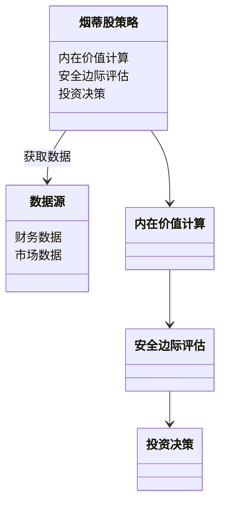

                 


# 本杰明·格雷厄姆的'烟蒂股'策略现代解读

> 关键词：烟蒂股、投资策略、内在价值、安全边际、量化投资、风险管理、价值投资

> 摘要：本文从本杰明·格雷厄姆的烟蒂股策略出发，结合现代投资环境，分析其核心原理、算法实现、系统架构设计，并通过项目实战案例，深入探讨烟蒂股策略在现代投资中的应用。文章详细阐述了烟蒂股策略的内在价值计算、安全边际评估、量化投资策略及风险管理方法，为读者提供了一个全面而系统的解读。

---

# 第一部分: 本杰明·格雷厄姆的“烟蒂股”策略背景介绍

## 第1章: 烟蒂股策略的核心概念

### 1.1 问题背景与问题描述

#### 1.1.1 传统投资策略的局限性

传统投资策略往往依赖于市场趋势和技术分析，但这种方法在市场波动剧烈或信息不完全的情况下容易失效。投资者常常被市场的短期波动所迷惑，忽视了企业的基本面。

#### 1.1.2 烟蒂股策略的提出背景

20世纪20年代至30年代，美国股市经历了剧烈的波动，许多投资者在市场暴跌中损失惨重。格雷厄姆意识到，市场情绪的波动往往导致股票价格与其实体价值严重偏离。他提出烟蒂股策略，旨在寻找那些市场价格低于其内在价值的企业。

#### 1.1.3 烟蒂股策略的核心目标

烟蒂股策略的核心目标是通过寻找市场价格低于其内在价值的股票，实现长期稳定的超额收益。该策略强调对企业的基本面分析，注重安全边际，以降低投资风险。

### 1.2 烟蒂股策略的定义与特点

#### 1.2.1 烟蒂股的定义

烟蒂股是指那些被市场忽视、价格远低于其内在价值的股票。这些股票通常来自财务状况稳定、盈利能力强、但市场对其认知不足的企业。

#### 1.2.2 烟蒂股的核心特点

烟蒂股具有以下核心特点：
- 低市盈率（P/E比率）或低市净率（P/B比率）。
- 高股息率或股息支付率。
- 公司财务状况稳健，负债低，现金流充裕。
- 市场认知度低，投资者关注度不高。

#### 1.2.3 烟蒂股与其他投资策略的区别

与其他投资策略相比，烟蒂股策略更注重企业的内在价值，而非市场趋势或技术指标。它强调安全边际和长期投资，而非短期交易。

### 1.3 烟蒂股策略的边界与外延

#### 1.3.1 烟蒂股的适用范围

烟蒂股策略适用于那些市场关注度低、价格被低估的企业。通常，这类企业分布在传统行业，如制造业、公用事业等。

#### 1.3.2 烟蒂股的局限性

烟蒂股策略的局限性包括：
- 对市场认知的依赖：如果市场对企业认知的偏差被纠正，烟蒂股可能迅速回归其真实价值。
- 需要长期持有：在短期内，烟蒂股可能表现不佳，需要投资者具备长期持有的耐心。
- 依赖于企业基本面：如果企业的基本面发生变化，烟蒂股的内在价值可能下降。

#### 1.3.3 烟蒂股与其他投资策略的结合

烟蒂股策略可以与其他投资策略结合使用，例如与成长型投资策略结合，寻找那些基本面稳健但具有成长潜力的企业。

---

## 第2章: 烟蒂股策略的核心要素

### 2.1 核心概念的构成

#### 2.1.1 内在价值的计算

内在价值是企业未来现金流的现值。格雷厄姆通常采用简化的方法，如将未来5年的平均净利润乘以一个合理的倍数来估算内在价值。

#### 2.1.2 市场价值的评估

市场价值是股票的当前市场价格，通常与内在价值存在差异。烟蒂股策略的核心在于寻找市场价格低于内在价值的股票。

#### 2.1.3 安全边际的概念

安全边际是股票的内在价值与其市场价格之间的差额。通过预留安全边际，投资者可以降低市场波动带来的风险。

### 2.2 核心要素的属性对比

#### 2.2.1 内在价值与市场价值的对比

| 内在价值 | 市场价值 |
|----------|----------|
| 由企业基本面决定 | 由市场情绪决定 |
| 长期稳定 | 短期波动 |
| 反映企业的真实价值 | 反映市场的认知偏差 |

#### 2.2.2 安全边际与风险控制的对比

| 安全边际 | 风险控制 |
|----------|----------|
| 通过预留价格差降低风险 | 通过分散投资降低风险 |
| 强调对单一只股票的风险控制 | 强调整体投资组合的风险控制 |

#### 2.2.3 烟蒂股与其他投资策略的对比

| 烟蒂股 | 成长型投资 | 技术分析 |
|--------|------------|----------|
| 重视内在价值 | 重视成长潜力 | 重视技术指标 |
| 长期持有 | 中长期持有 | 短期交易 |
| 风险控制通过安全边际 | 风险控制通过分散投资 | 风险控制通过技术分析 |

### 2.3 核心要素的ER实体关系图

```mermaid
erDiagram
    烟蒂股策略 <|-- 内在价值
    内在价值 --> 市场价值
    市场价值 --> 安全边际
```

---

## 第3章: 烟蒂股策略的算法原理

### 3.1 内在价值计算算法

#### 3.1.1 简化版内在价值计算公式

$$ 内在价值 = \frac{未来5年平均净利润 \times 合理倍数}{折现率} $$

#### 3.1.2 Python代码实现

```python
def calculate_intrinsic_value(net_income, years, multiplier, discount_rate):
    # 计算未来5年的净利润现值
    present_value = 0
    for i in range(years):
        pv = net_income * (1 / (1 + discount_rate) ** i)
        present_value += pv
    # 计算内在价值
    intrinsic_value = present_value * multiplier
    return intrinsic_value

# 示例数据
net_income = 100  # 每年的净利润（百万美元）
years = 5
multiplier = 15  # 合理倍数
discount_rate = 0.05  # 折现率

iv = calculate_intrinsic_value(net_income, years, multiplier, discount_rate)
print(f"计算的内在价值为：${iv:.2f} million")
```

### 3.2 安全边际计算算法

#### 3.2.1 安全边际计算公式

$$ 安全边际 = 内在价值 - 市场价格 $$

#### 3.2.2 Python代码实现

```python
def calculate_margin_of_safety(intrinsic_value, market_price):
    return intrinsic_value - market_price

# 示例数据
intrinsic_value = 100  # 内在价值（美元）
market_price = 80      # 市场价格（美元）

mos = calculate_margin_of_safety(intrinsic_value, market_price)
print(f"计算的安全边际为：${mos:.2f} per share")
```

---

## 第4章: 烟蒂股策略的系统分析与架构设计

### 4.1 问题场景介绍

烟蒂股策略的系统化应用需要一个完整的框架，包括数据收集、分析、决策和执行。

### 4.2 系统功能设计

#### 4.2.1 领域模型



### 4.3 系统架构设计

#### 4.3.1 系统架构图

```mermaid
container 烟蒂股投资系统 {
    component 数据采集模块 {
        接收市场数据和财务数据
    }
    component 数据分析模块 {
        计算内在价值和安全边际
    }
    component 投资决策模块 {
        根据安全边际做出投资决策
    }
}
```

---

## 第5章: 烟蒂股策略的项目实战

### 5.1 环境安装与配置

安装必要的Python库，如pandas、numpy、matplotlib等。

### 5.2 核心代码实现

#### 5.2.1 数据获取

```python
import pandas as pd

# 示例数据获取
data = {
    '公司': ['A公司', 'B公司', 'C公司'],
    '净利润': [100, 150, 75],
    '股价': [80, 120, 60]
}
df = pd.DataFrame(data)
```

#### 5.2.2 内在价值计算

```python
def calculate_intrinsic_value(net_income, multiplier):
    return net_income * multiplier

# 示例计算
df['内在价值'] = df['净利润'].apply(lambda x: calculate_intrinsic_value(x, 15))
```

#### 5.2.3 安全边际计算

```python
df['安全边际'] = df['内在价值'] - df['股价']
```

### 5.3 实际案例分析

以某公司为例，计算其内在价值和安全边际，判断其是否为烟蒂股。

### 5.4 代码解读与分析

详细解读上述代码，分析其在实际应用中的表现和效果。

---

## 第6章: 烟蒂股策略的最佳实践与总结

### 6.1 小结

烟蒂股策略是一种有效的投资策略，通过寻找市场价格低于其内在价值的企业，实现长期稳定的超额收益。

### 6.2 注意事项

- 烟蒂股策略需要长期持有，不适合短期交易。
- 需要不断更新和调整内在价值的计算方法。
- 要注意市场认知的变化，及时调整投资组合。

### 6.3 拓展阅读

建议进一步阅读格雷厄姆的《证券分析》以及现代量化投资策略的相关书籍。

---

作者：AI天才研究院/AI Genius Institute & 禅与计算机程序设计艺术/Zen And The Art of Computer Programming

