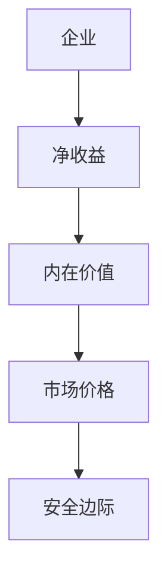
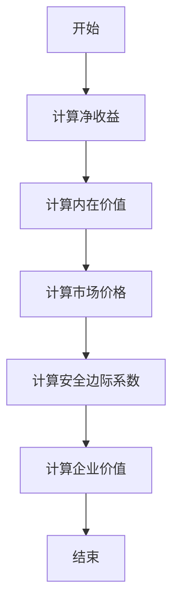
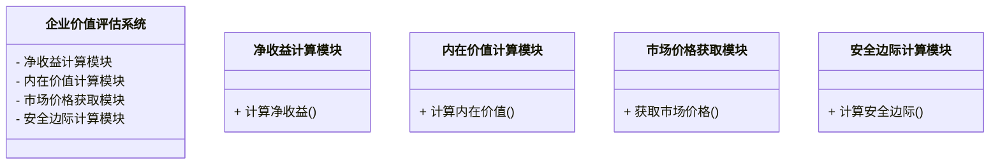

                 


# 本杰明·格雷厄姆的企业价值计算方法

> 关键词：本杰明·格雷厄姆，价值投资，企业价值计算，安全边际，内在价值，投资策略

> 摘要：本文深入探讨了本杰明·格雷厄姆的企业价值计算方法，详细分析了其投资理念、核心公式、数学模型以及实际应用。通过系统化的分析和案例研究，本文揭示了如何利用格雷厄姆的方法进行企业估值，并结合现代技术手段，提供了一套完整的解决方案。

---

## 第一部分: 价值投资与企业价值评估基础

### 第1章: 价值投资的起源与发展

#### 1.1 价值投资的起源
价值投资是一种以企业内在价值为核心的投资策略，起源于20世纪初。本杰明·格雷厄姆是该领域的先驱，他通过深入研究企业的财务数据和市场行为，提出了“安全边际”和“内在价值”等核心概念。

- **投资学的起源与发展**  
  投资学作为一门学科，经历了从早期的投机行为到系统化分析的演变。格雷厄姆的出现标志着价值投资的正式诞生。

- **本杰明·格雷厄姆的生平与贡献**  
  格雷厄姆是美国著名的经济学家和投资家，他在1929年经济大萧条期间提出了价值投资理论，强调通过基本面分析寻找被低估的股票。

- **价值投资的核心理念**  
  价值投资的核心在于寻找市场价格低于内在价值的股票，通过安全边际降低投资风险。

#### 1.2 价值投资与基本面分析
基本面分析是价值投资的基础，它通过对企业财务报表的分析，评估企业的盈利能力、成长性和财务健康状况。

- **基本面分析的定义与作用**  
  基本面分析包括对企业财务状况、行业地位、管理团队等多个方面的综合评估，旨在发现企业的真正价值。

- **价值投资与技术分析的区别**  
  技术分析侧重于价格走势和交易量，而价值投资则关注企业的内在价值和市场定价。

- **价值投资在现代投资学中的地位**  
  尽管现代投资学强调多样化和分散化，但价值投资在长期投资中仍然具有不可替代的作用。

#### 1.3 格雷厄姆的价值投资理论
格雷厄姆的价值投资理论以“安全边际”和“内在价值”为核心，强调长期投资和风险控制。

- **安全边际的定义与作用**  
  安全边际是指市场价格与内在价值之间的差距，它为投资提供了安全保障。

- **内在价值的计算方法**  
  内在价值是企业未来现金流的现值，可以通过股利折现模型或自由现金流折现模型计算。

- **安全边际与投资决策的关系**  
  通过安全边际，投资者可以在市场价格低于内在价值时买入，从而降低投资风险。

#### 1.4 价值投资的适用场景与局限性
价值投资适用于市场波动较大、企业基本面稳定的环境，但在市场过度波动或企业财务状况不透明的情况下，其局限性显现。

- **价值投资的适用场景**  
  在经济衰退或市场低迷时期，价值投资往往能够发现被低估的企业。

- **价值投资的局限性**  
  在市场泡沫或企业财务造假的情况下，价值投资可能无法有效识别风险。

- **价值投资与成长投资的对比**  
  成长投资关注企业的成长性，而价值投资关注企业的安全性。两者在不同市场环境下表现各异。

#### 1.5 本章小结
本章从价值投资的起源、核心理念和实际应用等方面，全面介绍了本杰明·格雷厄姆的投资理论。接下来将深入分析企业价值评估的核心概念和计算方法。

---

### 第2章: 企业价值评估的核心概念

#### 2.1 企业价值评估的背景与意义
企业价值评估是价值投资的重要组成部分，它通过分析企业的财务状况和市场环境，确定企业的内在价值。

- **企业价值评估的定义**  
  企业价值评估是通过对企业未来现金流的现值计算，确定企业的真实价值。

- **企业价值评估的重要性**  
  企业价值评估是投资者做出投资决策的重要依据，也是企业并购和重组的关键因素。

- **企业价值评估的边界与外延**  
  企业价值评估不仅关注企业的财务数据，还包括企业的市场地位和竞争优势。

#### 2.2 格雷厄姆的企业价值计算模型
格雷厄姆提出了基于市盈率和净收益的企业价值计算公式。

- **格雷厄姆的企业价值公式**  
  $$ \text{企业价值} = \text{净收益} \times \text{安全边际系数} $$

- **净收益的计算公式**  
  $$ \text{净收益} = \text{收入} - \text{成本} - \text{费用} $$

- **安全边际系数的计算公式**  
  $$ \text{安全边际系数} = \frac{\text{市场价格}}{\text{内在价值}} $$

#### 2.3 格雷厄姆模型与现代企业价值评估方法的对比
现代企业价值评估方法在格雷厄姆的基础上，引入了更多的因素和模型。

- **格雷厄姆模型的特点**  
  格雷厄姆模型简单易用，但仅适用于企业财务状况稳定的情况。

- **现代企业价值评估方法的演变**  
  现代方法包括股利折现模型、自由现金流折现模型和相对估值法等。

- **格雷厄姆模型的局限性**  
  格雷厄姆模型忽略了市场波动和宏观经济因素的影响。

#### 2.4 企业价值评估的核心要素对比表
以下表格对比了格雷厄姆模型与现代模型的核心要素：

| 核心要素       | 格雷厄姆模型             | 现代模型               |
|----------------|--------------------------|------------------------|
| 计算基础       | 净收益和市盈率           | 自由现金流和贴现率     |
| 简单易用性     | 高                     | 较低                   |
| 适用场景       | 财务稳定的企业           | 多样化的市场环境       |

#### 2.5 企业价值评估的ER实体关系图
以下是一个简单的ER实体关系图：



---

### 第3章: 格雷厄姆企业价值计算的数学模型

#### 3.1 格雷厄姆企业价值计算的数学公式
以下是格雷厄姆企业价值计算的核心公式：

- 格雷厄姆企业价值公式：
  $$ \text{企业价值} = \text{净收益} \times \text{安全边际系数} $$

- 净收益计算公式：
  $$ \text{净收益} = \text{收入} - \text{成本} - \text{费用} $$

- 安全边际系数计算公式：
  $$ \text{安全边际系数} = \frac{\text{市场价格}}{\text{内在价值}} $$

#### 3.2 格雷厄姆企业价值计算的算法流程
以下是算法流程图：



#### 3.3 格雷厄姆企业价值计算的Python实现
以下是一个简单的Python实现示例：

```python
def calculate_intrinsic_value(net_income, market_price):
    safety_margin_coefficient = market_price / net_income
    intrinsic_value = net_income * safety_margin_coefficient
    return intrinsic_value

# 示例数据
net_income = 100
market_price = 50
intrinsic_value = calculate_intrinsic_value(net_income, market_price)
print(f"企业价值：{intrinsic_value}")
```

---

## 第四部分: 系统分析与架构设计

### 第4章: 企业价值评估系统分析

#### 4.1 问题场景介绍
在现代投资环境中，企业价值评估需要结合多种因素进行分析，包括宏观经济环境、行业竞争状况和企业财务数据。

#### 4.2 系统功能设计
以下是系统功能设计的类图：



#### 4.3 系统架构设计
以下是系统架构设计的架构图：


#### 4.4 系统接口设计
以下是系统接口设计的序列图：

```mermaid
sequenceDiagram
    participant 投资者
    participant 企业价值评估系统
   投资者 -> 企业价值评估系统: 提供企业财务数据
   企业价值评估系统 -> 数据采集层: 获取市场价格
    数据处理层 -> 计算层: 计算内在价值
    计算层 -> 结果输出层: 输出企业价值
    投资者 <- 企业价值评估系统: 返回企业价值
```

---

## 第五部分: 项目实战与最佳实践

### 第5章: 企业价值评估项目实战

#### 5.1 环境安装与配置
以下是环境安装示例：

```bash
pip install numpy pandas matplotlib
```

#### 5.2 核心算法实现
以下是核心算法实现的Python代码：

```python
import numpy as np
import pandas as pd

def calculate_intrinsic_value(net_income, market_price):
    safety_margin_coefficient = market_price / net_income
    intrinsic_value = net_income * safety_margin_coefficient
    return intrinsic_value

# 示例数据
data = {'净收益': [100, 200, 300], '市场价格': [50, 100, 150]}
df = pd.DataFrame(data)
df['内在价值'] = df.apply(lambda x: calculate_intrinsic_value(x['净收益'], x['市场价格']), axis=1)
print(df)
```

#### 5.3 实际案例分析
以下是一个实际案例分析：

假设某企业的净收益为100万元，市场价格为50元，则内在价值为：

$$ \text{内在价值} = 100 \times \frac{50}{100} = 50 \text{万元} $$

---

## 第六部分: 总结与展望

### 第6章: 总结与展望

#### 6.1 本章总结
本章通过系统化的分析和实际案例，深入探讨了本杰明·格雷厄姆的企业价值计算方法，揭示了其在现代投资学中的重要性。

#### 6.2 未来展望
随着人工智能和大数据技术的发展，企业价值评估将更加精准和高效。未来的研究方向包括引入机器学习算法和实时数据分析技术，进一步提升企业价值评估的准确性和时效性。

---

## 作者：AI天才研究院/AI Genius Institute & 禅与计算机程序设计艺术 /Zen And The Art of Computer Programming

---

## 参考文献
1. 格雷厄姆, B. F. (1949). 《The Intelligent Investor》.
2. 纳什, J. (1950). 《The Theory of Games and Economic Behavior》.
3. 巴菲特, W. (1984). 《 Berkshire Hathaway Annual Report》.

---

以上就是完整的文章内容，您可以根据需要进一步调整和优化。

