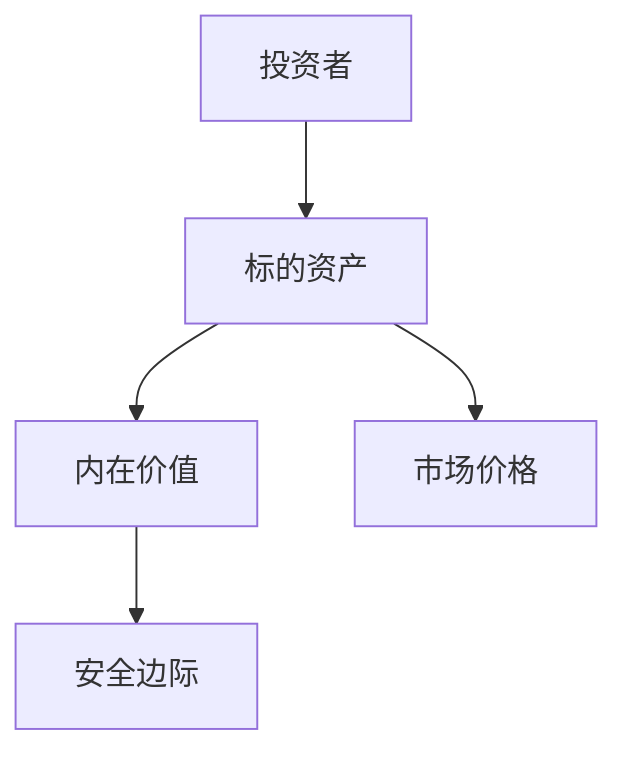
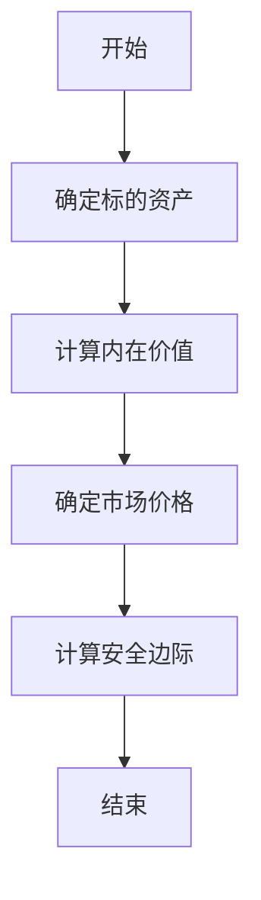
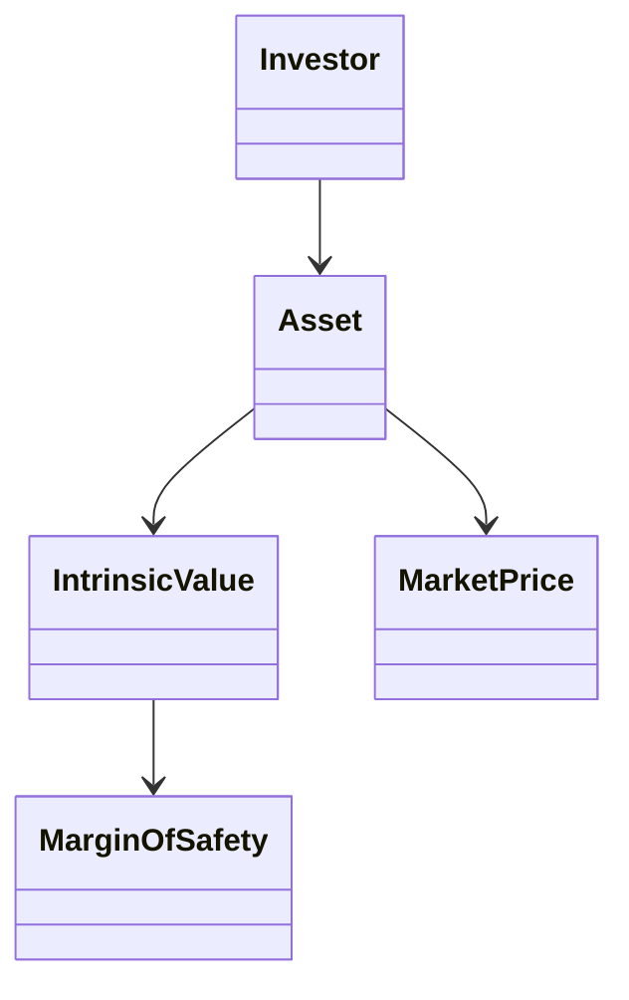
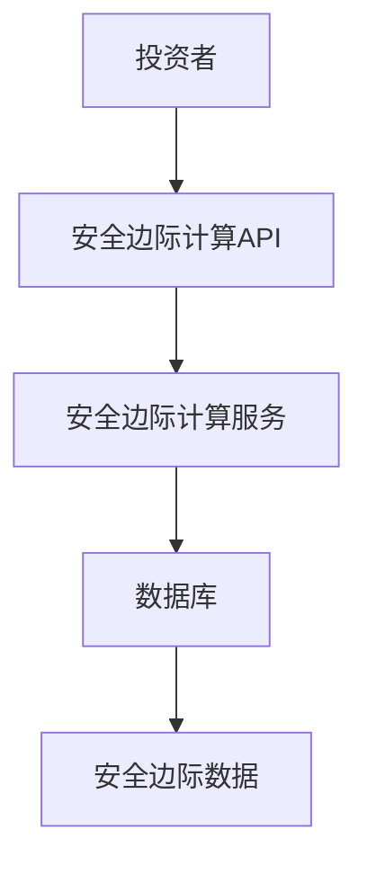

                 


# 本杰明·格雷厄姆的安全边际现代诠释

> 关键词：安全边际，本杰明·格雷厄姆，投资，价值投资，风险管理

> 摘要：本文通过详细分析本杰明·格雷厄姆提出的安全边际概念，探讨其在现代投资中的应用。从核心概念到算法原理，再到系统设计与项目实战，结合技术语言和实际案例，深入解读如何利用安全边际进行稳健投资。

---

## 第一章：安全边际的核心概念与背景

### 1.1 安全边际的定义与背景

#### 1.1.1 投资中的安全边际概念

安全边际是本杰明·格雷厄姆在其价值投资理论中提出的核心概念之一。它指的是在投资过程中，买入价格低于标的资产内在价值的幅度。简单来说，安全边际是投资者在买入资产时所拥有的“缓冲区”，用于降低投资风险并确保长期收益。

#### 1.1.2 格雷厄姆投资理念的起源

格雷厄姆是20世纪最著名的投资理论家之一，他的投资理念深受“安全边际”思想的影响。他主张以低于资产内在价值的价格买入资产，从而在市场波动中获得超额收益。这种理念在当时传统投资方法的基础上，提出了以基本面分析为核心的投资策略。

#### 1.1.3 安全边际在现代投资中的应用

随着金融市场的不断发展，安全边际的概念逐渐被应用于更广泛的领域。无论是股票、债券，还是其他金融资产，安全边际都为投资者提供了一种稳健的投资策略。通过计算安全边际，投资者可以更好地控制风险，避免在市场高估时盲目投资。

### 1.2 安全边际的核心要素

#### 1.2.1 内在价值的计算方法

内在价值是安全边际计算的基础，通常通过资产的未来现金流折现值来计算。对于股票而言，内在价值可以通过股利贴现模型（DDM）或其他现金流折现模型（DCF）来估算。

$$\text{内在价值} = \frac{\text{未来现金流}}{（1 + \text{折现率}）}$$

#### 1.2.2 安全边际的宽度

安全边际的宽度是指买入价格与内在价值之间的差值。通常，安全边际越高，投资风险越小，潜在收益越高。

$$\text{安全边际} = \text{内在价值} - \text{市场价格}$$

#### 1.2.3 安全边际与风险控制的关系

安全边际通过提供一个保护机制，帮助投资者在市场波动中避免重大损失。即使市场短期波动，投资者依然可以在安全边际的保护下，保持资产的长期增值。

---

## 第二章：安全边际的核心概念与联系

### 2.1 核心概念原理

#### 2.1.1 内在价值的计算公式

$$\text{内在价值} = \sum_{t=1}^{n} \frac{CF_t}{(1 + r)^t}$$

其中，\(CF_t\) 表示第t年的现金流，\(r\) 是折现率。

#### 2.1.2 安全边际的宽度计算

$$\text{安全边际} = \text{内在价值} - \text{市场价格}$$

#### 2.1.3 安全边际与投资回报的关系

通过安全边际，投资者可以确保在买入时的价格不会过高，从而在长期投资中获得稳定的回报。

### 2.2 核心概念对比表格

| 概念                | 描述                                                     |
|---------------------|--------------------------------------------------------|
| 安全边际           | 资产买入价格低于其内在价值的幅度                         |
| 非安全边际投资     | 资产买入价格接近或超过其内在价值                          |
| 风险控制            | 通过安全边际降低投资风险                                 |

### 2.3 ER实体关系图



---

## 第三章：安全边际的算法原理

### 3.1 安全边际计算流程



### 3.2 Python实现示例

```python
def calculate_intrinsic_value(cash_flows, discount_rate):
    """计算资产的内在价值"""
    return sum(cf / (1 + discount_rate)**t for t, cf in enumerate(cash_flows))

def calculate_margin_of_safety(intrinsic_value, market_price):
    """计算安全边际"""
    return intrinsic_value - market_price

# 示例计算

# 假设未来现金流为 [100, 120, 150]，折现率为 0.05
cash_flows = [100, 120, 150]
discount_rate = 0.05
intrinsic_value = calculate_intrinsic_value(cash_flows, discount_rate)
market_price = 300  # 市场价格
margin_of_safety = calculate_margin_of_safety(intrinsic_value, market_price)

print(f"内在价值: {intrinsic_value}")
print(f"市场价格: {market_price}")
print(f"安全边际: {margin_of_safety}")
```

### 3.3 数学模型

#### 内在价值公式

$$\text{内在价值} = \sum_{t=1}^{n} \frac{CF_t}{(1 + r)^t}$$

#### 安全边际公式

$$\text{安全边际} = \text{内在价值} - \text{市场价格}$$

---

## 第四章：系统分析与架构设计

### 4.1 问题场景介绍

本章将构建一个基于安全边际的资产分析系统，用于帮助投资者快速评估标的资产的安全边际。

### 4.2 系统功能设计

#### 4.2.1 领域模型



#### 4.2.2 系统架构



### 4.3 接口设计

- `GET /api/margin-of-safety`
  - 输入：资产信息（现金流、折现率、市场价格）
  - 输出：安全边际

---

## 第五章：项目实战

### 5.1 环境安装

```bash
pip install numpy pandas
```

### 5.2 核心实现代码

```python
import numpy as np
import pandas as pd

def calculate_intrinsic_value(cash_flows, discount_rate):
    return np.npv(discount_rate, cash_flows)

def calculate_margin_of_safety(intrinsic_value, market_price):
    return intrinsic_value - market_price

# 示例数据
data = {
    '现金流': [100, 120, 150],
    '折现率': 0.05,
    '市场价格': 300
}

# 计算
iv = calculate_intrinsic_value(data['现金流'], data['折现率'])
mos = calculate_margin_of_safety(iv, data['市场价格'])

print(f"内在价值: {iv}")
print(f"安全边际: {mos}")
```

### 5.3 案例分析

假设某公司的未来现金流为 [100, 120, 150]，折现率为 5%，市场价格为 300。

计算结果如下：

- 内在价值：约 265.57
- 安全边际：约 -35.43

由于安全边际为负，说明市场价格高于内在价值，投资风险较高。

---

## 第六章：总结与展望

### 6.1 最佳实践 Tips

- 定期评估资产的安全边际
- 结合市场环境调整安全边际宽度
- 多资产配置以分散风险

### 6.2 小结

通过本文的分析，我们可以看到，本杰明·格雷厄姆的安全边际理念在现代投资中依然具有重要的指导意义。结合技术手段，投资者可以更高效地计算和应用安全边际，从而实现稳健投资。

### 6.3 注意事项

- 安全边际计算依赖于对未来现金流的准确预测
- 需结合市场实际情况进行动态调整
- 避免过度依赖单一指标

### 6.4 拓展阅读

- 《The Intelligent Investor》 - 本杰明·格雷厄姆
- 《安全边际：投资的艺术与科学》 - 查理·芒格

---

## 作者：AI天才研究院 & 禅与计算机程序设计艺术

