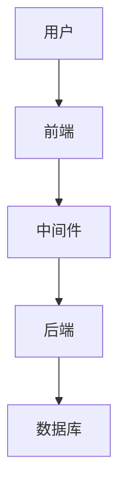
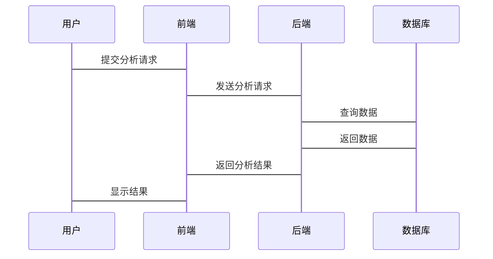

                 


# 本杰明·格雷厄姆的工作资本分析技巧

## 关键词：工作资本分析，投资策略，风险管理，本杰明·格雷厄姆，价值投资

## 摘要：本杰明·格雷厄姆作为价值投资的先驱，提出了工作资本分析的方法，通过分析企业的流动资产和流动负债，评估企业的财务健康状况，制定投资策略。本文详细介绍了工作资本分析的核心概念、数学模型、三大分析方法，以及如何在投资策略中应用风险管理技巧，并通过系统架构设计和项目实战，展示工作资本分析的实际应用。文章最后总结了工作资本分析的重要性和未来研究方向。

---

# 第一部分: 工作资本分析的背景与核心概念

## 第1章: 工作资本分析的背景与意义

### 1.1 投资分析的历史演变

#### 1.1.1 传统投资分析方法的局限性
传统的投资分析方法主要依赖于市场趋势和价格波动，忽视了企业的基本面分析。这种方法在市场波动剧烈时显得力不从心，无法为企业提供长期稳定的财务评估。

#### 1.1.2 格雷厄姆的贡献与工作资本分析的提出
本杰明·格雷厄姆作为价值投资的先驱，提出了工作资本分析的方法，强调通过分析企业的流动资产和流动负债，评估企业的财务健康状况。这种方法弥补了传统分析方法的不足，为企业投资者提供了更可靠的决策依据。

#### 1.1.3 工作资本分析在现代投资中的应用价值
工作资本分析不仅适用于传统投资，还广泛应用于现代金融工具和复杂市场环境中的投资决策。它通过对企业流动资产和流动负债的分析，帮助投资者识别企业的财务风险和投资机会。

### 1.2 工作资本分析的核心概念

#### 1.2.1 工作资本的定义与组成
工作资本（Working Capital）是指企业的流动资产减去流动负债，用于衡量企业短期偿债能力和运营效率。流动资产包括现金、应收账款、存货等，流动负债包括应付账款、短期贷款等。

#### 1.2.2 工作资本分析的基本原理
工作资本分析通过比较流动资产和流动负债的相对比例，评估企业的短期财务健康状况。工作资本为正时，企业有足够的流动资产偿还短期负债，反之则可能面临财务危机。

#### 1.2.3 工作资本与企业价值的关系
工作资本是企业价值的重要组成部分，它反映了企业的运营能力和偿债能力。高工作资本通常意味着企业有更强的短期偿债能力和运营效率。

### 1.3 工作资本分析的适用场景

#### 1.3.1 企业财务健康评估
通过工作资本分析，投资者可以评估企业的财务健康状况，识别潜在的财务风险。

#### 1.3.2 投资决策支持
工作资本分析为企业投资者提供了可靠的财务数据，帮助他们制定投资策略。

#### 1.3.3 风险管理与控制
工作资本分析可以帮助投资者识别和管理企业的财务风险，制定有效的风险管理策略。

### 1.4 本章小结
本章介绍了工作资本分析的背景、核心概念和适用场景，为后续分析奠定了基础。

---

## 第2章: 工作资本分析的核心要素与数学模型

### 2.1 工作资本分析的核心要素

#### 2.1.1 流动资产与流动负债的定义与分类
流动资产是指可以在一年内转换为现金的资产，包括现金、应收账款、存货等。流动负债是指企业在一年内需要偿还的债务，包括应付账款、短期贷款等。

#### 2.1.2 工作资本的计算公式与意义
$$\text{工作资本} = \text{流动资产} - \text{流动负债}$$
工作资本为正时，企业有足够的流动资产偿还短期负债，反之则可能面临财务危机。

#### 2.1.3 核心要素之间的关系
流动资产和流动负债是工作资本的核心要素，它们的相对比例直接影响工作资本的正负和企业的财务健康状况。

### 2.2 工作资本分析的数学模型

#### 2.2.1 工作资本公式
$$\text{工作资本} = \text{流动资产} - \text{流动负债}$$

#### 2.2.2 流动资产与流动负债的分解公式
流动资产包括：$$\text{现金} + \text{应收账款} + \text{存货}$$
流动负债包括：$$\text{应付账款} + \text{短期贷款}$$

#### 2.2.3 工作资本变化的数学表达
$$\Delta\text{工作资本} = \text{新工作资本} - \text{旧工作资本}$$

### 2.3 核心要素对比分析

#### 2.3.1 流动资产与流动负债的特征对比
| 特征           | 流动资产         | 流动负债         |
|----------------|------------------|------------------|
| 计量方式       | 资产             | 负债             |
| 时间范围       | 一年内           | 一年内           |
| 影响因素       | 存货、应收账款   | 应付账款、短期贷款|

#### 2.3.2 工作资本与净资本的关系
净资本是指企业的所有者权益，工作资本是企业的短期偿债能力。两者的结合可以更全面地评估企业的财务状况。

#### 2.3.3 核心要素对财务健康的影响
流动资产和流动负债的合理配比是企业财务健康的重要标志。工作资本为正时，企业短期偿债能力强，反之则可能面临流动性危机。

### 2.4 实例分析：某公司工作资本计算与解读

#### 2.4.1 数据来源与假设
假设某公司2023年的流动资产为100万元，流动负债为80万元。

#### 2.4.2 计算过程展示
$$\text{工作资本} = 100 - 80 = 20 \text{万元}$$

#### 2.4.3 结果解读与意义
工作资本为20万元，说明公司有足够的流动资产偿还短期负债，财务状况健康。

### 2.5 本章小结
本章详细介绍了工作资本分析的核心要素和数学模型，通过实例分析展示了工作资本的计算和解读方法。

---

## 第3章: 工作资本分析的三大核心方法

### 3.1 比率分析法

#### 3.1.1 流动比率与速动比率的定义
流动比率（Current Ratio）是流动资产与流动负债的比率：$$\text{流动比率} = \frac{\text{流动资产}}{\text{流动负债}}$$
速动比率（Quick Ratio）是速动资产与流动负债的比率：$$\text{速动比率} = \frac{\text{流动资产} - \text{存货}}{\text{流动负债}}$$

#### 3.1.2 两种比率的计算公式与意义
流动比率衡量企业的短期偿债能力，速动比率进一步剔除存货的影响，更能反映企业的即时偿债能力。

#### 3.1.3 实际案例中的应用
某公司流动资产为100万元，流动负债为80万元，存货为30万元。
$$\text{流动比率} = \frac{100}{80} = 1.25$$
$$\text{速动比率} = \frac{100 - 30}{80} = 0.875$$
流动比率表明公司有足够的流动资产偿还短期负债，速动比率表明在剔除存货后，公司仍有一定的即时偿债能力。

### 3.2 趋势分析法

#### 3.2.1 时间序列分析的基本概念
趋势分析法通过分析工作资本在不同时间点的变化趋势，评估企业的财务健康状况。

#### 3.2.2 工作资本趋势的可视化方法
使用折线图或柱状图展示工作资本的变化趋势。

#### 3.2.3 趋势分析在投资决策中的作用
趋势分析可以帮助投资者识别企业的财务风险和投资机会，例如工作资本持续增长可能表明企业运营效率提高。

### 3.3 比较分析法

#### 3.3.1 同行业公司对比的意义
通过与同行业公司对比，评估企业在行业中的相对位置。

#### 3.3.2 比较分析的具体步骤
1. 收集同行业公司的财务数据。
2. 计算各公司的工作资本。
3. 进行横向对比。

#### 3.3.3 案例分析：行业平均水平与目标公司对比
假设行业平均水平的流动比率为1.5，速动比率为0.8，目标公司流动比率为1.25，速动比率为0.875。目标公司在流动比率上低于行业平均水平，但在速动比率上与行业平均水平持平。

### 3.4 三种方法的综合应用

#### 3.4.1 综合分析的逻辑框架
结合比率分析、趋势分析和比较分析，全面评估企业的财务状况。

#### 3.4.2 实际案例中的综合应用
通过综合应用三种方法，全面评估某公司的财务健康状况，制定投资策略。

#### 3.4.3 方法选择的注意事项
根据具体情况进行方法选择，避免单一方法的局限性。

### 3.5 本章小结
本章介绍了工作资本分析的三大核心方法，通过实例分析展示了综合应用的方法。

---

## 第4章: 投资策略与风险管理

### 4.1 投资策略的制定

#### 4.1.1 工作资本分析在投资决策中的应用
工作资本分析可以帮助投资者评估企业的短期偿债能力和运营效率，制定投资策略。

#### 4.1.2 投资策略的类型
1. 价值投资：寻找被低估的企业。
2. 成长投资：投资于高增长企业。

### 4.2 风险管理的技巧

#### 4.2.1 风险识别
通过工作资本分析识别企业的财务风险，例如工作资本为负可能表明企业面临流动性危机。

#### 4.2.2 风险评估
评估风险的严重程度，制定相应的风险管理策略。

#### 4.2.3 风险控制
通过 diversification、 hedging 等方法分散和控制风险。

### 4.3 工作资本分析在风险管理中的应用

#### 4.3.1 通过工作资本分析识别潜在风险
工作资本为负可能表明企业面临短期偿债困难。

#### 4.3.2 制定风险管理策略
例如，通过增加流动资产或减少流动负债来改善工作资本。

### 4.4 本章小结
本章讨论了工作资本分析在投资策略和风险管理中的应用，强调了风险管理和投资策略的重要性。

---

## 第5章: 系统分析与架构设计

### 5.1 系统分析

#### 5.1.1 问题场景介绍
通过工作资本分析系统，帮助企业投资者进行财务分析和投资决策。

#### 5.1.2 系统功能设计
系统功能包括数据输入、分析计算、结果展示、风险管理等。

#### 5.1.3 系统架构设计
使用 Mermaid 图展示系统架构，包括数据层、业务逻辑层和用户界面层。

### 5.2 系统架构设计

#### 5.2.1 系统架构图


#### 5.2.2 数据流设计
用户输入数据，前端传递给中间件，中间件处理后传送给后端，后端进行分析计算，将结果存储在数据库中，并将结果反馈给用户。

### 5.3 系统接口设计

#### 5.3.1 API 接口设计
设计 RESTful API，例如：
- GET /work-capital：获取工作资本数据
- POST /analyze：提交分析请求

### 5.4 系统交互设计

#### 5.4.1 交互流程图


### 5.5 本章小结
本章通过系统分析与架构设计，展示了如何将工作资本分析应用于实际投资决策中。

---

## 第6章: 项目实战

### 6.1 环境安装

#### 6.1.1 安装 Python 环境
使用 Anaconda 安装 Python 3.8 或更高版本。

#### 6.1.2 安装相关库
安装 pandas、numpy、scikit-learn 等数据分析库。

### 6.2 系统核心实现源代码

#### 6.2.1 工作资本计算函数
```python
import pandas as pd

def calculate_working_capital(data):
    """
    计算工作资本
    :param data: 包含流动资产和流动负债的数据框
    :return: 工作资本
    """
    working_capital = data['流动资产'] - data['流动负债']
    return working_capital
```

#### 6.2.2 比率分析函数
```python
def calculate_ratios(data):
    """
    计算流动比率和速动比率
    :param data: 包含流动资产、流动负债和存货的数据框
    :return: 比率结果
    """
   流动比率 = data['流动资产'] / data['流动负债']
    速动比率 = (data['流动资产'] - data['存货']) / data['流动负债']
    return 流动比率, 速动比率
```

#### 6.2.3 趋势分析函数
```python
def calculate_trend(data):
    """
    计算工作资本的趋势
    :param data: 包含工作资本历史数据的数据框
    :return: 趋势分析结果
    """
    trend = data['工作资本'].rolling(3).mean()
    return trend
```

### 6.3 代码应用解读与分析

#### 6.3.1 数据输入与处理
读取企业的财务数据，计算工作资本、流动比率和速动比率。

#### 6.3.2 分析结果展示
使用 matplotlib 可视化分析结果，例如绘制工作资本的趋势图。

### 6.4 实际案例分析

#### 6.4.1 案例背景
分析某公司过去三年的财务数据，计算工作资本、流动比率和速动比率，评估企业的财务健康状况。

#### 6.4.2 数据分析与结果解读
通过代码计算得出的结果，解读企业的财务状况，制定投资策略。

### 6.5 本章小结
本章通过项目实战，展示了如何将工作资本分析应用于实际投资决策中，帮助投资者制定科学的投资策略。

---

## 第7章: 总结与展望

### 7.1 总结
本杰明·格雷厄姆的工作资本分析方法是价值投资的重要工具，通过分析企业的流动资产和流动负债，评估企业的短期偿债能力和运营效率。本文详细介绍了工作资本分析的核心概念、数学模型、三大分析方法，以及如何在投资策略中应用风险管理技巧，并通过系统架构设计和项目实战，展示了工作资本分析的实际应用。

### 7.2 展望
未来，随着人工智能和大数据技术的发展，工作资本分析将更加智能化和自动化。投资者可以通过机器学习算法，自动化分析企业的财务数据，制定更精准的投资策略。同时，工作资本分析在风险管理中的应用也将更加广泛，帮助投资者更好地应对复杂的市场环境。

### 7.3 本章小结
本文总结了工作资本分析的重要性和未来发展方向，为投资者提供了进一步研究的方向。

---

## 附录

### 附录 A: 术语表
- 工作资本（Working Capital）：流动资产减去流动负债。
- 流动资产（Current Assets）：可以在一年内转换为现金的资产。
- 流动负债（Current Liabilities）：企业在一年内需要偿还的债务。
- 流动比率（Current Ratio）：流动资产与流动负债的比率。
- 速动比率（Quick Ratio）：速动资产与流动负债的比率。

### 附录 B: 参考文献
1. 本杰明·格雷厄姆：《证券分析》
2. 投资学教材：《投资学导论》
3. 相关学术论文：《工作资本分析在投资决策中的应用》

---

## 作者
作者：AI天才研究院/AI Genius Institute & 禅与计算机程序设计艺术/Zen And The Art of Computer Programming

