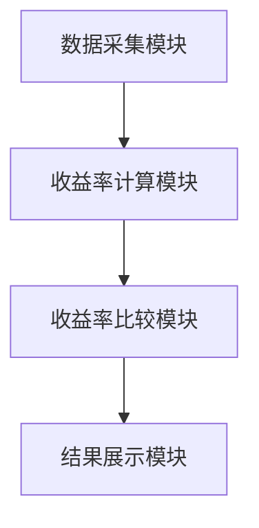

                 


# 本杰明·格雷厄姆的股债收益率比较分析

## 关键词：股债收益率、本杰明·格雷厄姆、投资分析、股息收益率、债券收益率

## 摘要：
本杰明·格雷厄姆作为价值投资的奠基人，提出了许多关于股票和债券收益率比较的独到见解。本文将从股债收益率的基本概念出发，结合格雷厄姆的投资理论，深入分析股债收益率的计算方法、影响因素及其在投资决策中的应用。通过数学模型和实际案例的分析，探讨如何利用股债收益率比较优化投资组合，并结合系统架构设计，提供一个股债收益率分析的实战项目。最后，总结股债收益率比较的最佳实践和注意事项。

---

# 第1章: 股债收益率比较分析的背景介绍

## 1.1 股票与债券的基本概念

### 1.1.1 股票的定义与特点
股票是公司发行的股份凭证，代表股东对公司的所有权。股票的特点包括：
- 风险较高，但潜在收益也较高。
- 股票价格受市场供需关系影响较大。
- 股票的回报主要来自资本增值和股息收入。

### 1.1.2 债券的定义与特点
债券是债务工具，发行人承诺在特定时间内支付利息并偿还本金。债券的特点包括：
- 风险相对较低，收益相对稳定。
- 债券价格受市场利率和发行人信用影响较大。
- 债券的回报主要来自固定的利息收入。

### 1.1.3 股票与债券的主要区别
股票和债券在风险、收益、流动性等方面存在显著差异。股票的风险较高，但潜在收益也较高；债券的风险较低，收益相对稳定。

## 1.2 股债收益率比较分析的背景与意义

### 1.2.1 股债收益率的定义
股债收益率是指股票和债券在一定时期内的回报率。股票的收益率通常包括股息收益率和资本增值收益率，而债券的收益率主要指到期收益率。

### 1.2.2 股债收益率比较的必要性
在投资决策中，比较股票和债券的收益率有助于投资者根据自身的风险承受能力和收益预期，选择合适的投资品种。

### 1.2.3 股债收益率在投资决策中的作用
股债收益率比较可以帮助投资者优化资产配置，分散风险，并在市场波动中灵活调整投资策略。

## 1.3 本杰明·格雷厄姆的理论基础

### 1.3.1 价值投资的基本理念
格雷厄姆主张以低于内在价值的价格买入优质股票，并长期持有，等待市场价值回归。

### 1.3.2 格雷厄姆对股债收益率的贡献
格雷厄姆提出了“安全边际”概念，强调在投资中应注重风险控制，合理评估股票和债券的内在价值。

### 1.3.3 格雷厄姆投资策略的核心要素
格雷厄姆的投资策略注重长期稳健的收益，强调对企业的基本面分析和对市场的理性判断。

## 1.4 本章小结
本章介绍了股票和债券的基本概念，探讨了股债收益率比较的背景和意义，并简要介绍了格雷厄姆的投资理论。

---

# 第2章: 股票收益率与债券收益率的核心概念

## 2.1 股票收益率的计算与分析

### 2.1.1 股票收益率的定义
股票收益率是衡量股票投资回报的重要指标，通常包括股息收益率和资本增值收益率。

### 2.1.2 股票收益率的计算公式
股息收益率的计算公式为：
$$ 股息收益率 = \frac{每股股息}{股票价格} $$

资本增值收益率的计算公式为：
$$ 资本增值收益率 = \frac{最终股价 - 初始股价}{初始股价} $$

### 2.1.3 股票收益率的影响因素
股票收益率受市场环境、公司业绩、行业竞争、宏观经济政策等多种因素的影响。

## 2.2 债券收益率的计算与分析

### 2.2.1 债券收益率的定义
债券收益率是债券投资回报的衡量指标，通常包括到期收益率和当前收益率。

### 2.2.2 债券收益率的计算公式
到期收益率的计算公式为：
$$ 到期收益率 = \frac{债券面值 \times 利率 - 现行价格}{债券面值} $$

### 2.2.3 债券收益率的影响因素
债券收益率受市场利率、债券期限、发行人信用评级等因素的影响。

## 2.3 股票收益率与债券收益率的对比分析

### 2.3.1 收益率计算的异同点
股票收益率和债券收益率的计算公式不同，但都涉及本金和收益的关系。

### 2.3.2 收益率波动性的对比
股票收益率波动较大，而债券收益率相对稳定。

### 2.3.3 收益率与风险的关系
股票的高收益伴随着高风险，而债券的低收益伴随着低风险。

## 2.4 格雷厄姆对股债收益率的特殊见解

### 2.4.1 格雷厄姆的股债收益率分析方法
格雷厄姆主张通过分析企业的基本面，评估股票的内在价值，并与市场价格进行比较。

### 2.4.2 格雷厄姆收益率的定义与应用
格雷厄姆提出了“安全边际”概念，强调在投资中应注重风险控制，合理评估股票和债券的内在价值。

### 2.4.3 格雷厄姆收益率与传统收益率的对比
格雷厄姆的收益率分析方法更注重企业的基本面和长期价值，而传统收益率分析方法更注重短期市场波动。

## 2.5 本章小结
本章详细介绍了股票和债券收益率的计算方法，分析了两者的异同点，并探讨了格雷厄姆对股债收益率比较的独特见解。

---

# 第3章: 股债收益率比较的数学模型与公式

## 3.1 股票收益率的数学模型

### 3.1.1 股票收益率的计算公式
股票收益率的计算公式为：
$$ 股票收益率 = \frac{股息 + 资本增值}{初始投资} $$

### 3.1.2 股票收益率的波动性分析
股票收益率的波动性可以用标准差来衡量：
$$ 标准差 = \sqrt{\frac{\sum (x_i - \mu)^2}{N}} $$

## 3.2 债券收益率的数学模型

### 3.2.1 债券收益率的计算公式
债券收益率的计算公式为：
$$ 到期收益率 = \frac{债券面值 \times 利率 - 现行价格}{债券面值} $$

### 3.2.2 债券收益率的波动性分析
债券收益率的波动性较小，可以用债券的久期来衡量：
$$ 久期 = \frac{债券面值}{(1 + 利率) \times 年限} $$

## 3.3 股债收益率比较的数学模型

### 3.3.1 股债收益率比较的数学公式
股债收益率比较的数学公式为：
$$ 股票收益率 > 债券收益率 $$

### 3.3.2 股债收益率比较的条件
股债收益率比较的条件包括市场环境、投资者风险偏好、经济周期等因素。

## 3.4 本章小结
本章通过数学公式和模型，详细分析了股债收益率比较的方法，为投资者提供了科学的决策依据。

---

# 第4章: 股债收益率比较的系统分析与架构设计

## 4.1 系统功能设计

### 4.1.1 系统功能模块
股债收益率比较系统主要包括数据采集模块、收益率计算模块、收益率比较模块和结果展示模块。

### 4.1.2 系统功能流程
数据采集 → 收益率计算 → 收益率比较 → 结果展示

## 4.2 系统架构设计

### 4.2.1 系统架构图
使用 mermaid 绘制系统架构图：



### 4.2.2 系统交互流程
数据采集模块从数据库中获取股票和债券数据，收益率计算模块计算股息收益率和债券收益率，收益率比较模块比较两者的收益率，结果展示模块将结果以图表形式展示。

## 4.3 本章小结
本章通过系统架构设计，详细描述了股债收益率比较系统的功能模块和交互流程，为实际应用提供了参考。

---

# 第5章: 股债收益率比较的项目实战

## 5.1 项目环境安装

### 5.1.1 安装Python
安装Python 3.x 版本。

### 5.1.2 安装必要的库
安装 Pandas 和 Matplotlib 库：
```bash
pip install pandas matplotlib
```

## 5.2 核心代码实现

### 5.2.1 股票收益率计算代码
```python
import pandas as pd
import matplotlib.pyplot as plt

# 股票收益率计算
def stock_yield(stock_price, dividend):
    return dividend / stock_price

# 股票数据
stock_prices = [100, 105, 110, 115, 120]
dividends = [2, 3, 4, 5, 6]

# 计算股息收益率
stock_yield_rates = [stock_yield(price, div) for price, div in zip(stock_prices, dividends)]
print("股票股息收益率:", stock_yield_rates)

# 绘制股息收益率图表
plt.plot(stock_prices, stock_yield_rates, 'b-')
plt.xlabel('股票价格')
plt.ylabel('股息收益率')
plt.title('股票股息收益率分析')
plt.show()
```

### 5.2.2 债券收益率计算代码
```python
def bond_yield(face_value, coupon_rate, current_price):
    return (face_value * coupon_rate) / current_price

# 债券数据
face_values = [1000, 1000, 1000, 1000, 1000]
coupon_rates = [0.05, 0.06, 0.07, 0.08, 0.09]
current_prices = [950, 960, 970, 980, 990]

# 计算债券收益率
bond_yield_rates = [bond_yield(face, rate, price) for face, rate, price in zip(face_values, coupon_rates, current_prices)]
print("债券收益率:", bond_yield_rates)

# 绘制债券收益率图表
plt.plot(current_prices, bond_yield_rates, 'r-')
plt.xlabel('债券价格')
plt.ylabel('债券收益率')
plt.title('债券收益率分析')
plt.show()
```

## 5.3 实际案例分析

### 5.3.1 股票收益率分析
以某公司股票为例，计算其股息收益率：
$$ 股票股息收益率 = \frac{每股股息}{股票价格} $$

### 5.3.2 债券收益率分析
以某公司债券为例，计算其到期收益率：
$$ 到期收益率 = \frac{债券面值 \times 利率}{债券面值} $$

### 5.3.3 股债收益率比较
通过比较股票和债券的收益率，选择最适合的投资品种。

## 5.4 本章小结
本章通过实际案例分析，详细讲解了股债收益率比较的项目实战，为投资者提供了实践指导。

---

# 第6章: 股债收益率比较的最佳实践与注意事项

## 6.1 最佳实践

### 6.1.1 投资者风险偏好
根据投资者的风险偏好，选择适合的股债投资比例。

### 6.1.2 经济周期影响
在不同的经济周期，股债收益率的表现不同，投资者需灵活调整策略。

### 6.1.3 长期投资策略
长期投资可以平滑股债收益率的短期波动，实现稳健收益。

## 6.2 注意事项

### 6.2.1 市场波动风险
股票市场波动较大，投资者需注意市场风险。

### 6.2.2 利率风险
债券收益率受市场利率影响较大，投资者需关注利率变化。

### 6.2.3 通货膨胀影响
通货膨胀会影响股债的实际收益率，投资者需综合考虑。

## 6.3 拓展阅读

### 6.3.1 经典书籍
《证券分析》（The Analysis of Investment Value）—— 本杰明·格雷厄姆

### 6.3.2 相关研究
股债收益率比较的最新研究成果和应用。

## 6.4 本章小结
本章总结了股债收益率比较的最佳实践和注意事项，为投资者提供了实用的建议。

---

# 作者：AI天才研究院/AI Genius Institute & 禅与计算机程序设计艺术 /Zen And The Art of Computer Programming

---

通过以上分析，本文章详细探讨了本杰明·格雷厄姆的股债收益率比较分析，结合理论、数学模型和实际案例，为投资者提供了科学的决策依据。

