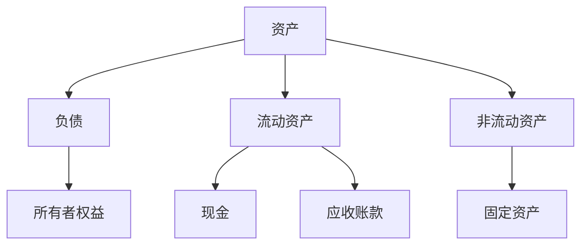

                 


# 本杰明·格雷厄姆的资产负债表分析方法

---

## 关键词：本杰明·格雷厄姆、资产负债表、价值投资、安全边际、内在价值、财务分析

---

## 摘要：  
本杰明·格雷厄姆是价值投资的鼻祖，他的资产负债表分析方法深刻影响了投资领域。本文将详细探讨格雷厄姆的分析方法，结合技术语言和实际案例，剖析其背后的逻辑和原理，帮助读者掌握这一经典投资策略。

---

# 第1章: 本杰明·格雷厄姆与价值投资概述

## 1.1 本杰明·格雷厄姆的生平与投资理念  
本杰明·格雷厄姆是20世纪最伟大的投资理论家之一，他的价值投资理念奠定了现代投资学的基础。他强调安全边际和内在价值，认为市场波动是投资机会的来源。  

---

## 1.2 资产负债表分析的核心地位  
格雷厄姆认为，资产负债表是评估企业价值的关键工具。它揭示了企业的资产、负债和所有者权益，帮助投资者判断企业的财务健康状况和未来盈利能力。  

---

## 1.3 本章小结  
格雷厄姆的资产负债表分析方法以内在价值为核心，结合安全边际，为投资者提供了科学的投资决策框架。

---

# 第2章: 资产负债表的基本结构与分析方法  

## 2.1 资产负债表的基本结构  
资产、负债和所有者权益是资产负债表的三大核心要素。资产是企业拥有的资源，负债是企业的债务，所有者权益是股东对企业的剩余权益。  

---

## 2.2 格雷厄姆的资产负债表分析核心要素  
格雷厄姆特别关注流动资产和流动负债，他认为流动比率和速动比率是衡量企业短期偿债能力的关键指标。  

---

## 2.3 资产负债表分析的关键指标  
- **流动比率**：流动资产 / 流动负债  
- **速动比率**：（流动资产 - 存货）/ 流动负债  
- **负债率**：负债总额 / 资产总额  

---

## 2.4 本章小结  
通过分析流动比率、速动比率和负债率等指标，投资者可以评估企业的短期偿债能力和财务风险。

---

# 第3章: 本杰明·格雷厄姆的资产负债表分析方法  

## 3.1 格雷厄姆的内在价值计算方法  
内在价值是企业未来现金流的现值。格雷厄姆通过分析资产负债表，估算企业的未来收益，并折现计算内在价值。  

---

### 内在价值计算公式  
$$
\text{内在价值} = \sum_{t=1}^{n} \frac{\text{未来现金流}}{(1 + r)^t}
$$  
其中，\( r \) 是折现率，\( t \) 是时间周期。  

---

## 3.2 格雷厄姆的安全边际概念  
安全边际是内在价值与市场价格的差额。格雷厄姆建议以低于内在价值的价格买入股票，以确保投资的安全性。  

---

## 3.3 本章小结  
格雷厄姆通过内在价值和安全边际的概念，帮助投资者在市场波动中做出理性决策。

---

# 第4章: 格雷厄姆分析方法的实际案例分析  

## 4.1 案例一：某制造业企业的资产负债表分析  
假设某制造业企业的资产负债表如下：  

| 项目          | 金额（万元） |
|---------------|--------------|
| 流动资产       | 500          |
| 非流动资产     | 800          |
| 资产总计       | 1300         |
| 流动负债       | 300          |
| 非流动负债     | 200          |
| 负债总计       | 500          |
| 所有者权益     | 800          |
| 资产负债表总计  | 1300         |

---

### 分析步骤  
1. 计算流动比率：  
$$
\text{流动比率} = \frac{500}{300} = 1.67
$$  
2. 计算速动比率：  
$$
\text{速动比率} = \frac{500 - 200}{300} = 1.0
$$  
3. 计算负债率：  
$$
\text{负债率} = \frac{500}{1300} \approx 0.385
$$  

---

## 4.2 本章小结  
通过实际案例分析，我们可以看到格雷厄姆分析方法在实践中的具体应用。

---

# 第5章: 资产负债表分析的系统化方法  

## 5.1 系统架构设计  
以下是资产负债表分析的系统架构图：  



---

## 5.2 关键指标的系统分析  
通过流动比率、速动比率和负债率等指标，我们可以系统地评估企业的财务健康状况。  

---

## 5.3 本章小结  
系统化的方法帮助投资者全面评估企业的财务状况，做出更科学的投资决策。

---

# 第6章: 项目实战——基于格雷厄姆方法的财务分析  

## 6.1 环境安装与数据准备  
需要安装Excel或Python的pandas库，准备企业的资产负债表数据。  

---

## 6.2 核心代码实现  
以下是一个Python代码示例：  

```python
import pandas as pd

# 读取资产负债表数据
df = pd.read_csv('balance_sheet.csv')

# 计算流动比率
流动资产 = df['流动资产'].sum()
流动负债 = df['流动负债'].sum()
流动比率 =流动资产 /流动负债

# 计算速动比率
速动资产 = df['速动资产'].sum()
速动比率 =速动资产 /流动负债

# 输出结果
print(f"流动比率: {流动比率:.2f}")
print(f"速动比率: {速动比率:.2f}")
```

---

## 6.3 本章小结  
通过代码实现，我们可以快速计算关键指标，提高分析效率。

---

# 第7章: 总结与展望  

## 7.1 本章总结  
格雷厄姆的资产负债表分析方法为投资者提供了科学的投资决策框架，帮助我们在市场波动中把握投资机会。

---

## 7.2 未来展望  
随着人工智能和大数据技术的发展，资产负债表分析将更加智能化和精准化。

---

# 作者：AI天才研究院 & 禅与计算机程序设计艺术  

---

通过本文，我们深入探讨了本杰明·格雷厄姆的资产负债表分析方法，结合理论与实践，帮助读者掌握这一经典投资策略。希望本文能为投资领域的研究和实践提供有价值的参考。

