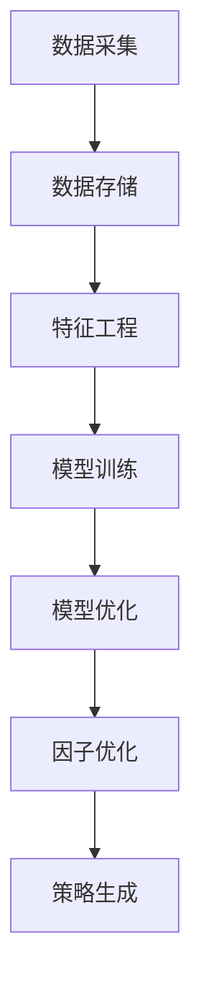
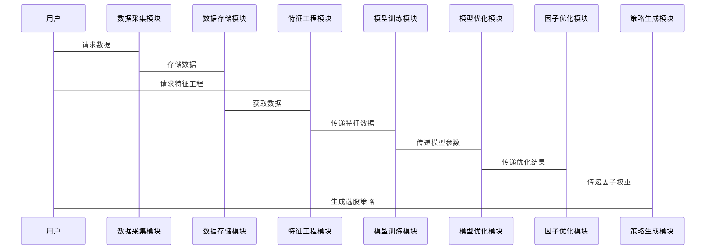

                 


# 机器学习优化多因子选股模型

> **关键词**：机器学习、多因子选股、量化投资、特征工程、算法优化  
> **摘要**：本文详细探讨了机器学习在优化多因子选股模型中的应用。通过分析传统多因子模型的局限性，结合机器学习算法的优势，提出了基于机器学习的多因子选股模型优化方法。文章从背景介绍、核心概念、算法原理、系统设计到项目实战，全面解析了如何利用机器学习技术提升多因子选股模型的性能和准确性。

---

## 第1章: 机器学习与量化投资背景

### 1.1 机器学习的基本概念
机器学习是一种人工智能技术，通过数据训练模型，使其能够从经验中学习并做出预测或决策。其核心在于通过数据特征提取、模型训练和优化，实现对复杂问题的自动解决。

#### 1.1.1 机器学习的定义
机器学习（Machine Learning）是研究如何从经验中学习以改进计算机系统性能的一门科学。它通过算法和数据训练，使模型能够从数据中提取模式和特征。

#### 1.1.2 机器学习的核心原理
机器学习的核心原理包括特征提取、模型训练和优化。特征提取是将数据转换为模型可以理解的特征；模型训练是通过优化目标函数使模型适应数据；优化则是通过调整模型参数来提高预测准确性。

#### 1.1.3 机器学习与传统统计学的区别
- 传统统计学基于假设检验和参数估计，假设数据分布已知。
- 机器学习不依赖于明确的假设，能够处理高维、非线性数据。
- 机器学习注重模型的泛化能力，能够处理复杂的数据模式。

---

### 1.2 量化投资的基本概念
量化投资是一种基于数学模型的投资方法，通过分析大量数据来寻找投资机会。量化投资的核心在于利用数据和算法进行决策。

#### 1.2.1 量化投资的定义
量化投资（Quantitative Investment）是通过数学模型和算法进行投资决策的过程。它依赖于大量历史数据和统计分析，寻找市场中的规律和机会。

#### 1.2.2 量化投资的核心方法
量化投资的核心方法包括因子分析、算法交易、高频交易和大数据分析。其中，因子分析是量化投资的重要组成部分。

#### 1.2.3 量化投资与传统投资的区别
- 传统投资依赖于经验和主观判断。
- 量化投资基于数据和模型，具有高度的系统性和纪律性。
- 量化投资能够处理大量数据，发现传统方法难以察觉的模式。

---

### 1.3 多因子选股模型的基本概念
多因子选股模型是一种基于多个因子（如市值、价值、动量等）筛选股票的投资方法。与单因子模型相比，多因子模型能够捕捉更多的市场信息，提高选股的准确性。

#### 1.3.1 多因子模型的定义
多因子模型是一种通过多个因子对股票进行评分和排序，以筛选出具有潜在投资价值的股票的模型。

#### 1.3.2 多因子模型的核心要素
- **因子选择**：选择能够解释股票收益的因子。
- **因子权重**：确定每个因子在模型中的重要性。
- **因子组合**：将多个因子组合起来，生成最终的股票评分。

#### 1.3.3 多因子模型与单因子模型的区别
- 单因子模型仅依赖于单一因子进行选股，容易受到市场波动的影响。
- 多因子模型结合多个因子，能够捕捉更多的市场信息，降低模型的脆弱性。

---

### 1.4 机器学习在量化投资中的应用
机器学习在量化投资中的应用主要体现在因子筛选、因子权重优化和因子组合优化等方面。

#### 1.4.1 机器学习在量化投资中的优势
- **非线性关系捕捉**：机器学习能够捕捉传统统计方法难以发现的非线性关系。
- **高维数据处理**：机器学习擅长处理高维数据，能够发现复杂的数据模式。
- **自动化特征工程**：机器学习算法能够自动提取特征，减少人工干预。

#### 1.4.2 机器学习在量化投资中的挑战
- **过拟合风险**：机器学习模型容易过拟合，导致在实际交易中表现不佳。
- **计算复杂度**：机器学习算法的计算复杂度较高，对硬件要求较高。
- **数据质量**：量化投资依赖于高质量的数据，数据缺失或噪声会影响模型性能。

#### 1.4.3 机器学习在多因子选股中的应用前景
随着机器学习技术的不断发展，其在多因子选股中的应用前景广阔。通过结合传统因子分析和机器学习算法，能够进一步提高选股模型的准确性和稳定性。

---

### 1.5 本章小结
本章介绍了机器学习和量化投资的基本概念，分析了多因子选股模型的核心要素及其在量化投资中的应用。同时，探讨了机器学习在量化投资中的优势和挑战，为后续章节奠定了理论基础。

---

## 第2章: 机器学习优化多因子选股模型的核心概念

### 2.1 机器学习优化多因子选股模型的原理
机器学习优化多因子选股模型的核心在于通过机器学习算法优化因子选择、因子权重和因子组合。

#### 2.1.1 机器学习算法在因子筛选中的应用
机器学习算法可以通过特征选择和降维技术（如PCA）优化因子筛选过程，提高因子的解释力。

#### 2.1.2 机器学习算法在因子权重优化中的应用
通过机器学习模型（如随机森林或XGBoost）优化因子权重，能够更好地捕捉因子对收益的贡献。

#### 2.1.3 机器学习算法在因子组合优化中的应用
机器学习算法可以通过组合优化技术（如遗传算法）优化因子组合，提高选股模型的稳定性。

---

### 2.2 机器学习优化多因子选股模型的核心要素
#### 2.2.1 因子选择与筛选
- **因子选择**：选择能够解释股票收益的因子，如市值、市盈率、动量等。
- **因子筛选**：通过机器学习算法优化因子筛选过程，剔除无效因子。

#### 2.2.2 因子的权重与组合优化
- **因子权重优化**：通过机器学习模型确定每个因子的权重。
- **因子组合优化**：通过组合优化技术确定最优的因子组合。

#### 2.2.3 因子的动态调整与更新
- **动态调整**：根据市场变化动态调整因子权重和组合。
- **因子更新**：定期更新因子库，引入新的因子。

---

### 2.3 机器学习优化多因子选股模型的流程
1. **数据准备**：收集历史股票数据和相关因子数据。
2. **特征工程**：进行数据清洗、特征选择和特征变换。
3. **模型训练**：通过机器学习算法训练选股模型。
4. **模型优化**：通过交叉验证和超参数调优优化模型性能。
5. **因子优化**：优化因子选择和因子权重。
6. **组合优化**：优化因子组合，生成最终的选股策略。

---

### 2.4 机器学习优化多因子选股模型的优势
- **提高选股准确率**：通过机器学习算法优化因子选择和组合，能够提高选股模型的准确率。
- **降低模型风险**：通过动态调整和优化，降低模型的过拟合风险。
- **捕捉非线性关系**：机器学习算法能够捕捉传统因子分析难以发现的非线性关系。

---

### 2.5 本章小结
本章详细探讨了机器学习优化多因子选股模型的核心概念和优化流程，分析了其优势和应用场景。接下来的章节将从算法原理、系统设计和项目实战等方面深入探讨机器学习优化多因子选股模型的具体实现。

---

## 第3章: 机器学习算法在多因子选股中的应用

### 3.1 常见机器学习算法概述
机器学习算法主要分为监督学习、无监督学习和强化学习。在多因子选股中，监督学习算法（如线性回归、随机森林）应用较为广泛。

#### 3.1.1 监督学习算法
- **线性回归**：用于预测股票收益。
- **支持向量机（SVM）**：用于分类和回归问题。
- **随机森林**：用于特征重要性分析和分类。
- **XGBoost**：用于高精度预测。

#### 3.1.2 无监督学习算法
- **主成分分析（PCA）**：用于降维和特征提取。
- **聚类分析**：用于股票分组和市场状态识别。

#### 3.1.3 强化学习算法
- **策略优化**：通过强化学习优化投资策略。

---

### 3.2 线性回归算法在多因子选股中的应用
线性回归是一种简单而有效的监督学习算法，适用于多因子选股中的因子权重优化。

#### 3.2.1 线性回归的数学模型
$$ y = \beta_0 + \beta_1x_1 + \beta_2x_2 + ... + \beta_nx_n + \epsilon $$
其中，$y$ 是目标变量（股票收益），$x_i$ 是因子，$\beta_i$ 是因子权重，$\epsilon$ 是误差项。

#### 3.2.2 线性回归的应用
- **因子权重优化**：通过线性回归确定每个因子的权重。
- **股票收益预测**：基于因子值预测股票收益。

---

### 3.3 支持向量机（SVM）在多因子选股中的应用
支持向量机是一种强大的分类和回归算法，适用于多因子选股中的股票分类。

#### 3.3.1 SVM的数学模型
$$ \text{优化目标：} \min_{w,b,\xi} \frac{1}{2}||w||^2 + C\sum_{i=1}^n \xi_i $$
$$ \text{约束条件：} y_i(w \cdot x_i + b) \geq 1 - \xi_i $$
其中，$w$ 是权重向量，$b$ 是偏置项，$\xi_i$ 是松弛变量。

#### 3.3.2 SVM的应用
- **股票分类**：将股票分为买、持有和卖出三类。
- **因子筛选**：通过SVM分析因子的重要性。

---

### 3.4 随机森林在多因子选股中的应用
随机森林是一种基于决策树的集成学习算法，适用于多因子选股中的特征重要性分析。

#### 3.4.1 随机森林的数学模型
随机森林通过集成多个决策树的预测结果，提高模型的准确性和稳定性。

#### 3.4.2 随机森林的应用
- **特征重要性分析**：通过随机森林确定每个因子的重要性。
- **股票分类与回归**：基于因子值进行股票分类和收益预测。

---

### 3.5 本章小结
本章介绍了几种常见的机器学习算法及其在多因子选股中的应用。通过线性回归、SVM和随机森林等算法，能够有效地优化因子选择和因子权重，提高选股模型的性能。

---

## 第4章: 机器学习优化多因子选股模型的系统设计

### 4.1 系统功能设计
#### 4.1.1 系统功能模块
- **数据采集**：从数据库或API获取股票数据和因子数据。
- **特征工程**：进行数据清洗、特征选择和特征变换。
- **模型训练**：训练机器学习模型。
- **模型优化**：优化模型参数和超参数。
- **因子优化**：优化因子选择和因子权重。
- **策略生成**：生成最终的选股策略。

#### 4.1.2 系统功能流程
1. 数据采集：获取历史股票数据和因子数据。
2. 特征工程：清洗数据，选择关键因子。
3. 模型训练：训练机器学习模型。
4. 模型优化：优化模型参数和超参数。
5. 因子优化：优化因子选择和因子权重。
6. 策略生成：生成最终的选股策略。

---

### 4.2 系统架构设计
#### 4.2.1 系统架构图


#### 4.2.2 系统模块说明
- **数据采集模块**：从数据库或API获取股票数据和因子数据。
- **数据存储模块**：存储清洗后的数据。
- **特征工程模块**：进行数据清洗、特征选择和特征变换。
- **模型训练模块**：训练机器学习模型。
- **模型优化模块**：优化模型参数和超参数。
- **因子优化模块**：优化因子选择和因子权重。
- **策略生成模块**：生成最终的选股策略。

---

### 4.3 系统接口设计
#### 4.3.1 数据接口
- **输入接口**：接收股票数据和因子数据。
- **输出接口**：输出清洗后的数据和特征工程后的数据。

#### 4.3.2 模型接口
- **输入接口**：接收特征工程后的数据。
- **输出接口**：输出模型训练结果和优化后的模型。

---

### 4.4 系统交互流程


---

### 4.5 本章小结
本章详细介绍了机器学习优化多因子选股模型的系统设计，包括功能模块、系统架构和交互流程。接下来的章节将从项目实战的角度，详细讲解如何实现机器学习优化的多因子选股模型。

---

## 第5章: 机器学习优化多因子选股模型的项目实战

### 5.1 项目环境搭建
#### 5.1.1 环境安装
- **Python安装**：安装Python 3.8及以上版本。
- **库安装**：安装Pandas、NumPy、Scikit-learn、XGBoost等库。

#### 5.1.2 数据获取
- **数据来源**：从金融数据库或API获取股票数据和因子数据。
- **数据格式**：将数据存储为CSV或Excel格式。

---

### 5.2 核心代码实现
#### 5.2.1 数据预处理
```python
import pandas as pd
import numpy as np

# 读取数据
data = pd.read_csv('stock_data.csv')

# 删除缺失值
data.dropna(inplace=True)

# 标准化处理
from sklearn.preprocessing import StandardScaler
scaler = StandardScaler()
data[['close', 'open', 'high', 'low']] = scaler.fit_transform(data[['close', 'open', 'high', 'low']])
```

#### 5.2.2 特征选择
```python
from sklearn.feature_selection import SelectKBest, f_regression

# 特征选择
selector = SelectKBest(score_func=f_regression, k=5)
selected_features = selector.fit_transform(data, target)
```

#### 5.2.3 模型训练
```python
from sklearn.ensemble import RandomForestRegressor

# 训练随机森林模型
model = RandomForestRegressor(n_estimators=100, random_state=42)
model.fit(selected_features, target)

# 预测结果
predicted = model.predict(selected_features)
```

#### 5.2.4 模型优化
```python
from sklearn.model_selection import GridSearchCV

# 超参数调优
param_grid = {
    'n_estimators': [100, 200],
    'max_depth': [None, 10, 20],
    'min_samples_split': [2, 5]
}

grid_search = GridSearchCV(estimator=model, param_grid=param_grid, cv=5)
grid_search.fit(selected_features, target)

# 输出最佳参数
print("Best Parameters:", grid_search.best_params_)
```

---

### 5.3 项目实战小结
本章通过具体案例，详细讲解了如何利用机器学习优化多因子选股模型。从数据预处理到模型训练，再到模型优化，每个步骤都进行了详细说明，并提供了代码示例。

---

## 第6章: 机器学习优化多因子选股模型的总结与展望

### 6.1 总结
机器学习优化多因子选股模型通过结合传统因子分析和机器学习算法，能够有效提高选股模型的准确性和稳定性。通过特征工程、模型训练和优化，能够更好地捕捉市场信息，降低模型的过拟合风险。

---

### 6.2 展望
未来，随着机器学习技术的不断发展，其在多因子选股中的应用将更加广泛。通过引入深度学习算法（如神经网络）和强化学习算法，能够进一步提升选股模型的性能和复杂性。

---

## 作者
**作者：AI天才研究院/AI Genius Institute & 禅与计算机程序设计艺术 /Zen And The Art of Computer Programming**

---

**注**：由于篇幅限制，本文仅展示部分内容。完整的文章将包含更多详细内容和代码示例。

