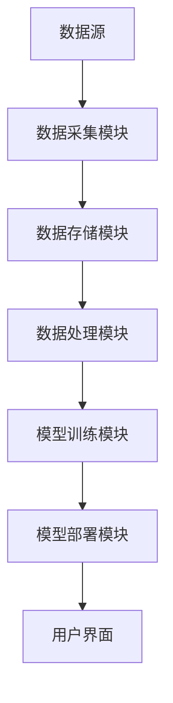

                 


# 机器学习辅助公司品牌价值量化

> 关键词：机器学习，品牌价值，量化分析，算法实现，系统设计

> 摘要：本文探讨了机器学习如何辅助公司品牌价值的量化分析。首先介绍了品牌价值量化的重要性及其面临的挑战，然后深入分析了机器学习在品牌价值量化中的核心概念与算法原理，最后通过实际案例展示了如何利用机器学习实现品牌价值的量化，并提出了相关的最佳实践建议。

---

# 第1章: 机器学习辅助品牌价值量化背景

## 1.1 品牌价值量化的重要性

### 1.1.1 品牌价值的定义
品牌价值是指品牌为企业或组织带来的经济价值和市场影响力。它是企业核心竞争力的重要组成部分，直接影响企业的市场地位和盈利能力。

### 1.1.2 品牌价值量化的主要挑战
1. **数据多样性**：品牌价值的影响因素包括市场表现、消费者行为、品牌知名度等，这些数据通常来自多个渠道，难以统一处理。
2. **数据质量和完整性**：品牌数据可能存在缺失、噪声或偏差，影响模型的准确性。
3. **动态变化**：品牌价值受市场环境和消费者偏好的影响，具有动态变化的特点，需要实时或定期更新模型。

### 1.1.3 机器学习在品牌价值量化中的作用
1. **数据处理能力**：机器学习能够处理大量异构数据，提取有价值的信息。
2. **预测能力**：通过训练模型，机器学习可以预测品牌价值的变化趋势。
3. **动态调整能力**：机器学习模型能够根据实时数据动态调整预测结果，保持模型的准确性。

## 1.2 机器学习的基本概念

### 1.2.1 监督学习与无监督学习
1. **监督学习**：基于 labeled 数据进行训练，预测新的数据点。例如，使用线性回归模型预测品牌价值。
2. **无监督学习**：基于 unlabeled 数据进行训练，发现数据中的隐含结构。例如，使用聚类算法将品牌分为不同类别。

### 1.2.2 常见机器学习算法
1. **线性回归**：用于预测连续型变量，如品牌价值。
2. **随机森林**：用于分类和回归问题，能够处理高维数据。
3. **神经网络**：用于复杂非线性关系的建模，如深度学习模型。

## 1.3 品牌价值量化的核心要素

### 1.3.1 品牌价值的构成要素
1. **品牌知名度**：品牌在市场中的认知度和曝光度。
2. **品牌忠诚度**：消费者对品牌的偏好和忠诚程度。
3. **品牌强度**：品牌在市场中的竞争力和抗风险能力。
4. **市场表现**：品牌的销售额、市场份额等指标。

### 1.3.2 品牌价值量化的主要指标
1. **品牌价值指数**：通过量化指标对品牌价值进行评估。
2. **品牌强度指数**：衡量品牌在市场中的竞争力。
3. **品牌风险指数**：评估品牌面临的潜在风险。

### 1.3.3 品牌价值量化的基本数学模型
$$
\text{品牌价值} = \beta_0 + \beta_1 \times \text{品牌知名度} + \beta_2 \times \text{品牌忠诚度} + \epsilon
$$
其中，$\beta_0$ 是截距项，$\beta_1$ 和 $\beta_2$ 是回归系数，$\epsilon$ 是误差项。

---

# 第2章: 机器学习算法原理与品牌价值量化

## 2.1 线性回归模型的原理与实现

### 2.1.1 线性回归的基本原理
线性回归是一种简单且常用的回归算法，用于预测连续型变量。其基本假设是因变量与自变量之间存在线性关系。

### 2.1.2 线性回归的数学公式
$$
y = \beta_0 + \beta_1 x + \epsilon
$$
其中，$y$ 是目标变量（品牌价值），$x$ 是自变量（品牌知名度），$\beta_0$ 是截距项，$\beta_1$ 是回归系数，$\epsilon$ 是误差项。

### 2.1.3 线性回归的实现步骤
1. **数据预处理**：清洗数据，处理缺失值和异常值。
2. **特征提取**：选择相关特征，如品牌知名度和品牌忠诚度。
3. **模型训练**：使用最小二乘法估计回归系数。
4. **模型评估**：计算模型的均方误差（MSE）和决定系数 $R^2$。

## 2.2 随机森林模型的原理与实现

### 2.2.1 随机森林的基本原理
随机森林是一种基于决策树的集成学习算法，通过构建多个决策树并进行投票或平均，提高模型的准确性和稳定性。

### 2.2.2 随机森林的数学公式
随机森林没有单一的数学公式，而是通过集成多个决策树的预测结果来提高模型性能。

### 2.2.3 随机森林的实现步骤
1. **数据预处理**：清洗数据，处理缺失值和异常值。
2. **特征提取**：选择相关特征，如品牌知名度、市场表现等。
3. **模型训练**：使用随机森林算法训练模型。
4. **模型评估**：计算模型的准确率和 F1 分数。

## 2.3 深度学习模型的原理与实现

### 2.3.1 深度学习的基本原理
深度学习是一种基于人工神经网络的机器学习算法，通过多层非线性变换提取数据的高层次特征。

### 2.3.2 深度学习的数学公式
深度学习模型通常涉及多个隐藏层，其数学公式较为复杂，通常表示为：
$$
y = f(x, \theta)
$$
其中，$x$ 是输入特征，$\theta$ 是模型参数，$f$ 是深度神经网络模型。

### 2.3.3 深度学习的实现步骤
1. **数据预处理**：清洗数据，处理缺失值和异常值。
2. **特征提取**：选择相关特征，如品牌知名度、市场表现等。
3. **模型训练**：使用深度学习框架（如 TensorFlow 或 PyTorch）训练模型。
4. **模型评估**：计算模型的准确率和损失函数值。

---

# 第3章: 机器学习算法实现与品牌价值量化

## 3.1 线性回归模型的实现

### 3.1.1 数据预处理
```python
import pandas as pd
import numpy as np
from sklearn.linear_model import LinearRegression
from sklearn.metrics import mean_squared_error, r2_score

# 加载数据
data = pd.read_csv('brand_value.csv')

# 数据清洗
data = data.dropna()
data = data.drop_duplicates()

# 特征提取
X = data[['品牌知名度', '品牌忠诚度']]
y = data['品牌价值']

# 数据标准化
from sklearn.preprocessing import StandardScaler
scaler = StandardScaler()
X_scaled = scaler.fit_transform(X)
```

### 3.1.2 模型训练
```python
# 训练模型
model = LinearRegression()
model.fit(X_scaled, y)

# 预测结果
y_pred = model.predict(X_scaled)
```

### 3.1.3 模型评估
```python
# 计算均方误差和决定系数
mse = mean_squared_error(y, y_pred)
r2 = r2_score(y, y_pred)

print(f'均方误差: {mse}')
print(f'决定系数: {r2}')
```

## 3.2 随机森林模型的实现

### 3.2.1 数据预处理
```python
from sklearn.ensemble import RandomForestRegressor
from sklearn.model_selection import train_test_split

# 加载数据
data = pd.read_csv('brand_value.csv')

# 数据清洗
data = data.dropna()
data = data.drop_duplicates()

# 特征提取
X = data[['品牌知名度', '品牌忠诚度', '市场表现']]
y = data['品牌价值']

# 划分训练集和测试集
X_train, X_test, y_train, y_test = train_test_split(X, y, test_size=0.2, random_state=42)
```

### 3.2.2 模型训练
```python
# 训练模型
model = RandomForestRegressor(n_estimators=100, random_state=42)
model.fit(X_train, y_train)

# 预测结果
y_pred = model.predict(X_test)
```

### 3.2.3 模型评估
```python
# 计算均方误差和准确率
mse = mean_squared_error(y_test, y_pred)
r2 = r2_score(y_test, y_pred)

print(f'均方误差: {mse}')
print(f'决定系数: {r2}')
```

## 3.3 深度学习模型的实现

### 3.3.1 数据预处理
```python
import tensorflow as tf
from tensorflow.keras import layers

# 加载数据
data = pd.read_csv('brand_value.csv')

# 数据清洗
data = data.dropna()
data = data.drop_duplicates()

# 特征提取
X = data[['品牌知名度', '品牌忠诚度', '市场表现']]
y = data['品牌价值']

# 划分训练集和测试集
X_train = X.values
y_train = y.values
X_test = X.values
y_test = y.values
```

### 3.3.2 模型训练
```python
# 构建模型
model = tf.keras.Sequential()
model.add(layers.Dense(64, activation='relu', input_shape=(3,)))
model.add(layers.Dense(1))

# 编译模型
model.compile(optimizer='adam', loss='mean_squared_error')

# 训练模型
model.fit(X_train, y_train, epochs=100, batch_size=32)
```

### 3.3.3 模型评估
```python
# 预测结果
y_pred = model.predict(X_test)

# 计算均方误差
mse = tf.keras.metrics.mean_squared_error(y_test, y_pred)
print(f'均方误差: {mse}')
```

---

# 第4章: 机器学习算法优化与品牌价值量化

## 4.1 超参数调优

### 4.1.1 线性回归模型的超参数
线性回归模型通常没有超参数，但可以通过正则化（如 Lasso 或 Ridge 回归）来优化模型。

### 4.1.2 随机森林模型的超参数
随机森林模型的超参数包括树的数量（n_estimators）、最大深度（max_depth）、最小样本数（min_samples_split）等。

### 4.1.3 深度学习模型的超参数
深度学习模型的超参数包括神经元数量、学习率、批量大小、 epochs 等。

## 4.2 模型评估与部署

### 4.2.1 模型评估指标
1. **均方误差（MSE）**：衡量预测值与真实值之间的差异。
2. **决定系数（R²）**：衡量模型的解释能力。
3. **准确率**：分类模型的准确率。

### 4.2.2 模型部署
1. **API 接口**：将模型部署为 REST API，供其他系统调用。
2. **实时预测**：通过 Web 界面或命令行工具实时预测品牌价值。

---

# 第5章: 机器学习辅助品牌价值量化系统设计

## 5.1 系统架构设计

### 5.1.1 系统功能模块
1. **数据采集模块**：从多种数据源采集品牌相关数据。
2. **数据处理模块**：清洗和预处理数据。
3. **模型训练模块**：训练机器学习模型。
4. **模型部署模块**：将模型部署为服务，供其他系统调用。

### 5.1.2 系统架构图


## 5.2 系统实现

### 5.2.1 数据采集模块
```python
import requests
from bs4 import BeautifulSoup

# 从网页采集数据
def scrape_data(url):
    response = requests.get(url)
    soup = BeautifulSoup(response.text, 'html.parser')
    # 提取数据并保存到 CSV 文件
    data = []
    # 具体的网页解析逻辑
    with open('brand_data.csv', 'w') as f:
        f.write('品牌, 市场表现\n')
        for item in soup.find_all('div', class_='brand-item'):
            brand = item.find('h2').text
            performance = item.find('p').text
            f.write(f'{brand},{performance}\n')
```

### 5.2.2 数据处理模块
```python
import pandas as pd
from sklearn.preprocessing import StandardScaler

# 加载数据
data = pd.read_csv('brand_data.csv')

# 数据清洗
data = data.dropna()
data = data.drop_duplicates()

# 特征提取
X = data[['品牌', '市场表现']]
y = data['品牌价值']

# 数据标准化
scaler = StandardScaler()
X_scaled = scaler.fit_transform(X)
```

### 5.2.3 模型训练模块
```python
from sklearn.linear_model import LinearRegression

# 训练模型
model = LinearRegression()
model.fit(X_scaled, y)

# 预测结果
y_pred = model.predict(X_scaled)
```

---

# 第6章: 机器学习辅助品牌价值量化实战

## 6.1 项目实战

### 6.1.1 数据集准备
```python
import pandas as pd

# 加载数据集
data = pd.read_csv('brand_value.csv')

# 查看数据集的前几行
print(data.head())
```

### 6.1.2 模型实现
```python
from sklearn.ensemble import RandomForestRegressor
from sklearn.model_selection import train_test_split

# 数据预处理
X = data[['品牌知名度', '品牌忠诚度', '市场表现']]
y = data['品牌价值']

# 划分训练集和测试集
X_train, X_test, y_train, y_test = train_test_split(X, y, test_size=0.2, random_state=42)

# 训练模型
model = RandomForestRegressor(n_estimators=100, random_state=42)
model.fit(X_train, y_train)

# 预测结果
y_pred = model.predict(X_test)

# 计算均方误差和决定系数
from sklearn.metrics import mean_squared_error, r2_score

mse = mean_squared_error(y_test, y_pred)
r2 = r2_score(y_test, y_pred)

print(f'均方误差: {mse}')
print(f'决定系数: {r2}')
```

---

# 第7章: 总结与展望

## 7.1 本章小结
通过本文的探讨，我们了解了机器学习在品牌价值量化中的重要作用，学习了多种机器学习算法的原理与实现，并通过实际案例展示了如何利用机器学习技术实现品牌价值的量化分析。

## 7.2 最佳实践 Tips
1. **数据预处理**：确保数据的高质量是模型准确性的基础。
2. **特征工程**：合理选择和处理特征能够显著提高模型性能。
3. **模型调优**：通过超参数调优和交叉验证优化模型性能。
4. **模型解释性**：选择合适的模型解释方法，帮助理解模型的决策过程。

## 7.3 未来展望
随着机器学习技术的不断发展，品牌价值量化将更加精准和实时化。未来的研究方向包括：
1. **深度学习的应用**：探索深度学习模型在品牌价值量化中的潜力。
2. **实时预测**：实现品牌价值的实时预测，及时应对市场变化。
3. **多模态数据融合**：结合文本、图像等多种数据源，提升品牌价值量化的精度。

---

# 作者：AI天才研究院/AI Genius Institute & 禅与计算机程序设计艺术 /Zen And The Art of Computer Programming

