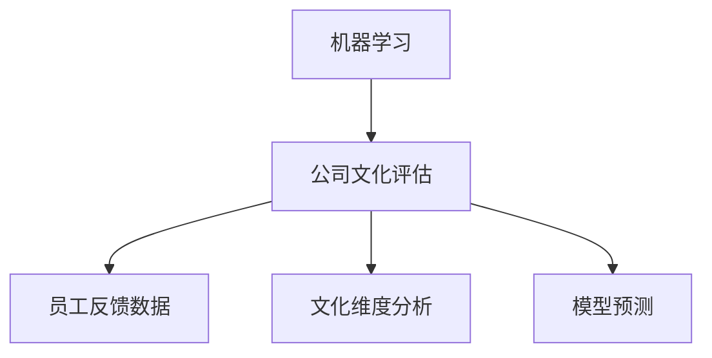
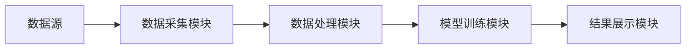
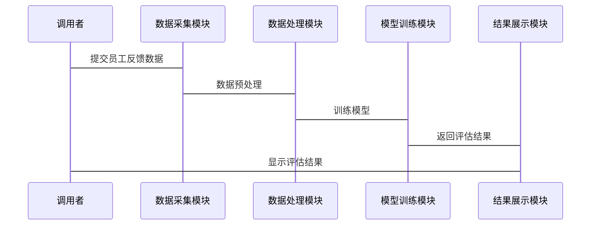

                 


# 机器学习辅助公司文化评估

> 关键词：机器学习，公司文化评估，员工反馈，数据分析，文化维度

> 摘要：本文探讨了机器学习在公司文化评估中的应用，分析了其核心概念、算法原理、系统架构，并通过项目实战展示了如何利用机器学习模型辅助公司文化评估，为公司管理层和HR提供了实用的工具和方法。

---

# 第一部分: 机器学习辅助公司文化评估的背景与核心概念

## 第1章: 机器学习与公司文化评估的背景

### 1.1 机器学习的概述

#### 1.1.1 机器学习的基本概念
机器学习是一种人工智能技术，通过数据驱动的方式训练模型，使其能够从数据中学习并做出预测或决策。其核心在于通过算法分析和挖掘数据中的模式和关系，从而实现自动化学习和优化。

#### 1.1.2 机器学习的核心算法
常用算法包括：
- **监督学习**：如线性回归、支持向量机（SVM）、随机森林。
- **无监督学习**：如聚类（K-means）、降维（主成分分析，PCA）。
- **自然语言处理（NLP）**：如词袋模型、TF-IDF、神经网络模型（如BERT）。

#### 1.1.3 机器学习的应用领域
机器学习在多个领域都有广泛应用，包括金融、医疗、教育和企业级应用。在企业级应用中，机器学习可以用于员工绩效预测、招聘筛选和文化评估。

### 1.2 公司文化评估的背景

#### 1.2.1 公司文化的定义与重要性
公司文化是指企业在运营过程中形成的价值观、行为准则和工作方式。良好的公司文化可以提高员工满意度、降低流失率并提升整体绩效。

#### 1.2.2 公司文化评估的常见方法
传统方法包括：
- **问卷调查**：收集员工对文化维度的评价。
- **焦点小组**：通过讨论分析文化问题。
- **文化审计**：评估现有文化和目标之间的差距。

#### 1.2.3 传统公司文化评估的局限性
传统方法存在主观性高、数据量小、分析深度不足的问题，难以量化和预测文化趋势。

### 1.3 机器学习在公司文化评估中的应用前景

#### 1.3.1 机器学习的优势与潜力
机器学习能够处理大量数据，发现隐藏模式，提供客观的评估结果。它还可以实时更新模型，适应文化变化。

#### 1.3.2 机器学习在公司文化评估中的具体应用
- **情感分析**：分析员工反馈中的情感倾向。
- **聚类分析**：将员工分为不同的文化群体。
- **预测模型**：预测文化变化对公司绩效的影响。

#### 1.3.3 机器学习辅助公司文化评估的挑战
- 数据隐私问题。
- 模型解释性不足。
- 数据质量和完整性的影响。

## 第2章: 机器学习辅助公司文化评估的核心概念

### 2.1 核心概念与联系

#### 2.1.1 核心概念的定义与属性特征对比
| 概念 | 属性 |
|------|------|
| 机器学习 | 数据驱动、模型训练、预测 |
| 公司文化评估 | 文化维度、员工反馈、数据分析 |

#### 2.1.2 实体关系图


### 2.2 机器学习算法在公司文化评估中的应用

#### 2.2.1 常用算法介绍
- **聚类算法**：用于将员工反馈分为不同类别。
- **分类算法**：用于预测文化问题的严重性。
- **自然语言处理**：分析文本数据中的情感和主题。

#### 2.2.2 算法选择与优化
选择算法时需考虑数据类型、模型复杂度和计算资源。例如，聚类适用于无标签数据，分类适用于有标签数据。

#### 2.2.3 算法的优缺点对比
| 算法 | 优点 | 缺点 |
|------|------|------|
| 聚类 | 发现隐藏结构 | 结果解释性差 |
| 分类 | 明确预测结果 | 需大量标注数据 |
| NLP | 处理非结构化数据 | 计算资源消耗大 |

### 2.3 数据预处理与特征工程

#### 2.3.1 数据清洗与标准化
- 清洗：去除重复、错误数据。
- 标准化：将数据归一化处理。

#### 2.3.2 特征提取与选择
- 使用TF-IDF提取文本特征。
- 采用主成分分析（PCA）降维。

#### 2.3.3 数据增强与降维
- 数据增强：增加数据多样性。
- 降维：减少特征维度，提高计算效率。

## 第3章: 机器学习辅助公司文化评估的算法原理

### 3.1 常用算法的原理与流程

#### 3.1.1 聚类算法

##### 3.1.1.1 原理
聚类算法通过最大化类内相似性和最小化类间相似性，将数据分为若干簇。

##### 3.1.1.2 代码实现
```python
from sklearn.cluster import KMeans
from sklearn.preprocessing import StandardScaler

# 数据预处理
scaler = StandardScaler()
X_scaled = scaler.fit_transform(X)

# 聚类
kmeans = KMeans(n_clusters=3, random_state=42)
kmeans.fit(X_scaled)
```

##### 3.1.1.3 公式
$$ 聚类目标函数：\sum_{i=1}^{k} \sum_{j=1}^{n_i} ||x_j - c_i||^2 $$

#### 3.1.2 分类算法

##### 3.1.2.1 原理
分类算法通过训练模型，将数据分为已知类别。

##### 3.1.2.2 代码实现
```python
from sklearn.svm import SVC

# 训练模型
model = SVC(C=1.0, kernel='rbf', gamma='auto')
model.fit(X_train, y_train)
```

##### 3.1.2.3 公式
$$ 分类损失函数：L(y, y_{pred}) = \sum_{i=1}^{m} (y_i - y_{pred,i})^2 $$

#### 3.1.3 自然语言处理算法

##### 3.1.3.1 原理
NLP通过处理文本数据，提取情感和主题信息。

##### 3.1.3.2 代码实现
```python
from sklearn.feature_extraction.text import TfidfVectorizer

# 提取TF-IDF特征
vectorizer = TfidfVectorizer(max_features=500)
X_tfidf = vectorizer.fit_transform(corpus)
```

##### 3.1.3.3 公式
$$ TF-IDF计算：TF(t, d) = \frac{\text{词t在文档d中的词频}}{\text{词t在所有文档中的词频}} $$

### 3.2 算法的数学模型与公式

#### 3.2.1 聚类算法的数学模型
$$ 聚类目标函数：\sum_{i=1}^{k} \sum_{j=1}^{n_i} ||x_j - c_i||^2 $$

#### 3.2.2 分类算法的数学模型
$$ 分类损失函数：L(y, y_{pred}) = \sum_{i=1}^{m} (y_i - y_{pred,i})^2 $$

#### 3.2.3 自然语言处理算法的数学模型
$$ TF-IDF计算：TF(t, d) = \frac{\text{词t在文档d中的词频}}{\text{词t在所有文档中的词频}} $$

### 3.3 算法的优缺点对比

| 算法 | 优点 | 缺点 |
|------|------|------|
| 聚类 | 发现隐藏结构 | 结果解释性差 |
| 分类 | 明确预测结果 | 需大量标注数据 |
| NLP | 处理非结构化数据 | 计算资源消耗大 |

---

# 第二部分: 系统分析与架构设计

## 第4章: 机器学习辅助公司文化评估的系统分析

### 4.1 系统分析与架构设计

#### 4.1.1 问题场景介绍
公司希望通过机器学习模型分析员工反馈，评估公司文化健康状况，并提供改进建议。

#### 4.1.2 系统功能设计
- 数据采集模块：收集员工反馈数据。
- 数据处理模块：清洗和预处理数据。
- 模型训练模块：训练机器学习模型。
- 结果展示模块：可视化分析结果。

#### 4.1.3 系统架构设计


#### 4.1.4 系统接口设计
- 数据接口：API接收员工反馈数据。
- 模型接口：API提供文化评估结果。

#### 4.1.5 系统交互流程


---

# 第三部分: 项目实战

## 第5章: 机器学习辅助公司文化评估的项目实战

### 5.1 环境安装与数据准备

#### 5.1.1 环境安装
安装Python、Scikit-learn、NLTK、Mermaid等工具。

#### 5.1.2 数据准备
从数据库或问卷调查中获取员工反馈数据，进行清洗和预处理。

### 5.2 系统核心实现

#### 5.2.1 数据处理模块
编写代码清洗数据，提取特征。

```python
import pandas as pd
from sklearn.preprocessing import StandardScaler

# 数据清洗
df = pd.read_csv('employee_survey.csv')
df.dropna(inplace=True)

# 特征提取
X = df[['question1', 'question2', 'question3']]
scaler = StandardScaler()
X_scaled = scaler.fit_transform(X)
```

#### 5.2.2 模型训练模块
训练聚类或分类模型。

```python
from sklearn.cluster import KMeans

# 聚类模型训练
kmeans = KMeans(n_clusters=3, random_state=42)
kmeans.fit(X_scaled)
```

#### 5.2.3 结果展示模块
可视化分析结果，生成报告。

```python
from sklearn.metrics import silhouette_score
import matplotlib.pyplot as plt

# 可视化聚类结果
plt.figure(figsize=(10,7))
plt.scatter(X_scaled[:,0], X_scaled[:,1], c=kmeans.labels_, cmap='viridis')
plt.xlabel('Feature 1')
plt.ylabel('Feature 2')
plt.show()
```

### 5.3 实际案例分析

#### 5.3.1 数据分析
分析员工满意度、文化认同度等指标，发现潜在问题。

#### 5.3.2 模型预测
预测文化趋势，评估文化健康状况。

#### 5.3.3 案例总结
总结分析结果，提出改进建议，如优化沟通机制、提升领导力等。

### 5.4 项目总结

#### 5.4.1 项目成果
成功开发了一个机器学习辅助公司文化评估系统，提高了评估的客观性和准确性。

#### 5.4.2 经验与教训
数据质量和模型解释性是关键，需加强数据清洗和结果解释。

---

# 第四部分: 最佳实践与小结

## 第6章: 机器学习辅助公司文化评估的最佳实践

### 6.1 项目小结

#### 6.1.1 核心知识点总结
- 机器学习的基本概念和算法。
- 数据预处理和特征工程。
- 机器学习模型在公司文化评估中的应用。

#### 6.1.2 项目经验总结
- 数据质量直接影响模型效果。
- 模型解释性需加强，便于用户理解。
- 需结合业务背景，选择合适的算法和模型。

### 6.2 注意事项与建议

#### 6.2.1 数据隐私保护
确保员工数据的安全和隐私，遵守相关法律法规。

#### 6.2.2 模型的可解释性
通过可视化和解释工具，提高模型的透明度和可信度。

#### 6.2.3 持续优化
定期更新模型，适应公司文化的变化。

### 6.3 拓展阅读与学习资源

#### 6.3.1 推荐书籍
- 《机器学习实战》
- 《自然语言处理入门》

#### 6.3.2 在线课程
- Coursera上的《机器学习专项课程》
- edX上的《文化管理与领导力》

---

# 作者

作者：AI天才研究院/AI Genius Institute & 禅与计算机程序设计艺术 /Zen And The Art of Computer Programming

---

# 结语

通过本文的详细讲解，我们了解了机器学习在公司文化评估中的潜力和应用。从理论到实践，从算法到系统架构，机器学习为公司文化评估提供了强大的工具和方法。希望本文能为公司管理层和HR部门提供有价值的参考和启示，帮助他们更好地理解和优化公司文化。

