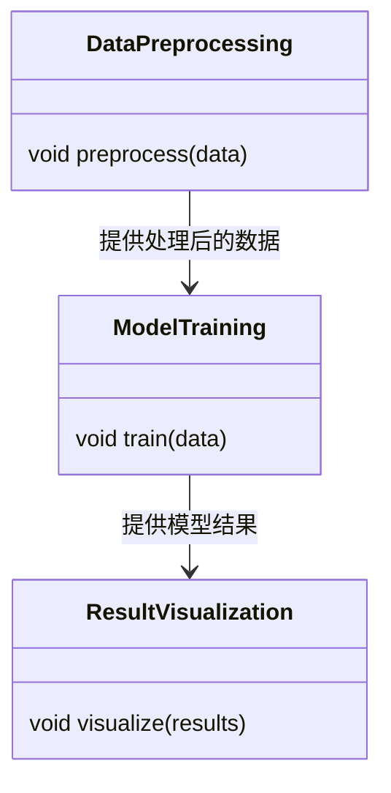
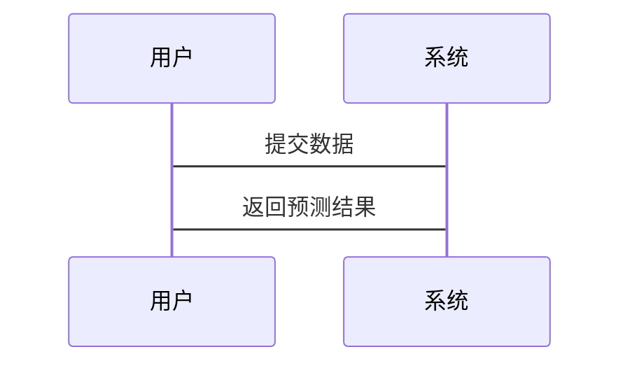

                 


# 机器学习辅助公司研发效率评估

## 关键词：机器学习，研发效率评估，算法原理，系统架构，项目实战

## 摘要：
本文探讨了机器学习在公司研发效率评估中的应用。通过分析研发效率的核心概念、常见指标及机器学习算法的原理，构建了一个完整的评估模型。详细讲解了系统架构设计、项目实战及最佳实践，为读者提供了全面的技术指导。

---

# 第1章：机器学习与研发效率评估的背景

## 1.1 机器学习的概述
### 1.1.1 机器学习的基本概念
机器学习是一种人工智能技术，通过数据训练模型，使其能够从经验中学习并做出预测或决策。其核心在于数据分析和模式识别，广泛应用于分类、回归和聚类等问题。

### 1.1.2 机器学习的核心算法
- **监督学习**：如线性回归、支持向量机（SVM）。
- **无监督学习**：如聚类（K-means）、降维（PCA）。
- **集成学习**：如随机森林、梯度提升树（GBDT）。

### 1.1.3 机器学习的应用领域
包括自然语言处理、计算机视觉、金融分析、医疗诊断等领域。在研发效率评估中，主要用于预测项目进度和资源分配。

## 1.2 研发效率评估的背景
### 1.2.1 研发效率的定义
研发效率是指在单位时间内完成高质量研发工作的能力，通常通过项目周期、代码质量、团队协作等指标衡量。

### 1.2.2 研发效率评估的重要性
高效的研发效率能缩短项目周期，降低成本，提升企业竞争力。传统方法依赖人工经验，容易主观且不准确，而机器学习能提供客观、量化的评估。

### 1.2.3 机器学习在研发效率评估中的作用
通过分析历史数据，识别影响效率的关键因素，优化资源配置，预测项目风险，辅助决策。

## 1.3 问题背景与问题描述
### 1.3.1 研发效率评估的挑战
- 数据多样性与不平衡性。
- 高维数据处理复杂性。
- 模型泛化能力不足。

### 1.3.2 机器学习如何解决这些问题
利用算法处理复杂数据，提取特征，建立预测模型，提供科学依据。

### 1.3.3 问题的边界与外延
专注于代码质量和项目进度预测，不涉及具体项目管理流程。

## 1.4 核心概念与联系
### 1.4.1 核心概念原理
- **数据预处理**：清洗和特征提取。
- **模型训练**：选择合适算法，调整参数。
- **结果评估**：通过准确率、F1分数等指标衡量。

### 1.4.2 指标对比表格
| 指标 | 定义 | 示例 |
|------|------|------|
| 代码质量 | 代码的可维护性和正确性 | 行为覆盖率、代码复杂度 |
| 项目进度 | 项目完成的时间 | 开发周期、任务完成率 |

### 1.4.3 ER实体关系图
```mermaid
erDiagram
    DEPARTMENT {
        depart_id
        depart_name
    }
    EMPLOYEE {
        emp_id
        emp_name
        emp_role
    }
    PROJECT {
        proj_id
        proj_name
        proj_start
        proj_end
    }
    DEPARTMENT --> EMPLOYEE : 所属部门
    EMPLOYEE --> PROJECT : 参与项目
```

---

# 第2章：研发效率评估的核心概念

## 2.1 研发效率评估的定义与指标
### 2.1.1 研发效率的定义
通过量化指标评估研发团队的产出与质量。

### 2.1.2 常见的评估指标
- 代码提交频率。
- 代码审查通过率。
- 项目按时完成率。

### 2.1.3 指标之间的关系与影响
代码质量高通常会减少后期修复时间，提高整体效率。

## 2.2 机器学习在研发效率评估中的应用
### 2.2.1 数据采集与处理
从版本控制系统（如Git）、项目管理工具（如Jira）获取数据，清洗和预处理。

### 2.2.2 特征提取与选择
提取代码复杂度、团队规模等特征，使用主成分分析（PCA）降维。

### 2.2.3 模型训练与评估
训练回归模型预测项目完成时间，使用均方误差（MSE）评估模型。

## 2.3 研发效率评估的系统架构
### 2.3.1 系统功能设计
- 数据采集模块。
- 特征工程模块。
- 模型训练模块。

### 2.3.2 系统架构设计


### 2.3.3 系统接口设计
API接口用于数据输入和结果输出，便于集成到现有系统中。

---

# 第3章：机器学习算法原理

## 3.1 常用机器学习算法概述
### 3.1.1 线性回归
用于预测连续型变量，如项目完成时间。

### 3.1.2 支持向量机（SVM）
适用于分类问题，如代码质量评估。

### 3.1.3 随机森林
适用于特征重要性分析和分类任务。

## 3.2 算法原理与数学模型
### 3.2.1 线性回归的数学模型
$$ y = \beta_0 + \beta_1x + \epsilon $$

### 3.2.2 支持向量机的数学模型
$$ \text{最大化} \sum_{i=1}^n \xi_i $$

### 3.2.3 随机森林的数学模型
$$ \text{集成学习} $$

## 3.3 算法的实现与应用
### 3.3.1 线性回归的实现
```python
import numpy as np
from sklearn.linear_model import LinearRegression

X = np.array([[1], [2], [3]])
y = np.array([2, 4, 6])
model = LinearRegression().fit(X, y)
print(model.predict([[4]]))  # 输出：[[8.0]]
```

---

# 第4章：系统分析与架构设计

## 4.1 系统分析
### 4.1.1 问题场景介绍
利用机器学习模型预测项目完成时间，优化资源分配。

### 4.1.2 系统功能设计
- 数据预处理：清洗和特征提取。
- 模型训练：选择合适的算法。
- 结果展示：可视化和报告生成。

### 4.1.3 领域模型类图


## 4.2 系统架构设计
### 4.2.1 架构图


## 4.3 接口与交互设计
### 4.3.1 接口设计
提供RESTful API，支持数据输入和结果输出。

### 4.3.2 交互流程


---

# 第5章：项目实战

## 5.1 环境安装
安装必要的库：
```bash
pip install numpy pandas scikit-learn
```

## 5.2 数据准备
从Jira导出项目数据，清洗处理。

## 5.3 核心代码实现
```python
from sklearn.ensemble import RandomForestRegressor
from sklearn.metrics import mean_squared_error

# 数据准备
X = ...  # 特征矩阵
y = ...  # 目标向量

# 模型训练
model = RandomForestRegressor().fit(X, y)

# 预测与评估
y_pred = model.predict(X)
print(mean_squared_error(y, y_pred))
```

## 5.4 案例分析
分析某项目的数据，预测完成时间，评估模型准确率。

## 5.5 代码实现与分析
详细解释代码实现，分析结果，找出模型的优势和不足。

---

# 第6章：最佳实践与小结

## 6.1 最佳实践
- 数据预处理：确保数据质量。
- 特征工程：选择关键特征。
- 模型调优：使用交叉验证。

## 6.2 小结
机器学习有效提升了研发效率评估的准确性，优化了资源配置。

## 6.3 注意事项
- 数据隐私保护。
- 模型解释性不足，需结合业务背景。

## 6.4 拓展阅读
推荐相关书籍和论文，如《机器学习实战》和《深度学习》。

---

# 附录

## 附录1：数据集格式
提供CSV格式的示例数据，包括项目ID、开始时间、结束时间、代码复杂度等。

## 附录2：工具安装指南
详细说明如何安装和配置开发环境，包括Python版本和库的安装。

---

作者：AI天才研究院 & 禅与计算机程序设计艺术

