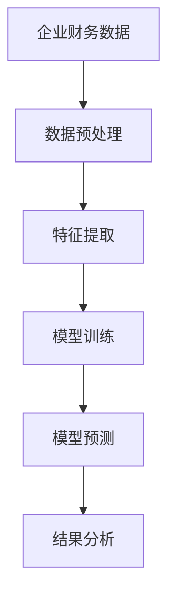
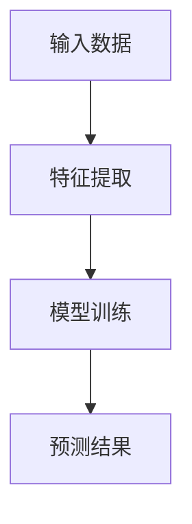
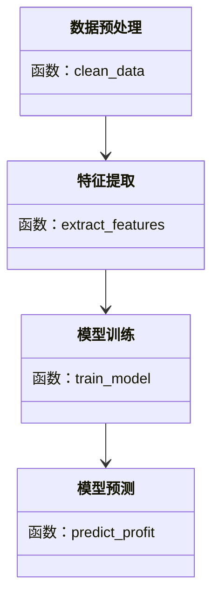
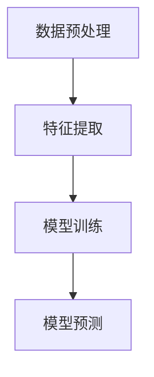
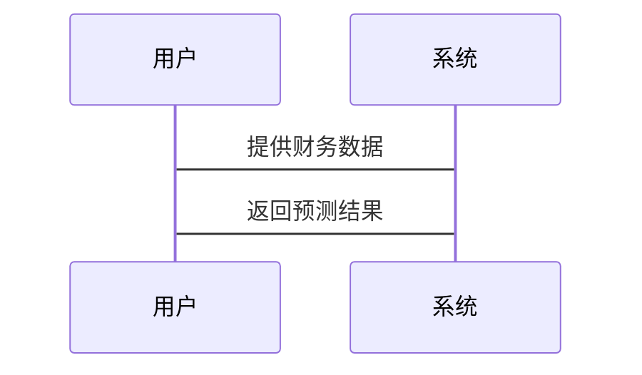

                 


# 机器学习预测公司盈利质量

## 关键词：机器学习，盈利质量预测，企业财务分析，预测模型，算法优化

## 摘要：  
机器学习在企业盈利质量预测中的应用越来越广泛。本文将从机器学习的基本概念出发，逐步深入探讨如何利用机器学习算法预测公司盈利质量。通过分析传统盈利预测方法的局限性，结合机器学习的优势，本文将详细讲解如何构建一个高效的盈利质量预测模型，包括数据预处理、特征工程、算法选择与优化、模型训练与评估等关键步骤。最后，本文还将通过实际案例展示如何将理论应用于实践，并总结机器学习在企业盈利质量预测中的最佳实践和未来研究方向。

---

# 第一部分：机器学习与盈利质量预测概述

## 第1章：机器学习与盈利质量预测概述

### 1.1 机器学习的基本概念

#### 1.1.1 机器学习的定义
机器学习是一种人工智能技术，通过算法和数据训练模型，使模型能够从数据中学习并做出预测或决策。其核心在于通过数据找到模式和规律，而不是依赖于显式的编程规则。

#### 1.1.2 盈利质量预测的定义
盈利质量预测是指通过对企业的历史财务数据、市场环境、行业趋势等多方面信息进行分析，预测企业在未来一段时间内的盈利能力和质量。盈利质量不仅关注企业的盈利能力，还关注盈利的可持续性和稳定性。

#### 1.1.3 机器学习在盈利质量预测中的作用
机器学习能够处理海量数据，并从中提取复杂的模式，这使得它在盈利质量预测中具有独特的优势。通过机器学习模型，可以更准确地预测企业的盈利趋势，帮助企业做出更明智的决策。

### 1.2 盈利质量预测的背景与意义

#### 1.2.1 企业盈利预测的重要性
企业盈利预测是财务管理中的重要环节，能够帮助企业制定合理的财务计划、投资决策和风险管理策略。准确的盈利预测能够帮助企业在激烈的市场竞争中占据优势。

#### 1.2.2 传统盈利预测方法的局限性
传统的盈利预测方法主要依赖于财务报表分析和经验判断，这种方法主观性强、效率低，且难以应对复杂多变的市场环境。

#### 1.2.3 机器学习在盈利预测中的优势
机器学习能够处理非结构化数据，具有高效率和高准确性。通过机器学习模型，可以更好地捕捉市场变化和企业内部运营的动态，从而提高盈利预测的准确性。

### 1.3 本书的核心内容与目标

#### 1.3.1 本书的核心目标
本书旨在通过机器学习技术，系统地介绍如何构建一个高效的公司盈利质量预测模型，并通过实际案例展示其应用。

#### 1.3.2 本书的主要内容
- 介绍机器学习的基本概念和核心算法；
- 探讨盈利质量预测的核心概念和指标；
- 详细讲解机器学习在盈利质量预测中的应用流程；
- 通过实际案例展示如何构建和优化盈利质量预测模型。

#### 1.3.3 本书的读者群体
本书适合对机器学习和企业财务管理感兴趣的学生、研究人员和从业者阅读。

---

# 第二部分：机器学习算法与盈利质量预测的核心概念

## 第2章：盈利质量预测的核心概念与联系

### 2.1 盈利质量预测的核心概念

#### 2.1.1 盈利质量的定义与指标
盈利质量是指企业在一定时期内实现的盈利能力和盈利的可持续性。常见的盈利质量指标包括净利润率、总资产周转率、资本回报率等。

#### 2.1.2 机器学习中的特征工程
特征工程是机器学习中的关键步骤，通过对原始数据进行特征选择、特征提取和特征变换，可以提高模型的性能和准确性。

#### 2.1.3 数据预处理与特征提取
数据预处理包括数据清洗、数据标准化和数据转换等步骤。特征提取则是从原始数据中提取有用的特征，以便更好地训练模型。

### 2.2 核心概念之间的联系

#### 2.2.1 盈利质量预测的流程图


#### 2.2.2 盈利质量预测的ER实体关系图
```mermaid
entity 财务数据 {
    id: string
    revenue: float
    profit: float
    industry: string
}
```

---

# 第三部分：机器学习算法原理与数学模型

## 第3章：机器学习算法原理

### 3.1 监督学习算法

#### 3.1.1 线性回归
线性回归是一种简单而强大的回归算法，适用于预测连续型目标变量。其数学模型如下：
$$y = \beta_0 + \beta_1x + \epsilon$$
其中，$y$ 是目标变量，$x$ 是特征变量，$\beta_0$ 和 $\beta_1$ 是模型参数，$\epsilon$ 是误差项。

#### 3.1.2 支持向量机
支持向量机（SVM）是一种监督学习算法，适用于分类和回归问题。其核心思想是通过找到一个超平面，将数据点分割成不同的类别。

#### 3.1.3 随机森林
随机森林是一种基于决策树的集成学习算法，通过构建多个决策树并进行投票或平均，可以提高模型的准确性和鲁棒性。

### 3.2 算法原理与流程图

#### 3.2.1 线性回归的流程图


### 3.3 数学模型与公式

#### 3.3.1 线性回归的数学模型
$$y = \beta_0 + \beta_1x + \epsilon$$

#### 3.3.2 随机森林的数学模型
$$y = \sum_{i=1}^{n} \text{Tree}(x)_i$$

### 3.4 算法对比与选择

#### 3.4.1 算法对比表格
| 算法 | 优点 | 缺点 |
|------|------|------|
| 线性回归 | 简单易懂，计算速度快 | 无法处理非线性关系 |
| 支持向量机 | 高准确性，适合小规模数据 | 参数选择复杂 |
| 随机森林 | 高准确性和鲁棒性 | 计算复杂度高 |

---

# 第四部分：系统分析与架构设计

## 第4章：系统分析与架构设计方案

### 4.1 问题场景介绍
企业需要预测未来一段时间内的盈利质量，以便制定合理的财务计划和投资策略。传统的方法依赖于人工分析，效率低下且准确性不足。

### 4.2 系统功能设计

#### 4.2.1 领域模型（类图）


### 4.3 系统架构设计

#### 4.3.1 系统架构图


### 4.4 系统接口设计

#### 4.4.1 系统交互图


---

# 第五部分：项目实战

## 第5章：项目实战与结果分析

### 5.1 环境安装与配置
- 安装Python和相关库（如NumPy、Pandas、Scikit-learn等）。
- 安装Jupyter Notebook用于数据处理和模型训练。

### 5.2 核心代码实现

#### 5.2.1 数据预处理代码
```python
import pandas as pd
import numpy as np

# 读取数据
data = pd.read_csv('company_financial.csv')

# 数据清洗
data = data.dropna()
data = data.replace([np.inf, -np.inf], np.nan).dropna()

# 标准化处理
from sklearn.preprocessing import StandardScaler
scaler = StandardScaler()
scaled_features = scaler.fit_transform(data[['revenue', 'profit']])
```

#### 5.2.2 模型训练代码
```python
from sklearn.ensemble import RandomForestRegressor
from sklearn.metrics import mean_squared_error

# 特征提取
X = scaled_features
y = data['profit_qua']

# 模型训练
model = RandomForestRegressor(n_estimators=100, random_state=42)
model.fit(X, y)

# 模型预测
y_pred = model.predict(X)
print(mean_squared_error(y, y_pred))
```

### 5.3 实际案例分析
以制造业公司为例，通过收集过去五年的财务数据，构建一个随机森林回归模型，预测未来一年的盈利质量。

### 5.4 代码实现与结果分析
通过代码实现模型训练和预测，并对结果进行分析和可视化。

---

# 第六部分：最佳实践与总结

## 第6章：最佳实践与总结

### 6.1 项目小结
通过机器学习技术，可以有效提高公司盈利质量预测的准确性和效率。随机森林等集成学习算法在处理复杂数据时表现优异，值得在实际应用中优先考虑。

### 6.2 最佳实践 tips
- 数据预处理是关键，尤其是缺失值处理和异常值剔除。
- 特征工程是模型性能提升的重要手段，需要结合业务背景进行特征选择。
- 模型调优时，可以尝试不同的参数组合和算法，选择最适合业务需求的模型。

### 6.3 未来研究方向
- 探索更复杂的深度学习模型在盈利预测中的应用。
- 结合时间序列分析，提高模型对市场变化的适应能力。

---

# 作者：AI天才研究院/AI Genius Institute & 禅与计算机程序设计艺术 /Zen And The Art of Computer Programming

