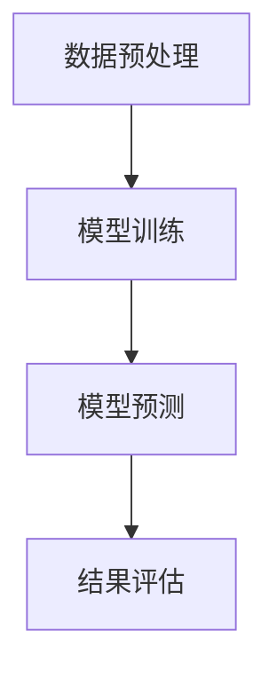
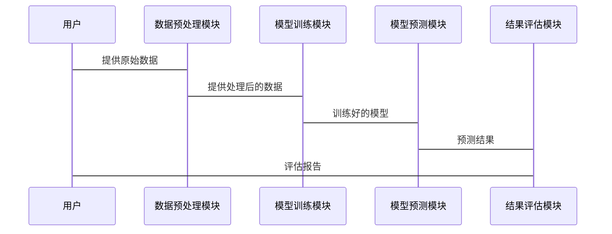

                 


# 机器学习预测公司自由现金流

> 关键词：机器学习，现金流预测，时间序列分析，回归分析，LSTM，随机森林

> 摘要：本文详细探讨了如何利用机器学习技术预测公司自由现金流。通过分析现金流预测的重要性、机器学习在金融领域的应用、各种算法的原理及实现，结合实际案例，展示了如何构建高效准确的现金流预测模型。文章从理论到实践，系统性地讲解了预测过程中的关键步骤和注意事项。

---

## 第1章: 公司自由现金流与机器学习概述

### 1.1 公司自由现金流的定义与重要性

#### 1.1.1 自由现金流的定义
公司自由现金流（Free Cash Flow, FCF）是指公司在扣除所有运营成本、税收和资本支出后的剩余现金流量。公式如下：
$$
FCF = \text{经营活动现金流} - \text{资本支出}
$$

自由现金流是评估企业价值的重要指标，反映了公司产生现金的能力，是投资决策的关键依据。

#### 1.1.2 自由现金流在企业价值评估中的作用
自由现金流用于评估企业的内在价值，帮助投资者判断公司是否值得投资。它也是企业进行资本预算、制定财务策略的重要依据。

#### 1.1.3 自由现金流预测的挑战与意义
现金流预测的挑战包括数据噪声大、时间序列依赖性强、市场波动性高等。准确预测现金流有助于企业优化资金管理、降低财务风险。

---

### 1.2 机器学习在金融预测中的应用

#### 1.2.1 机器学习在金融领域的应用现状
机器学习广泛应用于股票价格预测、信用评分、风险管理等领域。其强大的特征学习能力和非线性建模能力使其成为金融预测的重要工具。

#### 1.2.2 机器学习在现金流预测中的优势
机器学习能够捕捉复杂的非线性关系，处理高维数据，适用于时间序列预测。例如，随机森林和LSTM网络在处理金融数据方面表现优异。

#### 1.2.3 机器学习预测的局限性与改进方向
机器学习模型对数据质量敏感，且解释性较差。未来可以结合领域知识优化模型，如引入经济指标作为特征。

---

### 1.3 本章小结
本章介绍了自由现金流的定义和重要性，探讨了机器学习在金融预测中的应用及优势。接下来将深入分析现金流预测的核心概念和机器学习算法的原理。

---

## 第2章: 核心概念与原理

### 2.1 机器学习与现金流预测的原理

#### 2.1.1 机器学习的基本原理
机器学习通过数据训练模型，学习数据中的模式和特征。监督学习、无监督学习和强化学习是主要的学习范式。

#### 2.1.2 现金流预测的数学模型概述
时间序列模型是现金流预测的核心，常用ARIMA、GARCH等统计模型，以及LSTM、GRU等深度学习模型。

#### 2.1.3 机器学习在时间序列预测中的应用
时间序列数据具有自相关性，机器学习模型能捕捉长期依赖关系，适合处理复杂的金融数据。

---

### 2.2 现金流预测的关键特征分析

#### 2.2.1 现金流的时间序列特征
时间序列数据具有趋势性、周期性和随机性。这些特征影响模型的选择和表现。

#### 2.2.2 机器学习模型的特征工程
特征工程包括特征提取、降维和标准化。有效的特征工程能显著提升模型性能。

#### 2.2.3 现金流预测的特征选择方法
通过相关性分析、主成分分析（PCA）等方法选择重要特征，减少维度，提高模型效率。

---

### 2.3 机器学习模型与现金流预测的关系

#### 2.3.1 线性回归模型与现金流预测
线性回归适用于线性关系，但在现金流预测中表现有限，常用于基准模型。

#### 2.3.2 非线性模型与现金流预测
随机森林和梯度提升树模型能处理复杂的非线性关系，适合处理高维特征。

#### 2.3.3 时间序列模型与现金流预测
LSTM网络擅长处理长期依赖关系，适合时间序列预测，但训练时间较长。

---

### 2.4 本章小结
本章分析了现金流预测的核心概念，探讨了不同模型的特点及适用场景。下文将深入讲解具体算法的原理和实现。

---

## 第3章: 机器学习算法原理

### 3.1 线性回归模型

#### 3.1.1 线性回归的数学模型
线性回归模型公式为：
$$
y = \beta_0 + \beta_1 x_1 + \beta_2 x_2 + \dots + \beta_n x_n + \epsilon
$$

#### 3.1.2 线性回归的实现流程
1. 数据预处理：标准化、缺失值处理。
2. 模型训练：最小二乘法求解系数。
3. 模型评估：均方误差（MSE）、R²指标。

#### 3.1.3 线性回归的优缺点
优点：简单、解释性强；缺点：仅适合线性关系。

---

### 3.2 随机森林模型

#### 3.2.1 随机森林的原理与算法
随机森林是集成学习方法，通过生成多棵决策树并取平均值减少过拟合。

#### 3.2.2 随机森林的实现步骤
1. 数据划分：训练集、测试集。
2. 构建决策树：随机选取特征和样本。
3. 集成预测：投票或平均。

#### 3.2.3 随机森林的优缺点
优点：鲁棒性强、适合高维数据；缺点：解释性差。

---

### 3.3 LSTM神经网络模型

#### 3.3.1 LSTM的基本原理
LSTM通过门控机制处理长期依赖关系，避免梯度消失问题。

#### 3.3.2 LSTM在时间序列预测中的应用
LSTM适合处理时间依赖性较强的数据，如股票价格和现金流预测。

#### 3.3.3 LSTM的优缺点
优点：适合时间序列；缺点：训练时间长、难调参。

---

## 第4章: 系统分析与架构设计

### 4.1 项目背景
现金流预测对企业价值评估和财务决策至关重要，传统方法难以应对复杂金融环境。

### 4.2 系统功能设计

#### 4.2.1 数据预处理模块
- 数据清洗：处理缺失值、异常值。
- 特征工程：提取特征、降维。

#### 4.2.2 模型训练模块
- 算法选择：随机森林、LSTM。
- 超参数调优：网格搜索、随机搜索。

#### 4.2.3 预测与评估模块
- 模型预测：生成预测值。
- 结果评估：计算误差指标。

### 4.3 系统架构设计

#### 4.3.1 系统架构图


### 4.4 接口设计与交互流程图

#### 4.4.1 接口设计
- 输入接口：原始数据、参数设置。
- 输出接口：预测结果、评估指标。

#### 4.4.2 交互流程图


---

## 第5章: 项目实战

### 5.1 环境安装
安装Python和相关库：
```bash
pip install numpy pandas scikit-learn keras tensorflow
```

### 5.2 核心代码实现

#### 5.2.1 数据预处理
```python
import pandas as pd
import numpy as np

# 加载数据
data = pd.read_csv('cash_flow.csv')

# 数据清洗
data = data.dropna()
data = data.replace([np.inf, -np.inf], np.nan).dropna()

# 特征工程
features = data[[' revenue', ' net_income', ' operating_cash_flow']]
labels = data[' free_cash_flow']
```

#### 5.2.2 模型训练
```python
from sklearn.ensemble import RandomForestRegressor
from sklearn.metrics import mean_squared_error

# 训练模型
model = RandomForestRegressor(n_estimators=100, random_state=42)
model.fit(features, labels)

# 预测
predictions = model.predict(features)
print('均方误差:', mean_squared_error(labels, predictions))
```

#### 5.2.3 LSTM模型实现
```python
from keras.models import Sequential
from keras.layers import LSTM, Dense

# 模型构建
model = Sequential()
model.add(LSTM(50, input_shape=(timesteps, features)))
model.add(Dense(1))
model.compile(optimizer='adam', loss='mean_squared_error')

# 训练
model.fit(x_train, y_train, epochs=50, batch_size=32)
```

### 5.3 实际案例分析
通过具体公司的数据，训练模型并预测其未来现金流，评估模型表现。

### 5.4 项目小结
详细总结项目的实施过程、模型选择、优缺点及改进建议。

---

## 第6章: 最佳实践与注意事项

### 6.1 最佳实践
- 数据预处理：确保数据质量，合理处理异常值。
- 模型选择：根据数据特点选择合适算法。
- 结果验证：使用多种指标评估模型性能。

### 6.2 小结
总结全文，强调机器学习在现金流预测中的潜力和应用前景。

### 6.3 注意事项
- 数据隐私：确保数据安全。
- 模型解释性：选择可解释的模型辅助决策。
- 模型更新：定期更新模型，适应市场变化。

### 6.4 拓展阅读
推荐相关书籍和论文，鼓励读者深入学习。

---

## 作者：AI天才研究院/AI Genius Institute & 禅与计算机程序设计艺术 /Zen And The Art of Computer Programming

---

本文系统性地探讨了机器学习在现金流预测中的应用，从理论到实践，详细讲解了模型选择、算法实现和系统设计。希望对读者在实际应用中有所帮助。

