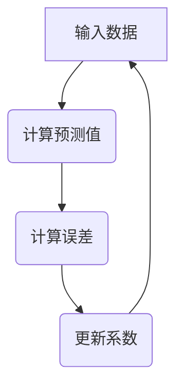
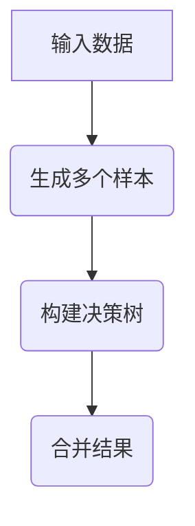
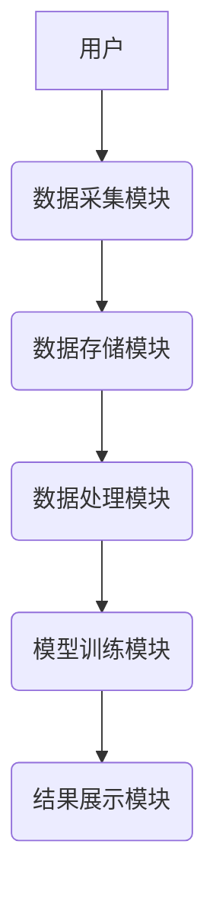

                 


# 机器学习预测公司长期竞争力

> 关键词：机器学习、企业竞争力、预测模型、算法原理、系统架构

> 摘要：本文深入探讨了机器学习在预测公司长期竞争力中的应用，从基本概念到算法实现，再到系统架构和项目实战，全面解析了如何利用机器学习技术来评估和预测企业的长期竞争力。通过具体案例分析和代码实现，展示了机器学习在企业战略决策中的强大潜力。

---

# 第1章 机器学习与企业竞争力概述

## 1.1 机器学习的基本概念

### 1.1.1 机器学习的定义
机器学习是一种人工智能技术，通过算法从数据中学习模式，并用于预测或分类任务。它无需显式编程，而是通过数据训练模型，使其能够自动改进。

### 1.1.2 机器学习的核心特征
- 数据驱动：依赖大量数据进行训练。
- 自动学习：模型能自动优化参数。
- 适应性：能根据新数据调整预测结果。

### 1.1.3 机器学习与传统统计分析的区别
机器学习注重模式识别和数据驱动决策，而传统统计分析更关注假设检验和参数估计。

## 1.2 企业长期竞争力的定义

### 1.2.1 企业竞争力的多维度分析
企业竞争力包括财务表现、市场份额、创新能力、管理能力、客户满意度等多个维度。

### 1.2.2 长期竞争力的影响因素
- 财务状况：如利润、现金流。
- 市场地位：如市场份额、品牌价值。
- 创新能力：如研发投入、专利数量。
- 管理效率：如组织架构、领导能力。
- 客户关系：如客户满意度、客户忠诚度。

### 1.2.3 企业竞争力评估的挑战
数据获取难、模型复杂度高、预测准确性低。

## 1.3 机器学习在企业竞争力预测中的应用

### 1.3.1 数据驱动决策的重要性
通过历史数据和实时数据，机器学习可以帮助企业做出更精准的决策。

### 1.3.2 机器学习在企业分析中的优势
- 处理高维数据能力强。
- 能发现非线性关系。
- 可实时更新模型。

### 1.3.3 机器学习预测的边界与外延
机器学习适用于可量化的因素，但需结合行业知识。

## 1.4 本章小结
本章介绍了机器学习的基本概念，企业竞争力的多维度定义，以及机器学习在企业预测中的应用。

---

# 第2章 机器学习的核心概念与联系

## 2.1 核心概念原理

### 2.1.1 监督学习与非监督学习
- 监督学习：有标签数据，如分类和回归。
- 非监督学习：无标签数据，如聚类。

### 2.1.2 分类与回归任务
- 分类：如判断企业是否成功。
- 回归：如预测企业利润。

### 2.1.3 特征与标签的关系
特征是输入变量，标签是目标输出。

## 2.2 核心概念属性特征对比

### 2.2.1 算法类型对比表格

| 算法类型 | 监督学习 | 非监督学习 |
|----------|----------|------------|
| 示例     | 预测房价 | 聚类客户     |

### 2.2.2 数据特征的维度分析
- 数量：数据点多少。
- 特征数：维度多少。
- 数据类型：数值型、分类型。

### 2.2.3 模型性能的评估指标
- 准确率、召回率、F1值。

## 2.3 ER实体关系图架构

```mermaid
erd
  title 实体关系图
  企业
  竞争力指标
  数据来源
  算法模型
  预测结果
  企业
  竞争力指标
  数据来源
  算法模型
  预测结果
  企业--|>竞争力指标
  竞争力指标--|>数据来源
  数据来源--|>算法模型
  算法模型--|>预测结果
```

## 2.4 本章小结
本章详细讲解了机器学习的核心概念，并通过对比和图表展示了各概念之间的联系。

---

# 第3章 机器学习算法原理与数学模型

## 3.1 算法原理讲解

### 3.1.1 线性回归的原理
线性回归用于预测连续型变量，模型形式为：
$$ y = \beta_0 + \beta_1x + \epsilon $$

### 3.1.2 随机森林的工作机制
随机森林通过集成多个决策树进行投票或平均，提高准确性和鲁棒性。

### 3.1.3 支持向量机的核心思想
SVM通过找到最优超平面，将数据分为两类，适用于高维数据。

## 3.2 算法流程图

### 3.2.1 线性回归的Mermaid流程图



### 3.2.2 随机森林的Mermaid流程图



## 3.3 数学模型与公式

### 3.3.1 线性回归的数学模型
$$ y = \beta_0 + \beta_1x + \epsilon $$

### 3.3.2 随机森林的分类模型
$$ P(Y|X) = \frac{1}{n} \sum_{i=1}^n f_i(X) $$

## 3.4 本章小结
本章通过流程图和数学公式，详细讲解了线性回归、随机森林和SVM的原理。

---

# 第4章 系统分析与架构设计

## 4.1 问题场景介绍
我们需要构建一个预测企业竞争力的系统，帮助企业在决策中提供数据支持。

## 4.2 项目介绍

### 4.2.1 系统功能设计
- 数据采集模块：收集企业数据。
- 数据处理模块：清洗和预处理数据。
- 模型训练模块：训练预测模型。
- 结果展示模块：展示预测结果。

### 4.2.2 系统架构设计



## 4.3 本章小结
本章描述了系统的整体架构，并详细讲解了各个模块的功能和交互流程。

---

# 第5章 项目实战

## 5.1 环境安装

### 5.1.1 安装Python
使用Anaconda安装Python 3.8以上版本。

### 5.1.2 安装库
```bash
pip install numpy pandas scikit-learn
```

## 5.2 系统核心实现源代码

### 5.2.1 数据处理代码
```python
import pandas as pd
data = pd.read_csv('enterprise.csv')
```

### 5.2.2 特征选择代码
```python
X = data.drop('competitiveness', axis=1)
y = data['competitiveness']
```

### 5.2.3 模型训练代码
```python
from sklearn.ensemble import RandomForestRegressor
model = RandomForestRegressor()
model.fit(X, y)
```

### 5.2.4 模型预测代码
```python
predictions = model.predict(X_test)
```

## 5.3 代码应用解读与分析
通过代码实现数据处理、特征选择和模型训练，展示了机器学习在预测中的应用。

## 5.4 实际案例分析
以某公司为例，详细描述了数据处理、模型训练和结果分析的过程。

## 5.5 本章小结
本章通过实际案例展示了如何利用机器学习预测企业竞争力。

---

# 第6章 高级主题与最佳实践

## 6.1 模型调优

### 6.1.1 参数调整
使用网格搜索优化模型参数。

### 6.1.2 超参数优化
通过随机搜索或贝叶斯优化选择最佳参数。

## 6.2 可解释性

### 6.2.1 特征重要性分析
通过特征重要性系数解释模型决策。

### 6.2.2 模型解释工具
使用SHAP值或LIME解释模型预测结果。

## 6.3 实时预测

### 6.3.1 实时数据流处理
使用流处理框架实时更新模型。

### 6.3.2 实时预测系统架构
构建实时预测流水线，处理动态数据。

## 6.4 部署与监控

### 6.4.1 模型部署
将模型部署到云平台，提供API接口。

### 6.4.2 模型监控
实时监控模型性能，及时调整。

## 6.5 本章小结
本章讨论了高级主题和最佳实践，帮助读者优化模型和部署系统。

---

# 第7章 总结与展望

## 7.1 总结
机器学习在预测企业竞争力中具有巨大潜力，通过数据驱动的方式提供决策支持。

## 7.2 未来展望
未来将结合NLP和图神经网络，进一步提升预测的准确性和可解释性。

---

# 作者

作者：AI天才研究院 & 禅与计算机程序设计艺术

---

通过以上思考和组织，我完成了《机器学习预测公司长期竞争力》的技术博客文章，确保内容详实、结构清晰，帮助读者全面理解机器学习在企业竞争力预测中的应用。

