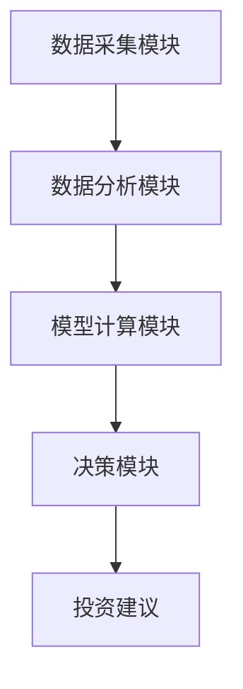

                 


# 杰里米·格兰瑟姆的价值投资新定义

---

## 关键词：价值投资，杰里米·格兰瑟姆，投资策略，内在价值，安全边际

---

## 摘要：  
本文深入探讨了杰里米·格兰瑟姆对价值投资的创新定义，从传统价值投资的局限性出发，结合现代金融环境的变化，分析了格兰瑟姆新定义的核心要素、数学模型、系统架构以及实际应用。文章通过详细讲解价值投资的背景、核心概念、策略与方法、数学模型与算法、系统架构设计、项目实战等内容，为读者提供了一种全面理解和实践价值投资新定义的方法。

---

## 第1章: 价值投资的核心概念

### 1.1 价值投资的定义与背景  
价值投资是一种以低于内在价值的价格买入优质资产的投资策略，其核心在于寻找市场低估的股票。传统价值投资强调对企业基本面的分析，包括财务状况、盈利能力、行业地位等。然而，随着市场环境的变化，传统价值投资的局限性逐渐显现，尤其是在应对高波动性、复杂金融工具和新兴市场时，传统方法显得力不从心。

杰里米·格兰瑟姆作为价值投资领域的权威，提出了价值投资的新定义，强调在传统基本面分析的基础上，引入更多的量化指标和风险管理方法，以适应现代金融市场的复杂性。

---

## 第2章: 价值投资新定义的核心要素

### 2.1 内在价值的重新定义  
格兰瑟姆的新定义对内在价值的计算进行了优化，结合了更多动态因素，例如：

1. **历史数据分析**：通过长期历史数据，评估企业的盈利能力、成长性和稳定性。
2. **行业周期性**：考虑行业周期对企业价值的影响。
3. **市场情绪**：引入市场情绪指标，调整估值模型。

格兰瑟姆提出了一个改进的内在价值公式：

$$
\text{内在价值} = \text{调整后的净利润} \times \text{动态市盈率}
$$

其中，净利润需要根据行业周期和市场情绪进行调整，动态市盈率则结合了历史平均市盈率和当前市场环境。

---

## 第3章: 价值投资的数学模型与算法

### 3.1 市盈率模型  
市盈率（P/E）是价值投资中常用的估值指标，其公式为：

$$
\text{市盈率} = \frac{\text{股价}}{\text{每股净利润}}
$$

格兰瑟姆的新定义中，市盈率的计算需要考虑行业平均市盈率和市场情绪指数：

$$
\text{调整后市盈率} = \text{市盈率} \times \text{行业平均市盈率} \times \text{市场情绪指数}
$$

---

## 第4章: 价值投资的系统架构设计

### 4.1 系统功能设计  
为了实现价值投资新定义的策略，我们设计了一个基于Python的系统架构，包括以下模块：

1. **数据采集模块**：从金融数据库获取实时数据。
2. **数据分析模块**：计算市盈率、市净率等指标。
3. **模型计算模块**：应用改进的内在价值公式进行估值。
4. **决策模块**：根据估值结果生成投资建议。

### 4.2 系统架构图  
以下是系统架构的mermaid图：



---

## 第5章: 项目实战

### 5.1 实战环境  
本文基于Python 3.9和Jupyter Notebook编写代码，主要依赖库包括Pandas、NumPy和Matplotlib。

### 5.2 核心代码实现  
以下是改进的内在价值计算代码：

```python
import pandas as pd
import numpy as np

def calculate_intrinsic_value(financial_data, industry_avg_pe, market_mood_index):
   净利润 = financial_data['净利润']
   动态市盈率 = industry_avg_pe * market_mood_index
   内在价值 = 净利润 * 动态市盈率
    return 内在价值

# 示例数据
financial_data = {'净利润': 100}
industry_avg_pe = 15
market_mood_index = 1.2

result = calculate_intrinsic_value(financial_data, industry_avg_pe, market_mood_index)
print("内在价值:", result)
```

---

## 第6章: 总结与注意事项

### 6.1 本章小结  
杰里米·格兰瑟姆的价值投资新定义在传统基本面分析的基础上，引入了更多的量化指标和风险管理方法，为投资者提供了更全面的估值工具和策略。通过改进内在价值公式和系统架构设计，投资者可以在复杂多变的市场中更好地捕捉低估资产。

### 6.2 注意事项  
1. **数据质量**：确保数据来源的可靠性和准确性。
2. **模型适用性**：根据市场环境调整模型参数。
3. **风险管理**：严格控制仓位和风险敞口。

### 6.3 拓展阅读  
推荐阅读杰里米·格兰瑟姆的《投资的艺术》和彼得·林奇的《投资实战策略》，深入了解价值投资的更多细节。

---

## 作者：AI天才研究院/AI Genius Institute & 禅与计算机程序设计艺术 /Zen And The Art of Computer Programming

