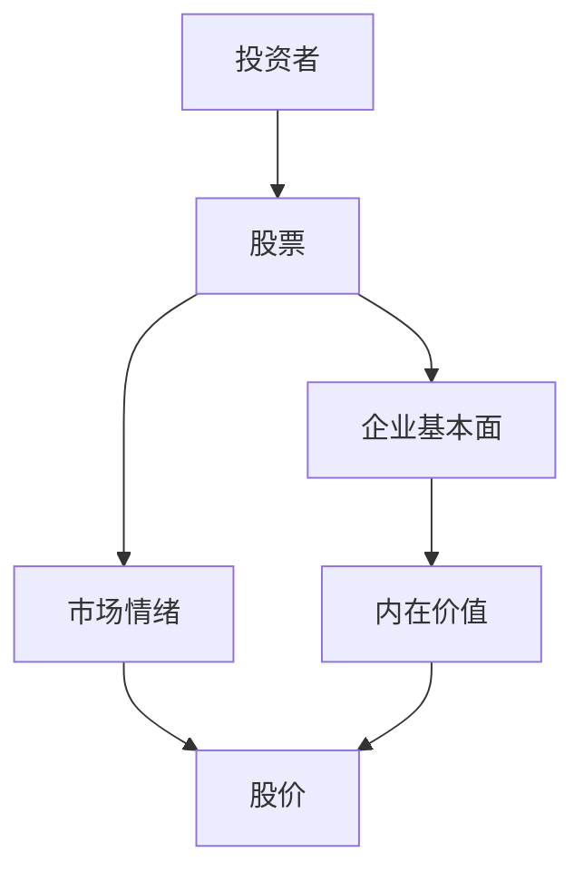
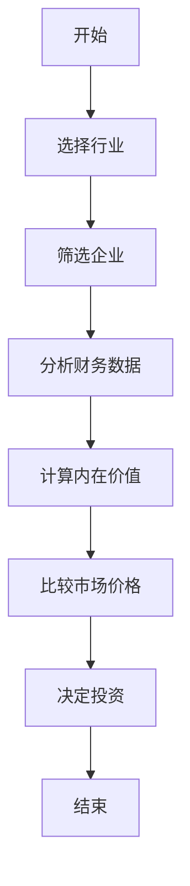
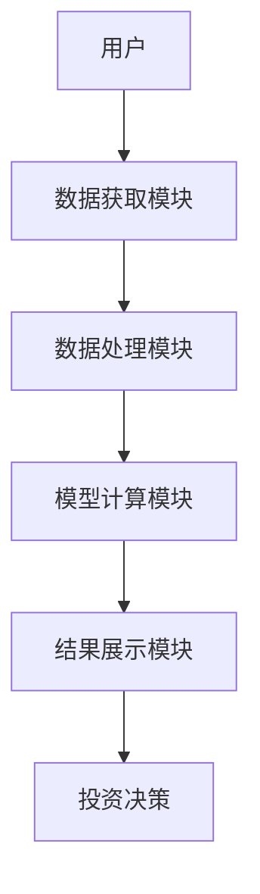
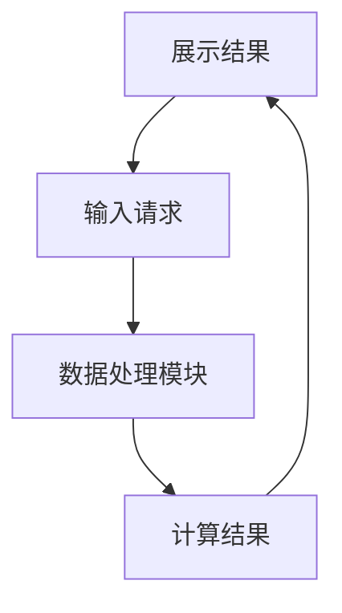

                 


# 杰里米·格兰瑟姆的长期价值投资与可持续发展

## 关键词：杰里米·格兰瑟姆, 价值投资, 可持续发展, 风险管理, ESG投资, 投资系统架构

## 摘要：  
本文系统阐述了杰里米·格兰瑟姆的长期价值投资理念，并深入探讨了可持续发展在投资中的重要性。通过分析价值投资的核心概念、算法原理和系统架构，结合实际项目案例，展示了如何将长期价值投资与可持续发展理念相结合，构建高效的投资策略。文章还提供了代码实现和数学模型，帮助读者理解投资系统的设计与实现。

---

# 第一部分：引言

## 第1章：本书的目的与范围

### 1.1 本书的目的  
- 介绍杰里米·格兰瑟姆的长期价值投资理念  
- 探讨可持续发展在投资中的重要性  
- 结合价值投资与可持续发展，提供系统化的投资策略  

### 1.2 本书的范围  
- 覆盖价值投资的基本原理  
- 分析可持续发展的核心要素  
- 展示如何将价值投资与可持续发展结合  

### 1.3 本书的结构  
- 分章节详细阐述核心概念  
- 通过数学模型和案例分析提供理论支持  
- 结合系统架构和项目实战提供实践指导  

---

# 第二部分：长期价值投资的背景与核心概念

## 第2章：长期价值投资的背景介绍

### 2.1 价值投资的定义与特点  
- 价值投资的核心理念  
- 与成长投资的区别  
- 价值投资的适用场景  

### 2.2 格兰瑟姆的投资哲学  
- 格兰瑟姆的生平与投资理念  
- 格兰瑟姆的长期价值投资模型  
- 格兰瑟姆的投资策略与风险管理  

### 2.3 价值投资的核心要素  
- 企业基本面分析  
- 股票估值方法  
- 安全边际的概念  

---

## 第3章：格兰瑟姆长期价值投资的核心概念与联系

### 3.1 核心概念原理  
- 价值投资的数学模型  
- 安全边际的计算方法  
- 股票内在价值的评估  

### 3.2 核心概念属性对比表格  
| 概念       | 描述                     |
|------------|--------------------------|
| 内在价值   | 股票的真实价值，基于企业基本面分析 |
| 安全边际   | 股票价格低于内在价值的部分 |
| 市场情绪   | 投资者情绪对股价的影响   |

### 3.3 ER实体关系图  


---

## 第4章：格兰瑟姆投资模型的算法原理

### 4.1 算法流程图  


### 4.2 核心算法代码  
```python
def calculate_intrinsic_value(financials):
    # 计算每股收益
    EPS = financials['EPS']
    # 计算市盈率
    P_E = financials['P_E']
    # 计算内在价值
    intrinsic_value = EPS * (P_E - growth_rate)
    return intrinsic_value
```

### 4.3 数学模型与公式  
- 内在价值公式：  
  $$ \text{内在价值} = \text{EPS} \times (\text{P/E} - \text{增长率}) $$
- 安全边际公式：  
  $$ \text{安全边际} = \text{内在价值} - \text{市场价格} $$

---

# 第三部分：可持续发展的背景与核心概念

## 第5章：可持续发展的背景介绍

### 5.1 可持续发展的定义与特点  
- 可持续发展的核心理念  
- 与传统投资的区别  
- 可持续发展的适用场景  

### 5.2 ESG投资的背景与意义  
- ESG评分的定义与计算  
- 可持续发展的社会和环境影响  
- ESG投资的市场趋势  

### 5.3 可持续发展的核心要素  
- 环境因素（Environmental）  
- 社会因素（Social）  
- 治理因素（Governance）  

---

## 第6章：可持续发展与长期价值投资的结合

### 6.1 价值投资与可持续发展的联系  
- 价值投资的长期视角与可持续发展的长期目标  
- ESG评分对内在价值的影响  
- 可持续发展如何增强投资组合的稳定性  

### 6.2 可持续发展对投资决策的影响  
- 通过ESG评分筛选企业  
- 环境和社会风险的量化评估  
- 可持续发展对企业估值的调整  

---

# 第四部分：系统架构与项目实战

## 第7章：投资决策支持系统的架构设计

### 7.1 系统功能设计  
- 用户需求分析  
- 系统功能模块划分  

### 7.2 系统架构设计  


### 7.3 系统接口设计  
- 数据接口：与股票数据库的交互  
- 计算接口：与数学模型的交互  

### 7.4 系统交互设计  


---

## 第8章：项目实战

### 8.1 环境安装与配置  
- 数据库安装与配置  
- 依赖库的安装（如Python的Pandas、NumPy等）  

### 8.2 核心代码实现  
```python
def calculate_esg_rating(company_data):
    # 计算环境评分
    environmental_score = company_data['CO2排放'] * -1 + 100
    # 计算社会评分
    social_score = company_data['员工满意度'] * 0.7 + company_data['社会责任'] * 0.3
    # 计算治理评分
    governance_score = company_data['管理层稳定性'] * 0.5 + company_data['董事会独立性'] * 0.5
    # 综合ESG评分
    esg_rating = (environmental_score + social_score + governance_score) / 3
    return esg_rating
```

### 8.3 实际案例分析  
- 某行业企业的ESG评分计算  
- 结合价值投资模型进行投资决策  

---

## 第9章：系统优化与扩展

### 9.1 系统优化策略  
- 数据更新的频率优化  
- 模型计算的并行优化  

### 9.2 系统扩展方向  
- 引入更多可持续发展指标  
- 与更多投资模型结合  

---

# 第五部分：总结与展望

## 第10章：总结与最佳实践

### 10.1 总结  
- 杰里米·格兰瑟姆的价值投资理念  
- 可持续发展对投资的影响  

### 10.2 最佳实践  
- 定期更新投资组合中的ESG评分  
- 结合市场环境动态调整投资策略  

### 10.3 注意事项  
- 风险管理的重要性  
- 数据质量和模型准确性的关键作用  

---

## 第11章：未来展望

### 11.1 技术发展  
- 人工智能在投资决策中的应用  
- 区块链技术在数据可信度中的作用  

### 11.2 可持续发展的趋势  
- 全球ESG投资的快速发展  
- 可持续发展对企业价值的长期影响  

---

# 作者：AI天才研究院/AI Genius Institute & 禅与计算机程序设计艺术 /Zen And The Art of Computer Programming

