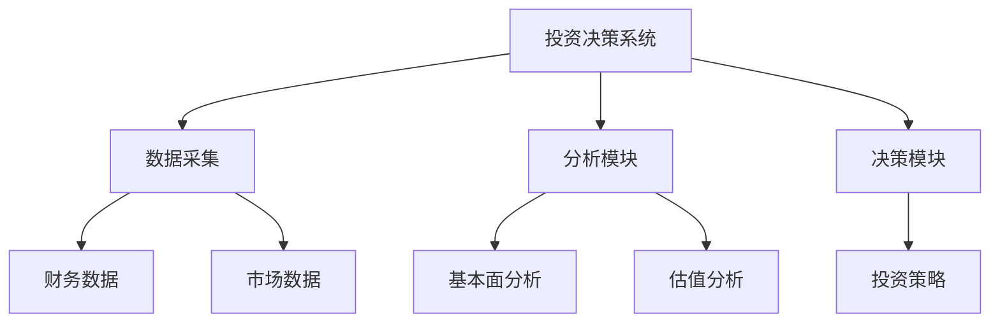

                 


# 杰里米·格兰瑟姆的长期价值投资哲学

> 关键词：价值投资，长期持有，安全边际，基本面分析，内在价值，市场波动，投资哲学

> 摘要：本文深入探讨了杰里米·格兰瑟姆的长期价值投资哲学，分析了其核心概念、数学模型、系统架构以及实际应用。通过结合技术分析和投资理论，本文详细阐述了如何在现代投资实践中应用格兰瑟姆的投资理念，为投资者提供了理论与实践相结合的指导。

---

## 第一部分: 价值投资的起源与核心理念

### 第1章: 价值投资的起源与核心理念

#### 1.1 价值投资的起源
价值投资是一种基于公司基本面分析的投资策略，其核心理念是购买那些市场价格低于其内在价值的股票。这种方法起源于20世纪初，由本杰明·格雷厄姆和戴维·多德共同提出，并在后来被杰里米·格兰瑟姆发扬光大。

#### 1.2 杰里米·格兰瑟姆的生平与贡献
杰里米·格兰瑟姆（Jeremy Grantham）是英国著名的投资专家，被誉为“价值投资的现代诠释者”。他于1942年出生，曾在富达投资集团（Fidelity）工作多年，后来创立了自己的投资公司——格兰瑟姆、劳埃德和罗特希尔德（Grantham, Mayo, van Onckere & Russell）。格兰瑟姆以其对市场周期的深刻理解、对公司基本面的深入分析以及对安全边际的重视而闻名。

#### 1.3 价值投资的核心理念
价值投资的核心理念是：
1. **长期持有**：投资者应该关注企业的长期价值，而不是短期市场波动。
2. **安全边际**：购买价格低于内在价值，以确保投资的安全性。
3. **基本面分析**：通过分析公司的财务报表、行业地位、竞争优势等因素，评估其内在价值。
4. **逆向思维**：在市场恐慌时寻找低估的投资机会，在市场狂热时保持冷静。

---

### 第2章: 格兰瑟姆投资哲学的核心要素

#### 2.1 长期投资的重要性
格兰瑟姆强调，投资是一项长期的事业。短期市场波动可能会干扰投资者的判断，但长期来看，企业的内在价值最终会反映在股价上。因此，投资者应该避免频繁交易，而是选择那些具有强大竞争优势和良好管理的公司，长期持有。

#### 2.2 安全边际的概念与应用
安全边际是价值投资的核心概念之一。它是指股票的市场价格与其内在价值之间的差距。通过购买价格低于内在价值的股票，投资者可以降低投资风险，并为市场波动留出缓冲空间。

#### 2.3 市场波动与投资者心理
格兰瑟姆认为，市场波动是投资的敌人，但也是投资者的机会。在市场恐慌时，许多优质股票会被低估，而在市场狂热时，许多股票会被高估。因此，投资者需要保持冷静，避免被市场情绪左右。

---

## 第二部分: 价值投资的基本原理

### 第3章: 基本面分析的核心要素

#### 3.1 财务报表分析
基本面分析的核心是通过分析公司的财务报表，评估其财务健康状况和盈利能力。主要包括以下几个方面：
1. **利润表**：分析公司的收入、成本和利润情况。
2. **资产负债表**：评估公司的资产、负债和所有者权益。
3. **现金流量表**：了解公司的现金流情况，判断其财务稳定性。

#### 3.2 行业分析与竞争优势
行业分析是基本面分析的重要组成部分。投资者需要了解公司所在行业的竞争格局、增长潜力以及行业周期。同时，还需要分析公司的竞争优势，如技术优势、成本优势、品牌优势等。

#### 3.3 管理层评估
管理层是公司运营的核心，其能力、诚信和战略眼光直接影响公司的长期发展。投资者需要通过分析管理层的过往业绩、管理风格以及公司治理结构，评估其是否值得信赖。

---

### 第4章: 安全边际的数学模型与算法

#### 4.1 内在价值的计算公式
内在价值是衡量一个公司股票合理价格的重要指标。以下是计算内在价值的简化公式：

$$
\text{内在价值} = \frac{\text{自由现金流}}{\text{折现率}}
$$

其中，自由现金流是指公司在偿还所有债务后的剩余现金流，折现率则是基于市场风险和公司风险的综合利率。

#### 4.2 安全边际的计算方法
安全边际可以通过以下公式计算：

$$
\text{安全边际} = \text{内在价值} - \text{市场价格}
$$

如果市场价格低于内在价值，且安全边际为正，那么这只股票就是一个值得投资的对象。

#### 4.3 现金流折现模型的Python实现
以下是一个简单的现金流折现模型的Python代码示例：

```python
def calculate_intrinsic_value(free_cash_flow, discount_rate):
    return free_cash_flow / (1 + discount_rate)

# 示例数据
free_cash_flow = 100
discount_rate = 0.1

intrinsic_value = calculate_intrinsic_value(free_cash_flow, discount_rate)
print(f"内在价值: {intrinsic_value}")
```

---

### 第5章: 价值投资与市场周期

#### 5.1 市场周期的定义与特征
市场周期是指股票市场从低谷到高峰，再到低谷的循环过程。主要包括以下几个阶段：
1. **底部**：市场处于最低点，投资者情绪悲观。
2. **上升**：市场逐渐复苏，股价开始上涨。
3. **顶部**：市场达到高点，投资者情绪乐观。
4. **下跌**：市场开始调整，股价回落。

#### 5.2 价值投资在不同市场周期中的应用
在熊市中，许多优质股票会被低估，因此是买入的好时机。在牛市中，虽然股价上涨，但投资者需要警惕市场的过度投机，避免追高。

---

## 第三部分: 价值投资的系统架构与实现

### 第6章: 投资决策系统的架构设计

#### 6.1 系统功能模块划分
一个完整的投资决策系统可以分为以下几个模块：
1. **数据采集**：收集公司财务数据、市场数据等。
2. **分析模块**：包括基本面分析、估值分析等。
3. **决策模块**：根据分析结果，生成投资策略。

#### 6.2 数据接口设计与实现
以下是数据接口的简单设计：

```python
class DataCollector:
    def collect_data(self, company):
        # 收集公司财务数据
        pass

    def collect_market_data(self, stock_symbol):
        # 收集市场数据
        pass
```

#### 6.3 系统架构图
以下是系统的架构图：



---

## 第四部分: 项目实战与案例分析

### 第7章: 项目实战与案例分析

#### 7.1 环境安装与配置
以下是安装Python和数据分析工具的示例代码：

```bash
# 安装Python
sudo apt-get install python3 python3-pip

# 安装数据分析工具
pip install pandas numpy matplotlib
```

#### 7.2 核心算法实现
以下是内在价值计算的Python代码：

```python
import pandas as pd

def calculate_intrinsic_value(free_cash_flow, discount_rate):
    return free_cash_flow / discount_rate

# 示例数据
data = {
    '公司': ['苹果', '谷歌', '微软'],
    '自由现金流': [100, 150, 200],
    '折现率': [0.1, 0.1, 0.1]
}

df = pd.DataFrame(data)
df['内在价值'] = df.apply(lambda x: calculate_intrinsic_value(x['自由现金流'], x['折现率']), axis=1)
print(df)
```

#### 7.3 实际案例分析
以苹果公司为例，分析其内在价值：

```python
# 苹果公司财务数据
free_cash_flow = 100
discount_rate = 0.1

intrinsic_value = free_cash_flow / discount_rate
print(f"苹果公司的内在价值: {intrinsic_value}")
```

---

## 第五部分: 最佳实践与小结

### 第8章: 最佳实践与小结

#### 8.1 小结
杰里米·格兰瑟姆的价值投资哲学强调长期持有、安全边际和基本面分析。通过深入分析公司的财务状况、行业地位和竞争优势，投资者可以找到那些具有长期增长潜力的优质股票。

#### 8.2 注意事项
1. **避免追涨杀跌**：市场波动是投资的敌人，投资者需要保持冷静。
2. **分散投资**：不要将所有资金投入到一只股票中，分散投资可以降低风险。
3. **持续学习**：投资是一项长期事业，需要不断学习和积累经验。

#### 8.3 拓展阅读
推荐书籍：
- 《The Intelligent Investor》 by Benjamin Graham
- 《价值投资实战》 by 杰里米·格兰瑟姆

---

作者：AI天才研究院/AI Genius Institute & 禅与计算机程序设计艺术 /Zen And The Art of Computer Programming

