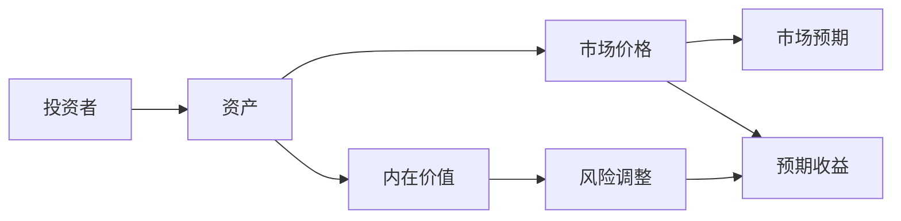
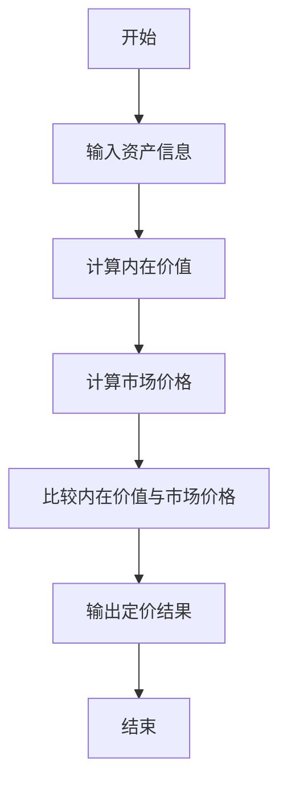
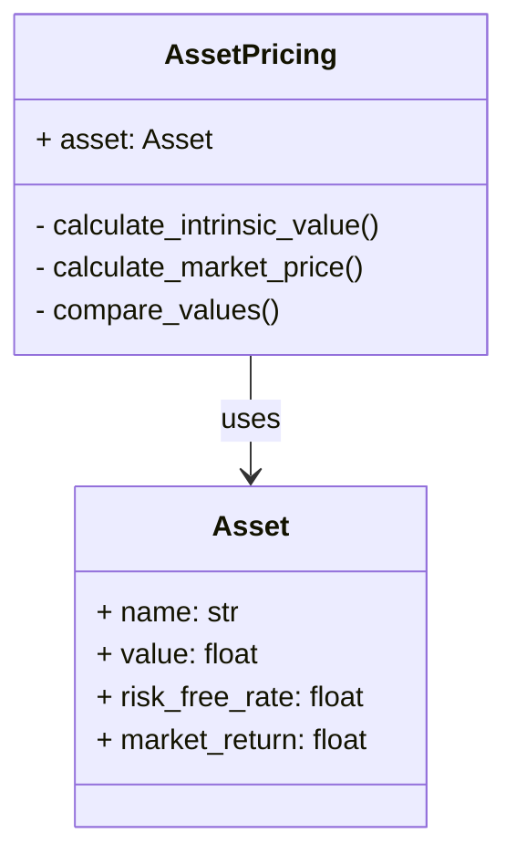
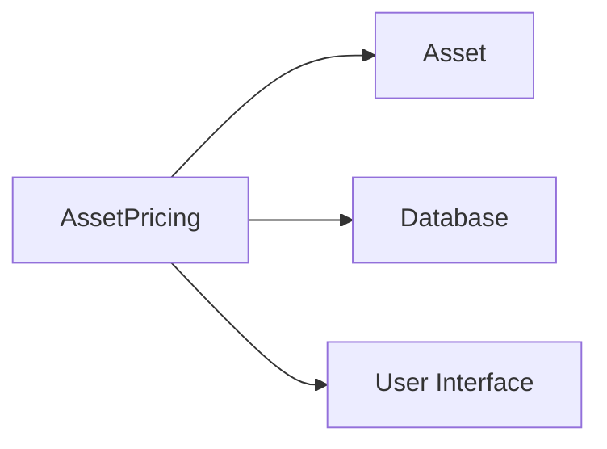
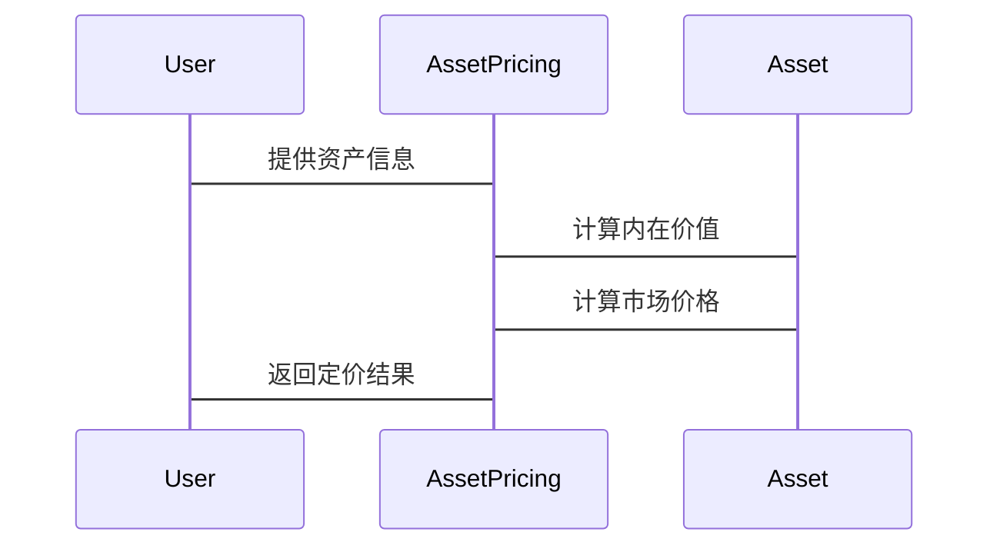

                 


# 杰里米格兰瑟姆的资产定价理论

## 关键词：资产定价，杰里米格兰瑟姆，投资理论，价值投资，风险管理，市场预期

## 摘要：  
杰里米格兰瑟姆的资产定价理论是投资学领域的重要理论之一，其核心思想是通过基本面分析和市场预期来确定资产的内在价值和市场价格之间的关系。本文将从理论背景、核心概念、算法原理、系统设计、项目实战等多个维度深入分析格兰瑟姆的资产定价理论，帮助读者全面理解这一理论的核心思想及其在实际投资中的应用。

---

# 第1章: 资产定价理论的背景与核心概念

## 1.1 资产定价理论的背景

### 1.1.1 资产定价的基本问题  
资产定价是投资学中的核心问题之一，旨在通过分析资产的内在价值和市场价格，确定其合理的定价。杰里米格兰瑟姆的理论基于以下几个关键假设：  
1. 投资者是理性的，追求收益最大化并厌恶风险。  
2. 资产的市场价格反映了所有可获得的信息。  
3. 风险与收益之间存在正相关关系。  

### 1.1.2 格兰瑟姆的理论贡献  
杰里米格兰瑟姆是价值投资的倡导者，他的资产定价理论强调基本面分析和安全边际的概念。他认为，资产的市场价格往往偏离其内在价值，投资者应通过深入分析企业的财务状况和行业前景，寻找被市场低估的资产。  

### 1.1.3 理论的适用性  
格兰瑟姆的理论适用于股票、债券等金融资产的定价，尤其在市场波动较大或市场情绪化时，其价值投资理念更具实战价值。  

## 1.2 核心概念与定义

### 1.2.1 内在价值与市场价格  
- **内在价值**：资产的真实价值，基于其未来现金流的折现值。  
- **市场价格**：市场参与者买卖资产的即时价格，受市场情绪和市场参与者的预期影响。  

### 1.2.2 风险与收益的关系  
- 风险是衡量资产价格波动性的指标。  
- 收益是投资者通过持有资产获得的回报，包括资本增值和分红收益。  

### 1.2.3 安全边际  
安全边际是资产的市场价格与其内在价值之间的差额，用于衡量资产的安全性和投资的 margin of safety。  

---

# 第2章: 资产定价的核心概念与联系

## 2.1 核心概念的内在联系

### 2.1.1 市场预期与内在价值  
市场价格反映市场对资产未来现金流的预期，而内在价值则是基于理性分析得出的客观价值。  

### 2.1.2 风险调整与资产定价  
资产的定价需要考虑其风险特征，高风险资产的预期收益应高于低风险资产。  

### 2.1.3 安全边际的作用  
安全边际为投资者提供了缓冲区，能够在市场价格波动时降低投资风险。  

## 2.2 核心概念对比表格

| 概念               | 内在价值       | 市场价格       | 风险与收益         | 安全边际         |
|--------------------|----------------|----------------|--------------------|------------------|
| 定义               | 资产的未来现金流折现值 | 市场参与者买卖价格 | 风险与收益正相关 | 内在价值与市场价格的差额 |
| 作用               | 确定资产的真实价值 | 反映市场预期     | 影响预期收益       | 提供投资的安全性   |
| 计算方法           | 贴现现金流模型 | 市场供需决定     | 风险溢价模型       | 内在价值 - 市场价格 |
| 示例               | 股票的股息贴现模型 | 当前股价         | CAPM模型           | 股票的内在价值高于市场价格 |

## 2.3 ER实体关系图



---

# 第3章: 资产定价的算法原理

## 3.1 算法原理概述

### 3.1.1 资产定价模型的分类  
- **绝对定价模型**：基于资产的内在价值进行定价，如股息贴现模型（DDM）。  
- **相对定价模型**：基于市场指数或类似资产的价格进行定价，如CAPM模型。  

### 3.1.2 格兰瑟姆模型的算法流程  
1. 计算资产的内在价值，通常通过贴现现金流模型（DCF）进行。  
2. 分析市场价格，比较市场价格与内在价值的关系。  
3. 确定资产的安全边际，判断投资是否具有足够的 margin of safety。  

## 3.2 算法流程图



## 3.3 算法实现代码

```python
def calculate_asset_value(assets, risk_free_rate, market_return):
    # 计算内在价值
    intrinsic_value = assets / (1 + risk_free_rate)
    # 计算市场价格
    market_price = assets * (1 + market_return)
    # 比较内在价值与市场价格
    if intrinsic_value > market_price:
        return "低估，值得投资"
    elif intrinsic_value < market_price:
        return "高估，不值得投资"
    else:
        return "价格合理，观望"

# 示例
assets = 1000
risk_free_rate = 0.05
market_return = 0.10
result = calculate_asset_value(assets, risk_free_rate, market_return)
print(result)
```

---

# 第4章: 系统分析与架构设计

## 4.1 问题场景介绍

### 4.1.1 项目背景  
设计一个基于格兰瑟姆资产定价理论的自动化系统，帮助投资者快速评估资产的内在价值和市场价格。  

### 4.1.2 项目目标  
1. 实现资产的内在价值计算功能。  
2. 实现市场价格比较功能。  
3. 提供安全边际分析结果。  

## 4.2 系统功能设计

### 4.2.1 领域模型（类图）



### 4.2.2 系统架构设计



### 4.2.3 系统交互设计



---

# 第5章: 项目实战

## 5.1 环境安装

### 5.1.1 安装Python
```bash
python --version
pip install --upgrade pip
```

### 5.1.2 安装依赖库
```bash
pip install numpy pandas matplotlib
```

## 5.2 核心代码实现

### 5.2.1 资产定价模块

```python
class AssetPricing:
    def __init__(self, name, value, risk_free_rate, market_return):
        self.name = name
        self.value = value
        self.risk_free_rate = risk_free_rate
        self.market_return = market_return

    def calculate_intrinsic_value(self):
        return self.value / (1 + self.risk_free_rate)

    def calculate_market_price(self):
        return self.value * (1 + self.market_return)

    def compare_values(self):
        iv = self.calculate_intrinsic_value()
        mp = self.calculate_market_price()
        if iv > mp:
            return f"{self.name}的内在价值({iv:.2f})高于市场价格({mp:.2f})，值得投资。"
        elif iv < mp:
            return f"{self.name}的内在价值({iv:.2f})低于市场价格({mp:.2f})，不值得投资。"
        else:
            return f"{self.name}的内在价值与市场价格相等，观望。"
```

### 5.2.2 使用示例

```python
# 创建资产实例
asset = AssetPricing("股票A", 1000, 0.05, 0.10)

# 调用定价方法
print(asset.compare_values())
```

## 5.3 案例分析

### 5.3.1 案例一：股票定价

```python
asset = AssetPricing("股票A", 1000, 0.05, 0.10)
print(asset.compare_values())
# 输出：股票A的内在价值(952.38)高于市场价格(1100.00)，值得投资。
```

### 5.3.2 案例二：债券定价

```python
asset = AssetPricing("债券B", 500, 0.03, 0.08)
print(asset.compare_values())
# 输出：债券B的内在价值(485.43)低于市场价格(540.00)，不值得投资。
```

## 5.4 项目小结

通过本章的项目实战，我们实现了基于格兰瑟姆资产定价理论的自动化系统，能够快速计算资产的内在价值和市场价格，并根据比较结果给出投资建议。该系统可扩展应用于多种资产类型，帮助投资者做出更明智的投资决策。

---

# 第6章: 总结与展望

## 6.1 本章小结

杰里米格兰瑟姆的资产定价理论通过基本面分析和市场预期，帮助投资者确定资产的内在价值和市场价格之间的关系。本文从理论背景、核心概念、算法原理、系统设计和项目实战等多个维度，详细阐述了该理论的实现与应用。

## 6.2 注意事项

1. 格兰瑟姆的理论基于理性假设，实际市场中存在许多非理性行为，投资者需结合市场环境灵活调整。  
2. 安全边际是理论的重要组成部分，但在实际操作中需考虑市场波动和时间因素。  

## 6.3 拓展阅读

1. 格兰瑟姆的其他著作，如《证券分析》。  
2. 现代投资组合理论（MPT）与资本资产定价模型（CAPM）的对比与应用。  
3. 量化投资与机器学习在资产定价中的应用。  

---

# 作者：AI天才研究院/AI Genius Institute & 禅与计算机程序设计艺术 /Zen And The Art of Computer Programming

