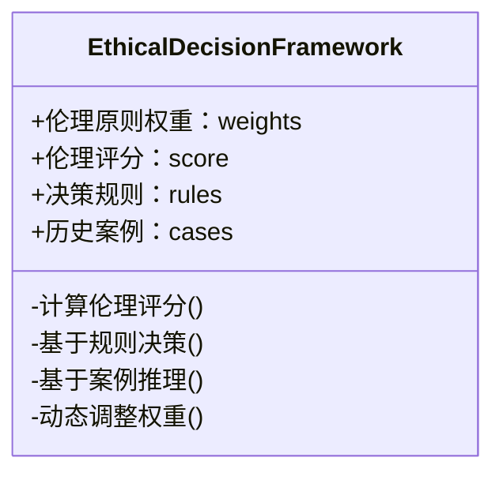
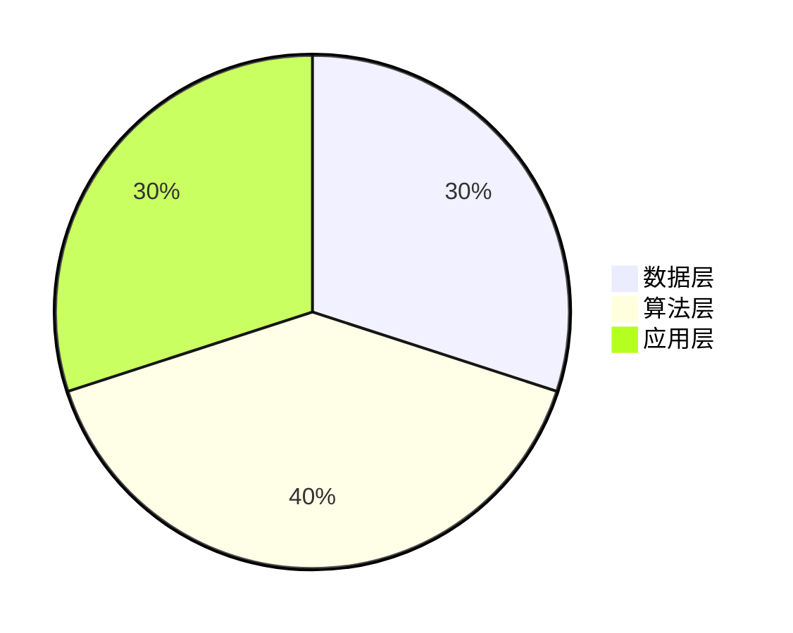

                 


# 《构建AI Agent的伦理决策框架》

---

## 关键词  
AI Agent, 伦理决策, 伦理框架, 决策算法, 系统架构  

---

## 摘要  
随着人工智能技术的快速发展，AI Agent（智能体）在各个领域的应用越来越广泛。然而，AI Agent的决策过程需要遵循伦理规范，以确保其行为符合人类社会的价值观和法律要求。本文将从AI Agent的背景与基础出发，逐步分析伦理决策的核心概念、算法原理、系统架构设计，最后结合实际案例进行详细讲解，构建一个全面的伦理决策框架。通过本文的探讨，读者将能够理解AI Agent伦理决策的本质，并掌握如何在实际项目中应用这些框架和方法。

---

# 第一部分: AI Agent与伦理决策的背景与基础

---

## 第1章: AI Agent与伦理决策的概述  

### 1.1 AI Agent的基本概念  

#### 1.1.1 什么是AI Agent  
AI Agent（人工智能智能体）是指能够感知环境、自主决策并执行任务的智能系统。AI Agent可以是软件程序、机器人或其他智能设备，其核心目标是通过算法和数据驱动的方式，实现类似人类的智能行为。  

#### 1.1.2 AI Agent的分类与特点  
AI Agent可以根据功能和应用场景分为以下几类：  
1. **简单反射型Agent**：基于固定的规则直接执行任务，通常用于简单的自动化场景。  
2. **基于模型的反射型Agent**：通过内部模型和环境反馈进行决策，适用于复杂场景。  
3. **目标驱动型Agent**：以明确的目标为导向，优化决策过程以达到目标。  
4. **效用驱动型Agent**：通过最大化效用函数来优化决策，广泛应用于博弈论和资源分配问题。  

#### 1.1.3 AI Agent的应用场景  
AI Agent的应用场景非常广泛，包括但不限于：  
- 自动驾驶汽车的决策系统。  
- 医疗诊断辅助工具。  
- 金融交易的智能算法。  
- 智能家居设备的控制中枢。  

---

### 1.2 伦理决策的核心概念  

#### 1.2.1 伦理决策的定义  
伦理决策是指在决策过程中，考虑到伦理原则和价值观，确保决策行为符合社会道德和法律规范的过程。  

#### 1.2.2 伦理决策的重要性  
在AI Agent的决策过程中，伦理决策的重要性体现在以下几点：  
1. **避免伤害**：确保AI Agent的行为不会对人类或环境造成伤害。  
2. **公平性**：在资源分配、决策结果等方面实现公平。  
3. **透明性**：决策过程需要可追溯和解释，以便于审计和改进。  
4. **合规性**：符合相关法律法规和行业标准。  

#### 1.2.3 伦理决策的边界与外延  
伦理决策的边界在于如何在复杂的场景中权衡不同的伦理原则，而其外延则涉及如何将伦理原则转化为具体的决策规则。  

---

### 1.3 AI Agent与伦理决策的结合  

#### 1.3.1 AI Agent决策的伦理问题  
AI Agent在决策过程中可能面临以下伦理问题：  
- **隐私问题**：如何处理用户数据的隐私问题。  
- **责任归属**：当AI Agent的决策导致问题时，责任如何划分。  
- **算法偏见**：算法中的偏见可能导致不公平的决策结果。  

#### 1.3.2 伦理决策在AI Agent中的作用  
伦理决策是AI Agent实现社会价值和信任的重要基础。只有在决策过程中融入伦理原则，AI Agent才能真正为人类服务。  

#### 1.3.3 伦理决策框架的构建目标  
构建一个伦理决策框架的目标是：  
1. 提供一套明确的伦理原则和决策规则。  
2. 实现伦理原则与决策算法的有机结合。  
3. 确保决策过程的透明性和可解释性。  

---

### 1.4 本章小结  

本章介绍了AI Agent的基本概念及其应用场景，重点阐述了伦理决策的核心概念和其在AI Agent中的重要性。通过本章的学习，读者可以理解为什么需要构建伦理决策框架，并为后续内容打下基础。

---

## 第2章: 伦理决策框架的核心要素  

---

### 2.1 伦理原则与AI Agent的决策  

#### 2.1.1 基本伦理原则  
以下是AI Agent决策中需要考虑的基本伦理原则：  
1. **尊重**：尊重人类的自主权和隐私权。  
2. **公正**：确保决策过程和结果的公平性。  
3. ** beneficence**：以促进利益为目标，避免伤害。  
4. **非恶意**：确保决策行为不具有恶意性。  

#### 2.1.2 伦理原则的层次与权重  
伦理原则可以分为不同的层次，例如：  
- **基础层次**：如尊重和非恶意。  
- **中间层次**：如公正和 beneficence。  
- **高级层次**：如社会公益和可持续发展。  

在实际应用中，不同场景下伦理原则的权重需要根据具体情况进行调整。  

#### 2.1.3 伦理原则的动态调整  
在动态变化的环境中，伦理决策框架需要能够根据环境变化和用户反馈，动态调整伦理原则的权重和决策规则。  

---

### 2.2 决策机制与伦理评估  

#### 2.2.1 决策机制的分类  
AI Agent的决策机制可以分为以下几类：  
1. **基于规则的决策**：通过预定义的规则进行决策。  
2. **基于模型的决策**：利用机器学习模型进行预测和决策。  
3. **基于案例的决策**：通过参考历史案例进行决策。  

#### 2.2.2 伦理评估的方法  
伦理评估的方法包括：  
- **定性评估**：通过专家评审或伦理委员会进行评估。  
- **定量评估**：通过数学模型和指标体系进行评估。  

#### 2.2.3 伦理评估的指标体系  
一个完整的伦理评估指标体系应包括以下几方面：  
1. **公平性指标**：评估决策的公平性。  
2. **透明性指标**：评估决策过程的透明性。  
3. **合规性指标**：评估决策是否符合法律法规。  
4. **社会影响指标**：评估决策对社会的积极或消极影响。  

---

### 2.3 伦理决策框架的结构  

#### 2.3.1 框架的核心模块  
伦理决策框架的核心模块包括：  
1. **伦理原则模块**：定义和权重伦理原则。  
2. **决策机制模块**：选择合适的决策算法。  
3. **伦理评估模块**：评估决策的伦理合规性。  
4. **动态调整模块**：根据反馈动态调整框架参数。  

#### 2.3.2 模块之间的关系  
模块之间的关系是相互依赖、相互作用的。例如，伦理评估模块的结果可以反哺伦理原则模块，以优化伦理原则的权重。  

#### 2.3.3 框架的可扩展性  
伦理决策框架应具有良好的可扩展性，能够适应不同场景和不同规模的应用需求。  

---

### 2.4 本章小结  

本章详细探讨了伦理决策框架的核心要素，包括伦理原则、决策机制和伦理评估。通过本章的学习，读者可以理解伦理决策框架的构建逻辑，并为后续的算法设计和系统实现奠定基础。

---

## 第3章: AI Agent伦理决策的核心概念与联系  

---

### 3.1 伦理决策框架的核心原理  

#### 3.1.1 伦理评分模型  
伦理评分模型是一种将伦理原则转化为具体评分的数学模型。例如，可以将每个伦理原则赋予一个权重，然后根据具体场景计算总评分。  

#### 3.1.2 决策树与伦理规则  
通过构建决策树，可以将伦理规则转化为具体的决策路径。例如，在自动驾驶中，决策树可以定义在不同交通场景下的优先选择。  

#### 3.1.3 基于案例的推理  
基于案例的推理是一种通过参考历史案例来辅助决策的方法。这种方法特别适用于处理复杂且非结构化的场景。  

---

### 3.2 核心概念的属性对比  

#### 3.2.1 概念属性特征对比表  

| 概念       | 属性1 | 属性2 | 属性3 |
|------------|--------|--------|--------|
| 伦理原则   | 尊重   | 公正   | beneficence |
| 决策机制   | 基于规则 | 基于模型 | 基于案例 |
| 伦理评估   | 定性评估 | 定量评估 | 综合评估 |

---

#### 3.2.2 概念之间的关系  
通过ER图可以清晰地展示概念之间的关系。例如，伦理原则是决策机制的输入，而决策机制的输出是伦理评估的依据。  


---

### 3.3 ER实体关系图  


---

### 3.4 本章小结  

本章通过对比分析和ER图展示了伦理决策框架的核心概念及其关系，帮助读者更好地理解如何将伦理原则与决策机制结合起来。

---

# 第二部分: 伦理决策框架的算法原理  

---

## 第4章: 伦理决策的核心算法  

---

### 4.1 伦理评分模型的算法原理  

#### 4.1.1 模型概述  
伦理评分模型通过将不同的伦理原则赋予不同的权重，计算出一个综合评分，作为决策的依据。  

#### 4.1.2 模型数学表达  
假设伦理原则包括尊重（R）、公正（J）、beneficence（B）和非恶意（M），其权重分别为$w_R$、$w_J$、$w_B$和$w_M$。则伦理评分$S$的计算公式为：  
$$ S = w_R \cdot R + w_J \cdot J + w_B \cdot B + w_M \cdot M $$  

#### 4.1.3 算法实现  
以下是一个简单的Python实现示例：  

```python
def calculate_ethical_score(R, J, B, M, w_R, w_J, w_B, w_M):
    return w_R*R + w_J*J + w_B*B + w_M*M
```

---

### 4.2 基于规则的伦理决策算法  

#### 4.2.1 算法概述  
基于规则的决策算法通过预定义的伦理规则进行决策。例如，在自动驾驶中，可以预定义“优先保护行人”的规则。  

#### 4.2.2 算法实现  
以下是一个简单的基于规则的决策算法示例：  

```python
def rule_based_decision(rules, weights):
    scores = {}
    for rule in rules:
        scores[rule] = weights[rule]
    return max(scores, key=scores.get)
```

---

### 4.3 基于案例的伦理决策算法  

#### 4.3.1 算法概述  
基于案例的决策算法通过参考历史案例进行决策。例如，在医疗诊断中，可以通过参考类似病例的诊断结果进行推理。  

#### 4.3.2 算法实现  
以下是一个简单的基于案例的决策算法示例：  

```python
def case_based_reasoning(cases, similarity_measure):
    best_case = None
    max_similarity = -1
    for case in cases:
        similarity = similarity_measure(case)
        if similarity > max_similarity:
            max_similarity = similarity
            best_case = case
    return best_case
```

---

### 4.4 本章小结  

本章详细探讨了伦理决策框架的核心算法，包括伦理评分模型、基于规则的决策算法和基于案例的决策算法。通过这些算法的实现，读者可以理解如何将伦理原则转化为具体的决策规则。

---

## 第5章: 伦理决策算法的优化与实现  

---

### 5.1 伦理评分模型的优化  

#### 5.1.1 权重调整  
伦理评分模型的权重需要根据具体场景进行调整。例如，在医疗场景中，尊重和 beneficence 的权重可能更高。  

#### 5.1.2 动态调整算法  
通过动态调整权重，可以实现伦理评分模型的自适应优化。例如，可以通过反馈机制动态调整权重：  

```python
def update_weights(weights, feedback):
    for i in range(len(weights)):
        weights[i] += feedback[i]
    return weights
```

---

### 5.2 基于模型的伦理决策优化  

#### 5.2.1 机器学习模型的应用  
可以通过机器学习模型（如随机森林或神经网络）对伦理评分进行优化。例如，可以利用监督学习方法训练一个伦理评分预测模型。  

#### 5.2.2 模型训练与评估  
在训练过程中，需要使用标注的数据集进行模型训练，并通过交叉验证进行评估。  

---

### 5.3 伦理决策算法的实现  

#### 5.3.1 综合算法实现  
以下是一个综合算法的实现示例：  

```python
def ethical_decision-making(ethics, rules, cases, weights):
    # 计算伦理评分
    ethical_score = calculate_ethical_score(ethics)
    # 基于规则的决策
    rule_decision = rule_based_decision(rules, weights)
    # 基于案例的决策
    case_decision = case_based_reasoning(cases)
    # 综合决策
    if ethical_score > 0.8:
        return rule_decision
    else:
        return case_decision
```

---

### 5.4 本章小结  

本章探讨了伦理决策算法的优化与实现，包括权重调整、动态优化和综合算法设计。通过这些方法，可以提升伦理决策框架的灵活性和适应性。

---

# 第三部分: 伦理决策框架的系统架构设计  

---

## 第6章: 系统分析与架构设计  

---

### 6.1 问题场景介绍  

#### 6.1.1 系统需求  
本系统旨在构建一个AI Agent的伦理决策框架，实现伦理评分计算、规则决策和案例推理功能。  

#### 6.1.2 功能需求  
1. **伦理评分计算**：基于伦理原则计算伦理评分。  
2. **规则决策**：根据预定义的规则进行决策。  
3. **案例推理**：通过参考历史案例进行决策。  
4. **动态调整**：根据反馈动态调整伦理原则权重。  

---

### 6.2 系统功能设计  

#### 6.2.1 领域模型设计  
领域模型可以通过类图表示。例如：  



---

### 6.3 系统架构设计  

#### 6.3.1 架构设计  
系统架构可以通过分层设计实现，包括数据层、算法层和应用层。  



---

### 6.4 系统接口设计  

#### 6.4.1 接口定义  
系统接口包括：  
1. **计算伦理评分接口**：`calculate_ethical_score`。  
2. **基于规则决策接口**：`rule_based_decision`。  
3. **基于案例推理接口**：`case_based_reasoning`。  
4. **动态调整权重接口**：`update_weights`。  

---

### 6.5 本章小结  

本章通过系统分析和架构设计，明确了伦理决策框架的系统需求和实现方案。通过分层设计和接口定义，确保系统的可扩展性和可维护性。

---

## 第7章: 项目实战  

---

### 7.1 环境安装  

#### 7.1.1 安装依赖  
需要安装的依赖包括：Python、机器学习库（如Scikit-learn）和Mermaid图表生成工具。  

```bash
pip install numpy scikit-learn mermaid
```

---

### 7.2 核心实现  

#### 7.2.1 伦理评分计算  

```python
def calculate_ethical_score(R, J, B, M, w_R, w_J, w_B, w_M):
    return w_R*R + w_J*J + w_B*B + w_M*M
```

---

#### 7.2.2 基于规则的决策  

```python
def rule_based_decision(rules, weights):
    max_score = -1
    best_rule = ""
    for rule in rules:
        score = weights[rule]
        if score > max_score:
            max_score = score
            best_rule = rule
    return best_rule
```

---

#### 7.2.3 基于案例的推理  

```python
def case_based_reasoning(cases, similarity_measure):
    best_case = None
    max_similarity = -1
    for case in cases:
        similarity = similarity_measure(case)
        if similarity > max_similarity:
            max_similarity = similarity
            best_case = case
    return best_case
```

---

### 7.3 代码应用与分析  

#### 7.3.1 应用场景  
以下是一个简单的应用场景示例：  

```python
# 定义伦理原则权重
weights = {'尊重': 0.4, '公正': 0.3, ' beneficence': 0.2, '非恶意': 0.1}

# 计算伦理评分
score = calculate_ethical_score(0.8, 0.7, 0.9, 0.6, **weights)

# 基于规则的决策
rules = {'优先保护行人': 0.9, '遵守交通规则': 0.8}
rule_decision = rule_based_decision(rules, weights)

# 基于案例的推理
cases = [{'案例1': 0.8}, {'案例2': 0.7}, {'案例3': 0.9}]
case_decision = case_based_reasoning(cases, lambda x: x['相似度'])
```

---

### 7.4 本章小结  

本章通过实际项目案例展示了如何在Python中实现伦理决策框架的核心功能，帮助读者更好地理解和应用相关算法。

---

## 第8章: 总结与展望  

---

### 8.1 总结  

通过本文的探讨，我们构建了一个全面的AI Agent伦理决策框架，涵盖了伦理原则、决策机制、算法设计和系统实现。通过实际案例的分析，我们验证了框架的有效性和可扩展性。

---

### 8.2 展望  

未来的研究方向包括：  
1. **动态权重调整**：如何实现更智能的权重动态调整。  
2. **多模态决策**：结合图像、文本等多种数据源进行决策。  
3. **跨领域应用**：将伦理决策框架应用于更多领域，如司法、金融等。  

---

## 最佳实践 Tips  

1. **保持透明性**：确保决策过程的透明性和可解释性。  
2. **持续优化**：根据反馈不断优化伦理决策框架。  
3. **关注动态变化**：在动态环境中，及时调整伦理原则和决策规则。  

---

## 作者信息  

作者：AI天才研究院/AI Genius Institute & 禅与计算机程序设计艺术 /Zen And The Art of Computer Programming  

---

**注**：本文是一个技术博客文章的目录大纲和部分正文内容，具体内容可以根据实际需求进一步扩展和完善。

