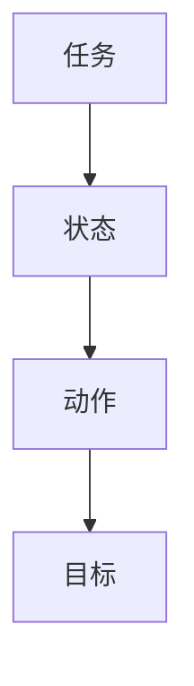
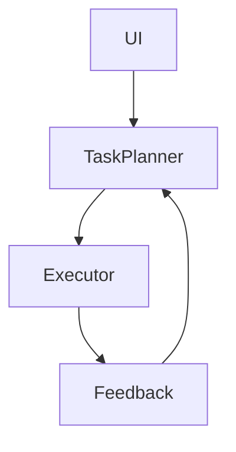

                 


# 构建AI Agent的动态任务规划与执行框架

> 关键词：AI Agent，动态任务规划，执行框架，任务建模，规划算法，系统架构

> 摘要：本文详细介绍了构建AI Agent的动态任务规划与执行框架的核心概念、算法原理和系统架构。通过分析任务建模、规划算法和执行监控，结合具体算法和系统设计，展示了如何构建一个高效、灵活的动态任务规划系统。

---

# 第一部分：AI Agent动态任务规划与执行框架概述

## 第1章：AI Agent的基本概念

### 1.1 AI Agent的定义

AI Agent（智能体）是指能够感知环境、做出决策并执行动作的实体。它可以是一个软件程序、机器人或其他智能系统。AI Agent的核心目标是通过感知和行动来实现特定任务。

### 1.2 动态任务规划的背景与问题背景

动态任务规划是指在不断变化的环境中，AI Agent能够实时调整任务优先级和执行计划的能力。传统的静态任务规划方法难以应对环境中的不确定性，因此动态任务规划应运而生。

### 1.3 动态任务规划的核心概念

动态任务规划涉及任务建模、状态空间、动作空间和目标函数。任务建模是将任务分解为可执行的子任务，状态空间描述了环境中的各种状态，动作空间定义了AI Agent可以执行的动作，目标函数则用于评估任务的完成情况。

### 1.4 动态任务规划的必要性

在动态环境中，任务需求和环境条件可能会发生变化。动态任务规划允许AI Agent根据新的信息调整其行为，从而提高任务执行的成功率和效率。

---

## 第2章：动态任务规划的核心概念

### 2.1 动态任务规划的理论基础

动态任务规划的理论基础包括状态空间、动作空间和目标函数。状态空间表示环境中的所有可能状态，动作空间定义了AI Agent可以执行的所有动作，目标函数用于评估任务的完成情况。

### 2.2 动态任务规划的算法原理

动态任务规划的算法主要包括A*算法、遗传算法和粒子群算法。这些算法在处理动态任务规划问题时各有优缺点。A*算法适合处理静态问题，而遗传算法和粒子群算法则更适合处理动态问题。

### 2.3 动态任务规划的ER实体关系图



---

## 第3章：动态任务规划算法详解

### 3.1 A*算法原理

A*算法是一种常用的路径规划算法，其基本原理是通过评估从起点到目标点的路径成本来找到最短路径。公式如下：

$$f(n) = g(n) + h(n)$$

其中，$g(n)$表示从起点到节点n的实际成本，$h(n)$表示从节点n到目标的估算成本。

### 3.2 遗传算法原理

遗传算法是一种基于自然选择和遗传机制的优化算法。其核心步骤包括初始化种群、计算适应度、选择、交叉和变异。适应度函数用于评估种群的适应度。

$$适应度函数：f(x) = \sum x_i$$

### 3.3 算法对比与选择

根据任务需求和环境特点选择合适的算法。A*算法适合静态任务规划，而遗传算法和粒子群算法更适合动态任务规划。

---

## 第4章：系统架构设计

### 4.1 问题场景介绍

动态任务规划系统需要在复杂环境中实时调整任务执行计划，因此系统架构需要具备高扩展性和灵活性。

### 4.2 系统功能设计

系统功能设计包括任务建模、规划算法选择、执行监控和反馈机制。任务建模是将任务分解为可执行的子任务，并定义每个子任务的输入输出接口。

### 4.3 系统架构图



### 4.4 接口设计与交互流程

系统接口设计包括任务建模接口、规划算法接口和执行监控接口。交互流程包括任务接收、规划生成、执行监控和反馈处理。

---

## 第5章：项目实战

### 5.1 环境安装

安装Python、numpy、pandas和scipy库。

```bash
pip install numpy pandas scipy
```

### 5.2 核心功能实现

实现动态任务规划的核心功能，包括任务建模、规划算法和执行监控。

```python
import numpy as np

def a_star(start, goal, heuristic):
    open_set = set([start])
    came_from = {}
    g_score = {start: 0}
    f_score = {start: heuristic(start, goal)}
    
    while open_set:
        current = min(open_set, key=lambda x: f_score[x])
        if current == goal:
            break
        open_set.remove(current)
        for neighbor in neighbors(current):
            tentative_g_score = g_score[current] + cost(current, neighbor)
            if neighbor not in g_score or tentative_g_score < g_score[neighbor]:
                came_from[neighbor] = current
                g_score[neighbor] = tentative_g_score
                f_score[neighbor] = g_score[neighbor] + heuristic(neighbor, goal)
                open_set.add(neighbor)
    return came_from, g_score
```

### 5.3 代码解读与分析

详细解读上述代码，说明每个部分的功能和实现细节。

### 5.4 案例分析与总结

通过具体案例分析动态任务规划框架的应用，总结经验教训。

---

## 第6章：总结与展望

### 6.1 总结

本文详细介绍了构建AI Agent的动态任务规划与执行框架的核心概念、算法原理和系统架构。通过分析任务建模、规划算法和执行监控，展示了如何构建一个高效、灵活的动态任务规划系统。

### 6.2 未来展望

未来的研究方向包括更高效的算法优化、多智能体协作、边缘计算和实时性优化。

### 6.3 最佳实践

在实际应用中，选择合适的算法和系统架构是关键。同时，动态任务规划框架需要具备良好的扩展性和可维护性。

---

# 作者：AI天才研究院 & 禅与计算机程序设计艺术

---

