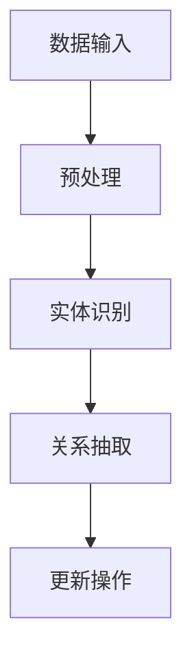
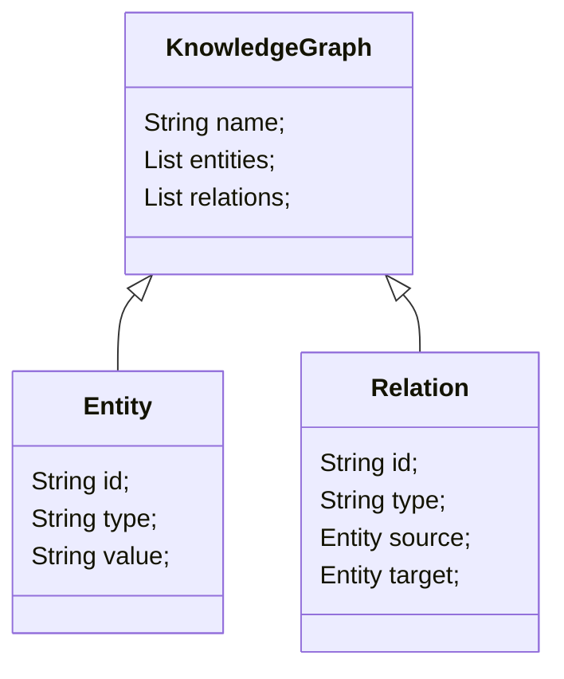
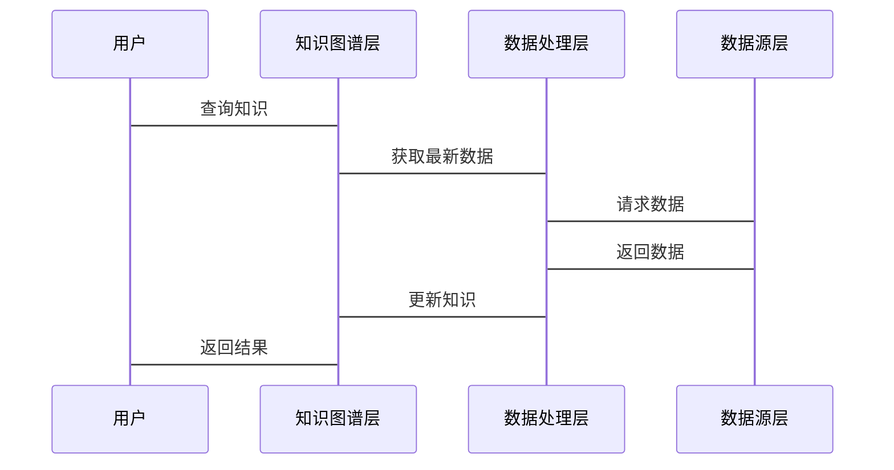

                 


# 构建AI Agent的动态知识图谱更新系统

## 关键词：AI Agent，知识图谱，动态更新，系统架构，算法原理

## 摘要：本文详细探讨了构建AI Agent的动态知识图谱更新系统的背景、核心原理、算法实现、系统架构及实际应用。通过对知识图谱动态更新的系统性分析，结合实际案例和代码实现，为读者提供一个全面的技术指南。

---

# 第1章 动态知识图谱更新系统的背景与问题

## 1.1 问题背景

### 1.1.1 AI Agent的核心需求

AI Agent（人工智能代理）是实现智能交互和自动化决策的核心技术。AI Agent需要实时感知环境、理解信息并做出合理决策。然而，AI Agent的知识来源通常是静态的知识图谱，无法适应动态变化的环境。

### 1.1.2 知识图谱在AI Agent中的作用

知识图谱是一种结构化的知识表示方法，通过实体和关系描述世界。AI Agent通过查询知识图谱获取知识，但静态的知识图谱无法反映实时变化，导致AI Agent的知识陈旧。

### 1.1.3 动态知识更新的必要性

在动态环境中，知识图谱需要实时更新以反映最新信息。例如，在实时聊天机器人中，对话历史、上下文信息需要动态更新，以确保AI Agent的响应准确性和连贯性。

## 1.2 问题描述

### 1.2.1 知识图谱的静态化问题

传统知识图谱通常是静态的，无法实时更新。这导致AI Agent在处理动态任务时知识不足，无法做出正确的决策。

### 1.2.2 动态知识更新的挑战

动态知识更新需要解决数据实时性、更新频率、数据冲突等问题。例如，在实时推荐系统中，用户行为数据需要实时更新，但频繁的更新会导致性能下降。

### 1.2.3 现有解决方案的不足

现有的知识图谱更新方法通常仅支持批量更新，难以满足实时更新的需求。此外，动态更新缺乏高效的冲突检测和恢复机制。

## 1.3 问题解决

### 1.3.1 动态知识图谱更新的目标

动态知识图谱更新的目标是实现实时、高效、准确的知识更新，确保AI Agent的知识始终是最新的。

### 1.3.2 解决方案的核心思路

通过设计高效的动态更新算法和优化系统架构，结合实时数据流和事件驱动机制，实现知识图谱的动态更新。

### 1.3.3 边界与外延

动态知识图谱更新的边界包括数据源、更新频率、更新粒度等。外延则包括与分布式系统、实时计算框架的集成。

## 1.4 概念结构与核心要素

### 1.4.1 知识图谱的基本组成

知识图谱由实体、关系、属性三部分组成，形成一个图结构。

### 1.4.2 动态更新的核心要素

动态更新的核心要素包括数据源、更新触发机制、冲突检测与恢复、更新日志等。

### 1.4.3 系统架构的逻辑关系

系统架构包括数据采集层、数据处理层、知识图谱层和应用层。数据采集层负责实时数据获取，数据处理层进行数据清洗和转换，知识图谱层负责知识表示和更新，应用层负责与AI Agent的交互。

---

# 第2章 动态知识图谱更新系统的核心原理

## 2.1 核心概念原理

### 2.1.1 知识图谱的构建与更新

知识图谱的构建包括数据采集、实体识别、关系抽取等步骤。动态更新则包括增量更新和全量更新。

### 2.1.2 动态更新的触发机制

动态更新可以通过时间触发、事件触发或基于规则的方式进行。

### 2.1.3 实时更新的实现方式

实时更新需要高效的分布式架构和低延迟的数据处理机制。

## 2.2 概念属性特征对比

### 2.2.1 实体节点属性对比

| 属性 | 静态知识图谱 | 动态知识图谱 |
|------|-------------|-------------|
| 时间戳 | 无           | 有           |
| 更新频率 | 低           | 高           |
| 更新粒度 | 粗           | 细           |

### 2.2.2 关系边属性对比

| 属性 | 静态知识图谱 | 动态知识图谱 |
|------|-------------|-------------|
| 关系权重 | 固定         | 动态         |
| 关系类型 | 静态         | 动态         |
| 更新机制 | 批量         | 实时         |

### 2.2.3 时间戳属性的作用

时间戳用于记录实体或关系的创建时间、更新时间，帮助判断数据的新旧和版本冲突。

## 2.3 ER实体关系图

```mermaid
er
actor: 用户
goal: 更新目标
event: 更新事件
action: 更新操作
```

---

# 第3章 动态知识图谱更新算法

## 3.1 算法流程

### 3.1.1 数据预处理

数据预处理包括数据清洗、数据转换和数据增强。

### 3.1.2 实体识别

使用自然语言处理技术从文本中提取实体。

### 3.1.3 关系抽取

通过模式匹配或深度学习模型抽取实体间的关系。

### 3.1.4 更新操作

根据更新规则，将新数据整合到知识图谱中。

## 3.2 算法实现

### 3.2.1 数据流图



### 3.2.2 Python代码实现

```python
def update_knowledge_graph(new_data):
    # 数据预处理
    processed_data = preprocess(new_data)
    # 实体识别
    entities = extract_entities(processed_data)
    # 关系抽取
    relations = extract_relations(processed_data, entities)
    # 更新操作
    update_kg(entities, relations)
```

### 3.2.3 算法的数学模型

动态知识图谱更新的数学模型可以表示为：

$$
KG_{new} = KG_{old} \cup \Delta KG
$$

其中，$\Delta KG$表示新增的知识。

---

# 第4章 系统分析与架构设计方案

## 4.1 项目背景

本文构建一个动态知识图谱更新系统，目标是为AI Agent提供实时的知识更新能力。

## 4.2 系统功能设计

### 4.2.1 领域模型类图



### 4.2.2 系统架构设计


### 4.2.3 系统接口设计

系统接口包括数据获取接口、知识更新接口和查询接口。

### 4.2.4 系统交互序列图



---

# 第5章 项目实战

## 5.1 环境安装

安装Python、TensorFlow、Neo4j等工具。

## 5.2 核心代码实现

### 5.2.1 数据预处理

```python
def preprocess(data):
    # 数据清洗
    cleaned_data = data.dropna()
    # 数据转换
    processed_data = cleaned_data.apply(normalize)
    return processed_data
```

### 5.2.2 实体识别

```python
def extract_entities(text):
    entities = []
    for sentence in text.split('.'):
        for entity in extract_entities(sentence):
            entities.append(entity)
    return entities
```

### 5.2.3 关系抽取

```python
def extract_relations(text, entities):
    relations = []
    for entity in entities:
        for relation in extract_relations(text):
            relations.append(relation)
    return relations
```

### 5.2.4 知识图谱更新

```python
def update_kg(entities, relations):
    for entity in entities:
        kg.add_entity(entity)
    for relation in relations:
        kg.add_relation(relation)
```

## 5.3 实际案例分析

以实时聊天机器人为例，展示动态知识图谱更新的实际应用。

## 5.4 项目小结

总结项目的实现过程，分析优缺点，提出改进建议。

---

# 第6章 最佳实践与注意事项

## 6.1 小结

总结全文，强调动态知识图谱更新系统的重要性和实现方法。

## 6.2 注意事项

### 6.2.1 数据预处理

确保数据的准确性和及时性。

### 6.2.2 模型调优

优化算法性能，减少更新延迟。

### 6.2.3 数据隐私

遵守数据隐私保护法规，确保数据安全。

## 6.3 拓展阅读

推荐相关领域的书籍和论文，供读者深入学习。

---

# 作者：AI天才研究院 & 禅与计算机程序设计艺术

---

本文详细讲解了构建AI Agent的动态知识图谱更新系统的各个方面，从背景到实现，从理论到实践，为读者提供了一个全面的技术指南。希望本文能为AI Agent的开发和应用提供有价值的参考。

