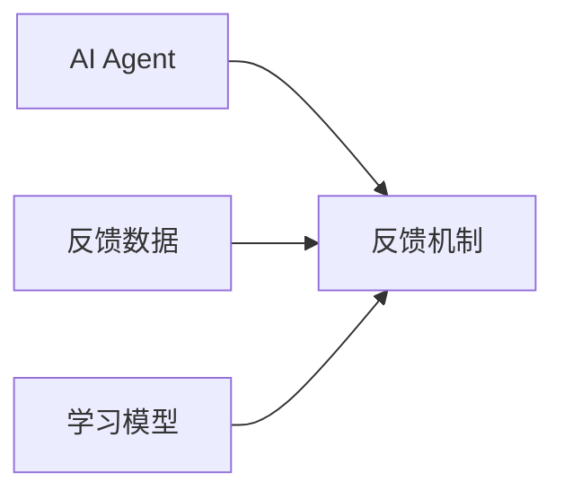
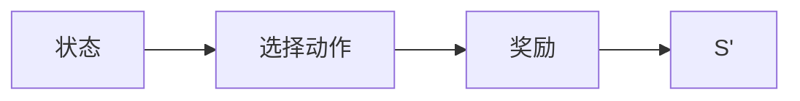
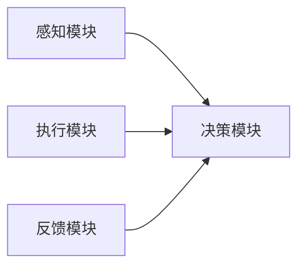

                 


# 构建AI Agent的反馈学习机制

> 关键词：AI Agent，反馈学习机制，强化学习，监督学习，系统架构，数学模型

> 摘要：本文详细探讨了构建AI Agent反馈学习机制的核心概念、算法原理、系统设计和项目实战。通过分析反馈学习机制的背景与概念，强化学习和监督学习的算法原理，系统架构设计，项目实战，以及总结与展望，为读者提供全面的指导。

---

# 第一部分: 构建AI Agent的反馈学习机制概述

## 第1章: 反馈学习机制的背景与概念

### 1.1 问题背景与描述

#### 1.1.1 AI Agent的基本概念
AI Agent（智能体）是指能够感知环境、做出决策并执行动作的智能系统。它可以是一个软件程序，也可以是一个物理机器人。AI Agent的核心目标是通过与环境的交互，实现预定的目标。

#### 1.1.2 反馈学习机制的定义
反馈学习机制是指AI Agent在执行动作后，根据环境的反馈（奖励或惩罚）来调整其行为策略的过程。这种机制类似于人类通过试错学习的方式，逐步优化自己的行为。

#### 1.1.3 问题解决的核心思路
在构建AI Agent的反馈学习机制时，核心思路是通过不断试错，利用反馈信息优化决策模型。具体来说，AI Agent会根据当前状态选择一个动作，执行该动作后获得反馈，然后根据反馈调整未来的行为策略。

#### 1.1.4 反馈学习机制的边界与外延
反馈学习机制的边界包括输入、模型、输出和反馈。外延则涉及强化学习、监督学习等多种机器学习方法。

#### 1.1.5 核心要素与概念结构
核心要素包括：
- 状态（State）：AI Agent所处的环境情况。
- 动作（Action）：AI Agent采取的行为。
- 反馈（Feedback）：环境对AI Agent行为的评价。
- 模型（Model）：AI Agent决策的依据。

### 1.2 反馈学习机制的核心概念与联系

#### 1.2.1 核心概念原理
反馈学习机制通过不断试错优化决策模型。AI Agent通过感知环境、选择动作、执行动作并获得反馈，不断调整策略。

#### 1.2.2 概念属性特征对比表格
| 概念     | 描述                                      |
|----------|-----------------------------------------|
| 状态     | 当前环境情况                              |
| 动作     | AI Agent采取的行为                        |
| 反馈     | 环境对动作的评价                          |
| 模型     | 决策的依据                                |

#### 1.2.3 ER实体关系图架构


## 第2章: 反馈学习机制的算法原理

### 2.1 算法原理讲解

#### 2.1.1 正向过程
AI Agent根据当前状态选择一个动作，并执行该动作。

#### 2.1.2 逆向过程
执行动作后，获得反馈（奖励或惩罚），并根据反馈调整模型参数。

#### 2.1.3 损失函数计算
损失函数用于衡量预测值与实际值之间的差异。
$$L = \frac{1}{2}(y - \hat{y})^2$$

### 2.2 数学模型与公式

#### 2.2.1 损失函数
$$L = \frac{1}{2}(y - \hat{y})^2$$

#### 2.2.2 梯度计算
$$\frac{\partial L}{\partial w} = (y - \hat{y})(x)$$

---

# 第二部分: 反馈学习机制的算法实现

## 第3章: 强化学习中的反馈机制

### 3.1 强化学习基础

#### 3.1.1 Q-learning算法
Q-learning是一种经典的强化学习算法，通过状态-动作价值函数（Q值）来优化决策。
$$Q(s, a) = Q(s, a) + \alpha (r + \gamma \max Q(s', a') - Q(s, a))$$

#### 3.1.2 算法流程


### 3.2 策略梯度方法

#### 3.2.1 策略梯度算法
策略梯度方法通过直接优化策略来最大化期望奖励。
$$\nabla \theta \leftarrow \frac{1}{N}\sum_{i=1}^{N} \nabla \log \pi_\theta(a|s) Q_\theta(s, a)$$

---

## 第4章: 监督学习中的反馈机制

### 4.1 监督学习基础

#### 4.1.1 监督学习与反馈机制的联系
在监督学习中，反馈机制通常表现为标签数据，用于指导模型的预测。

#### 4.1.2 案例分析
以图像分类为例，模型根据标签数据调整权重。

---

## 第5章: 系统设计与实现

### 5.1 系统架构设计

#### 5.1.1 系统功能设计
AI Agent的反馈学习机制系统包括感知模块、决策模块和执行模块。

#### 5.1.2 系统架构图


---

## 第6章: 项目实战

### 6.1 环境安装与配置

#### 6.1.1 安装Python和必要的库
安装Python和深度学习框架（如TensorFlow、PyTorch）。

### 6.2 核心实现代码

#### 6.2.1 强化学习代码示例
```python
def policy_gradient():
    for epoch in epochs:
        state = env.reset()
        while not done:
            action = policy_net(state)
            next_state, reward, done, _ = env.step(action)
            loss += calculate_loss(reward)
            policy_net.backward(loss)
            policy_net.update()
```

---

## 第7章: 总结与展望

### 7.1 总结
本文详细探讨了AI Agent反馈学习机制的核心概念、算法原理和系统设计。

### 7.2 注意事项
- 确保反馈机制的实时性和准确性。
- 注意模型的泛化能力。

### 7.3 拓展阅读
推荐阅读强化学习和监督学习的经典论文。

---

作者：AI天才研究院 & 禅与计算机程序设计艺术

