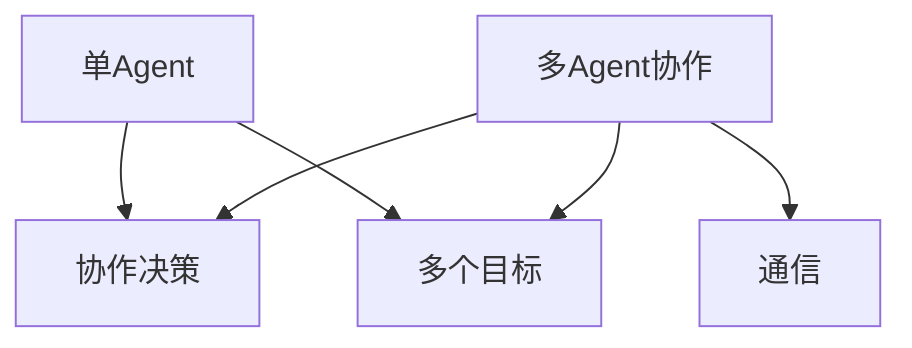
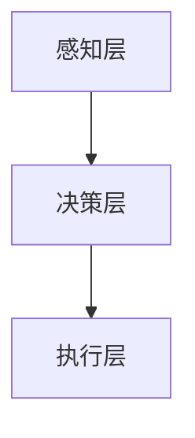

                 


# 构建AI Agent的多Agent协作决策系统

**关键词：** AI Agent, 多Agent系统, 协作决策, 系统架构, 算法原理

**摘要：**  
本文系统地探讨了构建AI Agent的多Agent协作决策系统的各个方面，从理论基础到实际应用。文章首先介绍了多Agent协作决策系统的背景和核心概念，然后详细分析了相关的算法原理，包括分布式计算、强化学习和联合推理。接着，从系统分析与架构设计的角度，阐述了系统的功能需求、架构设计和接口设计。最后，通过实际项目案例，展示了如何将理论应用于实践，并总结了最佳实践和未来研究方向。本文旨在为读者提供一个多维度的视角，帮助他们深入理解并掌握多Agent协作决策系统的构建方法。

---

# 第1章: 多Agent协作决策系统背景介绍

## 1.1 问题背景

### 1.1.1 当前AI Agent技术的发展现状
AI Agent（智能体）技术近年来发展迅速，广泛应用于自动驾驶、智能助手、机器人等领域。然而，单个Agent的能力有限，复杂任务的完成需要多个Agent协作完成。例如，在自动驾驶中，多个车辆需要通过协作避免碰撞，同时优化交通流量。

### 1.1.2 多Agent协作的必要性
在现实场景中，许多问题需要多个智能体协同完成。例如，城市交通系统中，多个自动驾驶车辆需要实时协作，以确保交通流畅且安全。单个Agent无法独立完成所有任务，协作是必然选择。

### 1.1.3 问题解决的意义与价值
通过构建多Agent协作决策系统，可以提高任务完成效率，降低系统复杂性。例如，在供应链管理中，多个Agent可以分别负责采购、生产和物流，通过协作实现最优的资源分配。

## 1.2 问题描述

### 1.2.1 多Agent协作的基本概念
多Agent协作是指多个智能体通过信息共享和任务分配，共同完成复杂任务的过程。每个Agent都有自己的目标和决策能力，通过协作实现整体目标。

### 1.2.2 系统的边界与外延
多Agent协作决策系统的边界包括内部Agent之间的交互、与外部环境的接口，以及系统的输入输出。外延则涉及系统的扩展性和灵活性。

### 1.2.3 核心问题的定义与分解
核心问题包括：如何实现Agent之间的通信与协作，如何设计高效的决策算法，如何保证系统的实时性和可靠性。

## 1.3 核心概念与联系

### 1.3.1 多Agent协作决策系统的概念结构
多Agent协作决策系统由多个智能体组成，每个Agent具有感知环境、决策和执行的能力。系统通过Agent之间的协作，实现复杂任务的完成。

### 1.3.2 核心要素组成与功能模块
- **感知模块**：负责获取环境信息。
- **决策模块**：基于感知信息做出决策。
- **协作模块**：与其他Agent通信并协调任务。
- **执行模块**：根据决策结果执行任务。

### 1.3.3 系统与外部环境的交互关系
系统通过输入接口获取环境信息，通过输出接口将决策结果传递给外部系统。与外部环境的交互是多Agent协作决策系统的重要组成部分。

---

# 第2章: 多Agent协作决策系统的核心概念与联系

## 2.1 核心概念原理

### 2.1.1 Agent的基本定义与特征
Agent是一种能够感知环境并采取行动以实现目标的实体。其特征包括自主性、反应性、社交性和学习性。

### 2.1.2 多Agent协作的基本原理
多Agent协作通过信息共享和任务分配，实现多个Agent的协同工作。协作过程包括通信、协商和协调。

### 2.1.3 系统决策机制的核心要素
- **信息共享**：Agent之间共享感知到的信息。
- **任务分配**：根据Agent的能力分配任务。
- **协作决策**：基于共享信息做出集体决策。

## 2.2 核心概念属性特征对比

| **属性**       | **单Agent**            | **多Agent协作**          |
|-----------------|------------------------|--------------------------|
| **目标**        | 单一目标              | 多个目标                |
| **决策**        | 独立决策              | 协作决策                |
| **通信**        | 无通信                | 需要通信                |



## 2.3 ER实体关系图架构

```mermaid
erd
actor 用户
actor 系统
actor 环境
```

---

# 第3章: 多Agent协作决策系统的算法原理

## 3.1 分布式计算与协作算法

### 3.1.1 分布式计算的基本原理
分布式计算将任务分解成多个子任务，分别在不同的计算节点上执行。通过协调各个节点的计算结果，最终得到整体结果。

### 3.1.2 协作算法的实现步骤
1. **任务分解**：将整体任务分解为多个子任务。
2. **任务分配**：根据Agent的能力分配任务。
3. **子任务计算**：每个Agent独立完成分配的子任务。
4. **结果汇总**：将子任务结果汇总，得到整体结果。

### 3.1.3 算法的数学模型与公式

$$
\text{总任务} = \sum_{i=1}^{n} \text{子任务}_i
$$

其中，$n$ 是子任务的数量。

---

## 3.2 强化学习与决策优化

### 3.2.1 强化学习的基本概念
强化学习是一种通过试错方式学习策略的方法。Agent通过与环境的交互，学习最优策略。

### 3.2.2 决策优化的数学模型
$$
V(s) = \max_{a} Q(s, a)
$$

其中，$V(s)$ 是状态 $s$ 的值函数，$Q(s, a)$ 是状态-动作对 $(s, a)$ 的Q值。

### 3.2.3 算法的实现与应用
```python
def强化学习算法():
    初始化Q表
    while True:
        状态s = 获取当前状态
        动作a = 选择动作（探索或利用）
        新状态s' = 执行动作a后的状态
        奖励r = 获取奖励
        Q(s, a) += 学习率 * (r + γ * max(Q(s', a')))
    返回最优策略
```

---

## 3.3 联合推理与协作决策

### 3.3.1 联合推理的基本原理
联合推理是指多个Agent共同推理，基于共享信息做出决策。

### 3.3.2 协作决策的实现方法
1. **信息共享**：Agent之间共享感知到的信息。
2. **协商与协调**：通过协商确定任务分配和决策。
3. **联合推理**：基于共享信息进行推理，得出最优决策。

### 3.3.3 算法的优化与改进
通过改进通信机制和推理算法，提高协作效率和决策准确性。

---

# 第4章: 多Agent协作决策系统的系统分析与架构设计

## 4.1 系统分析

### 4.1.1 问题场景介绍
以城市交通系统为例，多个自动驾驶车辆需要协作，以避免碰撞并优化交通流量。

### 4.1.2 系统功能需求分析
- **车辆定位**：实时获取车辆的位置信息。
- **路径规划**：为每个车辆规划最优路径。
- **协作决策**：车辆之间协作，避免碰撞。

### 4.1.3 系统性能指标设计
- **响应时间**：系统对环境变化的响应时间。
- **决策准确率**：决策的正确性。
- **系统稳定性**：系统的健壮性。

---

## 4.2 系统架构设计

### 4.2.1 系统架构的总体设计
采用分层架构，包括感知层、决策层和执行层。

### 4.2.2 系统架构的详细设计



### 4.2.3 系统架构的实现步骤
1. **感知层**：获取环境信息。
2. **决策层**：基于感知信息做出决策。
3. **执行层**：执行决策结果。

---

## 4.3 系统接口设计

### 4.3.1 系统接口的定义
- **输入接口**：接收环境信息。
- **输出接口**：输出决策结果。

### 4.3.2 系统接口的实现
通过标准接口实现与其他系统和Agent的通信。

---

## 4.4 系统交互设计

### 4.4.1 系统交互的定义
系统与外部环境的交互，包括与其他Agent和外部系统的通信。

### 4.4.2 系统交互的实现
通过通信协议实现系统与其他Agent的交互。

---

# 第5章: 多Agent协作决策系统的项目实战

## 5.1 环境安装

### 5.1.1 安装Python环境
安装Python 3.8以上版本，并安装必要的库（如numpy、pandas、scikit-learn等）。

### 5.1.2 安装依赖项
安装必要的依赖项，如`pip install numpy`。

## 5.2 系统核心实现源代码

### 5.2.1 Agent类的实现
```python
class Agent:
    def __init__(self, id):
        self.id = id
        self.state = None
    def感知(self):
        # 获取环境信息
    def决策(self):
        # 基于感知信息做出决策
    def执行(self):
        # 执行决策
```

### 5.2.2 协作决策算法的实现
```python
class CollaborationAlgorithm:
    def __init__(self, agents):
        self.agents = agents
    def协作(self):
        # 实现协作算法
```

---

## 5.3 实际案例分析与详细讲解剖析

### 5.3.1 案例介绍
以自动驾驶车辆协作为例，展示如何通过多Agent协作实现交通优化。

### 5.3.2 案例分析
分析案例中的Agent设计、协作算法和系统架构。

---

## 5.4 项目小结

### 5.4.1 项目实现的关键点
- **Agent设计**：实现感知、决策和执行功能。
- **协作算法**：实现多Agent协作。
- **系统架构**：设计合理的系统架构。

### 5.4.2 项目实现的注意事项
- **通信机制**：确保Agent之间的通信顺畅。
- **任务分配**：合理分配任务，提高协作效率。
- **系统优化**：优化算法和系统架构，提高性能。

---

# 第6章: 多Agent协作决策系统的高级主题

## 6.1 边缘计算与多Agent协作

### 6.1.1 边缘计算的基本概念
边缘计算是一种分布式计算范式，数据在靠近数据源的边缘设备上进行处理。

### 6.1.2 边缘计算与多Agent协作的结合
通过边缘计算，实现多Agent协作的实时性和高效性。

## 6.2 多Agent协作决策系统的安全性

### 6.2.1 安全风险分析
分析多Agent协作系统中的安全风险，如通信被截获、恶意Agent等。

### 6.2.2 安全防护措施
通过加密通信、身份认证等措施，提高系统的安全性。

---

# 第7章: 总结与展望

## 7.1 总结

### 7.1.1 核心内容回顾
回顾本文的核心内容，包括多Agent协作决策系统的背景、核心概念、算法原理、系统设计和项目实战。

### 7.1.2 最佳实践 tips
总结多Agent协作决策系统设计和实现的最佳实践，如合理设计系统架构、优化协作算法等。

### 7.1.3 注意事项
提醒读者在设计和实现多Agent协作决策系统时需要注意的问题，如通信延迟、系统复杂性等。

## 7.2 展望

### 7.2.1 未来的研究方向
探讨多Agent协作决策系统的未来研究方向，如强化学习在协作中的应用、边缘计算与协作的结合等。

### 7.2.2 技术的发展趋势
分析多Agent协作决策技术的发展趋势，如向更智能化、自动化方向发展。

---

**作者：AI天才研究院/AI Genius Institute & 禅与计算机程序设计艺术 /Zen And The Art of Computer Programming**

