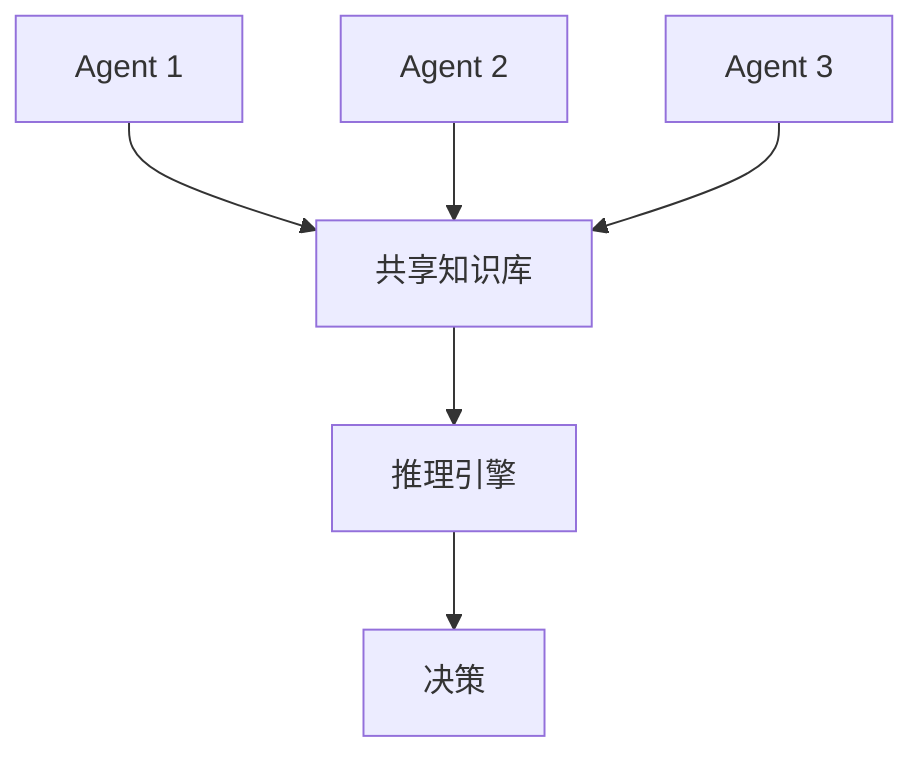
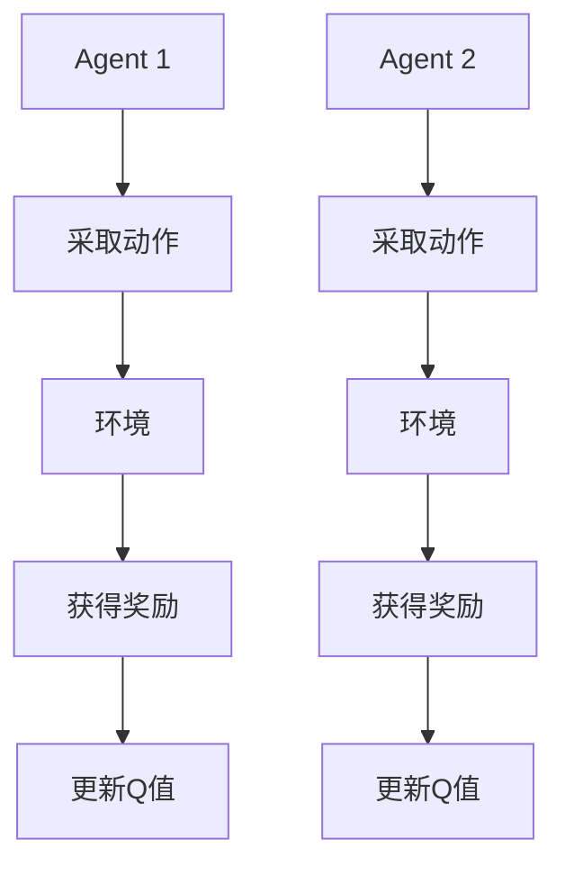

                 


# 构建AI Agent的多Agent协作学习系统

## 关键词：AI Agent, 多Agent协作学习, 分布式强化学习, 知识共享, 协作学习系统

## 摘要：  
本文系统地探讨了构建AI Agent的多Agent协作学习系统的各个方面，从基础概念到高级算法，从系统设计到实际应用，层层深入。文章首先介绍了AI Agent和多Agent协作学习的基本概念，接着详细阐述了多Agent协作学习的核心原理、算法和数学模型，随后分析了系统的架构设计和实现方法。最后，通过实际案例展示了如何在项目中实现多Agent协作学习，并提出了未来研究方向和最佳实践建议。

---

## 第一部分: AI Agent与多Agent协作学习系统基础

### 第1章: AI Agent与多Agent协作学习系统概述

#### 1.1 AI Agent的基本概念

##### 1.1.1 AI Agent的定义与特点
AI Agent（人工智能代理）是指能够感知环境、自主决策并执行任务的智能实体。AI Agent的特点包括：
- **自主性**：能够自主决策，无需外部干预。
- **反应性**：能够实时感知环境并做出反应。
- **学习性**：能够通过经验改进自身的性能。
- **协作性**：能够与其他Agent或人类进行协作。

**AI Agent与传统程序的区别**：  
AI Agent不仅仅是被动执行指令的程序，而是能够主动感知环境、推理并采取行动的智能体。

##### 1.1.2 多Agent系统的基本概念
多Agent系统是指由多个相互作用的AI Agent组成的系统，这些Agent可以协作或竞争以完成复杂的任务。多Agent系统的特点包括：
- **分布性**：多个Agent分布在不同的节点上。
- **协作性**：Agent之间可以通过通信和协作完成共同目标。
- **动态性**：环境和任务可能是动态变化的。

##### 1.1.3 多Agent协作学习系统的背景与意义
随着AI技术的发展，多Agent协作学习系统在许多领域得到了广泛应用，例如自动驾驶、机器人协作、分布式计算等。多Agent协作学习系统的意义在于：
- **提高系统性能**：通过协作，多个Agent可以共同完成复杂的任务，从而提高整体性能。
- **增强系统鲁棒性**：多个Agent的协作可以分担任务，减少单点故障。

#### 1.2 多Agent协作学习的核心思想

##### 1.2.1 多Agent协作的基本原理
多Agent协作学习的核心思想是通过多个Agent之间的协作来实现共同目标。协作可以通过以下方式进行：
- **任务分配**：将任务分解为多个子任务，分配给不同的Agent。
- **知识共享**：Agent之间共享知识和信息，以提高整体的决策能力。
- **协同推理**：Agent之间通过推理和协作，共同解决问题。

##### 1.2.2 协作学习的定义与特点
协作学习是指多个Agent通过协作来提高学习效果的过程。协作学习的特点包括：
- **分布式学习**：学习过程分布在多个Agent中。
- **知识共享**：Agent之间共享知识和经验。
- **动态适应**：协作学习系统能够适应动态变化的环境。

##### 1.2.3 多Agent协作学习的典型应用场景
多Agent协作学习在以下领域有广泛应用：
- **自动驾驶**：多个自动驾驶车辆通过协作来实现交通优化。
- **机器人协作**：多个机器人通过协作完成复杂的任务。
- **分布式计算**：多个计算节点通过协作完成大规模计算任务。

---

### 第2章: 多Agent协作学习系统的核心概念

#### 2.1 多Agent协作学习系统的组成要素

##### 2.1.1 Agent的属性与行为模型
Agent的属性包括：
- **状态**：Agent的当前情况，例如位置、任务进度等。
- **行为**：Agent根据当前状态和环境信息采取的行动。
- **目标**：Agent需要完成的任务或目标。

**Agent的行为模型**：  
Agent的行为可以通过状态、动作和目标来描述。例如，一个自动驾驶车辆的Agent可以根据当前的交通状况和位置决定是否变道。

##### 2.1.2 任务分配与协作机制
任务分配是指将任务分解为多个子任务，并分配给不同的Agent。协作机制包括：
- **任务分配**：将任务分配给不同的Agent。
- **通信与协调**：Agent之间通过通信和协调来完成任务。
- **冲突解决**：当Agent之间出现冲突时，通过协商解决。

##### 2.1.3 知识共享与协同推理
知识共享是指Agent之间共享知识和信息。协同推理是指Agent之间通过推理和协作来解决问题。知识共享和协同推理是多Agent协作学习系统的核心。

**知识共享的流程图**：  


#### 2.2 多Agent协作学习的数学模型

##### 2.2.1 Agent的数学表示
Agent可以表示为一个函数，输入是环境信息，输出是动作。例如：
$$
a = f(s)
$$
其中，$s$是状态，$a$是动作。

##### 2.2.2 协作学习的数学框架
协作学习的数学框架包括：
- **任务分配**：将任务分配给不同的Agent，可以用数学模型描述。
- **知识共享**：Agent之间共享知识，可以用概率模型描述。
- **协同推理**：Agent之间通过推理协作，可以用逻辑推理模型描述。

##### 2.2.3 知识共享的数学模型
知识共享的数学模型可以用概率分布来表示。例如，Agent 1和Agent 2共享知识，可以用联合概率分布来表示：
$$
P(s_1, s_2) = P(s_1) \cdot P(s_2 | s_1)
$$

---

### 第3章: 多Agent协作学习的算法原理

#### 3.1 分布式强化学习算法

##### 3.1.1 分布式强化学习的基本原理
分布式强化学习是一种多Agent协作学习的算法，多个Agent通过协作来学习策略。分布式强化学习的基本原理包括：
- **策略更新**：每个Agent根据自己的经验更新策略。
- **协作机制**：Agent之间通过协作机制来协调动作。

##### 3.1.2 多智能体Q-learning算法
多智能体Q-learning算法是一种常用的分布式强化学习算法。其核心思想是多个Agent通过协作来更新Q值。算法流程图如下：


##### 3.1.3 马尔可夫博弈与纳什均衡
马尔可夫博弈是一种多Agent协作学习的模型，纳什均衡是博弈论中的一个概念，表示多个Agent在协作中的平衡点。纳什均衡的定义是：
$$
\text{如果每个Agent都在当前策略下无法通过单方面改变策略而提高收益，则达到了纳什均衡。}
$$

#### 3.2 协作学习的数学模型与公式

##### 3.2.1 协作学习的数学表达式
协作学习的数学表达式可以用以下公式表示：
$$
Q(s_1, s_2, \dots, s_n) = \sum_{i=1}^n Q_i(s_i)
$$
其中，$Q_i(s_i)$是Agent $i$在状态$s_i$下的Q值。

##### 3.2.2 知识共享的数学公式
知识共享的数学公式可以用以下公式表示：
$$
P(s_1, s_2, \dots, s_n) = \prod_{i=1}^n P(s_i | s_{i-1})
$$
其中，$P(s_i | s_{i-1})$是状态$s_i$在状态$s_{i-1}$下的条件概率。

##### 3.2.3 协作学习的收敛性分析
协作学习的收敛性分析表明，当多个Agent协作时，系统的收敛速度取决于协作机制和算法设计。例如，多智能体Q-learning算法的收敛性可以通过以下公式表示：
$$
\lim_{t \to \infty} Q(s, a) = V^*(s)
$$
其中，$V^*(s)$是状态$s$下的最优值函数。

---

### 第4章: 多Agent协作学习系统的架构设计

#### 4.1 系统功能设计

##### 4.1.1 Agent行为设计
Agent的行为设计包括：
- **感知**：Agent通过传感器感知环境。
- **决策**：Agent根据感知信息做出决策。
- **执行**：Agent执行决策的动作。

##### 4.1.2 任务分配与协作机制
任务分配与协作机制包括：
- **任务分配**：将任务分配给不同的Agent。
- **通信与协调**：Agent之间通过通信和协调来完成任务。
- **冲突解决**：当Agent之间出现冲突时，通过协商解决。

##### 4.1.3 知识共享与协同推理
知识共享与协同推理包括：
- **知识共享**：Agent之间共享知识和信息。
- **协同推理**：Agent之间通过推理和协作来解决问题。

#### 4.2 系统架构设计

##### 4.2.1 分层架构设计
分层架构设计包括：
- **感知层**：负责感知环境。
- **决策层**：负责决策和推理。
- **执行层**：负责执行动作。

##### 4.2.2 分布式架构设计
分布式架构设计包括：
- **分布式计算**：多个Agent分布在不同的节点上。
- **通信与协调**：Agent之间通过通信和协调来完成任务。
- **动态适应**：系统能够适应动态变化的环境。

##### 4.2.3 混合架构设计
混合架构设计结合了分层架构和分布式架构，具有以下特点：
- **层次化结构**：多个层次结构，每个层次负责不同的功能。
- **分布式协作**：多个Agent通过协作来完成任务。

---

### 第5章: 多Agent协作学习系统的实现

#### 5.1 项目实战

##### 5.1.1 环境安装
要实现多Agent协作学习系统，需要安装以下环境：
- **Python**：用于编程和计算。
- **TensorFlow**：用于深度学习。
- **Mermaid**：用于绘制图表。

##### 5.1.2 系统核心实现
以下是多Agent协作学习系统的Python代码示例：
```python
import random

class Agent:
    def __init__(self, id):
        self.id = id
        self.q_values = {}
    
    def take_action(self, state):
        return random.choice(actions)
    
    def update_q_values(self, state, action, reward):
        self.q_values[(state, action)] = reward

# 初始化多个Agent
agents = [Agent(i) for i in range(3)]

# 环境
class Environment:
    def __init__(self):
        self.state = 'start'
    
    def get_reward(self, action):
        if action == 'good':
            return 1
        else:
            return -1

# 实验
env = Environment()
for agent in agents:
    state = env.state
    action = agent.take_action(state)
    reward = env.get_reward(action)
    agent.update_q_values(state, action, reward)
```

##### 5.1.3 实际案例分析
以下是多Agent协作学习系统的一个实际案例分析：
- **场景**：多个自动驾驶车辆在道路上行驶。
- **任务**：通过协作避免碰撞，实现交通优化。
- **实现**：每个车辆的Agent通过感知环境、决策和执行动作来实现协作。

---

## 第二部分: 高级主题与未来展望

### 第6章: 多Agent协作学习系统的高级主题

#### 6.1 多Agent协作学习的前沿研究
多Agent协作学习的前沿研究包括：
- **分布式强化学习**：研究如何在分布式环境下实现强化学习。
- **知识共享与协同推理**：研究如何通过知识共享和协同推理提高系统的性能。

#### 6.2 多Agent协作学习系统的挑战
多Agent协作学习系统的挑战包括：
- **任务分配**：如何将任务分配给不同的Agent。
- **通信与协调**：如何实现Agent之间的通信和协调。
- **动态适应**：如何适应动态变化的环境。

#### 6.3 多Agent协作学习的未来趋势
多Agent协作学习的未来趋势包括：
- **智能化**：通过智能化技术提高系统的性能。
- **分布式计算**：通过分布式计算实现大规模的协作。
- **人机协作**：研究人与Agent之间的协作。

---

## 第三部分: 总结与展望

### 第7章: 总结与展望

#### 7.1 全文总结
本文系统地探讨了构建AI Agent的多Agent协作学习系统的各个方面，从基础概念到高级算法，从系统设计到实际应用，层层深入。文章首先介绍了AI Agent和多Agent协作学习的基本概念，接着详细阐述了多Agent协作学习的核心原理、算法和数学模型，随后分析了系统的架构设计和实现方法。最后，通过实际案例展示了如何在项目中实现多Agent协作学习，并提出了未来研究方向和最佳实践建议。

#### 7.2 未来展望
未来，多Agent协作学习系统将在以下几个方面继续发展：
- **智能化**：通过智能化技术提高系统的性能。
- **分布式计算**：通过分布式计算实现大规模的协作。
- **人机协作**：研究人与Agent之间的协作。

---

## 作者信息

作者：AI天才研究院/AI Genius Institute & 禅与计算机程序设计艺术 /Zen And The Art of Computer Programming

