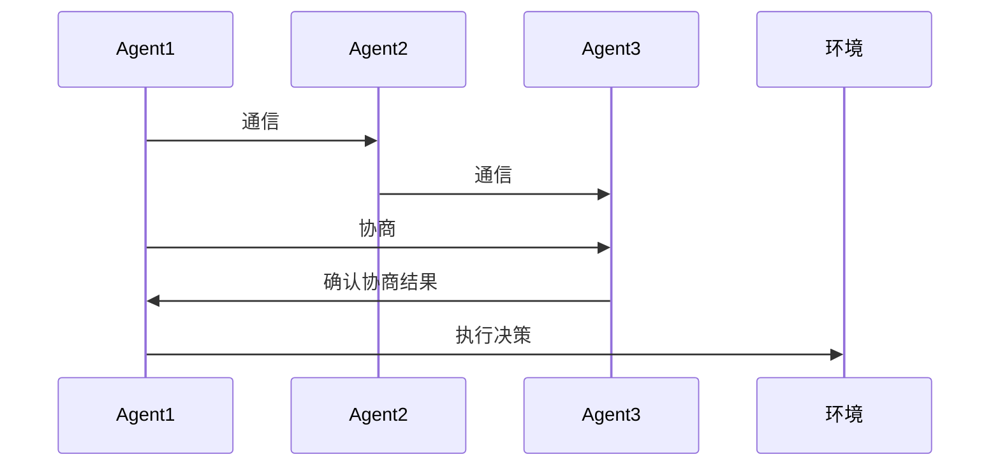

                 


# 构建AI Agent的多Agent协商与决策系统

> 关键词：AI Agent, 多Agent系统, 协商与决策, 人工智能, 系统架构

> 摘要：本文详细探讨了构建AI Agent的多Agent协商与决策系统的各个方面，从基本概念到算法实现，从系统架构到项目实战，结合实际案例和数学模型，全面分析了多Agent协商与决策系统的核心原理和实现方法。

---

# 第一部分：多Agent协商与决策系统背景介绍

## 第1章：多Agent系统概述

### 1.1 多Agent系统的基本概念

#### 1.1.1 什么是多Agent系统
多Agent系统（Multi-Agent System, MAS）是由多个智能体（Agent）组成的分布式系统，这些智能体能够通过协作完成复杂的任务。每个Agent都是一个独立的实体，具备感知环境、自主决策和与其它Agent通信的能力。

#### 1.1.2 多Agent系统的特点
- **分布性**：Agent分布在不同的位置，能够独立运行。
- **协作性**：Agent之间通过协作完成共同目标。
- **动态性**：环境和任务可能是动态变化的。
- **智能性**：每个Agent都具备一定的智能性，能够进行推理和决策。

#### 1.1.3 多Agent系统与单Agent系统的区别
- **单Agent系统**：只有一个智能体，负责完成所有任务。
- **多Agent系统**：多个智能体协作，任务分配更灵活，能够处理更复杂的任务。

### 1.2 AI Agent的发展历程

#### 1.2.1 Agent的基本概念
Agent是指能够感知环境并采取行动以实现目标的实体。Agent可以是软件程序、机器人或其他智能设备。

#### 1.2.2 AI Agent的定义与分类
- **定义**：AI Agent是具备人工智能的智能体，能够通过学习和推理完成复杂任务。
- **分类**：
  - **简单反射Agent**：基于当前感知做出反应。
  - **基于模型的反射Agent**：利用内部模型进行推理。
  - **目标驱动Agent**：基于目标进行决策。
  - **效用驱动Agent**：通过最大化效用函数进行决策。

#### 1.2.3 多Agent系统的历史发展
多Agent系统的发展经历了从简单协作到复杂协作的演变。早期的多Agent系统主要用于分布式计算，现代则广泛应用于人工智能领域。

### 1.3 多Agent协商与决策系统的背景

#### 1.3.1 协商与决策的定义
- **协商**：多个Agent之间通过通信达成一致的过程。
- **决策**：Agent基于当前信息做出选择的过程。

#### 1.3.2 多Agent协商与决策的必要性
在复杂的任务环境中，单个Agent难以完成所有任务，因此需要多个Agent协作完成任务。协商和决策是协作的核心。

#### 1.3.3 多Agent协商与决策的应用场景
- **分布式计算**：任务分解和资源分配。
- **机器人协作**：多机器人团队协作完成任务。
- **智能交通系统**：车辆之间的协作与决策。

### 1.4 本章小结
本章介绍了多Agent系统的基本概念、特点、分类以及多Agent协商与决策系统的背景和应用场景。

---

## 第2章：多Agent协商的原理与机制

### 2.1 多Agent协商的基本原理

#### 2.1.1 协商的基本概念
协商是多个Agent之间通过通信达成一致的过程。协商的目标是找到一个满足所有参与者的解决方案。

#### 2.1.2 多Agent协商的分类
- **同步协商**：所有Agent同时参与协商。
- **异步协商**：Agent按轮次进行协商。
- **分布式协商**：Agent在不同的位置独立进行协商。

#### 2.1.3 协商的过程与阶段
1. **初始化**：确定协商的目标和参与Agent。
2. **信息交换**：Agent之间交换信息。
3. **协商过程**：基于信息交换，达成一致。
4. **结果确认**：确认协商结果并执行。

### 2.2 多Agent协商的算法与实现

#### 2.2.1 基于分布式计算的协商算法
- **分布式协商算法**：Agent在分布式环境中通过通信达成一致。
- **数学模型**：
  $$ \text{协商结果} = \arg\min_{x} \sum_{i=1}^{n} d(x_i, x) $$
  其中，$d(x_i, x)$ 表示第i个Agent的偏好距离。

#### 2.2.2 基于博弈论的协商机制
- **博弈论模型**：Agent在协商中选择策略，以最大化自身效用。
- **纳什均衡**：所有Agent的策略组合达到均衡状态。

#### 2.2.3 基于规则的协商方法
- **规则驱动协商**：基于预定义的规则进行协商。
- **规则示例**：
  如果 Agent A 的需求优先级高于 Agent B，则 Agent A 的需求优先满足。

### 2.3 协商中的冲突解决与优化

#### 2.3.1 冲突的定义与分类
- **冲突**：协商过程中出现的矛盾或不一致。
- **分类**：资源冲突、目标冲突、信息冲突。

#### 2.3.2 冲突解决的策略与方法
- **协商解决**：通过进一步协商解决冲突。
- **仲裁解决**：引入第三方仲裁机构。
- **优先级解决**：基于优先级进行冲突解决。

#### 2.3.3 协商优化的技巧与实践
- **信息共享**：尽可能共享信息以减少冲突。
- **灵活策略**：制定灵活的协商策略以适应变化。

### 2.4 本章小结
本章详细讲解了多Agent协商的基本原理、算法与实现，以及冲突解决与优化的策略和方法。

---

## 第3章：多Agent决策系统的原理与实现

### 3.1 多Agent决策的基本原理

#### 3.1.1 决策的基本概念
决策是指Agent基于当前信息做出选择的过程。

#### 3.1.2 多Agent决策的特点
- **分布式决策**：每个Agent独立做出决策。
- **动态决策**：环境动态变化，决策需要实时调整。
- **协同决策**：多个Agent协作完成决策。

#### 3.1.3 决策的过程与阶段
1. **信息收集**：Agent感知环境信息。
2. **信息处理**：对信息进行分析和处理。
3. **决策制定**：基于信息处理结果制定决策。
4. **决策执行**：将决策转化为行动。

### 3.2 基于机器学习的多Agent决策

#### 3.2.1 机器学习在决策中的应用
- **监督学习**：基于标记数据进行训练。
- **无监督学习**：基于无标记数据进行聚类。
- **强化学习**：通过奖励机制优化决策。

#### 3.2.2 基于深度学习的决策模型
- **神经网络模型**：使用深度神经网络进行决策。
- **数学模型**：
  $$ Q(s, a) = \alpha Q(s, a) + (1 - \alpha) r $$
  其中，$Q(s, a)$ 是状态-动作值，$\alpha$ 是学习率，$r$ 是奖励。

#### 3.2.3 基于强化学习的决策方法
- **Q-learning算法**：通过Q值更新进行决策优化。
- **数学模型**：
  $$ Q(s, a) \leftarrow Q(s, a) + \alpha [r + \gamma \max Q(s', a')] - Q(s, a) $$

### 3.3 多Agent决策中的挑战与解决方案

#### 3.3.1 决策中的不确定性问题
- **不确定性来源**：环境动态变化、信息不完整。
- **解决方案**：使用概率模型和贝叶斯推理。

#### 3.3.2 决策中的计算复杂度问题
- **计算复杂度**：多Agent决策需要考虑多个因素。
- **解决方案**：分布式计算和并行处理。

#### 3.3.3 决策优化的策略与方法
- **启发式优化**：基于启发式规则优化决策。
- **数学优化**：使用数学规划方法优化决策。

### 3.4 本章小结
本章详细讲解了多Agent决策的基本原理、机器学习在决策中的应用，以及决策中的挑战与解决方案。

---

## 第4章：多Agent协商算法的数学模型与实现

### 4.1 基于分布式计算的协商算法

#### 4.1.1 分布式协商算法的数学模型
$$ f(x) = \sum_{i=1}^{n} w_i x_i $$
其中，$w_i$ 是权重，$x_i$ 是第i个Agent的偏好。

#### 4.1.2 分布式协商算法的实现步骤
1. 初始化：确定协商目标和权重。
2. 信息交换：Agent之间交换信息。
3. 计算：基于数学模型计算协商结果。
4. 结果确认：确认协商结果并执行。

#### 4.1.3 分布式协商算法的优缺点分析
- **优点**：计算简单，适用于大规模分布式系统。
- **缺点**：协商结果可能不满足所有Agent的需求。

### 4.2 基于博弈论的协商算法

#### 4.2.1 博弈论的基本概念与数学模型
$$ \text{效用函数} = u(x_1, x_2, ..., x_n) $$
其中，$x_i$ 是第i个Agent的策略，$u$ 是效用函数。

#### 4.2.2 基于博弈论的协商算法实现
1. 初始化：确定博弈规则和效用函数。
2. 策略选择：每个Agent选择自己的策略。
3. 纳什均衡：计算纳什均衡点。
4. 结果确认：确认协商结果并执行。

#### 4.2.3 基于博弈论的协商算法优化
- **纳什均衡优化**：通过调整博弈规则优化纳什均衡。
- **数学模型**：
  $$ \text{最优策略} = \arg\max_{x} u(x) $$

### 4.3 基于规则的协商算法

#### 4.3.1 基于规则的协商算法的数学模型
$$ \text{协商结果} = \bigcap_{i=1}^{n} R_i $$
其中，$R_i$ 是第i个Agent的规则集合。

#### 4.3.2 基于规则的协商算法实现
1. 初始化：确定规则集合。
2. 信息交换：Agent之间交换规则。
3. 规则交集：计算所有规则的交集。
4. 结果确认：确认协商结果并执行。

#### 4.3.3 基于规则的协商算法的适用场景
- **适用场景**：规则明确，协商结果要求一致。

### 4.4 本章小结
本章详细讲解了多Agent协商算法的数学模型与实现，包括分布式计算、博弈论和基于规则的协商算法。

---

## 第5章：多Agent决策算法的数学模型与实现

### 5.1 基于机器学习的决策算法

#### 5.1.1 机器学习在决策中的数学模型
$$ f(x) = \sum_{i=1}^{n} \theta_i x_i $$
其中，$\theta_i$ 是权重，$x_i$ 是特征。

#### 5.1.2 基于深度学习的决策算法实现
1. 初始化：确定神经网络结构和参数。
2. 训练：基于训练数据更新参数。
3. 预测：基于训练好的模型进行预测。

#### 5.1.3 基于强化学习的决策方法
- **Q-learning算法**：通过Q值更新进行决策优化。
- **数学模型**：
  $$ Q(s, a) \leftarrow Q(s, a) + \alpha [r + \gamma \max Q(s', a')] - Q(s, a) $$

### 5.2 基于概率论的决策算法

#### 5.2.1 概率论在决策中的数学模型
$$ P(A|B) = \frac{P(B|A)P(A)}{P(B)} $$
其中，$P(A|B)$ 是条件概率。

#### 5.2.2 基于概率论的决策算法实现
1. 初始化：确定概率分布和决策规则。
2. 信息处理：基于概率分布进行信息处理。
3. 决策制定：基于信息处理结果制定决策。
4. 决策执行：将决策转化为行动。

#### 5.2.3 基于概率论的决策算法优化
- **贝叶斯推理**：通过贝叶斯推理优化决策。
- **数学模型**：
  $$ P(A|B) = \frac{P(B|A)P(A)}{P(B)} $$

### 5.3 本章小结
本章详细讲解了多Agent决策算法的数学模型与实现，包括基于机器学习、概率论的决策算法。

---

## 第6章：系统架构与交互设计

### 6.1 问题场景介绍
在多Agent协商与决策系统中，需要设计一个高效的架构来支持多个Agent之间的通信与协作。

### 6.2 系统功能设计

#### 6.2.1 领域模型（Mermaid类图）
```mermaid
classDiagram
    class Agent {
        - id: int
        - preferences: dict
        - decision: dict
        +协商(其他Agent): void
        +决策(): void
    }
    class 环境 {
        - state: dict
        +获取状态(): dict
    }
    Agent -> 环境: 感知环境
    Agent --> Agent: 通信
```

### 6.3 系统架构设计（Mermaid架构图）


### 6.4 系统接口设计
- **协商接口**：支持Agent之间的通信与协商。
- **决策接口**：支持Agent的决策制定与执行。

### 6.5 系统交互（Mermaid序列图）


### 6.6 本章小结
本章详细介绍了多Agent协商与决策系统的架构设计、接口设计和交互流程。

---

## 第7章：项目实战

### 7.1 环境安装
- **Python**：安装Python 3.x。
- **依赖库**：安装numpy、scipy、matplotlib。

### 7.2 系统核心实现源代码
```python
class Agent:
    def __init__(self, id):
        self.id = id
        self.preferences = {}
        self.decision = {}

    def协商(self, 其他Agent):
        # 实现协商逻辑
        pass

    def 决策(self):
        # 实现决策逻辑
        pass

def main():
    # 初始化多个Agent
    agent1 = Agent(1)
    agent2 = Agent(2)
    agent3 = Agent(3)

    # 调用协商方法
    agent1.协商(agent2)
    agent2.协商(agent3)
    agent3.协商(agent1)

    # 调用决策方法
    agent1.决策()
    agent2.决策()
    agent3.决策()

if __name__ == "__main__":
    main()
```

### 7.3 代码应用解读与分析
- **Agent类**：定义了Agent的基本属性和方法。
- **协商方法**：实现了Agent之间的协商逻辑。
- **决策方法**：实现了Agent的决策逻辑。

### 7.4 案例分析与详细讲解
- **案例**：三个Agent协商资源分配。
- **分析**：通过协商和决策过程，实现资源的合理分配。

### 7.5 项目小结
本章通过具体案例展示了多Agent协商与决策系统的实现过程，包括环境安装、核心代码实现、案例分析和项目总结。

---

## 第8章：最佳实践与注意事项

### 8.1 最佳实践 tips
- **信息共享**：尽可能共享信息以减少冲突。
- **灵活策略**：制定灵活的协商策略以适应变化。
- **优化算法**：选择合适的算法优化协商与决策过程。

### 8.2 小结
通过本文的详细讲解，读者可以全面理解多Agent协商与决策系统的核心原理和实现方法。

### 8.3 注意事项
- **系统复杂性**：多Agent系统复杂，需要仔细设计。
- **安全性问题**：注意协商与决策过程中的安全性问题。
- **可扩展性**：设计时考虑系统的可扩展性。

### 8.4 拓展阅读
- **推荐书籍**：《Multi-Agent Systems: Algorithm and Applications》
- **推荐论文**：《A Survey on Multi-Agent Negotiation and Decision-Making》

---

## 作者信息

作者：AI天才研究院/AI Genius Institute & 禅与计算机程序设计艺术 /Zen And The Art of Computer Programming

---

以上是《构建AI Agent的多Agent协商与决策系统》的技术博客文章的详细内容，涵盖了从背景介绍到系统实现的各个方面，结合实际案例和数学模型，全面分析了多Agent协商与决策系统的核心原理和实现方法。

