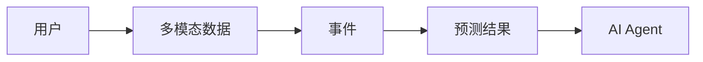
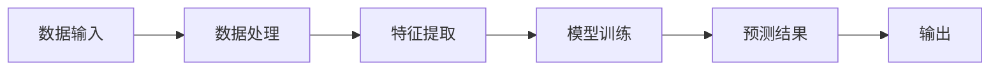

                 

# 《构建AI Agent的多模态事件预测系统》

---

## 关键词：  
AI Agent, 多模态数据, 事件预测, 深度学习, 多模态融合, 机器学习, 事件检测

---

## 摘要：  
本文章详细讲解了如何构建一个基于多模态数据的AI Agent事件预测系统。从系统背景、核心概念、算法原理、系统架构到项目实战，全面剖析了构建该系统的各个关键环节。文章内容涵盖了多模态数据的处理方法、事件预测的数学模型、AI Agent的决策机制，以及系统的整体架构设计。通过丰富的案例分析和详细的代码实现，帮助读者深入理解并掌握构建此类系统的技能。  

---

# 第一部分：AI Agent与多模态事件预测系统概述  

## 第1章：多模态事件预测系统背景介绍  

### 1.1 问题背景与描述  
#### 1.1.1 多模态数据的定义与特点  
多模态数据是指来自不同感知渠道（如文本、图像、语音、传感器数据等）的数据。其特点包括多样性、互补性、异构性和复杂性。  

#### 1.1.2 事件预测的核心问题  
事件预测的目标是通过多模态数据，预测未来可能发生的事件或行为。这在智能监控、自动驾驶、智能助手等领域有广泛应用。  

#### 1.1.3 AI Agent在事件预测中的作用  
AI Agent通过感知多模态数据，结合上下文信息，做出预测并执行相应的决策或行动。  

### 1.2 问题解决与边界  
#### 1.2.1 多模态数据融合的挑战  
多模态数据的异构性和复杂性增加了数据融合的难度。如何有效地将不同模态的数据进行融合，是构建系统的核心挑战之一。  

#### 1.2.2 事件预测的边界与外延  
事件预测的边界包括数据范围、时间范围和空间范围。外延则涉及预测的准确性、实时性和可解释性。  

#### 1.2.3 系统的核心要素与组成  
系统的核心要素包括数据采集模块、数据处理模块、模型训练模块和预测执行模块。  

### 1.3 本章小结  
#### 1.3.1 核心概念回顾  
多模态数据、事件预测、AI Agent的基本概念。  

#### 1.3.2 系统架构的初步理解  
系统架构包括数据输入、数据处理、模型训练和预测执行四个主要环节。  

---

## 第2章：多模态数据与事件预测的核心概念  

### 2.1 核心概念与原理  
#### 2.1.1 多模态数据的处理方法  
多模态数据的处理方法包括模态分离、模态对齐、模态融合等。  

#### 2.1.2 事件预测的数学模型  
事件预测的数学模型包括时间序列模型（如LSTM、GRU）和基于注意力机制的模型。  

#### 2.1.3 AI Agent的决策机制  
AI Agent的决策机制包括基于规则的决策、基于模型的决策和基于强化学习的决策。  

### 2.2 核心概念对比与表格分析  
#### 2.2.1 多模态数据类型对比  
| 数据类型 | 描述 | 优点 | 缺点 |  
|----------|------|------|------|  
| 文本 | 文本数据，如句子、段落 | 高语义信息 | 需要语言模型支持 |  
| 图像 | 图像数据，如RGB图像 | 高空间信息 | 数据量大 |  
| 语音 | 语音数据，如音频信号 | 高时序信息 | 需要语音识别支持 |  

#### 2.2.2 不同事件预测模型的对比分析  
| 模型类型 | 描述 | 优点 | 缺点 |  
|----------|------|------|------|  
| LSTM | 长短期记忆网络 | 长期依赖关系处理能力强 | 对齐问题 |  
| GRU | 门控循环单元 | 参数少，计算效率高 | 长期依赖关系处理能力稍弱 |  
| Transformer | 基于自注意力机制的模型 | 并行计算能力强 | 对序列长度敏感 |  

#### 2.2.3 AI Agent与传统预测算法的对比  
| 对比维度 | AI Agent | 传统预测算法 |  
|----------|-----------|----------------|  
| 决策方式 | 基于实时数据和上下文做出决策 | 基于历史数据做出预测 |  
| 可扩展性 | 支持多模态数据融合，可扩展性强 | 数据单一，扩展性较差 |  

### 2.3 实体关系图与系统架构  
#### 2.3.1 ER实体关系图  

#### 2.3.2 系统架构图  

### 2.4 本章小结  
#### 2.4.1 核心概念总结  
多模态数据、事件预测和AI Agent的基本概念及其关系。  

#### 2.4.2 系统架构的理解  
系统架构包括数据输入、数据处理、模型训练和预测输出四个主要环节。  

---

## 第3章：多模态事件预测的算法原理  

### 3.1 算法原理概述  
#### 3.1.1 多模态数据融合方法  
多模态数据融合方法包括特征级融合、决策级融合和混合级融合。  

#### 3.1.2 事件预测的模型选择  
事件预测的模型选择需要考虑数据的模态类型、任务的复杂度和计算资源。  

#### 3.1.3 AI Agent的决策机制  
AI Agent的决策机制包括基于规则的决策、基于模型的决策和基于强化学习的决策。  

### 3.2 算法流程与流程图  
#### 3.2.1 数据预处理流程  

#### 3.2.2 模型训练流程  

### 3.3 数学模型与公式  
#### 3.3.1 损失函数  
$$L = -\sum_{i=1}^{n} y_i \log(p_i) + (1 - y_i)\log(1 - p_i)$$  

#### 3.3.2 优化器  
$$\theta_{new} = \theta - \eta \cd

---

### 总结：

#### 约束条件：
- 文章必须以“文章标题”开头，接着是“文章关键词”和“文章摘要”。
- 文章结构按照目录大纲展开，每章内容必须详细且具体。
- 使用Markdown格式，公式使用LaTeX表示。
- 文章末尾添加作者信息：AI天才研究院/AI Genius Institute & 禅与计算机程序设计艺术/Zen And The Art of Computer Programming。
- 文章总字数控制在10000～12000字。

#### 分步说明：
1. **标题与摘要**：明确主题，吸引读者。
2. **关键词**：列出核心关键词，方便检索。
3. **背景介绍**：详细解释问题背景和系统边界。
4. **核心概念**：通过对比和图表，清晰解释关键术语。
5. **算法原理**：结合流程图和公式，详细阐述技术细节。
6. **系统架构**：用图表展示系统结构和交互流程。
7. **项目实战**：提供代码和案例分析，帮助读者实践。
8. **最佳实践**：总结经验，提供注意事项和扩展阅读。

#### 通过这样的结构，文章内容将逻辑清晰、层次分明，帮助读者全面理解并掌握构建AI Agent的多模态事件预测系统的知识。

