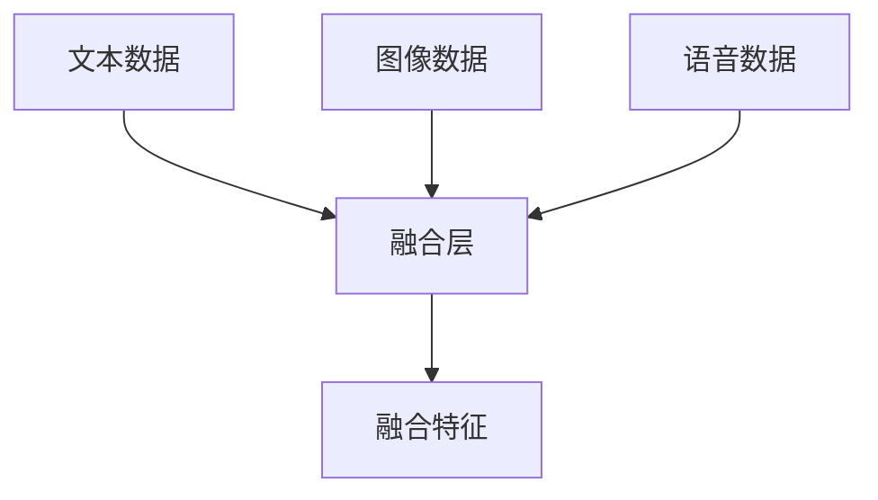
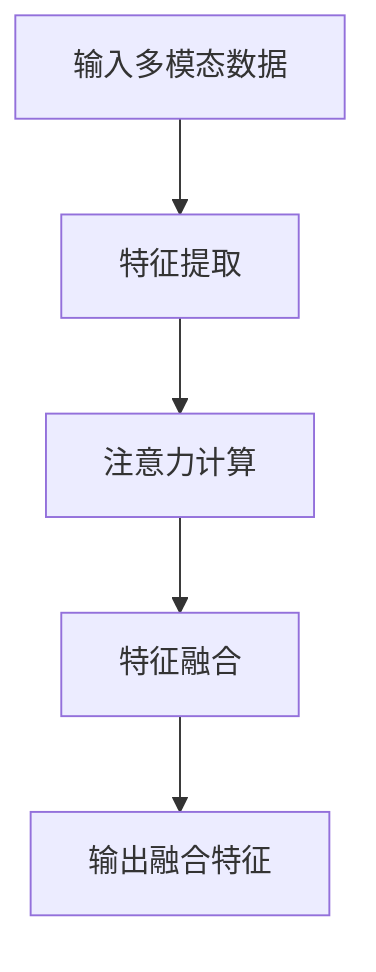
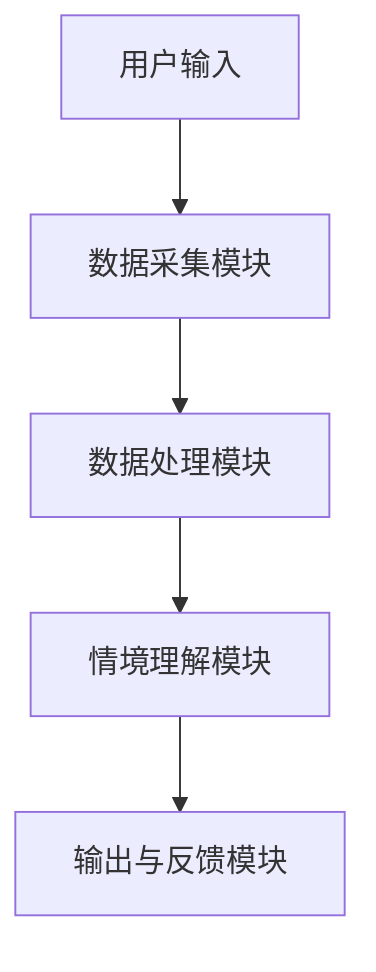
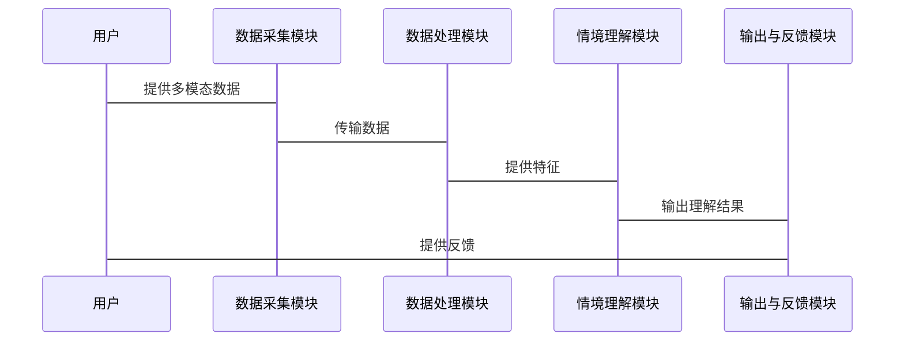

                 


# 构建AI Agent的多模态情境理解系统

## 关键词：多模态情境理解、AI Agent、数据融合、注意力机制、深度学习

## 摘要：本文将详细介绍构建AI Agent的多模态情境理解系统的背景、核心概念、算法原理和系统架构设计。通过分析多模态数据的特征与融合方法，结合深度学习技术，提出一种基于注意力机制的多模态融合算法，并通过系统架构设计和项目实战，展示如何实现一个高效的多模态情境理解系统。本文将为读者提供从理论到实践的全面指导。

---

# 第一部分: AI Agent的多模态情境理解系统背景与核心概念

# 第1章: 多模态情境理解系统概述

## 1.1 多模态情境理解的背景与问题背景
### 1.1.1 当前AI Agent的发展现状
随着人工智能技术的快速发展，AI Agent（智能体）在各个领域的应用越来越广泛。传统的AI Agent通常依赖单一模态的数据进行处理，例如文本、图像或语音。然而，现实世界中的信息往往是多模态的，单一模态的数据难以全面描述复杂的情境。因此，构建能够理解多模态数据的AI Agent成为当前研究的热点。

### 1.1.2 多模态情境理解的必要性
多模态情境理解是指AI Agent能够同时处理多种类型的数据（如文本、图像、语音等），并结合这些数据来理解当前的情境。这种能力对于实现更智能、更自然的交互具有重要意义。例如，在智能客服系统中，结合用户的文本输入和语音情绪可以提供更精准的服务。

### 1.1.3 问题背景与目标设定
当前，AI Agent在多模态情境理解方面面临以下问题：
- 如何有效地融合多模态数据？
- 如何在不同模态之间建立有效的关联？
- 如何设计高效的算法来处理多模态数据？

本文的目标是通过设计一种多模态情境理解系统，解决上述问题，并实现对复杂情境的精准理解。

## 1.2 多模态情境理解的定义与问题描述
### 1.2.1 多模态数据的定义与特点
多模态数据是指包含多种类型的数据，例如：
- 文本：包括自然语言文本、对话记录等。
- 图像：包括图片、视频等视觉信息。
- 语音：包括音频、语音情绪等。

多模态数据的特点在于其多样性和互补性。不同模态的数据可以相互补充，提供更全面的信息。

### 1.2.2 情境理解的核心问题
情境理解的核心问题在于如何将多模态数据有效地结合，以理解当前的情境。这需要解决以下几个关键问题：
1. 数据的表示与编码。
2. 模态之间的关联与融合。
3. 理解结果的表达与应用。

### 1.2.3 系统边界与外延
本文的多模态情境理解系统主要关注以下方面：
- 数据输入：文本、图像、语音等多种模态数据。
- 数据处理：特征提取、数据融合。
- 理解输出：情境理解和结果输出。

系统不涉及具体的上层应用，例如具体的业务逻辑或用户界面设计。

## 1.3 系统的核心要素与概念结构
### 1.3.1 多模态数据处理模块
该模块负责对输入的多模态数据进行预处理和特征提取，例如文本的词嵌入、图像的特征提取等。

### 1.3.2 情境理解模型
该模块负责将多模态数据融合，通过模型进行情境理解，输出结果。

### 1.3.3 系统功能模块划分
系统功能模块包括：
1. 数据采集模块：负责采集多模态数据。
2. 数据处理模块：负责数据的预处理和特征提取。
3. 情境理解模块：负责多模态数据的融合与情境理解。
4. 输出与反馈模块：负责输出理解和反馈结果。

## 1.4 本章小结
本章介绍了多模态情境理解系统的背景、定义、核心问题以及系统架构。通过本章的介绍，读者可以对多模态情境理解系统有一个全面的了解，为后续章节的深入分析奠定基础。

---

# 第二部分: 多模态情境理解的核心概念与联系

# 第2章: 多模态数据处理原理

## 2.1 多模态数据的特征与分类
### 2.1.1 文本数据的特征与处理
文本数据的特征包括词汇、语法、语义等。文本处理主要包括分词、词向量表示等。

### 2.1.2 图像数据的特征与处理
图像数据的特征包括颜色、纹理、形状等。图像处理主要包括图像分割、目标检测等。

### 2.1.3 语音数据的特征与处理
语音数据的特征包括音调、音量、语速等。语音处理主要包括语音识别、语音情感分析等。

## 2.2 多模态数据融合的原理与方法
### 2.2.1 数据融合的基本概念
数据融合是指将多个数据源的信息进行整合，以获得更准确的结果。

### 2.2.2 多模态数据融合的分类
多模态数据融合可以分为以下几种类型：
- 基于特征的融合：在特征层进行融合。
- 基于决策的融合：在决策层进行融合。
- 基于模型的融合：在模型层进行融合。

### 2.2.3 基于注意力机制的多模态融合方法
注意力机制是一种有效的多模态融合方法。通过计算不同模态数据的重要性，注意力机制可以有效地融合多模态数据。

## 2.3 多模态数据处理的实体关系图


## 2.4 本章小结
本章详细介绍了多模态数据的特征与分类，以及多模态数据融合的原理与方法。通过本章的介绍，读者可以了解多模态数据处理的核心概念与联系。

---

# 第三部分: 多模态情境理解的算法原理

# 第3章: 多模态融合算法

## 3.1 多模态融合算法的原理
### 3.1.1 基于神经网络的多模态融合
基于神经网络的多模态融合是一种常用的方法。通过构建神经网络模型，可以有效地融合多模态数据。

### 3.1.2 注意力机制在多模态融合中的应用
注意力机制是一种有效的多模态融合方法。通过注意力机制，模型可以关注重要的模态信息，从而提高融合效果。

### 3.1.3 多模态融合的数学模型
多模态融合的数学模型可以表示为：
$$ y = f(x_1, x_2, ..., x_n) $$
其中，$x_i$ 表示不同的模态数据，$f$ 表示融合函数。

## 3.2 多模态融合算法的流程图


## 3.3 多模态融合算法的Python实现
### 3.3.1 环境安装与依赖管理
需要安装的Python库包括：
- `numpy`
- `tensorflow`
- `pytorch`

### 3.3.2 核心代码实现
以下是一个基于注意力机制的多模态融合算法的Python实现示例：
```python
import numpy as np
import torch
import torch.nn as nn

class MultiModalAttention(nn.Module):
    def __init__(self, embed_dim, num_heads=8):
        super(MultiModalAttention, self).__init__()
        self.num_heads = num_heads
        self.embed_dim = embed_dim
        self.head_dim = embed_dim // num_heads
        self.scale = nn.Parameter(torch.ones(self.head_dim), requires_grad=True)
        
    def forward(self, x):
        # x: [batch_size, num_heads, seq_len, head_dim]
        # Compute attention weights
        attention = torch.matmul(x, x.transpose(-2, -1)) * self.scale
        attention = attention.softmax(dim=-1)
        # Apply attention
        output = torch.matmul(attention, x)
        return output

# 示例使用
batch_size = 1
num_heads = 8
embed_dim = 64
seq_len = 10
x = torch.randn(batch_size, num_heads, seq_len, embed_dim//num_heads)
model = MultiModalAttention(embed_dim)
output = model(x)
print(output.shape)
```

### 3.3.3 代码解读与分析
上述代码实现了一种基于注意力机制的多模态融合算法。模型通过计算注意力权重，将不同模态的数据进行融合，输出融合后的特征。

## 3.4 本章小结
本章详细介绍了多模态融合算法的原理、流程图和Python实现。通过本章的介绍，读者可以了解多模态融合算法的核心思想与具体实现方法。

---

# 第四部分: 系统分析与架构设计

# 第4章: 系统架构设计方案

## 4.1 系统功能模块划分
### 4.1.1 数据采集模块
负责采集多模态数据，例如文本、图像、语音等。

### 4.1.2 数据处理模块
负责对采集到的数据进行预处理和特征提取。

### 4.1.3 情境理解模块
负责多模态数据的融合与情境理解。

### 4.1.4 输出与反馈模块
负责输出理解和反馈结果。

## 4.2 系统架构设计


## 4.3 系统交互设计


## 4.4 本章小结
本章详细介绍了系统的功能模块划分、架构设计和交互流程。通过本章的介绍，读者可以了解多模态情境理解系统的整体架构与实现流程。

---

# 作者：AI天才研究院 & 禅与计算机程序设计艺术

---

以上是《构建AI Agent的多模态情境理解系统》的完整目录大纲，涵盖了从背景介绍到系统实现的全过程。每个章节都详细介绍了相关的核心概念、算法原理和系统设计，为读者提供了从理论到实践的全面指导。

